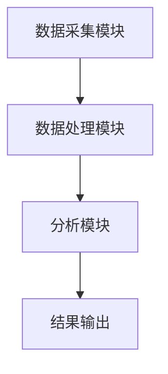
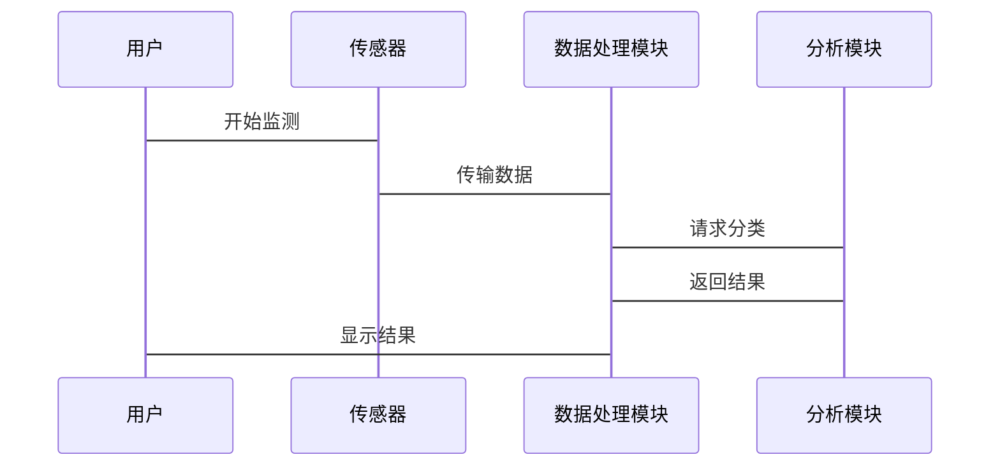

                 


# AI Agent在智能枕头中的睡眠质量分析

## 关键词：AI Agent, 智能枕头, 睡眠质量, 数据分析, 机器学习

## 摘要：本文探讨了AI Agent在智能枕头中的应用，分析其如何通过收集和处理睡眠数据来评估和改善睡眠质量。文章从背景介绍、核心概念、算法原理、系统设计、项目实战到最佳实践，全面阐述了AI Agent在睡眠分析中的作用和实现过程，为读者提供深入的技术见解。

---

# 第1章：AI Agent与智能枕头的背景介绍

## 1.1 AI Agent的基本概念

### 1.1.1 什么是AI Agent
AI Agent（人工智能代理）是一种智能体，能够感知环境、做出决策并执行动作，以实现特定目标。它具备自主性、反应性、目标导向和社交能力等特征。

### 1.1.2 AI Agent的核心特征
| 特征 | 描述 |
|------|------|
| 自主性 | 能够自主决策 |
| 反应性 | 能够响应环境变化 |
| 目标导向 | 以目标为导向进行行动 |
| 社交能力 | 能够与其他系统或用户交互 |

### 1.1.3 AI Agent的应用领域
- **智能家居**：控制家庭设备
- **医疗健康**：辅助诊断和治疗
- **金融投资**：自动交易和风险评估

## 1.2 智能枕头的发展现状

### 1.2.1 智能枕头的定义与功能
智能枕头是一种集成了多种传感器的寝具，能够监测用户的睡眠数据，如心率、呼吸频率和体动次数。

### 1.2.2 智能枕头的市场现状
- 市场需求增长迅速
- 技术不断进步，功能日益丰富

### 1.2.3 智能枕头的技术挑战
- 数据采集的准确性
- 数据处理的实时性
- 用户隐私的保护

---

# 第2章：睡眠质量分析的背景与需求

## 2.1 睡眠质量的重要性

### 2.1.1 睡眠对健康的影响
睡眠是维持身体健康的重要因素，影响免疫系统、认知功能和情绪调节。

### 2.1.2 睡眠障碍的现状
- 睡眠障碍广泛存在
- 影响生活质量

### 2.1.3 提高睡眠质量的意义
- 提升健康水平
- 改善工作效率

## 2.2 AI Agent在睡眠分析中的作用

### 2.2.1 AI Agent如何改善睡眠分析
- 实时监测睡眠数据
- 自动分析并提供改善建议

### 2.2.2 AI Agent的优势与潜力
- 高效的数据处理能力
- 智能的决策支持

### 2.2.3 睡眠分析中的问题与挑战
- 数据的多样性和复杂性
- 模型的准确性和可解释性

---

# 第3章：AI Agent的核心原理

## 3.1 AI Agent的基本原理

### 3.1.1 AI Agent的感知机制
AI Agent通过传感器收集数据，如心率和体动次数。

### 3.1.2 AI Agent的决策机制
基于收集的数据，AI Agent使用算法进行分析，如决策树和神经网络。

### 3.1.3 AI Agent的执行机制
根据分析结果，AI Agent调整枕头参数，如硬度和高度。

## 3.2 AI Agent的关键技术

### 3.2.1 数据采集与处理
- 数据采集：使用传感器收集睡眠数据
- 数据预处理：去除噪声，提取特征

### 3.2.2 模型训练与优化
- 选择合适的算法，如随机森林和K-最近邻
- 优化模型参数，提升分类准确率

### 3.2.3 系统集成与部署
- 整合各个模块，确保系统的高效运行
- 确保系统的可扩展性和可维护性

---

# 第4章：AI Agent与智能枕头的结合

## 4.1 智能枕头的数据采集

### 4.1.1 睡眠数据的类型
- 心率
- 呼吸频率
- 体动次数

### 4.1.2 数据采集的技术手段
- 使用加速度计和心率传感器
- 通过蓝牙和Wi-Fi传输数据

### 4.1.3 数据采集的挑战与解决方案
- 传感器精度问题：采用高精度传感器
- 数据传输延迟：使用低延迟通信技术

## 4.2 AI Agent在睡眠数据分析中的应用

### 4.2.1 数据预处理与特征提取
- 数据清洗：处理缺失值和异常值
- 特征提取：提取有用的睡眠特征，如睡眠周期和深度睡眠时间

### 4.2.2 睡眠阶段的分类与识别
- 使用机器学习算法进行分类，如支持向量机（SVM）和长短期记忆网络（LSTM）
- 通过混淆矩阵和准确率评估分类效果

### 4.2.3 睡眠质量的评估与优化
- 根据分析结果，优化枕头参数，如调整高度和柔软度

---

# 第5章：AI Agent的算法原理

## 5.1 数据采集与特征提取

### 5.1.1 数据采集流程
1. 传感器采集数据
2. 数据预处理
3. 特征提取

### 5.1.2 特征提取方法
- 时间序列分析：计算平均心率和最大心率
- 频域分析：使用FFT提取频谱特征

## 5.2 睡眠阶段分类算法

### 5.2.1 分类算法的选择
- 选择适合睡眠数据分析的算法，如随机森林和SVM

### 5.2.2 模型训练与优化
- 使用训练数据训练模型
- 调整模型参数，如C和gamma值

### 5.2.3 模型评估
- 使用测试数据评估模型性能
- 采用准确率、召回率和F1分数进行评估

---

# 第6章：系统分析与架构设计

## 6.1 系统功能设计

### 6.1.1 系统功能模块
- 数据采集模块：采集睡眠数据
- 数据处理模块：处理数据并提取特征
- 分析模块：分类睡眠阶段并评估质量

### 6.1.2 系统功能流程
1. 采集数据
2. 处理数据
3. 分析数据
4. 输出结果

## 6.2 系统架构设计

### 6.2.1 系统架构图


### 6.2.2 系统接口设计
- 数据采集接口：提供传感器数据的接口
- 分析接口：提供睡眠阶段分类的结果

## 6.3 系统交互设计

### 6.3.1 系统交互流程
1. 用户进入睡眠状态
2. 传感器采集数据
3. 数据处理模块处理数据
4. 分析模块分类睡眠阶段
5. 结果输出到用户界面

### 6.3.2 系统交互图


---

# 第7章：项目实战

## 7.1 环境安装

### 7.1.1 安装Python环境
- 使用Anaconda安装Python 3.8

### 7.1.2 安装必要的库
```bash
pip install numpy pandas scikit-learn matplotlib
```

## 7.2 系统核心实现源代码

### 7.2.1 数据预处理代码
```python
import numpy as np
import pandas as pd

# 读取数据
data = pd.read_csv('sleep_data.csv')

# 数据清洗
data.dropna(inplace=True)
data = data[~data['心率'].isin([0])]

# 特征提取
features = data[['心率', '呼吸频率', '体动次数']]
labels = data['睡眠阶段']
```

### 7.2.2 模型训练代码
```python
from sklearn.model_selection import train_test_split
from sklearn.ensemble import RandomForestClassifier
from sklearn.metrics import accuracy_score

# 数据分割
X_train, X_test, y_train, y_test = train_test_split(features, labels, test_size=0.2)

# 模型训练
model = RandomForestClassifier()
model.fit(X_train, y_train)

# 模型预测
y_pred = model.predict(X_test)
print('准确率:', accuracy_score(y_test, y_pred))
```

## 7.3 代码应用解读与分析

### 7.3.1 数据预处理
- 数据清洗：去除缺失值和异常值
- 特征提取：选择心率、呼吸频率和体动次数作为特征

### 7.3.2 模型训练
- 使用随机森林算法进行分类
- 通过交叉验证优化模型参数

## 7.4 实际案例分析

### 7.4.1 案例介绍
- 用户A的睡眠数据：心率波动大，呼吸频率不规律，体动次数多

### 7.4.2 数据分析
- 分析结果：浅睡眠阶段较多，REM阶段较少

### 7.4.3 改进建议
- 调整枕头高度，改善呼吸不畅问题
- 提供放松训练，减少体动次数

## 7.5 项目小结

### 7.5.1 项目成果
- 成功实现睡眠阶段分类
- 提供个性化的睡眠改善建议

### 7.5.2 经验总结
- 数据质量对模型性能影响重大
- 模型解释性是实际应用中的重要考量

---

# 第8章：最佳实践、小结与注意事项

## 8.1 最佳实践 tips

### 8.1.1 数据处理
- 确保数据的完整性和准确性
- 使用适当的数据预处理技术

### 8.1.2 模型选择
- 根据数据特性选择合适的算法
- 定期更新模型，保持性能

## 8.2 小结

### 8.2.1 核心内容回顾
- AI Agent在智能枕头中的应用
- 睡眠质量分析的实现过程

## 8.3 注意事项

### 8.3.1 数据隐私
- 严格保护用户数据
- 遵守相关法律法规

### 8.3.2 模型优化
- 定期监控模型性能
- 及时调整模型参数

---

# 第9章：拓展阅读

## 9.1 推荐书籍

### 9.1.1 《机器学习实战》
- 作者：Aurélien Géron
- 简介：详细讲解机器学习算法的实现与应用

### 9.1.2 《深度学习》
- 作者：Ian Goodfellow
- 简介：系统介绍深度学习的理论与实践

## 9.2 推荐在线资源

### 9.2.1 TensorFlow官方文档
- 网址：https://tensorflow.org
- 简介：提供丰富的教程和案例

### 9.2.2 Kaggle竞赛
- 网址：https://www.kaggle.com
- 简介：参与数据科学竞赛，提升实战能力

---

# 作者：AI天才研究院 & 禅与计算机程序设计艺术

---

以上是《AI Agent在智能枕头中的睡眠质量分析》的完整大纲，涵盖了从背景介绍到系统设计、项目实战和最佳实践的各个方面，旨在为读者提供全面的技术见解和实践指导。

