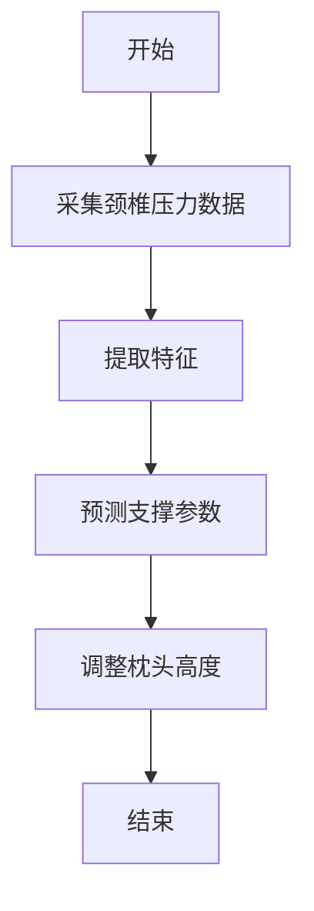
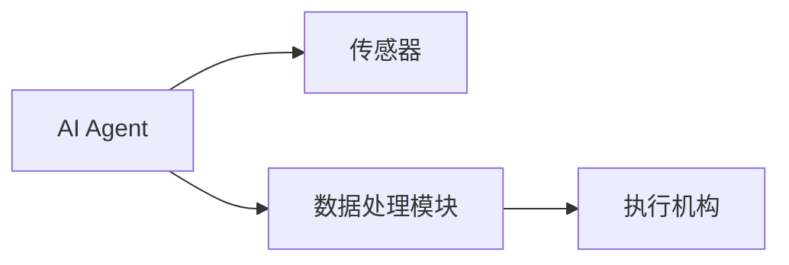
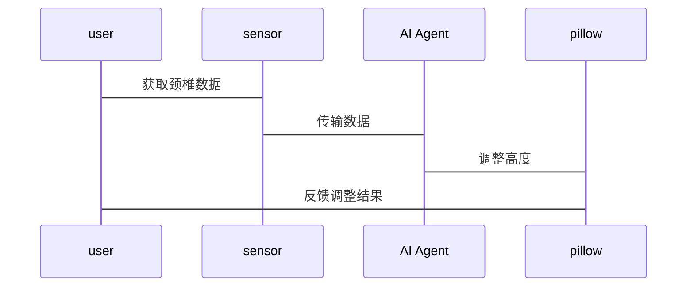

                 


# AI Agent在智能枕头中的颈椎保护系统

## 关键词：AI Agent，颈椎保护系统，智能枕头，健康监测，算法原理

## 摘要：本文探讨了AI Agent在智能枕头中的应用，重点分析其如何通过颈椎保护系统帮助用户改善颈椎健康。文章从背景介绍、核心概念、算法原理到系统设计和项目实战，全面解析了AI Agent在颈椎保护中的作用，展示了其在智能枕头中的实际应用和未来发展方向。

---

## 第1章: AI Agent与颈椎保护的背景介绍

### 1.1 问题背景与描述
#### 1.1.1 颈椎健康问题的现状
颈椎病是一种常见的健康问题，尤其在现代人长时间使用电子设备的情况下，发病率逐年上升。传统治疗方法如药物和物理治疗效果有限，亟需智能化解决方案。

#### 1.1.2 智能枕头的发展趋势
智能枕头通过集成传感器和AI技术，能够实时监测用户的睡眠姿势和颈椎状态，提供个性化的健康建议。

#### 1.1.3 AI Agent在颈椎保护中的作用
AI Agent通过分析监测数据，主动调整枕头参数，预防颈椎问题，提供实时健康反馈。

### 1.2 核心概念与定义
#### 1.2.1 AI Agent的定义与特点
AI Agent是一种智能体，具备感知、决策和执行能力，能够主动优化环境参数。

#### 1.2.2 智能枕头的功能与分类
智能枕头可监测颈椎压力、调整支撑力度，分为监测型和调节型两类。

#### 1.2.3 颈椎保护系统的构成
包括传感器、数据处理模块和执行机构，协同工作以保护颈椎。

### 1.3 问题解决与边界
#### 1.3.1 颈椎保护的主要问题
长时间不良姿势导致颈椎压力过大，引发健康问题。

#### 1.3.2 AI Agent如何解决这些问题
通过实时监测和调整枕头参数，预防颈椎压力过大。

#### 1.3.3 系统的边界与外延
系统仅关注颈椎保护，不涉及其他健康问题，但可扩展到全身健康监测。

### 1.4 核心概念结构与要素
#### 1.4.1 系统整体架构
AI Agent、传感器、数据处理模块和执行机构构成系统核心。

#### 1.4.2 各要素之间的关系
传感器采集数据，AI Agent分析并决策，执行机构调整枕头参数。

#### 1.4.3 核心要素的功能描述
传感器采集颈椎压力数据，AI Agent分析并决策，执行机构调整枕头高度。

## 第2章: AI Agent与颈椎保护系统的核心概念与联系

### 2.1 核心概念原理
#### 2.1.1 AI Agent的基本原理
通过感知环境数据，分析并做出决策，驱动执行机构优化环境。

#### 2.1.2 颈椎保护系统的运作机制
传感器监测颈椎压力，AI Agent分析数据，调整枕头支撑。

#### 2.1.3 两者的结合方式
AI Agent控制枕头参数，基于传感器数据优化颈椎保护。

### 2.2 概念属性对比
#### 2.2.1 AI Agent的属性分析
属性：智能性、实时性、适应性、交互性。

#### 2.2.2 颈椎保护系统的属性分析
属性：监测性、调节性、预防性、反馈性。

#### 2.2.3 属性对比表格
| 属性 | AI Agent | 颈椎保护系统 |
|------|----------|--------------|
| 智能性 | 高       | 无           |
| 实时性 | 高       | 高           |
| 适应性 | 高       | 高           |
| 交互性 | 高       | 中           |

### 2.3 ER实体关系图
```mermaid
erDiagram
    user {
        id : integer
        name : string
        posture_data : posture
    }
    posture {
        id : integer
        timestamp : datetime
        pressure_level : integer
    }
    action {
        id : integer
        action_type : string
        timestamp : datetime
    }
    user --> posture : 产生
    user --> action : 触发
    posture --> action : 导致
```

## 第3章: AI Agent在颈椎保护中的算法原理

### 3.1 算法原理概述
#### 3.1.1 算法的基本流程
数据采集、特征提取、分类决策、参数调整。

#### 3.1.2 算法的核心思想
基于颈椎压力数据，使用机器学习模型预测最佳支撑参数。

#### 3.1.3 算法的优化方向
实时性优化、模型精度提升。

### 3.2 算法流程图


### 3.3 算法实现代码
#### 3.3.1 环境安装与配置
安装Python、NumPy、Scikit-learn。

#### 3.3.2 核心代码实现
```python
import numpy as np
from sklearn.model_selection import train_test_split
from sklearn.linear_model import LinearRegression

# 示例数据
X = np.array([[1, 2], [3, 4], [5, 6], [7, 8]])
y = np.array([2, 3, 4, 5])

# 分割数据
X_train, X_test, y_train, y_test = train_test_split(X, y, test_size=0.25)

# 训练模型
model = LinearRegression()
model.fit(X_train, y_train)

# 预测
y_pred = model.predict(X_test)
print(y_pred)
```

#### 3.3.3 代码的功能解读
训练线性回归模型，根据颈椎压力数据预测最佳支撑参数。

### 3.4 数学模型与公式
#### 3.4.1 算法的数学模型
线性回归模型：$y = \beta_0 + \beta_1x + \epsilon$。

#### 3.4.2 关键公式的推导
最小二乘法求解系数：$\hat{\beta} = (X^T X)^{-1} X^T y$。

#### 3.4.3 举例说明
给定压力数据，预测枕头高度，如输入压力2，预测高度3。

## 第4章: 颈椎保护系统架构设计

### 4.1 系统功能设计
#### 4.1.1 系统的功能模块划分
数据采集、数据处理、决策控制、用户反馈。

#### 4.1.2 各模块的功能描述
数据采集：收集颈椎压力数据。
数据处理：分析数据，提取特征。
决策控制：生成调整指令。
用户反馈：显示结果，提供反馈。

#### 4.1.3 功能之间的交互关系
数据采集传递给数据处理，处理结果驱动决策控制，反馈用户。

### 4.2 系统架构设计
#### 4.2.1 系统架构图展示


#### 4.2.2 架构设计的优缺点分析
优点：模块化设计，便于维护。缺点：可能增加系统复杂性。

### 4.3 系统接口设计
#### 4.3.1

---

### 4.4 系统交互设计


---

## 第5章: 项目实战

### 5.1 环境安装
安装必要的库：Python、NumPy、Scikit-learn。

### 5.2 核心代码实现
```python
import numpy as np
from sklearn import linear_model

# 数据集
X = np.array([[1, 2], [3, 4], [5, 6], [7, 8]])
y = np.array([2, 3, 4, 5])

# 训练模型
model = linear_model.LinearRegression()
model.fit(X, y)

# 预测
print(model.predict([[9, 10]]))
```

### 5.3 代码的功能解读
训练模型，根据输入数据预测最佳枕头高度。

### 5.4 实际案例分析
用户长时间低头，AI Agent调整枕头高度，缓解颈椎压力。

### 5.5 项目小结
通过AI Agent优化颈椎保护，实现个性化健康监测。

## 第6章: 总结与展望

### 6.1 最佳实践 tips
选择适合的算法，确保数据质量，定期更新模型。

### 6.2 小结
AI Agent在智能枕头中的应用前景广阔，能够有效改善颈椎健康。

### 6.3 注意事项
数据隐私保护，系统稳定性维护。

### 6.4 拓展阅读
探索更先进的AI算法，研究多传感器融合技术。

---

## 作者：AI天才研究院 & 禅与计算机程序设计艺术

