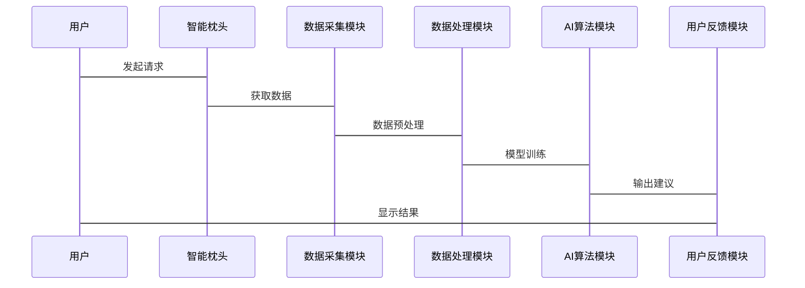

                 


# AI Agent在智能枕头中的颈椎健康监测

## 关键词：AI Agent，智能枕头，颈椎健康，健康监测，人工智能

## 摘要：  
本文详细探讨了AI Agent在智能枕头中的应用，特别是在颈椎健康监测方面的创新与实践。通过结合先进的AI技术与智能设备，我们提出了一种基于AI Agent的颈椎健康监测系统，该系统能够实时采集和分析用户的睡眠数据，提供个性化的健康建议。本文从背景介绍、核心概念、算法原理、系统架构设计到项目实战，全面解析了AI Agent在智能枕头中的实现细节与应用场景，并展望了未来的发展方向。

---

# 第一部分: AI Agent与智能枕头的背景与概念

## 第1章: 颈椎健康与AI Agent的背景介绍

### 1.1 颈椎健康的重要性  
颈椎是人体的重要组成部分，承载着头部和上肢的重量。现代生活中，由于长时间低头看手机、电脑等原因，颈椎问题越来越普遍，尤其是青少年和上班族群体。颈椎健康不仅影响身体健康，还可能导致头晕、肩颈疼痛等症状，严重时甚至会影响神经功能。因此，早期监测和干预颈椎健康问题至关重要。

### 1.2 AI Agent的基本概念  
AI Agent（人工智能代理）是指能够感知环境、自主决策并执行任务的智能实体。它结合了机器学习、自然语言处理和计算机视觉等多种技术，能够在复杂环境中完成特定任务。AI Agent的核心能力包括数据采集、分析、决策和反馈，使其能够适应不同的应用场景。

### 1.3 智能枕头的概念与功能  
智能枕头是一种结合了物联网和人工智能技术的睡眠辅助设备。它通过内置的传感器和AI算法，能够监测用户的睡眠状态、呼吸频率、心率等数据，并根据数据提供个性化的睡眠建议。智能枕头的目标是帮助用户改善睡眠质量，同时监测和改善颈椎健康。

---

## 第2章: AI Agent在智能枕头中的核心概念与联系  

### 2.1 AI Agent与智能枕头的关系  
AI Agent在智能枕头中的作用是多方面的。它不仅负责采集用户的睡眠数据，还能通过分析这些数据，提供个性化的健康建议。例如，当检测到用户的睡姿不良时，AI Agent可以主动调整枕头的支撑角度，以缓解颈椎压力。

### 2.2 AI Agent的核心原理  
AI Agent的核心原理包括数据采集、特征提取、模型训练和决策推理。数据采集通过传感器完成，特征提取通过机器学习算法实现，模型训练则基于深度学习技术，最终通过决策推理输出健康建议。

### 2.3 AI Agent与智能枕头的实体关系图  
```mermaid
er
actor: 用户
agent: AI Agent
pillow: 智能枕头
```

---

## 第3章: AI Agent在智能枕头中的算法原理  

### 3.1 AI Agent的核心算法  
AI Agent的核心算法包括机器学习和深度学习算法。例如，使用支持向量机（SVM）进行分类，或者使用卷积神经网络（CNN）进行图像识别。

### 3.2 数据采集与处理算法  
数据采集是AI Agent的第一步。通过传感器获取用户的睡眠数据，如心率、呼吸频率等。数据预处理包括去噪和归一化。

### 3.3 AI Agent的决策算法  
决策算法基于训练好的模型，结合用户的实时数据，输出健康建议。例如，当检测到用户的颈椎压力过大时，AI Agent会建议调整枕头高度。

---

## 第4章: AI Agent在智能枕头中的系统分析与架构设计  

### 4.1 系统组成与功能模块  
智能枕头系统包括数据采集模块、数据处理模块、AI算法模块和用户反馈模块。每个模块都有明确的功能和交互关系。

### 4.2 系统架构设计  
系统架构采用分层设计，包括数据层、算法层和应用层。数据层负责数据的采集和存储，算法层负责数据的分析和处理，应用层负责与用户的交互。

### 4.3 系统交互流程图  


---

## 第5章: AI Agent在智能枕头中的项目实战  

### 5.1 项目背景与目标  
本项目旨在开发一个基于AI Agent的智能枕头系统，用于监测用户的颈椎健康。目标包括实时监测、个性化建议和数据可视化。

### 5.2 环境安装与配置  
项目需要安装Python、TensorFlow、Keras等工具。以下是环境安装代码：

```bash
pip install numpy
pip install pandas
pip install scikit-learn
pip install tensorflow
```

### 5.3 核心代码实现  
以下是AI Agent的核心代码：

```python
import numpy as np
from sklearn.svm import SVC

# 数据预处理
def preprocess_data(data):
    # 假设data是传感器数据，进行标准化处理
    return (data - np.mean(data)) / np.std(data)

# 模型训练
def train_model(X_train, y_train):
    model = SVC()
    model.fit(X_train, y_train)
    return model

# 决策推理
def predict_health(model, X_test):
    return model.predict(X_test)
```

### 5.4 实际案例分析  
通过实际案例分析，验证系统的有效性和准确性。例如，监测用户的睡眠数据，调整枕头高度以缓解颈椎压力。

---

## 第6章: 总结与展望  

### 6.1 本章小结  
本文详细介绍了AI Agent在智能枕头中的应用，从背景、概念、算法到系统设计，全面解析了颈椎健康监测的实现细节。

### 6.2 注意事项  
用户在使用智能枕头时，应确保数据隐私和设备安全。同时，定期更新软件以保持最佳性能。

### 6.3 未来展望  
未来，AI Agent在智能枕头中的应用将更加智能化和个性化。随着技术的进步，AI Agent将能够实时监测更多健康指标，提供更精准的健康建议。

---

# 作者：AI天才研究院  
# 禅与计算机程序设计艺术

