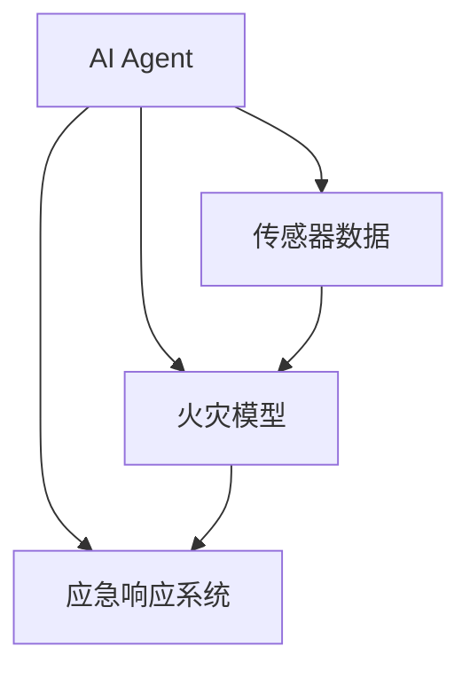
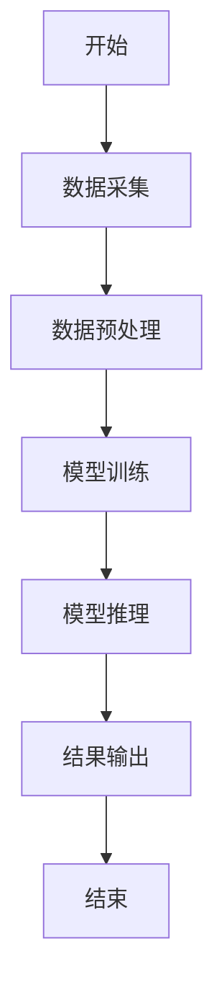
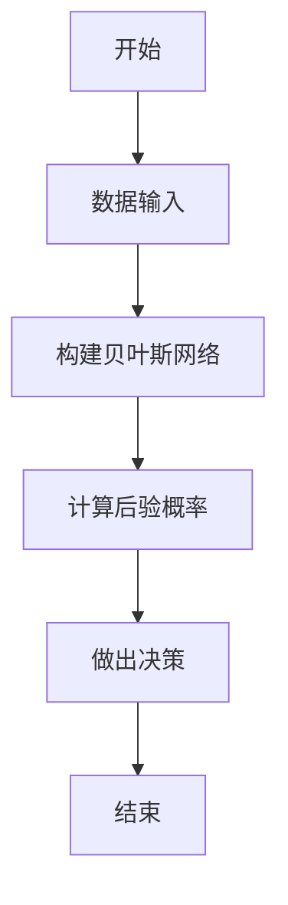
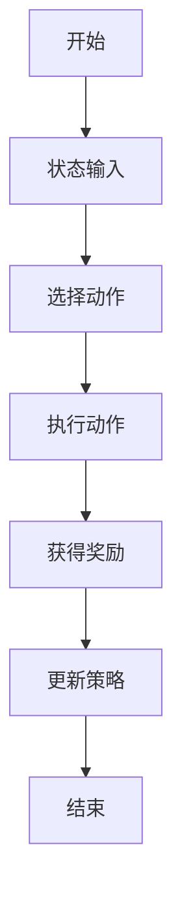
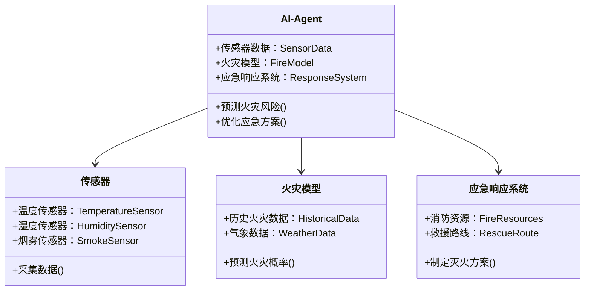
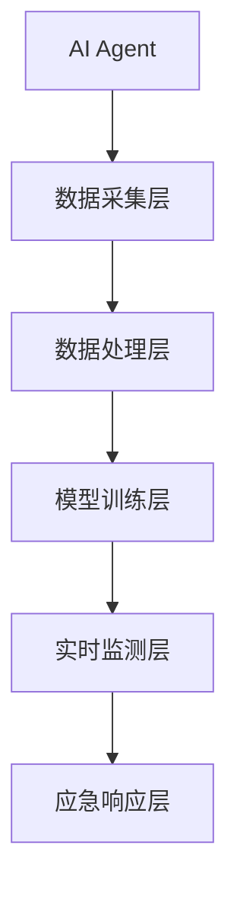

                 


# AI Agent在智能森林火灾预警中的实践

## 关键词：AI Agent, 智能森林火灾预警, 机器学习, 火灾预测, 实时监测, 应急响应

## 摘要：  
本文深入探讨了AI Agent在智能森林火灾预警中的应用，从背景介绍、核心概念到算法原理、系统架构，再到项目实战，全面解析了AI Agent如何通过数据采集、模型训练和决策优化实现高效的火灾预警与应急响应。文章结合理论与实践，展示了AI Agent在森林防火中的巨大潜力，为相关领域的研究和应用提供了有益的参考。

---

# 第1章: AI Agent与智能森林火灾预警的背景介绍

## 1.1 AI Agent的基本概念  
AI Agent（人工智能代理）是指能够感知环境、自主决策并采取行动以实现特定目标的智能实体。与传统的AI算法不同，AI Agent具有更强的自主性和适应性，能够在动态环境中实时调整策略。  

### 1.1.1 AI Agent的定义  
AI Agent是一种能够通过感知环境、分析信息、做出决策并采取行动的智能系统。它可以是一个软件程序，也可以是一个物理设备（如无人机或传感器）。  

### 1.1.2 AI Agent的核心特征  
- **自主性**：能够在没有外部干预的情况下独立运行。  
- **反应性**：能够实时感知环境变化并做出响应。  
- **目标导向**：所有行动都围绕实现特定目标展开。  
- **学习能力**：通过数据反馈不断优化自身性能。  

### 1.1.3 AI Agent与传统算法的区别  
| 特性 | AI Agent | 传统算法 |  
|------|----------|----------|  
| 决策方式 | 基于环境反馈动态调整 | 预先设定固定的逻辑 |  
| 自主性 | 高 | 低 |  
| 学习能力 | 强 | 弱 |  
| 应用场景 | 复杂动态环境 | 稳定静态环境 |  

## 1.2 森林火灾预警的背景与挑战  

### 1.2.1 森林火灾的定义与危害  
森林火灾是由于自然或人为原因引起的森林区域火灾，具有破坏性强、蔓延速度快等特点。火灾不仅会导致森林资源的损失，还可能造成严重的生态破坏和人员伤亡。  

### 1.2.2 传统火灾预警方法的局限性  
传统的火灾预警方法主要依赖人工巡查和简单的传感器报警，存在以下问题：  
1. **实时性差**：无法快速响应突发火灾。  
2. **覆盖范围有限**：难以覆盖偏远地区。  
3. **误报率高**：传感器数据的准确性不足。  

### 1.2.3 AI Agent在火灾预警中的优势  
- **实时监测**：通过AI Agent实时分析传感器数据，快速发现火源。  
- **精准预测**：基于历史数据和环境特征，预测火灾发生的概率。  
- **智能响应**：在火灾发生后，AI Agent可以协调应急资源，优化救援方案。  

## 1.3 AI Agent在森林火灾预警中的应用前景  

### 1.3.1 AI Agent在火灾预测中的作用  
AI Agent可以通过分析气象数据（如温度、湿度、风速）和地形信息，预测火灾发生的可能性。  

### 1.3.2 AI Agent在火灾实时监测中的应用  
通过部署无人机和地面传感器，AI Agent可以实时采集森林环境数据，并通过边缘计算快速做出反应。  

### 1.3.3 AI Agent在火灾应急响应中的价值  
在火灾发生后，AI Agent可以协调消防资源，制定最优的灭火方案，减少人员伤亡和财产损失。  

## 1.4 本章小结  
本章介绍了AI Agent的基本概念和核心特征，并分析了森林火灾预警的背景与挑战。同时，探讨了AI Agent在火灾预警中的优势和应用前景，为后续章节的深入分析奠定了基础。

---

# 第2章: AI Agent的核心概念与联系  

## 2.1 AI Agent的核心概念  

### 2.1.1 AI Agent的组成要素  
AI Agent的组成要素包括感知模块、决策模块、行动模块和学习模块。  

- **感知模块**：负责采集环境数据（如温度、湿度、烟雾等）。  
- **决策模块**：基于感知数据和预设模型，做出决策。  
- **行动模块**：根据决策结果采取行动（如发出警报、启动灭火设备）。  
- **学习模块**：通过反馈数据优化模型参数。  

### 2.1.2 AI Agent的行为机制  
AI Agent的行为机制包括感知、推理、决策和行动四个阶段。  

1. **感知**：通过传感器或其他数据源获取环境信息。  
2. **推理**：基于感知数据和知识库，推导出可能的结果。  
3. **决策**：根据推理结果和目标函数，选择最优行动方案。  
4. **行动**：执行决策并输出结果。  

### 2.1.3 AI Agent的决策模型  
AI Agent的决策模型可以基于多种算法，如规则引擎、概率推理和强化学习。  

## 2.2 AI Agent与相关技术的对比  

### 2.2.1 AI Agent与传统AI的区别  
- **传统AI**：基于规则或预设模型，无法自主调整。  
- **AI Agent**：具有自主性和学习能力，能够动态优化决策。  

### 2.2.2 AI Agent与机器学习的联系  
AI Agent的核心算法（如概率推理和强化学习）属于机器学习的范畴。AI Agent通过机器学习模型实现感知和决策功能。  

### 2.2.3 AI Agent与大数据分析的结合  
AI Agent可以利用大数据分析技术，从海量数据中提取特征，优化预测模型。  

## 2.3 AI Agent的ER实体关系图  



---

# 第3章: AI Agent的算法原理  

## 3.1 AI Agent的核心算法  

### 3.1.1 基于概率论的火灾预测算法  
基于概率论的火灾预测算法通过分析气象数据和历史火灾数据，计算火灾发生的概率。  

#### 算法流程图  



#### 核心公式  
火灾发生的概率 \( P \) 可以通过贝叶斯公式计算：  
$$ P(\text{火灾}) = \frac{P(\text{火灾}|\text{气象条件}) \cdot P(\text{气象条件})}{P(\text{气象条件}| \text{非火灾}) \cdot P(\text{非火灾})} $$  

### 3.1.2 基于贝叶斯网络的决策模型  
贝叶斯网络是一种概率图模型，可以用来表示变量之间的依赖关系。  

#### 算法流程图  



### 3.1.3 基于强化学习的优化算法  
强化学习通过试错的方式优化决策策略，适用于动态环境下的火灾应急响应。  

#### 算法流程图  



---

# 第4章: 森林火灾预警系统的系统分析与架构设计  

## 4.1 系统功能设计  

### 4.1.1 系统功能模块  
- **数据采集模块**：采集森林环境数据（如温度、湿度、烟雾浓度）。  
- **数据处理模块**：对采集数据进行清洗和预处理。  
- **模型训练模块**：基于历史数据训练火灾预测模型。  
- **实时监测模块**：监控森林环境，实时预测火灾风险。  
- **应急响应模块**：在火灾发生时协调资源进行灭火。  

### 4.1.2 领域模型类图  



## 4.2 系统架构设计  

### 4.2.1 系统架构图  



---

# 第5章: 项目实战  

## 5.1 环境安装与配置  

### 5.1.1 安装Python环境  
安装Python 3.8以上版本，并配置虚拟环境。  

### 5.1.2 安装依赖库  
安装以下依赖库：  
- `numpy`  
- `pandas`  
- `scikit-learn`  
- `tensorflow`  

## 5.2 系统核心实现  

### 5.2.1 数据采集与预处理  
```python
import numpy as np
import pandas as pd

# 数据采集
data = pd.read_csv('forest_data.csv')

# 数据清洗
data.dropna(inplace=True)
data = pd.get_dummies(data)
```

### 5.2.2 模型训练与优化  
```python
from sklearn.model_selection import train_test_split
from sklearn.ensemble import RandomForestClassifier

# 数据分割
X_train, X_test, y_train, y_test = train_test_split(data.drop('fire_risk', axis=1), data['fire_risk'], test_size=0.2)

# 模型训练
model = RandomForestClassifier()
model.fit(X_train, y_train)

# 模型评估
score = model.score(X_test, y_test)
print(f'模型准确率：{score}')
```

### 5.2.3 应急响应模拟  
```python
import tensorflow as tf
from tensorflow.keras import layers

# 构建强化学习模型
model = tf.keras.Sequential([
    layers.Dense(64, activation='relu'),
    layers.Dense(1, activation='sigmoid')
])

# 编译模型
model.compile(optimizer='adam', loss='binary_crossentropy', metrics=['accuracy'])

# 训练模型
model.fit(X_train, y_train, epochs=10, batch_size=32)
```

## 5.3 实际案例分析  
假设某地区温度为35℃，湿度为20%，风速为5m/s，AI Agent通过模型预测火灾风险为80%。系统会立即发出警报，并启动应急响应程序，协调消防资源进行灭火。

---

# 第6章: 总结与展望  

## 6.1 本章总结  
本文系统地介绍了AI Agent在智能森林火灾预警中的应用，从算法原理到系统架构，再到项目实战，全面展示了AI Agent在火灾预警中的巨大潜力。通过AI Agent的自主性和学习能力，可以显著提升火灾预警的效率和准确性。  

## 6.2 未来展望  
未来，随着AI技术的不断发展，AI Agent在森林火灾预警中的应用将更加智能化和普及化。可以通过引入更复杂的算法（如深度学习和强化学习）进一步优化预测模型，并结合物联网技术实现更高效的应急响应。

---

# 作者：AI天才研究院/AI Genius Institute & 禅与计算机程序设计艺术 /Zen And The Art of Computer Programming

