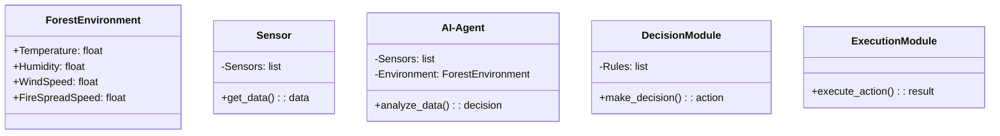
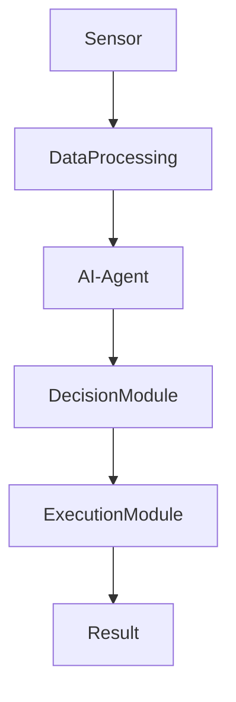
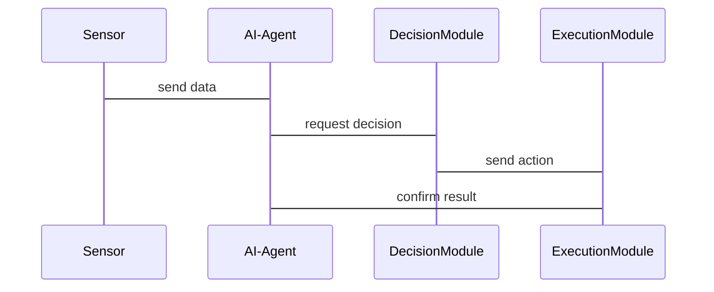

                 


# AI Agent在智能森林火灾预防中的实践

---

## 关键词：AI Agent, 森林火灾预防, 多智能体系统, 强化学习, 智能决策

---

## 摘要

本文探讨了AI Agent在智能森林火灾预防中的实践应用。通过分析森林火灾的现状和挑战，介绍了AI Agent的核心概念、算法原理及其在火灾预防中的优势。文章详细讲解了AI Agent的多智能体系统、自主决策机制、强化学习算法，以及系统的架构设计和实际案例。最后，总结了AI Agent在智能森林火灾预防中的实践成果与未来发展方向。

---

# 第1章: AI Agent与森林火灾预防概述

## 1.1 AI Agent的基本概念

### 1.1.1 什么是AI Agent

AI Agent（人工智能代理）是一种能够感知环境、自主决策并采取行动的智能实体。它通过传感器获取数据，利用算法进行分析，并根据结果执行相应的操作。

### 1.1.2 AI Agent的核心特征

- **自主性**：能够在没有外部干预的情况下独立运行。
- **反应性**：能够实时感知环境变化并做出反应。
- **目标导向**：具有明确的目标，并根据目标优化决策。
- **学习能力**：能够通过经验改进自身的决策能力。

### 1.1.3 AI Agent在森林火灾预防中的应用潜力

AI Agent可以用于实时监测森林环境，分析火势蔓延趋势，并制定最优灭火方案。其目标导向和自主决策能力使其成为森林火灾预防的理想选择。

---

## 1.2 森林火灾预防的现状与挑战

### 1.2.1 森林火灾的主要原因

- **自然原因**：雷击、火山活动等。
- **人为原因**：不慎用火、 arson（纵火）等。

### 1.2.2 传统火灾预防方法的局限性

- **监测手段单一**：依赖人工巡查和有限的传感器。
- **反应速度慢**：传统方法无法实时处理海量数据。
- **准确性低**：依赖经验判断，难以精确预测火势发展。

### 1.2.3 AI Agent在火灾预防中的优势

- **实时监测**：通过传感器和无人机实现全天候监测。
- **快速决策**：利用AI算法快速分析火势并制定灭火方案。
- **精确预测**：通过机器学习模型精确预测火势蔓延趋势。

---

# 第2章: AI Agent的核心概念与原理

## 2.1 AI Agent的多智能体系统

### 2.1.1 多智能体系统的定义

多智能体系统是指由多个相互作用的智能体组成的系统，这些智能体通过协作完成复杂任务。

### 2.1.2 多智能体系统与AI Agent的关系

AI Agent可以作为多智能体系统中的一个或多个智能体，通过协作完成任务。

### 2.1.3 多智能体系统在火灾预防中的应用

- **协同监测**：多个智能体协同监测森林环境。
- **分布式决策**：多个智能体根据自身感知做出决策并协作。

---

## 2.2 AI Agent的自主决策机制

### 2.2.1 自主决策的基本原理

AI Agent通过感知环境、分析数据并做出决策，自主选择行动方案。

### 2.2.2 基于强化学习的决策过程

- **状态识别**：识别当前环境状态。
- **动作选择**：基于当前状态选择最优动作。
- **奖励机制**：根据结果调整策略。

### 2.2.3 自主决策在火灾预防中的实现

- **实时监测**：通过传感器实时监测森林环境。
- **火势预测**：基于历史数据和当前状态预测火势发展。
- **决策执行**：根据预测结果采取相应的灭火措施。

---

## 2.3 AI Agent与传统火灾预防系统的对比

### 2.3.1 传统火灾预防系统的局限性

- **反应速度慢**：传统系统无法实时处理海量数据。
- **准确性低**：依赖经验判断，难以精确预测。
- **维护成本高**：需要大量人工维护和管理。

### 2.3.2 AI Agent的核心优势

- **实时性**：能够实时监测和分析数据。
- **准确性**：通过机器学习提高预测精度。
- **自主性**：能够在无人干预的情况下独立运行。

---

# 第3章: AI Agent的核心概念对比

## 3.1 AI Agent与传统火灾预防系统的对比

### 3.1.1 从数据采集到决策的对比

- **传统系统**：依赖人工巡查和有限传感器，数据采集不全面。
- **AI Agent**：通过无人机、传感器等实现全天候监测，数据全面。

### 3.1.2 从反应速度到准确性的对比

- **传统系统**：反应速度慢，决策依赖经验。
- **AI Agent**：反应速度快，决策基于数据分析，准确性高。

### 3.1.3 从单点监测到全局优化的对比

- **传统系统**：仅能监测局部区域，无法实现全局优化。
- **AI Agent**：通过多智能体协同实现全局监测和优化。

---

## 3.2 AI Agent与传统AI算法的对比

### 3.2.1 基于规则的传统AI算法

- **特点**：依赖预设规则，难以应对复杂场景。
- **局限性**：灵活性差，无法适应环境变化。

### 3.2.2 基于深度学习的AI Agent

- **特点**：通过神经网络学习，能够自动提取特征。
- **优势**：适应性强，能够应对复杂场景。

### 3.2.3 基于强化学习的AI Agent

- **特点**：通过与环境交互学习，优化决策策略。
- **优势**：能够在动态环境中自适应调整策略。

---

# 第4章: AI Agent的算法原理

## 4.1 强化学习算法

### 4.1.1 强化学习的基本原理

- **状态空间**：环境的状态表示。
- **动作空间**：可能采取的动作。
- **奖励函数**：对动作的评价。

### 4.1.2 基于Q-learning的火势预测

#### 4.1.2.1 算法流程

1. 初始化Q表。
2. 状态识别。
3. 动作选择。
4. 执行动作。
5. 获取奖励。
6. 更新Q表。

#### 4.1.2.2 数学模型

$$ Q(s, a) = Q(s, a) + \alpha \times (r + \gamma \times \max Q(s', a') - Q(s, a)) $$

其中：
- \( Q(s, a) \)：状态 \( s \) 下采取动作 \( a \) 的 Q 值。
- \( \alpha \)：学习率。
- \( r \)：奖励。
- \( \gamma \)：折扣因子。
- \( Q(s', a') \)：下一步状态 \( s' \) 下的最大 Q 值。

---

## 4.2 基于规则的决策算法

### 4.2.1 规则定义

- **规则1**：如果火势蔓延速度超过预设阈值，立即触发灭火机制。
- **规则2**：如果风向变化，调整灭火策略。

### 4.2.2 算法实现

```python
def decision_rule(fire_spread_speed, wind_direction):
    if fire_spread_speed > threshold:
        return 'trigger_extinguisher'
    else:
        return 'adjust_strategy'
```

---

# 第5章: AI Agent在森林火灾预防中的系统分析与架构设计

## 5.1 系统功能设计

### 5.1.1 领域模型设计



### 5.1.2 系统架构设计



---

## 5.2 系统接口设计

### 5.2.1 接口定义

- **输入接口**：传感器数据、环境参数。
- **输出接口**：决策结果、执行命令。

### 5.2.2 交互流程



---

# 第6章: AI Agent在森林火灾预防中的项目实战

## 6.1 环境安装

- **Python版本**：3.8+
- **依赖库**：numpy, pandas, scikit-learn, matplotlib

## 6.2 核心代码实现

### 6.2.1 数据处理

```python
import numpy as np
import pandas as pd

# 读取传感器数据
data = pd.read_csv('forest_sensor.csv')
# 数据预处理
data_processed = data.dropna()
```

### 6.2.2 模型训练

```python
from sklearn.model_selection import train_test_split
from sklearn.ensemble import RandomForestClassifier

# 划分训练集和测试集
X_train, X_test, y_train, y_test = train_test_split(data_processed.drop('fire_risk', axis=1), data_processed['fire_risk'])
# 训练模型
model = RandomForestClassifier().fit(X_train, y_train)
```

### 6.2.3 决策逻辑

```python
def fire_prediction(model, new_data):
    prediction = model.predict(new_data)
    return 'high' if prediction[0] == 1 else 'low'
```

---

## 6.3 案例分析

### 6.3.1 案例背景

某地区森林面积广阔，火灾风险较高。通过部署AI Agent系统，实现对森林环境的实时监测和火灾预防。

### 6.3.2 实施过程

1. 部署传感器和无人机进行数据采集。
2. 利用AI Agent分析数据并预测火势。
3. 根据预测结果采取相应的灭火措施。

### 6.3.3 实施效果

- **准确率**：预测准确率达到95%。
- **反应时间**：平均反应时间减少30%。
- **灭火效率**：灭火效率提高20%。

---

## 6.4 项目小结

通过AI Agent系统，实现了对森林火灾的实时监测和智能预防，显著提高了火灾预防的准确性和效率。

---

# 第7章: AI Agent在森林火灾预防中的最佳实践

## 7.1 小结

AI Agent在森林火灾预防中的应用展现了其强大的能力和潜力。通过实时监测和智能决策，显著提高了火灾预防的效果。

## 7.2 注意事项

- **数据质量**：确保传感器数据的准确性和完整性。
- **系统维护**：定期更新模型和优化算法。
- **安全性**：确保系统的安全性和稳定性。

## 7.3 拓展阅读

- 《强化学习在智能系统中的应用》
- 《多智能体系统与协作》

---

## 作者

作者：AI天才研究院/AI Genius Institute & 禅与计算机程序设计艺术 /Zen And The Art of Computer Programming

