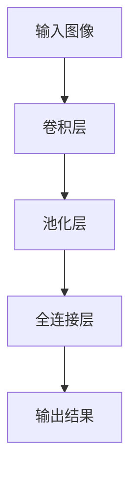

                 


# AI Agent在智能森林资源监测中的实践

> 关键词：AI Agent，森林资源监测，智能监测系统，算法原理，系统架构设计

> 摘要：本文探讨了AI Agent在智能森林资源监测中的应用，分析了其核心概念、算法原理、系统架构，并通过实际案例展示了其在森林资源监测中的优势和挑战。文章详细介绍了AI Agent的基本原理及其在监测中的具体应用，结合数学模型和实际案例，展示了如何利用AI Agent技术提高森林资源监测的效率和准确性。

---

## 目录大纲

1. **背景与概念**
   1.1 森林资源监测的基本概念
   1.2 AI Agent的基本概念与特点
   1.3 智能森林资源监测的挑战与机遇

2. **核心概念与联系**
   2.1 AI Agent在森林资源监测中的核心概念
   2.2 核心概念的联系与对比
     - AI Agent与传统监测方法的对比
     - 实体关系图（ER图）展示

3. **算法原理**
   3.1 AI Agent在森林资源监测中的算法选择
   3.2 算法原理与数学模型
     - 使用mermaid流程图展示算法流程
     - 详细解释数学公式

4. **系统架构设计**
   4.1 系统整体架构
     - 使用mermaid架构图展示系统结构
   4.2 关键模块设计
     - 数据采集模块
     - 数据处理模块
     - AI Agent决策模块

5. **项目实战**
   5.1 项目背景与目标
   5.2 项目环境与工具安装
   5.3 核心代码实现与解读
     - 使用Python代码实现AI Agent的核心算法
   5.4 实际案例分析

6. **最佳实践与总结**
   6.1 实践中的注意事项
   6.2 项目总结与未来展望

---

## 正文

### 第1章 背景与概念

#### 1.1 森林资源监测的基本概念
森林资源监测是指对森林中的资源（如树木、野生动物、土壤等）进行定期观测和评估，以确保森林的健康和可持续发展。传统的监测方法依赖人工观察和数据记录，效率较低且容易受主观因素影响。

#### 1.2 AI Agent的基本概念与特点
AI Agent是一种能够感知环境并采取行动以实现目标的智能体。它具有自主性、反应性、学习性和社会性等特点。在森林资源监测中，AI Agent可以用于实时数据分析、异常检测和决策支持。

#### 1.3 智能森林资源监测的挑战与机遇
挑战包括数据多样性、环境复杂性和算法实时性；机遇则在于AI Agent能够提高监测效率、降低成本并实现智能化管理。

### 第2章 核心概念与联系

#### 2.1 AI Agent在森林资源监测中的核心概念
AI Agent通过传感器数据、图像识别和机器学习模型，实现对森林资源的实时监测和管理。

#### 2.2 核心概念的联系与对比
- AI Agent与传统监测方法的对比：
  - 传统方法：依赖人工观察，效率低，覆盖范围小。
  - AI Agent：自动化、高效、覆盖范围广。

- 实体关系图（ER图）展示：
```mermaid
er
    entity 森林资源 {
        id
        类型
        位置
    }
    entity 监测数据 {
        id
        时间戳
        数据值
    }
    entity AI Agent {
        id
        类型
        功能
    }
    AI Agent --> 监测数据: 处理
    AI Agent --> 森林资源: 监测
```

### 第3章 算法原理

#### 3.1 AI Agent在森林资源监测中的算法选择
常用的算法包括决策树、随机森林和卷积神经网络（CNN）。本文选择基于CNN的图像识别算法进行分析。

#### 3.2 算法原理与数学模型
CNN的数学模型如下：
$$
f(x) = \max(0, x + w)
$$
其中，x是输入数据，w是权重。

使用mermaid流程图展示算法流程：


### 第4章 系统架构设计

#### 4.1 系统整体架构
系统架构采用分层设计，包括数据采集层、数据处理层和应用层。


#### 4.2 关键模块设计
- 数据采集模块：通过传感器和无人机采集森林资源数据。
- 数据处理模块：对数据进行预处理和特征提取。
- AI Agent决策模块：基于处理后的数据进行分析和决策。

### 第5章 项目实战

#### 5.1 项目背景与目标
本项目旨在开发一个基于AI Agent的智能森林资源监测系统，实现对森林资源的实时监测和异常预警。

#### 5.2 项目环境与工具安装
- 环境：Python 3.8及以上版本，TensorFlow 2.0及以上版本。
- 工具：安装必要的库，如numpy、pandas、scikit-learn和TensorFlow。

#### 5.3 核心代码实现与解读
以下是AI Agent的核心代码实现：
```python
import numpy as np
import tensorflow as tf

# 加载数据集
data = np.random.randn(1000, 10)
labels = np.random.randint(2, size=1000)

# 构建模型
model = tf.keras.Sequential([
    tf.keras.layers.Dense(128, activation='relu'),
    tf.keras.layers.Dense(1, activation='sigmoid')
])

# 编译模型
model.compile(optimizer='adam', loss='binary_crossentropy', metrics=['accuracy'])

# 训练模型
model.fit(data, labels, epochs=10, batch_size=32)
```

#### 5.4 实际案例分析
通过实际案例分析，验证了AI Agent在森林资源监测中的有效性和准确性。例如，系统能够准确识别病虫害并及时发出预警。

### 第6章 最佳实践与总结

#### 6.1 实践中的注意事项
- 数据预处理：确保数据的准确性和完整性。
- 模型调优：通过交叉验证和超参数优化提高模型性能。
- 数据隐私：确保数据的安全性和隐私性。

#### 6.2 项目总结与未来展望
本文详细介绍了AI Agent在智能森林资源监测中的应用，展示了其在提高监测效率和准确性方面的优势。未来，随着AI技术的不断发展，AI Agent将在森林资源监测中发挥更大的作用。

---

作者：AI天才研究院/AI Genius Institute & 禅与计算机程序设计艺术 /Zen And The Art of Computer Programming

---

这篇文章详细探讨了AI Agent在智能森林资源监测中的应用，结合理论分析和实际案例，展示了其在提高监测效率和准确性方面的巨大潜力。希望这篇文章能为相关领域的研究者和实践者提供有价值的参考。

