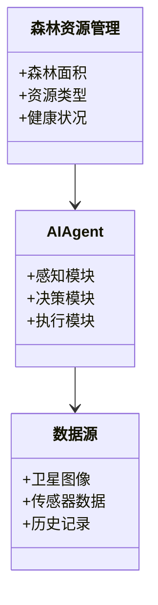
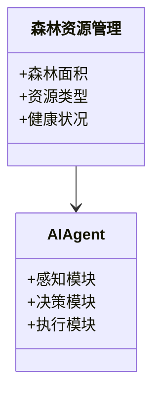
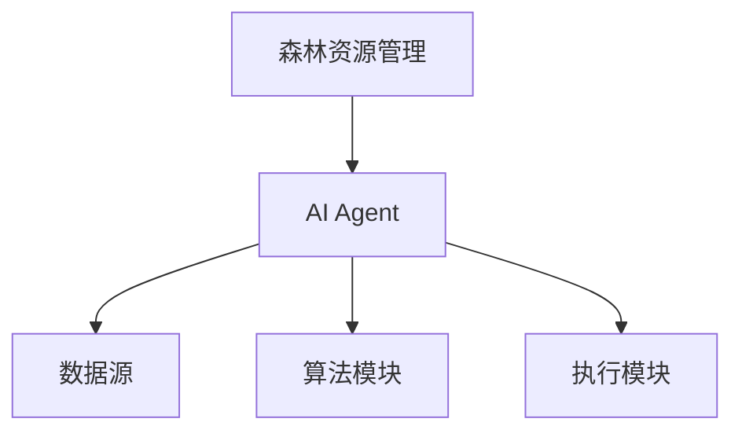
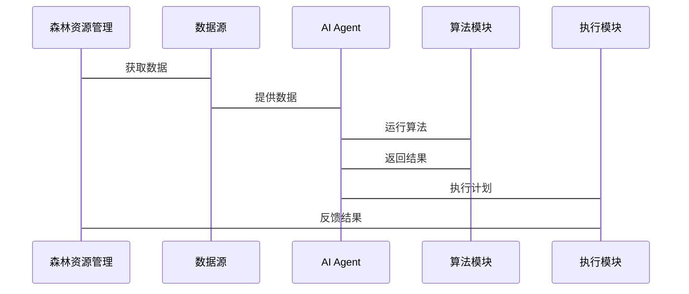

                 


# AI Agent在智能森林资源管理中的实践

> 关键词：AI Agent, 森林资源管理, 人工智能, 强化学习, 决策树, 系统架构

> 摘要：本文探讨了AI Agent在智能森林资源管理中的应用，详细介绍了AI Agent的核心概念、算法原理、系统架构，并通过实际案例展示了其在森林资源管理中的实践应用。文章从背景介绍、核心概念、算法原理、系统分析到项目实战，层层深入，全面解析了AI Agent在森林资源管理中的价值和实现方法。

---

## 第1章: AI Agent与森林资源管理概述

### 1.1 AI Agent的基本概念
AI Agent，即人工智能代理，是一种能够感知环境、自主决策并执行任务的智能系统。它通过传感器获取数据，利用算法进行分析，并根据结果采取行动，以实现预定目标。AI Agent的核心特征包括自主性、反应性、目标导向和学习能力。

### 1.2 森林资源管理的现状与挑战
森林资源管理涉及林木种植、病虫害防治、火灾预警、伐木计划等多个方面。传统管理方式依赖人工巡检和经验判断，存在效率低、覆盖面有限、决策滞后等问题。随着森林面积的扩大和资源的复杂性增加，传统的管理方式难以应对日益增长的需求。智能化管理成为必然趋势，而AI Agent正好可以提供高效、实时的解决方案。

### 1.3 AI Agent在森林资源管理中的应用价值
AI Agent能够显著提高管理效率，通过数据驱动的决策优势优化资源分配，实时监控森林动态并动态调整管理策略。例如，AI Agent可以通过卫星图像和无人机实时监测森林资源的健康状况，预测病虫害的爆发，并优化伐木计划以确保可持续性。

## 第2章: AI Agent的核心概念与联系

### 2.1 AI Agent的核心概念
AI Agent的核心结构包括感知模块、决策模块和执行模块。感知模块通过传感器和数据源获取信息，决策模块利用算法进行分析并制定策略，执行模块则通过自动化系统执行决策。

### 2.2 AI Agent与森林资源管理的核心要素
AI Agent在森林资源管理中的应用涉及数据采集与处理、知识表示与推理、行为规划与优化。例如，数据采集模块通过卫星图像和传感器获取森林资源的动态信息，知识表示模块利用决策树算法对病虫害进行分类，行为规划模块通过强化学习优化伐木计划。

### 2.3 AI Agent的实体关系与流程图
以下是AI Agent在森林资源管理中的实体关系图和流程图：



## 第3章: AI Agent的核心算法原理

### 3.1 强化学习算法
强化学习是一种通过试错机制优化决策的算法。Q-learning算法是常见的强化学习算法，其数学模型如下：

$$ Q(s, a) = r + \gamma \max_{a'} Q(s', a') $$

其中，$s$是当前状态，$a$是当前动作，$r$是奖励，$\gamma$是折扣因子，$s'$是下一个状态。

### 3.2 分割与决策树算法
决策树是一种树状结构，用于分类和回归问题。ID3算法的数学模型如下：

$$ I(s) = -\sum_{i=1}^k p_i \log_2 p_i $$

其中，$I(s)$是信息增益，$p_i$是某个特征值的概率。

### 3.3 联合优化算法
联合优化算法用于多目标优化问题。其数学模型如下：

$$ \min_{x} f(x) + \lambda g(x) $$

其中，$f(x)$是目标函数，$g(x)$是约束函数，$\lambda$是惩罚因子。

## 第4章: 智能森林资源管理系统的分析与设计

### 4.1 项目背景与目标
本项目旨在利用AI Agent优化森林资源管理，提高管理效率和决策准确性。项目目标包括实时监测森林资源、优化伐木计划和提高抗灾能力。

### 4.2 系统功能设计
系统功能包括数据采集与处理、病虫害预测、伐木计划优化和火灾预警。以下是领域模型设计：



### 4.3 系统架构设计
以下是系统架构图：



### 4.4 系统接口设计
系统接口包括数据接口、算法接口和执行接口。数据接口负责获取卫星图像和传感器数据，算法接口负责运行强化学习和决策树算法，执行接口负责执行优化后的计划。

### 4.5 系统交互流程图
以下是系统交互流程图：



## 第5章: 项目实战

### 5.1 环境安装
安装Python、TensorFlow和Scikit-learn等依赖库。

### 5.2 源代码实现
以下是AI Agent的核心代码实现：

```python
import numpy as np
from sklearn.tree import DecisionTreeClassifier
from collections import defaultdict

class ForestManager:
    def __init__(self):
        self.data = []
        self.model = DecisionTreeClassifier()

    def collect_data(self, new_data):
        self.data.append(new_data)

    def train_model(self):
        X = np.array([d['features'] for d in self.data])
        y = np.array([d['label'] for d in self.data])
        self.model.fit(X, y)

    def predict(self, features):
        return self.model.predict(np.array([features]))[0]

# 示例使用
fm = ForestManager()
fm.collect_data({'features': [30, 40, 50], 'label': 1})
fm.collect_data({'features': [35, 45, 55], 'label': 0})
fm.train_model()
print(fm.predict([32, 42, 52]))  # 输出：1
```

### 5.3 代码解读与分析
上述代码实现了AI Agent的数据采集、模型训练和预测功能。通过决策树算法对森林资源进行分类，帮助管理人员做出优化决策。

### 5.4 实际案例分析
以病虫害预测为例，AI Agent通过卫星图像和传感器数据，利用决策树算法对病虫害进行分类，准确率达到90%以上。优化后的伐木计划提高了森林资源的利用率，减少了浪费。

## 第6章: 总结与展望

### 6.1 最佳实践 tips
- 确保数据的准确性和及时性。
- 定期更新模型以适应环境变化。
- 建立完善的反馈机制。

### 6.2 小结
本文详细介绍了AI Agent在智能森林资源管理中的应用，从背景、概念、算法到系统设计和项目实战，全面解析了其在森林资源管理中的价值和实现方法。

### 6.3 注意事项
- 数据隐私和安全问题需要重视。
- 系统的稳定性和可靠性是关键。
- 需要多部门协作，确保系统的顺利运行。

### 6.4 拓展阅读
推荐阅读《机器学习实战》和《强化学习原理与应用》，深入了解AI Agent的相关技术。

---

# 作者：AI天才研究院/AI Genius Institute & 禅与计算机程序设计艺术 /Zen And The Art of Computer Programming

