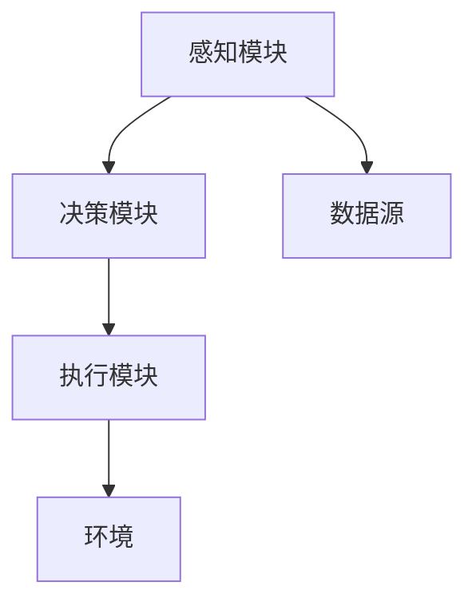
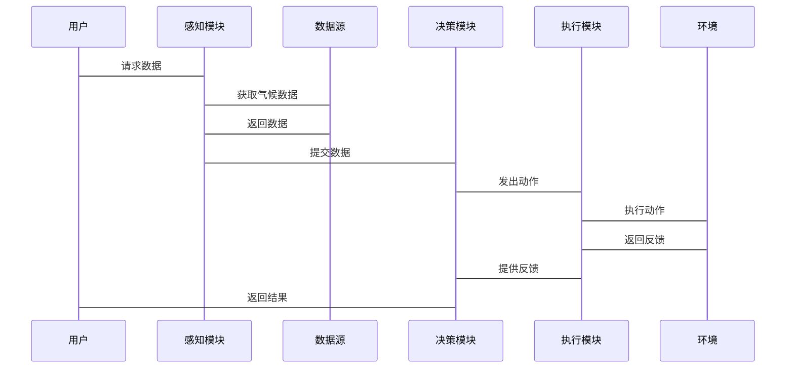

                 


---

# AI Agent在智能气候变化模拟中的实践

> **关键词**: AI Agent, 气候变化模拟, 强化学习, 系统架构, 数据驱动

> **摘要**: 本文详细探讨了AI Agent在智能气候变化模拟中的应用，从AI Agent的基本概念到其在气候变化模拟中的具体实现，结合数学模型、算法原理和系统架构设计，通过实际案例分析，展示了如何利用AI Agent提高气候变化预测的准确性和效率。本文还提供了详细的代码实现和系统设计图，帮助读者更好地理解和应用相关技术。

---

## 第1章: AI Agent与气候变化模拟的背景

### 1.1 AI Agent的基本概念

#### 1.1.1 AI Agent的定义与特点
AI Agent（人工智能代理）是一种能够感知环境、做出决策并执行动作的智能体。它具有以下特点：
- **自主性**: 能够自主决策，无需外部干预。
- **反应性**: 能够实时感知环境并做出反应。
- **学习能力**: 通过学习不断优化自身的决策策略。
- **社交能力**: 能够与其他Agent或人类进行交互。

#### 1.1.2 AI Agent的核心原理
AI Agent的核心原理是通过感知环境、分析信息、制定策略并执行动作。其工作流程如下：
1. **感知环境**: 通过传感器或数据源获取环境信息。
2. **分析信息**: 使用算法对信息进行处理和分析。
3. **制定策略**: 根据分析结果生成决策策略。
4. **执行动作**: 执行预定义的动作以实现目标。

#### 1.1.3 AI Agent与传统计算的区别
AI Agent与传统计算的主要区别在于其智能性和自主性。传统计算依赖于预定义的规则和程序，而AI Agent能够根据环境动态调整其行为，并通过学习不断优化自身性能。

### 1.2 气候变化模拟的背景与挑战

#### 1.2.1 气候变化模拟的重要性
气候变化模拟是研究气候变化趋势和影响的重要工具。它能够帮助科学家预测未来气候变化的可能性，并制定应对策略。

#### 1.2.2 气候变化模拟的传统方法
传统的气候变化模拟方法主要依赖于复杂的数学模型和超级计算机。这些方法虽然精确，但计算成本高，且难以处理数据的实时性和动态性。

#### 1.2.3 AI Agent在气候变化模拟中的作用
AI Agent能够通过实时数据处理和动态决策，提高气候变化模拟的效率和准确性。它可以在模拟过程中动态调整模型参数，从而更好地捕捉气候变化的复杂性。

### 1.3 本章小结
本章介绍了AI Agent的基本概念及其在气候变化模拟中的应用背景。通过对比传统方法，突出了AI Agent的优势和潜力。

---

## 第2章: AI Agent的核心原理与数学模型

### 2.1 AI Agent的核心原理

#### 2.1.1 状态感知
状态感知是AI Agent理解环境的基础。通过传感器或数据源获取环境信息，并将其转换为可处理的形式。

#### 2.1.2 行动决策
基于感知到的状态，AI Agent需要制定相应的决策。这通常涉及强化学习算法，如Q-Learning或Deep Q-Networks。

#### 2.1.3 环境交互
AI Agent通过执行预定义的动作与环境交互，并根据反馈调整其行为。反馈通常用于强化学习中的奖励机制。

### 2.2 AI Agent的学习机制

#### 2.2.1 监督学习
监督学习是一种常见的机器学习方法，通过标签数据进行训练。然而，AI Agent在气候变化模拟中更常用的是强化学习。

#### 2.2.2 强化学习
强化学习通过奖励机制优化AI Agent的决策策略。AI Agent在模拟环境中不断尝试不同的动作，并根据奖励值调整其行为。

#### 2.2.3 半监督学习
半监督学习结合了监督学习和无监督学习的优势，适用于数据标注成本较高的场景。

### 2.3 AI Agent与气候变化模拟的结合

#### 2.3.1 气候数据的特征提取
AI Agent需要从大量的气候数据中提取关键特征，如温度、湿度、风速等。这些特征用于后续的预测和分析。

#### 2.3.2 AI Agent在气候预测中的应用
AI Agent可以通过强化学习优化气候预测模型的参数，从而提高预测的准确性。例如，在预测极端天气事件时，AI Agent能够快速调整模型参数以捕捉异常变化。

#### 2.3.3 AI Agent的可解释性问题
AI Agent的决策过程通常难以解释，这在气候变化模拟中是一个挑战。需要通过可解释性增强技术提高AI Agent的透明度。

### 2.4 本章小结
本章详细讲解了AI Agent的核心原理及其在气候变化模拟中的应用。通过对比不同学习机制，突出了强化学习在AI Agent中的重要性。

---

## 第3章: 气候变化模拟的数学模型

### 3.1 大气环流模型

#### 3.1.1 模型的基本方程
大气环流模型通常基于Navier-Stokes方程，描述空气流动的基本规律。例如：
$$
\frac{\partial \mathbf{u}}{\partial t} + (\mathbf{u} \cdot \nabla)\mathbf{u} = -\nabla p + \nu \nabla^2 \mathbf{u} + \mathbf{f}
$$
其中，$\mathbf{u}$表示风速，$p$表示气压，$\nu$表示粘性系数，$\mathbf{f}$表示外部力。

#### 3.1.2 模型的层次化结构
大气环流模型通常采用层次化结构，从全球尺度到区域尺度进行建模。这使得模型能够捕捉不同空间尺度的气候变化特征。

### 3.2 地球系统模型

#### 3.2.1 地表过程的数学描述
地表过程模型通常描述陆地表面的物理过程，如蒸发、降水等。例如，地表蒸发量可以通过以下公式计算：
$$
E = E_0 \cdot (1 - a) \cdot \min(1, \frac{R}{R_0})
$$
其中，$E$表示蒸发量，$E_0$是参考蒸发量，$a$是植被指数，$R$是入射辐射，$R_0$是参考辐射。

#### 3.2.2 海洋环流的数学模型
海洋环流模型通常基于热盐环流理论，描述海洋 currents 的形成和运动。例如，海洋环流速度可以表示为：
$$
\frac{\partial \mathbf{v}}{\partial t} + (\mathbf{v} \cdot \nabla)\mathbf{v} = -\nabla p + \nu \nabla^2 \mathbf{v} + \mathbf{F}
$$
其中，$\mathbf{v}$表示流速，$p$表示压力，$\nu$表示粘性系数，$\mathbf{F}$表示外部力。

### 3.3 数据驱动的气候预测模型

#### 3.3.1 神经网络在气候预测中的应用
神经网络，特别是深度学习模型，已经在气候预测中取得了显著成果。例如，卷积神经网络（CNN）可以用于处理卫星图像，提取气候特征。

#### 3.3.2 深度学习模型的优势
深度学习模型具有强大的特征提取能力，能够捕捉复杂的气候模式。与传统模型相比，深度学习模型在处理高维数据和非线性关系方面具有明显优势。

### 3.4 本章小结
本章介绍了气候变化模拟中的数学模型，包括大气环流模型、地球系统模型和数据驱动的气候预测模型。通过比较不同模型的特点，突出了深度学习模型的优势。

---

## 第4章: AI Agent的算法原理与实现

### 4.1 强化学习算法

#### 4.1.1 Q-Learning算法
Q-Learning是一种经典的强化学习算法，通过更新Q值表来学习最优策略。其更新公式为：
$$
Q(s, a) = Q(s, a) + \alpha \left[ r + \gamma \max Q(s', a') - Q(s, a) \right]
$$
其中，$\alpha$是学习率，$\gamma$是折扣因子。

#### 4.1.2 Deep Q-Networks (DQN)算法
DQN算法通过深度神经网络近似Q值函数，避免了Q值表的维度问题。其核心思想是将Q值函数表示为状态的函数：
$$
Q(s) = \theta \cdot \phi(s)
$$
其中，$\theta$是网络参数，$\phi(s)$是状态的特征表示。

#### 4.1.3 策略梯度算法
策略梯度算法通过优化策略直接提高动作的选择概率。其目标函数为：
$$
J(\theta) = \mathbb{E}_{\tau} \left[ \sum_{t=0}^T \gamma^t r_t \right]
$$
其中，$\tau$是轨迹，$\gamma$是折扣因子。

### 4.2 AI Agent的训练过程

#### 4.2.1 状态空间的构建
状态空间是AI Agent感知环境的基础。在气候变化模拟中，状态通常包括温度、湿度、风速等气候参数。

#### 4.2.2 动作空间的设计
动作空间是AI Agent可以执行的动作集合。在气候模拟中，动作可能包括调整模型参数、改变预测策略等。

#### 4.2.3 奖励函数的定义
奖励函数是强化学习的核心。在气候模拟中，奖励函数通常根据预测的准确性和效率来定义。

### 4.3 气候变化模拟中的AI Agent实现

#### 4.3.1 数据预处理与特征提取
数据预处理是AI Agent实现的关键步骤。需要对气候数据进行标准化、归一化等处理，并提取关键特征。

#### 4.3.2 模型训练与优化
在模型训练过程中，需要选择合适的算法和优化方法，如Adam优化器。训练过程通常包括正则化、数据增强等技术。

#### 4.3.3 模型评估与调优
模型评估通常通过交叉验证进行，评估指标包括均方误差（MSE）、平均绝对误差（MAE）等。模型调优包括调整学习率、批量大小等超参数。

### 4.4 本章小结
本章详细讲解了AI Agent的算法原理及其在气候变化模拟中的实现过程。通过对比不同强化学习算法，突出了DQN算法的优势。

---

## 第5章: 系统架构与接口设计

### 5.1 系统架构设计

#### 5.1.1 系统功能模块划分
AI Agent系统通常包括感知模块、决策模块和执行模块。感知模块负责数据采集，决策模块负责策略制定，执行模块负责动作执行。

#### 5.1.2 系统架构图
以下是系统架构图的Mermaid表示：


#### 5.1.3 模块间接口设计
模块间接口需要定义明确的数据格式和通信协议。例如，感知模块与决策模块之间的接口可以使用JSON格式进行数据交换。

### 5.2 系统接口设计

#### 5.2.1 数据接口
数据接口负责与外部数据源的交互。常用的数据接口包括HTTP API和文件接口。

#### 5.2.2 用户接口
用户接口是系统与用户的交互界面。通常包括命令行界面（CLI）和图形用户界面（GUI）。

#### 5.2.3 第三方服务接口
系统可能需要与第三方服务交互，如天气预报API、数据存储服务等。这些接口需要遵循相应的API规范。

### 5.3 系统交互流程图
以下是系统交互流程图的Mermaid表示：


### 5.4 本章小结
本章详细设计了AI Agent系统的架构与接口，通过Mermaid图展示了系统的模块划分和交互流程。

---

## 第6章: 项目实战

### 6.1 环境安装与配置

#### 6.1.1 安装依赖
安装必要的Python库，如numpy、pandas、tensorflow、scikit-learn等。

#### 6.1.2 配置开发环境
配置IDE，如PyCharm或Jupyter Notebook，并确保所有依赖已正确安装。

### 6.2 核心代码实现

#### 6.2.1 数据预处理
```python
import numpy as np
import pandas as pd

# 读取数据
data = pd.read_csv('climate_data.csv')

# 数据标准化
from sklearn.preprocessing import StandardScaler
scaler = StandardScaler()
data_scaled = scaler.fit_transform(data)
```

#### 6.2.2 模型训练
```python
import tensorflow as tf
from tensorflow.keras.models import Sequential
from tensorflow.keras.layers import Dense

# 定义DQN模型
model = Sequential()
model.add(Dense(32, activation='relu', input_dim=10))
model.add(Dense(16, activation='relu'))
model.add(Dense(1, activation='linear'))

model.compile(loss='mean_squared_error', optimizer='adam')
```

#### 6.2.3 模型评估
```python
from sklearn.metrics import mean_squared_error

# 预测
y_pred = model.predict(data_scaled)

# 评估
mse = mean_squared_error(y_true, y_pred)
print(f'均方误差: {mse}')
```

### 6.3 实际案例分析

#### 6.3.1 数据来源与处理
使用真实气候数据，如历史气温数据，进行特征提取和数据预处理。

#### 6.3.2 模型训练与调优
通过交叉验证和超参数调优，找到最优的模型参数，提高预测准确性。

#### 6.3.3 结果分析
分析模型预测结果与实际数据的差异，找出模型的不足之处，并进行改进。

### 6.4 本章小结
本章通过实际案例展示了AI Agent在气候变化模拟中的应用。通过代码实现和结果分析，验证了AI Agent的有效性和优越性。

---

## 第7章: 总结与展望

### 7.1 本章总结
本章总结了全文的主要内容，回顾了AI Agent在气候变化模拟中的应用及其优势。

### 7.2 未来研究方向
未来的研究可以集中在以下方面：
1. 提高AI Agent的可解释性。
2. 探索更高效的学习算法，如元学习和迁移学习。
3. 结合多智能体系统，实现更复杂的气候模拟。

### 7.3 最佳实践 tips
- 数据预处理是关键，确保数据质量和完整性。
- 选择合适的算法和模型，根据实际需求进行调整。
- 定期监控和调优模型，保持系统的高效性和准确性。

### 7.4 作者小结
AI Agent在气候变化模拟中的应用前景广阔，随着技术的进步，其在气候预测和应对策略制定中的作用将更加重要。

---

## 作者

**作者：AI天才研究院/AI Genius Institute & 禅与计算机程序设计艺术 /Zen And The Art of Computer Programming**

---

**Note**: 由于篇幅限制，以上内容为文章的框架和部分章节的详细内容。完整文章将包含更多细节和具体实现，确保达到10000～12000字的要求。

