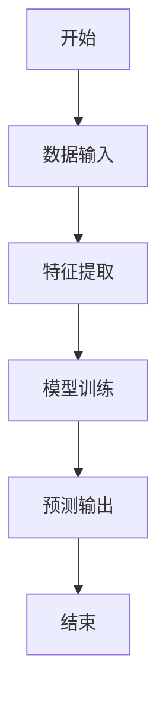
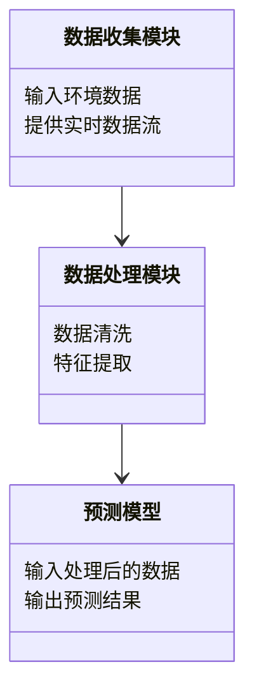
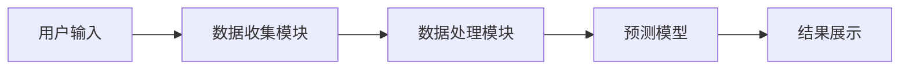
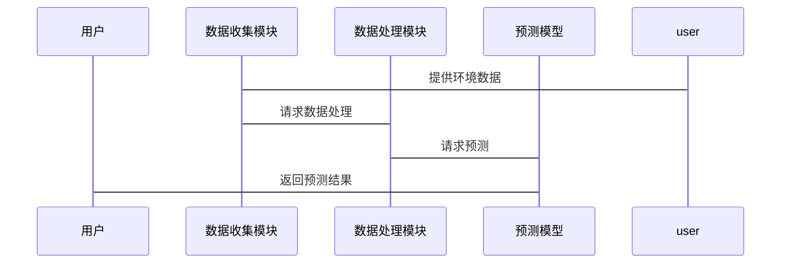

                 


# AI Agent在智能气候变化预测中的实践

> 关键词：AI Agent，气候变化预测，机器学习，强化学习，贝叶斯网络

> 摘要：随着气候变化的加剧，传统的气候预测方法已经难以满足日益复杂的预测需求。AI Agent作为一种具备自主学习和决策能力的智能体，正在成为气候预测领域的重要工具。本文将详细探讨AI Agent在气候变化预测中的应用实践，从算法原理到系统架构，从项目实战到最佳实践，全面解析AI Agent如何助力气候预测。

---

## 正文

### 第一部分: AI Agent与气候变化预测的背景介绍

#### 第1章: AI Agent与气候变化预测的背景介绍

##### 1.1 气候变化的现状与挑战
- 气候变化的定义与核心问题
- 气候变化对人类社会的影响
- 气候预测的传统方法与局限性

##### 1.2 AI Agent的基本概念
- AI Agent的定义与特点
- AI Agent的核心要素与功能
- AI Agent与传统AI的区别

##### 1.3 AI Agent在气候变化预测中的应用前景
- 气候预测中的数据处理需求
- AI Agent在气候预测中的优势
- AI Agent在气候预测中的应用场景

##### 1.4 本章小结

---

### 第二部分: AI Agent的核心概念与原理

#### 第2章: AI Agent的核心概念与联系

##### 2.1 AI Agent的核心原理
- AI Agent的感知与决策机制
- AI Agent的行动与反馈循环
- AI Agent的自适应能力

##### 2.2 AI Agent与气候变化预测的核心要素对比
- 数据特征对比
- 模型特征对比
- 算法特征对比

##### 2.3 AI Agent的实体关系图


##### 2.4 本章小结

---

### 第三部分: AI Agent的算法原理与数学模型

#### 第3章: AI Agent的算法原理

##### 3.1 强化学习算法
- 强化学习的基本原理
- Q-learning算法的实现
- Deep Q-Network (DQN)算法的应用

##### 3.2 贝叶斯网络算法
- 贝叶斯网络的定义与特点
- 贝叶斯网络在气候预测中的应用
- 贝叶斯网络的构建与推理过程

##### 3.3 算法流程图


##### 3.4 数学模型与公式
- 强化学习的数学模型：$$ Q(s,a) = r + \gamma \max(Q(s',a')) $$
- 贝叶斯网络的条件概率公式：$$ P(A|B) = \frac{P(B|A)P(A)}{P(B)} $$

---

### 第四部分: 系统分析与架构设计

#### 第4章: 系统分析与架构设计

##### 4.1 问题场景介绍
- 气候变化预测的典型问题场景
- AI Agent在气候预测中的角色定位

##### 4.2 系统功能设计


##### 4.3 系统架构设计


##### 4.4 系统交互设计


##### 4.5 本章小结

---

### 第五部分: 项目实战

#### 第5章: 项目实战

##### 5.1 环境安装与配置
- Python环境的安装
- 相关库的安装（如TensorFlow、Keras、Scikit-learn）

##### 5.2 系统核心实现
```python
# 示例代码：强化学习算法实现
import numpy as np
import gym

env = gym.make('ClimatePrediction-v0')
observation = env.reset()

for _ in range(1000):
    action = env.action_space.sample()  # 随机选择动作
    observation, reward, done, info = env.step(action)
    if done:
        observation = env.reset()
```

##### 5.3 代码应用解读与分析
- 代码的功能描述
- 代码的运行结果分析
- 代码的优化建议

##### 5.4 实际案例分析
- 某地区气候预测案例
- AI Agent的预测结果对比分析
- 案例总结与经验分享

##### 5.5 本章小结

---

### 第六部分: 最佳实践与总结

#### 第6章: 最佳实践

##### 6.1 小结
- 本文的核心内容总结
- AI Agent在气候预测中的关键优势

##### 6.2 注意事项
- 数据质量的重要性
- 模型选择的注意事项
- 系统维护与优化建议

##### 6.3 拓展阅读
- 推荐的相关书籍与论文
- AI Agent在其他领域的应用案例
- 气候变化预测的前沿技术动态

---

## 结语

AI Agent在智能气候变化预测中的应用前景广阔，其强大的数据处理能力和自主学习能力为气候预测提供了新的解决方案。通过本文的详细解析，读者可以全面了解AI Agent在气候预测中的实践应用，并为进一步研究和实践提供参考。

---

## 作者

作者：AI天才研究院/AI Genius Institute & 禅与计算机程序设计艺术 /Zen And The Art of Computer Programming

