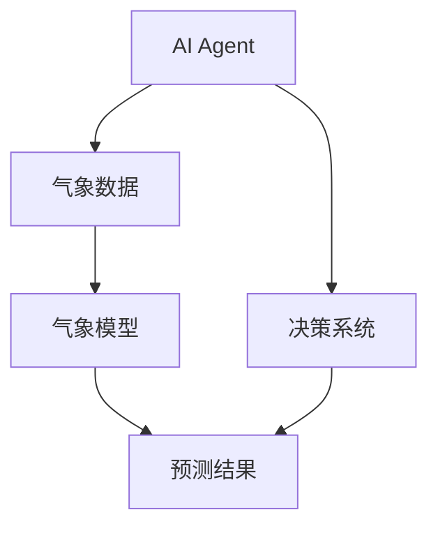
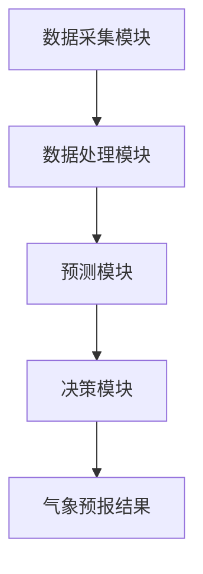
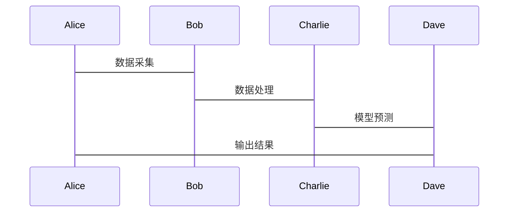

                 


# AI Agent在智能气象预报中的应用

> 关键词：AI Agent, 智能气象预报, 机器学习, 天气预测, 数据分析

> 摘要：本文详细探讨了AI Agent在智能气象预报中的应用，从基本概念到核心算法，再到系统架构设计和项目实战，全面分析了AI Agent如何提升气象预报的准确性、实时性和智能化水平。文章结合理论与实践，通过丰富的案例和详细的代码示例，帮助读者深入理解AI Agent在气象预报中的应用价值和技术实现。

---

# 第一部分: AI Agent与智能气象预报的背景与基础

## 第1章: AI Agent与智能气象预报概述

### 1.1 AI Agent的基本概念

#### 1.1.1 AI Agent的定义
AI Agent（人工智能代理）是一种能够感知环境、自主决策并执行任务的智能实体。它能够根据输入的信息做出判断，并采取相应的行动以实现目标。

#### 1.1.2 AI Agent的核心特征
- **自主性**：AI Agent能够自主决策，无需人工干预。
- **反应性**：能够实时感知环境并做出反应。
- **目标导向**：以特定目标为导向，优化决策过程。
- **学习能力**：通过数据和经验不断优化自身性能。

#### 1.1.3 AI Agent与传统气象预报的区别
传统的气象预报主要依赖于数值模拟和经验模型，而AI Agent能够结合实时数据和历史数据，通过机器学习算法进行预测，具有更高的准确性和实时性。

### 1.2 智能气象预报的背景与需求

#### 1.2.1 气象预报的重要性
气象预报是防灾减灾、农业生产、交通物流等领域的重要基础。准确的气象预报能够帮助人们做出更合理的决策。

#### 1.2.2 传统气象预报的局限性
- 数据量有限：传统方法依赖于有限的气象站数据。
- 计算能力不足：复杂的大气模型需要大量计算资源。
- 预测精度有限：传统模型对复杂天气现象的预测能力有限。

#### 1.2.3 AI Agent在气象预报中的优势
- 高精度：通过机器学习算法，AI Agent能够从海量数据中提取规律，提高预测精度。
- 实时性：能够实时处理数据，快速做出预测。
- 自适应性：能够根据环境变化自适应调整预测模型。

### 1.3 AI Agent在气象预报中的应用前景

#### 1.3.1 智能气象预报的潜在应用场景
- 精准农业：根据天气变化优化农作物种植。
- 交通管理：根据天气预报调整交通调度。
- 灾害预警：提前预测自然灾害，减少损失。

#### 1.3.2 AI Agent在气象预报中的核心价值
- 提高预测精度：通过深度学习算法，AI Agent能够更准确地预测天气变化。
- 实现实时监控：能够实时处理气象数据，快速做出预测。
- 优化资源分配：通过智能决策，优化气象资源的利用效率。

#### 1.3.3 当前技术挑战与未来发展方向
- 数据质量问题：气象数据的准确性和完整性对预测结果有直接影响。
- 模型优化：需要不断优化深度学习模型，提高预测精度。
- 实际应用中的适应性问题：AI Agent需要能够适应不同的气象环境和应用场景。

### 1.4 本章小结
本章介绍了AI Agent的基本概念、核心特征以及在气象预报中的应用前景。通过对比传统气象预报与AI Agent的优势，强调了AI Agent在提高气象预报精度和实时性方面的重要作用。

---

# 第二部分: AI Agent的核心概念与原理

## 第2章: AI Agent的核心概念与联系

### 2.1 AI Agent的实体关系图



### 2.2 AI Agent的核心原理

#### 2.2.1 AI Agent的基本工作原理
AI Agent通过感知环境、分析数据、制定决策并执行行动来实现气象预报的目标。

#### 2.2.2 AI Agent的决策机制
AI Agent的决策机制包括数据收集、特征提取、模型训练和预测四个步骤。

#### 2.2.3 AI Agent的学习与优化
通过机器学习算法，AI Agent能够从历史数据中学习，不断优化预测模型。

### 2.3 AI Agent与气象数据的关系

#### 2.3.1 气象数据的多样性
气象数据包括温度、湿度、气压、风速等多种类型的数据，具有时空分布不均的特点。

#### 2.3.2 AI Agent对气象数据的处理
AI Agent通过数据预处理、特征提取和数据增强等技术，对气象数据进行处理。

#### 2.3.3 数据驱动的气象预报模型
基于深度学习的气象预报模型，能够从海量数据中提取特征，提高预测精度。

### 2.4 本章小结
本章详细分析了AI Agent的核心概念与原理，强调了AI Agent在气象数据处理和预测中的重要作用。

---

# 第三部分: AI Agent的数学模型与算法原理

## 第3章: AI Agent的数学模型与算法

### 3.1 基础数学模型

#### 3.1.1 概率论基础
概率论是机器学习的基础，用于描述数据的不确定性。

#### 3.1.2 统计学习基础
统计学习是通过数据学习模型参数的技术，广泛应用于分类和回归问题。

#### 3.1.3 深度学习基础
深度学习通过多层神经网络，能够从数据中提取高层次特征。

### 3.2 AI Agent的核心算法

#### 3.2.1 生成模型
生成模型如GAN（生成对抗网络）可以用于生成气象数据。

#### 3.2.2 强化学习
强化学习通过奖励机制，优化AI Agent的决策过程。

#### 3.2.3 聚类与分类算法
聚类算法用于将气象数据分组，分类算法用于预测天气类型。

### 3.3 算法原理的数学推导

#### 3.3.1 概率密度函数的推导
$$ p(x) = \frac{1}{\sqrt{2\pi\sigma^2}} e^{-\frac{(x-\mu)^2}{2\sigma^2}} $$

#### 3.3.2 深度学习模型的数学公式
$$ y = \sigma(Wx + b) $$

#### 3.3.3 强化学习的数学模型
$$ Q(s, a) = r + \gamma \max_{a'} Q(s', a') $$

### 3.4 算法实现的代码示例

#### 3.4.1 Python实现的基础代码
```python
import numpy as np
import tensorflow as tf
```

#### 3.4.2 模型训练的代码示例
```python
model = tf.keras.Sequential([
    tf.keras.layers.Dense(64, activation='relu'),
    tf.keras.layers.Dense(1)
])
model.compile(optimizer='adam', loss='mean_squared_error')
model.fit(x_train, y_train, epochs=100)
```

#### 3.4.3 模型预测的代码实现
```python
predictions = model.predict(x_test)
```

### 3.5 本章小结
本章详细讲解了AI Agent的核心算法及其数学模型，通过代码示例帮助读者理解算法实现。

---

# 第四部分: AI Agent的系统分析与架构设计

## 第4章: AI Agent的系统架构设计

### 4.1 系统功能设计

#### 4.1.1 数据采集模块
负责采集气象数据，包括温度、湿度、气压等。

#### 4.1.2 数据处理模块
对数据进行预处理、特征提取和数据增强。

#### 4.1.3 预测模块
基于机器学习模型进行天气预测。

#### 4.1.4 决策模块
根据预测结果做出决策，并输出气象预报结果。

### 4.2 系统架构设计



### 4.3 接口设计与交互流程

#### 4.3.1 系统接口设计
- 数据接口：负责数据的输入和输出。
- 模型接口：负责模型的训练和预测。

#### 4.3.2 交互流程


### 4.4 本章小结
本章详细设计了AI Agent系统的架构，包括功能模块、系统架构图和交互流程图。

---

# 第五部分: AI Agent的项目实战

## 第5章: AI Agent的项目实战

### 5.1 环境安装与配置

#### 5.1.1 安装Python
```bash
python --version
pip install --upgrade pip
```

#### 5.1.2 安装深度学习库
```bash
pip install numpy tensorflow keras
```

### 5.2 系统核心实现

#### 5.2.1 数据预处理
```python
def preprocess_data(data):
    # 数据清洗
    data = data.dropna()
    # 标准化处理
    from sklearn.preprocessing import StandardScaler
    scaler = StandardScaler()
    data_scaled = scaler.fit_transform(data)
    return data_scaled
```

#### 5.2.2 模型训练
```python
model = tf.keras.Sequential([
    tf.keras.layers.Dense(64, activation='relu'),
    tf.keras.layers.Dense(1)
])
model.compile(optimizer='adam', loss='mean_squared_error')
model.fit(x_train, y_train, epochs=100, batch_size=32)
```

#### 5.2.3 模型预测
```python
predictions = model.predict(x_test)
```

### 5.3 实际案例分析

#### 5.3.1 数据来源
使用全球气象站的数据，包括温度、湿度、气压等。

#### 5.3.2 模型训练
使用训练数据训练深度学习模型，优化模型参数。

#### 5.3.3 模型预测
利用训练好的模型进行天气预测，并与实际数据进行对比。

### 5.4 项目小结
本章通过实际案例展示了AI Agent在气象预报中的应用，从环境配置到数据处理，再到模型训练和预测，详细讲解了整个过程。

---

# 总结

AI Agent在智能气象预报中的应用前景广阔，通过结合机器学习算法和深度学习模型，AI Agent能够显著提高气象预报的精度和实时性。本文从基础概念到算法实现，再到系统设计和项目实战，全面分析了AI Agent在气象预报中的应用价值和技术实现。

---

作者：AI天才研究院/AI Genius Institute & 禅与计算机程序设计艺术 /Zen And The Art of Computer Programming

