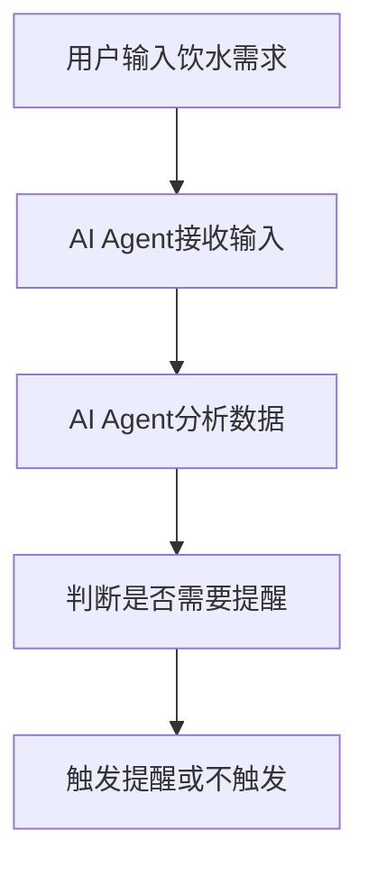
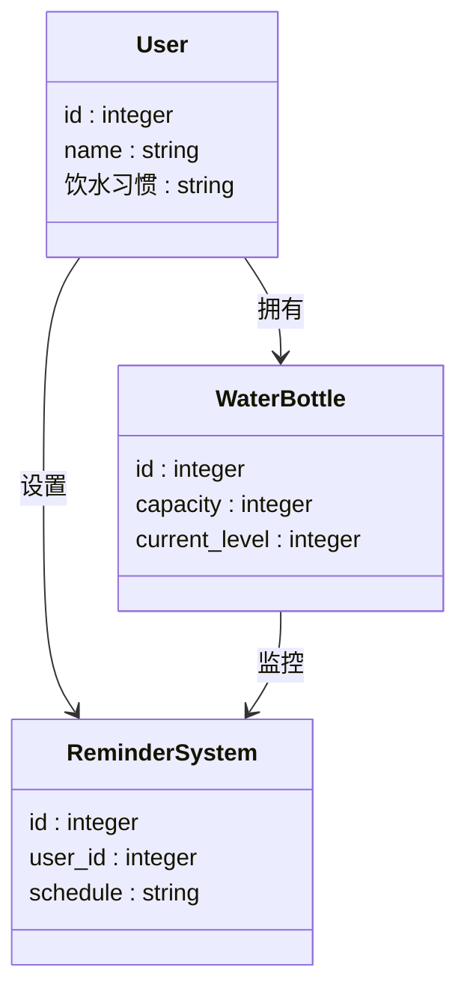
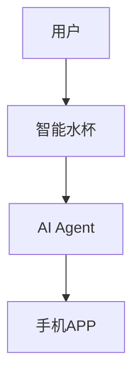
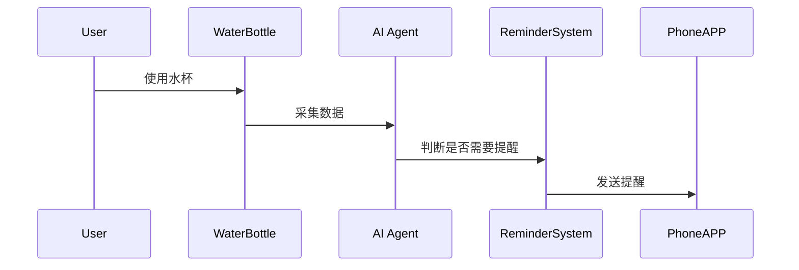

                 


# AI Agent在智能水杯中的饮水提醒

> 关键词：AI Agent，智能水杯，饮水提醒，物联网，智能硬件

> 摘要：本文详细探讨了AI Agent在智能水杯中的饮水提醒功能的设计与实现。从背景介绍到核心概念，从算法原理到系统架构，从项目实战到最佳实践，全面解析了AI Agent在智能水杯中的应用。文章通过具体案例分析，展示了如何利用AI技术优化用户的饮水习惯，同时提供了丰富的代码实现和系统架构设计，为读者提供了一套完整的解决方案。

---

# 第1章: 背景介绍

## 1.1 问题背景

### 1.1.1 智能水杯的发展现状
智能水杯作为一种典型的物联网设备，近年来得到了快速发展。通过内置传感器，智能水杯能够实时监测水温、水位、水质等参数，并通过蓝牙、Wi-Fi等通信技术与手机APP或其他智能设备连接，为用户提供便捷的饮水管理功能。

### 1.1.2 饮水提醒的必要性
现代人普遍存在饮水不足的问题，尤其是在工作和学习中，人们常常忘记按时饮水。智能水杯通过AI Agent的饮水提醒功能，可以帮助用户养成良好的饮水习惯，预防因缺水引起的健康问题。

### 1.1.3 AI Agent在智能水杯中的作用
AI Agent（人工智能代理）通过分析用户的饮水习惯、健康数据和环境信息，能够主动为用户提供个性化的饮水建议，优化用户的饮水管理体验。

## 1.2 问题描述

### 1.2.1 饮水提醒的核心问题
如何设计一个能够主动学习用户饮水习惯，并根据用户的实时需求提供饮水提醒的智能系统。

### 1.2.2 用户需求分析
- 用户希望智能水杯能够自动监测饮水量，并在需要时发出提醒。
- 用户希望饮水提醒能够根据个人健康状况和活动强度进行调整。
- 用户希望系统能够长期记录饮水数据，并提供健康报告。

### 1.2.3 现有解决方案的局限性
- 现有智能水杯大多基于简单的定时提醒功能，无法根据用户的实际需求进行动态调整。
- 系统缺乏对用户健康数据的分析能力，无法提供个性化的饮水建议。

## 1.3 问题解决

### 1.3.1 AI Agent的核心优势
AI Agent通过机器学习算法，能够实时分析用户的饮水数据和健康信息，动态调整饮水提醒策略，提供个性化的饮水管理服务。

### 1.3.2 智能水杯的硬件基础
智能水杯需要配备水位传感器、蓝牙模块、低功耗处理器等硬件设备，为AI Agent的运行提供必要的支持。

### 1.3.3 软件与硬件的结合
通过AI Agent算法，智能水杯能够将硬件采集的数据进行分析，并通过软件实现个性化的饮水提醒功能。

## 1.4 边界与外延

### 1.4.1 系统边界定义
- 系统仅关注用户的饮水习惯和水杯的实时状态，不涉及其他健康数据的采集和分析。
- 系统的核心功能是饮水提醒，不涉及水杯的其他功能（如水质检测）。

### 1.4.2 功能的外延扩展
- 系统可以通过扩展功能，集成更多的健康数据（如心率、血压等），进一步优化饮水提醒策略。
- 系统可以与其他智能设备（如智能手环）联动，提供更全面的健康管理服务。

### 1.4.3 系统与外部环境的交互
智能水杯通过蓝牙或Wi-Fi与手机APP连接，用户可以通过APP查看饮水数据和调整提醒设置。

## 1.5 核心要素组成

### 1.5.1 AI Agent的基本组成
AI Agent由传感器数据采集模块、数据处理模块和提醒触发模块三部分组成。

### 1.5.2 智能水杯的硬件组成
- 水位传感器：用于监测水杯的实时水位。
- 蓝牙模块：用于与手机APP或其他设备通信。
- 低功耗处理器：用于运行AI Agent算法。

### 1.5.3 系统的整体架构
智能水杯系统由硬件设备、AI Agent算法和用户交互界面三部分组成，实现从数据采集到用户反馈的完整流程。

---

# 第2章: 核心概念与联系

## 2.1 AI Agent的原理

### 2.1.1 AI Agent的定义
AI Agent是一种能够感知环境并采取行动以实现目标的智能实体。在智能水杯中，AI Agent通过分析用户的饮水数据，主动触发饮水提醒。

### 2.1.2 AI Agent的核心算法
AI Agent的核心算法包括基于规则的算法和基于机器学习的算法。本文采用基于规则的简单算法，通过设定阈值实现饮水提醒功能。

### 2.1.3 AI Agent与智能水杯的结合
通过AI Agent，智能水杯能够根据用户的饮水习惯和实时需求，动态调整饮水提醒策略。

## 2.2 核心概念对比

### 2.2.1 规则引擎与机器学习模型的对比
| 对比维度 | 规则引擎 | 机器学习模型 |
|----------|----------|--------------|
| 实现方式 | 基于预设规则 | 基于数据训练 |
| 灵活性   | 较低       | 较高          |
| 学习能力 | 无         | 有            |
| 适用场景 | 简单场景   | 复杂场景       |

### 2.2.2 不同AI Agent算法的优缺点
- **基于规则的算法**：简单易实现，但缺乏灵活性。
- **基于机器学习的算法**：能够动态调整，但实现复杂度较高。

### 2.2.3 系统架构的对比分析
- **集中式架构**：所有计算在云端完成，适合需要高精度分析的场景。
- **分布式架构**：计算在设备端完成，适合需要实时响应的场景。

## 2.3 ER实体关系图

```mermaid
erDiagram
    user {
        id : integer
        name : string
       饮水习惯 : string
    }
    water_bottle {
        id : integer
        capacity : integer
        current_level : integer
    }
    reminder_system {
        id : integer
        user_id : integer
        schedule : string
    }
    user --> water_bottle : 拥有
    user --> reminder_system : 设置
    water_bottle --> reminder_system : 监控
```

## 2.4 算法流程图



---

# 第3章: 算法原理讲解

## 3.1 基于规则的算法实现

### 3.1.1 算法流程
1. **数据采集**：通过水位传感器获取水杯的实时水位。
2. **数据处理**：计算用户的饮水量和饮水频率。
3. **规则判断**：根据预设规则判断是否需要触发饮水提醒。
4. **提醒触发**：通过蓝牙模块向手机APP发送提醒消息。

### 3.1.2 算法代码实现

```python
import time

# 水位传感器数据
current_level = 100  # 单位：毫升
capacity = 200  # 杯子容量

# 饮水提醒规则
threshold = 50  # 当水位低于阈值时触发提醒

if current_level < threshold:
    print("请喝水！")
else:
    print("暂时不需要喝水。")
```

### 3.1.3 算法的数学模型
$$ \text{饮水量} = \text{杯中水量} - \text{上次饮水量} $$

---

# 第4章: 系统分析与架构设计方案

## 4.1 问题场景介绍
用户通过智能水杯记录每日饮水量，并希望系统能够根据饮水习惯提供个性化的饮水提醒。

## 4.2 系统功能设计

### 4.2.1 领域模型设计


### 4.2.2 系统架构设计


### 4.2.3 系统接口设计
- **传感器接口**：水位传感器的数据接口。
- **蓝牙通信接口**：与手机APP的通信接口。

### 4.2.4 系统交互设计


---

# 第5章: 项目实战

## 5.1 环境安装

### 5.1.1 安装Python
```bash
# 安装Python
sudo apt-get install python3
```

### 5.1.2 安装依赖库
```bash
# 安装必要的库
pip install numpy
pip install matplotlib
```

## 5.2 系统核心实现源代码

### 5.2.1 AI Agent核心代码
```python
import time
import numpy as np

# 初始化数据
current_level = 100  # 当前水位
threshold = 50        # 提醒阈值

# 判断是否需要提醒
def should_remind(current_level, threshold):
    return current_level < threshold

# 触发提醒
def trigger_reminder():
    print("请喝水！")

# 主程序
while True:
    if should_remind(current_level, threshold):
        trigger_reminder()
    time.sleep(60)  # 每分钟检查一次
```

### 5.2.2 数据可视化代码
```python
import matplotlib.pyplot as plt

# 饮水量数据
饮水量 = [100, 80, 90, 70, 120]

# 绘制柱状图
plt.bar(range(len(饮水量)), 饮水量)
plt.title("每日饮水量")
plt.xlabel("时间")
plt.ylabel("毫升")
plt.show()
```

## 5.3 实际案例分析
假设用户每天的饮水量如下：
- 早上：200毫升
- 中午：150毫升
- 晚上：100毫升

系统会根据用户的饮水习惯，自动调整饮水提醒的时间和频率。

---

# 第6章: 最佳实践

## 6.1 小结
AI Agent在智能水杯中的饮水提醒功能，通过实时监测用户的饮水数据，动态调整提醒策略，帮助用户养成良好的饮水习惯。

## 6.2 注意事项
- 系统需要定期更新AI Agent算法，以适应用户的需求变化。
- 系统需要确保数据的安全性和隐私性。

## 6.3 拓展阅读
- 推荐阅读《人工智能：一种现代的方法》（Russell & Norvig），深入理解AI Agent的核心原理。
- 推荐学习《Python机器学习实战》，掌握AI Agent算法的实现技巧。

---

# 作者：AI天才研究院/AI Genius Institute & 禅与计算机程序设计艺术 /Zen And The Art of Computer Programming

---

感谢您的阅读！希望本文对您理解AI Agent在智能水杯中的应用有所帮助。

