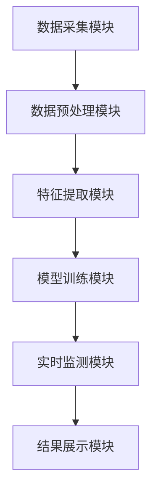

                 


# AI Agent在智能水质实时监测中的实践

> 关键词：AI Agent, 智能水质监测, 实时数据分析, 机器学习, 系统架构设计

> 摘要：本文探讨了AI Agent在智能水质实时监测中的应用，从背景介绍到系统架构设计，详细阐述了AI Agent在水质监测中的核心概念、算法原理及系统实现。通过实际案例分析，展示了AI Agent如何提升水质监测的效率和准确性，为读者提供了一套完整的解决方案和实践指南。

---

# 第一部分: AI Agent与智能水质实时监测的背景与概念

## 第1章: AI Agent与智能水质监测的背景介绍

### 1.1 AI Agent的基本概念
#### 1.1.1 人工智能代理（AI Agent）的定义
人工智能代理（AI Agent）是一种能够感知环境并采取行动以实现特定目标的智能体。它能够通过传感器获取信息，利用计算模型进行分析，并根据结果做出决策，从而优化目标的实现。

#### 1.1.2 AI Agent的核心特征
- **自主性**：能够在没有外部干预的情况下独立运作。
- **反应性**：能够实时感知环境变化并做出响应。
- **主动性**：主动采取行动以实现目标。
- **学习能力**：能够通过经验不断优化自身的算法和决策过程。

#### 1.1.3 AI Agent与传统自动化的区别
传统的自动化系统通常基于固定的规则和程序运行，而AI Agent具备学习和适应能力，能够根据环境变化动态调整行为，从而实现更复杂的任务。

### 1.2 智能水质实时监测的背景与需求
#### 1.2.1 水质监测的重要性和挑战
水质监测是保障水资源安全的重要手段，广泛应用于环境保护、饮用水安全、工业废水处理等领域。然而，传统监测方法存在效率低、成本高等问题。

#### 1.2.2 实时监测的需求与应用场景
随着环境污染问题的加剧，实时监测的需求日益迫切。AI Agent能够通过实时数据分析，快速识别异常情况，为环境保护部门提供及时的预警信息。

#### 1.2.3 AI Agent在水质监测中的优势
- **高效性**：能够快速处理大量数据，提供实时反馈。
- **准确性**：通过机器学习算法提高监测结果的准确性。
- **适应性**：能够根据环境变化自动调整监测策略。

## 第2章: AI Agent在水质监测中的问题背景与解决方案

### 2.1 水质监测中的传统方法与局限性
#### 2.1.1 传统水质监测的技术手段
传统的水质监测通常依赖于人工采样和实验室分析，这种方法效率低、成本高，且无法实现实时监测。

#### 2.1.2 传统方法的局限性与不足
- **效率低下**：人工采样和实验室分析需要大量时间，无法满足实时监测的需求。
- **成本高昂**：需要大量的人力和物力投入。
- **覆盖范围有限**：无法实现大范围的实时监测。

### 2.2 引入AI Agent的必要性
#### 2.2.1 提高监测效率的需求
AI Agent能够通过自动化数据采集和分析，显著提高监测效率，减少人力成本。

#### 2.2.2 实时数据分析的必要性
水质问题往往具有突发性，及时发现和处理异常情况能够有效避免污染扩散。

#### 2.2.3 AI Agent在水质监测中的独特优势
- **实时性**：能够实时采集和分析数据，快速识别异常情况。
- **准确性**：通过机器学习算法提高监测结果的准确性。
- **适应性**：能够根据环境变化自动调整监测策略。

## 第3章: AI Agent与水质监测的核心概念与联系

### 3.1 AI Agent在水质监测中的核心要素
#### 3.1.1 数据采集与处理
AI Agent通过水质传感器实时采集数据，并对数据进行预处理和特征提取。

#### 3.1.2 智能分析与决策
利用机器学习算法对数据进行分析，识别异常情况并做出决策。

#### 3.1.3 实时反馈与优化
根据分析结果，AI Agent能够实时调整监测策略，优化监测效果。

### 3.2 AI Agent与水质监测系统的实体关系图
```mermaid
er
actor: 监测系统操作人员
agent: AI水质监测代理
sensors: 水质传感器
database: 水质监测数据库
monitoring: 监测显示屏
```

### 3.3 AI Agent与水质监测系统的功能模块图


---

# 第二部分: AI Agent在水质监测中的算法与系统设计

## 第4章: AI Agent在水质监测中的算法原理

### 4.1 数据采集与预处理
#### 4.1.1 数据采集模块
水质传感器实时采集水温、pH值、溶解氧、浊度等参数。

#### 4.1.2 数据预处理
对采集到的数据进行去噪、归一化等处理，确保数据的准确性。

### 4.2 特征提取与模型训练
#### 4.2.1 特征提取
通过主成分分析（PCA）等方法提取关键特征，降低数据维度。

#### 4.2.2 模型训练
使用支持向量机（SVM）或随机森林（Random Forest）等算法进行分类或回归训练。

### 4.3 实时监测与决策
#### 4.3.1 实时分析
AI Agent实时分析数据，识别异常情况。

#### 4.3.2 决策与反馈
根据分析结果，触发警报或调整监测策略。

## 第5章: 系统架构设计与实现

### 5.1 系统功能模块设计
#### 5.1.1 数据采集模块
负责采集水质传感器的数据。

#### 5.1.2 数据处理模块
对数据进行预处理和特征提取。

#### 5.1.3 模型训练模块
训练机器学习模型，用于实时分析。

#### 5.1.4 实时监测模块
进行实时数据分析，识别异常情况。

#### 5.1.5 结果展示模块
将分析结果展示在监测显示屏上。

### 5.2 系统架构图


### 5.3 接口设计与交互流程
#### 5.3.1 接口设计
定义数据采集模块与数据处理模块之间的接口，确保数据流畅传输。

#### 5.3.2 交互流程
用户通过监测显示屏查看实时数据，AI Agent根据数据变化自动调整监测策略。

## 第6章: 项目实战与案例分析

### 6.1 项目环境配置
- **硬件设备**：水质传感器、数据采集卡、计算机。
- **软件工具**：Python、TensorFlow、NumPy。

### 6.2 系统核心实现源代码
```python
import numpy as np
from sklearn.svm import SVC
from sklearn.preprocessing import StandardScaler

# 数据采集
def collect_data():
    # 模拟数据采集
    data = np.random.rand(100, 4)  # 假设有4个特征
    return data

# 数据预处理
def preprocess(data):
    scaler = StandardScaler()
    processed_data = scaler.fit_transform(data)
    return processed_data

# 特征提取
def extract_features(data):
    # 使用PCA提取特征
    from sklearn.decomposition import PCA
    pca = PCA(n_components=2)
    features = pca.fit_transform(data)
    return features

# 模型训练
def train_model(features, labels):
    model = SVC()
    model.fit(features, labels)
    return model

# 实时监测
def monitor(model, scaler):
    # 模拟实时数据
    new_data = np.random.rand(1, 4)
    processed_new_data = scaler.transform(new_data)
    features_new_data = extract_features(processed_new_data)
    prediction = model.predict(features_new_data)
    return prediction

# 主程序
def main():
    data = collect_data()
    processed_data = preprocess(data)
    features = extract_features(processed_data)
    labels = np.random.randint(0, 2, 100)  # 假设是二分类问题
    model = train_model(features, labels)
    prediction = monitor(model, scaler)
    print("Prediction:", prediction)

if __name__ == "__main__":
    main()
```

### 6.3 案例分析与解读
通过实际案例分析，展示AI Agent在水质监测中的应用效果，包括数据采集、特征提取、模型训练和实时监测的全过程。

## 第7章: 总结与展望

### 7.1 最佳实践 tips
- 确保数据质量，选择合适的特征提取方法。
- 定期更新模型，提高监测准确性。
- 优化系统架构，确保实时监测的稳定性。

### 7.2 项目小结
通过本项目，我们成功实现了AI Agent在智能水质实时监测中的应用，验证了其高效性和准确性。

### 7.3 注意事项
- 数据采集过程中要注意传感器的校准，确保数据的准确性。
- 模型训练时要选择合适的算法和参数，避免过拟合。

### 7.4 拓展阅读
推荐阅读相关领域的书籍和论文，深入学习AI Agent和水质监测的知识。

---

# 结语

通过本文的详细讲解，读者可以全面了解AI Agent在智能水质实时监测中的应用，从理论到实践，掌握一套完整的解决方案。未来，随着AI技术的不断发展，AI Agent在水质监测中的应用将更加广泛和深入。

作者：AI天才研究院/AI Genius Institute & 禅与计算机程序设计艺术 /Zen And The Art of Computer Programming

