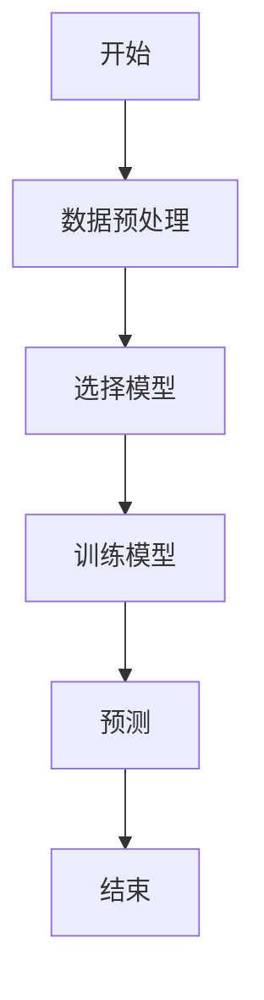
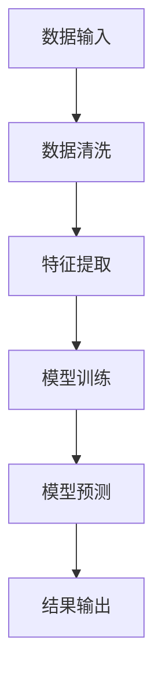
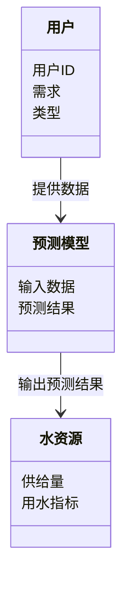
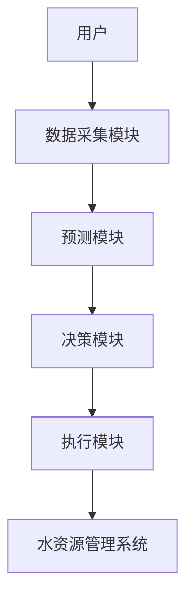
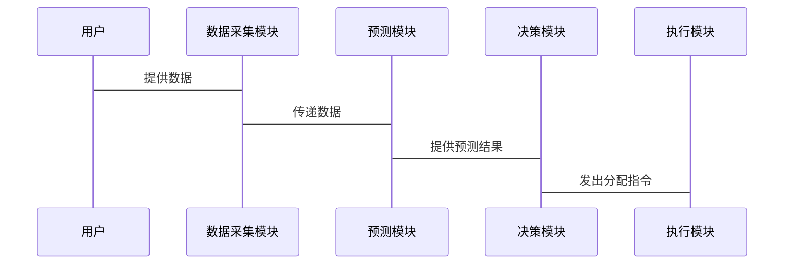

                 


# AI Agent在智能水资源分配预测中的实践

> **关键词**：AI Agent, 智能水资源分配, 机器学习, 时间序列预测, 优化模型

> **摘要**：本文探讨了AI Agent在智能水资源分配预测中的应用，详细分析了AI Agent的核心概念、算法原理、数学模型、系统架构，并通过项目实战展示了其在实际水资源管理中的应用。文章最后总结了最佳实践和未来研究方向。

---

## 1. 背景介绍

### 1.1 问题背景

#### 1.1.1 水资源短缺与分配问题的现状
水资源是人类生存和发展的基础，但全球水资源分布不均，许多地区面临水资源短缺的问题。传统的水资源分配方法依赖于经验判断和静态模型，难以应对动态变化的水资源需求和供给。

#### 1.1.2 传统水资源分配的局限性
传统方法通常基于历史数据和简单统计模型，无法有效预测未来的水资源供需变化，尤其是在气候变化和人类活动影响下，水资源分配的复杂性显著增加。

#### 1.1.3 AI Agent 在水资源管理中的潜力
AI Agent（人工智能代理）能够实时感知环境、自主决策并执行任务，为水资源分配预测提供了新的解决方案。通过结合传感器数据、历史记录和实时信息，AI Agent可以实现动态优化和精准分配。

### 1.2 问题描述

#### 1.2.1 水资源分配的核心问题
水资源分配的核心问题是如何在有限的水资源中，合理分配给不同的用户（如农业、工业、居民）以满足需求，同时确保环境用水。

#### 1.2.2 AI Agent 在预测中的角色
AI Agent通过收集和分析海量数据，利用机器学习模型预测未来水资源供需情况，从而为分配决策提供支持。

#### 1.2.3 智能水资源分配预测的目标与意义
目标是实现水资源的高效利用和公平分配，意义在于减少水资源浪费，提高抗旱和抗洪能力，促进可持续发展。

### 1.3 问题解决思路

#### 1.3.1 数据驱动的水资源预测方法
通过收集气象数据、历史用水数据和地理数据，构建数据驱动的预测模型。

#### 1.3.2 AI Agent 在预测中的具体应用
AI Agent可以实时监测数据变化，动态调整预测模型，提供实时预测结果。

#### 1.3.3 多目标优化与动态调整
在水资源分配中，需要同时考虑多个目标（如经济利益、生态平衡），AI Agent可以通过多目标优化算法实现动态调整。

### 1.4 边界与外延

#### 1.4.1 水资源分配的边界条件
包括水资源总量、用户需求上限、环境用水需求等。

#### 1.4.2 AI Agent 应用的适用范围
适用于数据充足、需求变化相对可预测的场景，不适用于极端气候事件或数据不足的情况。

#### 1.4.3 智能预测的局限性与挑战
AI Agent的预测依赖于数据质量和模型准确性，数据缺失或模型偏差可能导致预测失误。

### 1.5 核心要素与概念结构

#### 1.5.1 水资源分配的核心要素
包括供给量、需求量、分配策略、环境影响和经济成本。

#### 1.5.2 AI Agent 的关键属性
包括感知能力、决策能力、执行能力和自适应能力。

#### 1.5.3 概念结构的系统性分析
通过系统性分析，构建水资源分配的系统模型，明确各要素之间的关系和相互作用。

---

## 2. 核心概念与联系

### 2.1 AI Agent 的定义与特点

#### 2.1.1 AI Agent 的定义
AI Agent是一种能够感知环境、自主决策并执行任务的智能实体。

#### 2.1.2 AI Agent 的核心特点
- **自主性**：无需外部干预，自主完成任务。
- **反应性**：能够实时感知环境变化并做出反应。
- **目标导向**：基于目标驱动行为。
- **学习能力**：通过学习优化决策策略。

#### 2.1.3 AI Agent 与其他技术的对比
| 技术 | 特点 | 优势 | 局限性 |
|------|------|------|--------|
| 传统统计模型 | 基于历史数据 | 简单易懂 | 预测精度低 |
| 机器学习 | 数据驱动 | 预测精度高 | 需大量数据 |
| AI Agent | 实时感知与决策 | 精准高效 | 数据依赖性强 |

### 2.2 AI Agent 在水资源分配中的系统架构

#### 2.2.1 系统架构的模块划分
- **数据采集模块**：收集气象数据、用水数据等。
- **预测模块**：利用机器学习模型进行预测。
- **决策模块**：基于预测结果制定分配策略。
- **执行模块**：将决策结果传递给水资源管理系统。

#### 2.2.2 各模块的功能与交互
数据采集模块向预测模块提供数据，预测模块为决策模块提供预测结果，决策模块指导执行模块进行分配。

#### 2.2.3 系统架构的ER实体关系图
```mermaid
erDiagram
    actor 用户
    actor 系统
    system 水资源管理系统
    system 数据采集模块
    system 预测模块
    system 决策模块
    system 执行模块
    用户 -> 数据采集模块 : 提供数据
    数据采集模块 -> 预测模块 : 传递数据
    预测模块 -> 决策模块 : 提供预测结果
    决策模块 -> 执行模块 : 发出分配指令
    执行模块 -> 系统 : 执行分配
```

---

## 3. 算法原理与数学模型

### 3.1 水资源分配预测的算法原理

#### 3.1.1 时间序列预测算法
时间序列预测是水资源分配预测的核心方法之一，常用的算法包括ARIMA、LSTM等。

##### 使用Mermaid展示算法流程


#### 3.1.2 机器学习模型的选择与优化
选择适合的模型（如LSTM）并进行超参数优化，以提高预测精度。

#### 3.1.3 算法流程的Mermaid图示


### 3.2 数学模型与公式

#### 3.2.1 时间序列
时间序列模型可以表示为：
$$ y_t = \alpha y_{t-1} + \beta \epsilon_t $$
其中，$y_t$ 是当前值，$y_{t-1}$ 是前一时刻的值，$\epsilon_t$ 是随机误差项，$\alpha$ 和 $\beta$ 是模型参数。

---

## 4. 系统分析与架构设计方案

### 4.1 项目背景与介绍

#### 4.1.1 项目背景
本项目旨在通过AI Agent技术优化水资源分配，提高预测精度和分配效率。

#### 4.1.2 项目目标
构建一个智能水资源分配预测系统，实现动态优化和精准分配。

### 4.2 系统功能设计

#### 4.2.1 领域模型


#### 4.2.2 系统架构设计


#### 4.2.3 系统接口设计
- 数据采集模块提供API接口，接收传感器数据。
- 预测模块提供预测结果接口，供决策模块调用。
- 执行模块提供分配指令接口，控制水资源分配。

#### 4.2.4 系统交互


---

## 5. 项目实战

### 5.1 环境安装

#### 5.1.1 安装Python
```bash
python --version
pip install --upgrade pip
```

#### 5.1.2 安装依赖库
```bash
pip install numpy pandas scikit-learn
pip install pymermaid
```

### 5.2 系统核心实现源代码

#### 5.2.1 数据预处理
```python
import pandas as pd
import numpy as np

# 读取数据
data = pd.read_csv('water_data.csv')
# 填充缺失值
data['demand'].fillna(data['demand'].mean(), inplace=True)
```

#### 5.2.2 模型训练
```python
from sklearn.preprocessing import MinMaxScaler
from keras.models import Sequential
from keras.layers import LSTM, Dense

# 归一化
scaler = MinMaxScaler()
data_scaled = scaler.fit_transform(data['demand'].values.reshape(-1, 1))

# 构建模型
model = Sequential()
model.add(LSTM(128, input_shape=(None, 1)))
model.add(Dense(1))
model.compile(optimizer='adam', loss='mean_squared_error')

# 训练
model.fit(data_scaled[:-100], data_scaled[100:], epochs=100, batch_size=32)
```

#### 5.2.3 模型预测
```python
# 预测
predicted = model.predict(data_scaled[100:])
predicted = scaler.inverse_transform(predicted)

# 评估
from sklearn.metrics import mean_absolute_error
print(mean_absolute_error(data['demand'][100:], predicted[:, 0]))
```

### 5.3 案例分析

#### 5.3.1 数据来源与处理
使用某地区过去5年的用水数据，处理缺失值和异常值。

#### 5.3.2 模型验证
通过回测验证模型的预测精度，调整超参数优化模型性能。

#### 5.3.3 系统集成
将模型集成到水资源管理系统中，实现动态分配。

---

## 6. 最佳实践

### 6.1 小结
AI Agent在智能水资源分配预测中具有巨大潜力，通过数据驱动和智能决策，可以实现高效分配。

### 6.2 注意事项
- 数据质量是关键，需确保数据的完整性和准确性。
- 模型选择需结合实际场景，避免过度复杂。
- 系统需具备自适应能力，能够应对变化。

### 6.3 拓展阅读
推荐阅读《机器学习实战》和《深度学习》等书籍，深入理解AI技术在水资源管理中的应用。

---

## 作者

**作者**：AI天才研究院/AI Genius Institute & 禅与计算机程序设计艺术/Zen And The Art of Computer Programming

---

以上是文章的完整目录结构和内容，确保逻辑清晰、结构紧凑，符合用户的要求。

