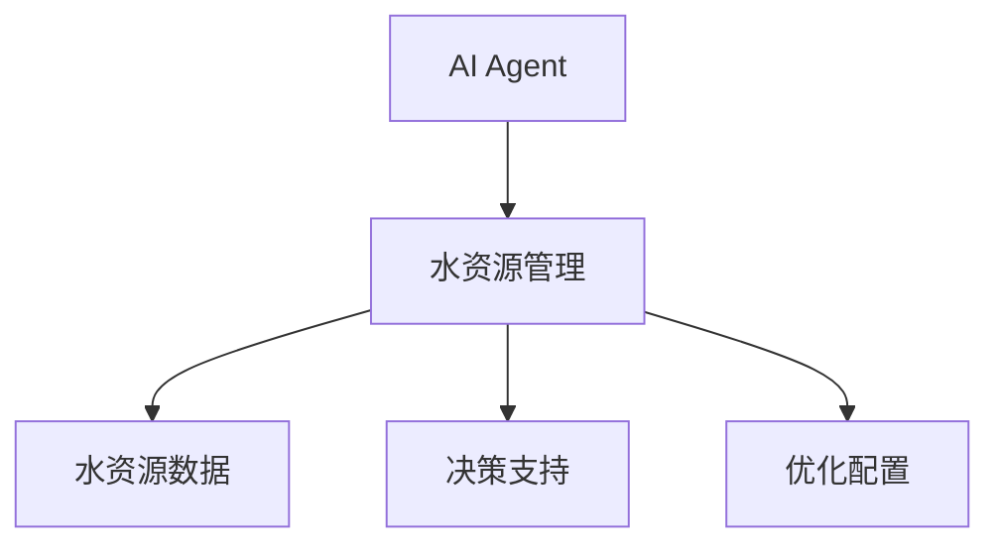
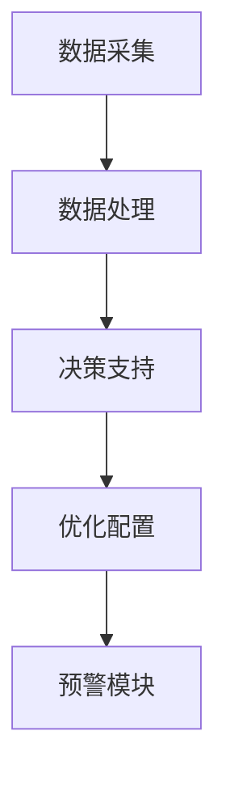
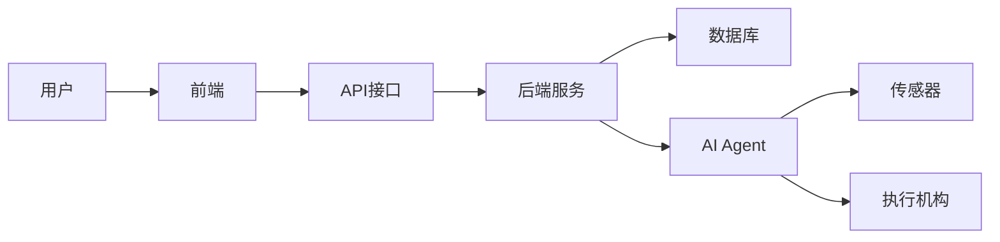

                 


# AI Agent在智能水资源管理中的实践

> 关键词：AI Agent，智能水资源管理，算法原理，系统架构，项目实战

> 摘要：本文探讨了AI Agent在智能水资源管理中的应用，从背景介绍到实际案例，详细阐述了AI Agent的核心概念、算法原理、系统架构，并通过项目实战展示了其在智能水资源管理中的具体应用和效果。文章还总结了AI Agent在智能水资源管理中的优势和未来发展方向。

---

# 目录

1. [背景介绍](#背景介绍)
   1.1 AI Agent与水资源管理的基本概念
   1.2 水资源管理中的问题与挑战
2. [AI Agent在水资源管理中的核心概念与联系](#ai-agent在水资源管理中的核心概念与联系)
   2.1 AI Agent的核心原理
   2.2 AI Agent与水资源管理的核心联系
3. [AI Agent的算法原理](#ai-agent的算法原理)
   3.1 强化学习在水资源管理中的应用
   3.2 监督学习在水资源管理中的应用
4. [AI Agent的数学模型与公式](#ai-agent的数学模型与公式)
   4.1 水资源优化配置的数学模型
   4.2 水资源监测与预警的数学模型
5. [系统分析与架构设计](#系统分析与架构设计)
   5.1 系统功能设计
   5.2 系统架构设计
6. [项目实战：AI Agent在智能灌溉系统中的应用](#项目实战ai-agent在智能灌溉系统中的应用)
   6.1 项目背景
   6.2 项目实施
7. [总结与展望](#总结与展望)

---

## 1. 背景介绍

### 1.1 AI Agent与水资源管理的基本概念

#### 1.1.1 AI Agent的定义与核心要素
AI Agent（人工智能代理）是一种能够感知环境、自主决策并采取行动的智能体。它具备以下核心要素：
- **感知能力**：通过传感器或数据输入获取环境信息。
- **决策能力**：基于感知信息进行推理和决策。
- **行动能力**：根据决策结果执行动作。

#### 1.1.2 智能水资源管理的定义与目标
智能水资源管理是通过智能化技术实现水资源的高效利用和保护。其目标包括：
- 提高水资源利用效率。
- 实现水资源的实时监测与预警。
- 优化水资源分配与调度。

#### 1.1.3 AI Agent与智能水资源管理的结合背景
随着水资源短缺问题的加剧，传统的水资源管理模式已无法满足需求。AI Agent通过其智能决策能力，能够实时优化水资源的配置与管理，成为智能水资源管理的重要工具。

### 1.2 水资源管理中的问题与挑战

#### 1.2.1 水资源短缺与污染问题
全球水资源短缺和污染问题日益严重，影响了农业、工业和居民生活。

#### 1.2.2 传统水资源管理的局限性
传统水资源管理依赖人工决策，存在效率低、响应慢、缺乏实时性等问题。

#### 1.2.3 AI Agent在水资源管理中的应用前景
AI Agent能够通过实时数据感知、智能决策和自主行动，有效解决传统水资源管理的难题。

---

## 2. AI Agent在水资源管理中的核心概念与联系

### 2.1 AI Agent的核心原理

#### 2.1.1 AI Agent的基本工作原理
AI Agent通过感知环境、处理信息、制定决策并执行行动，实现对水资源的智能化管理。

#### 2.1.2 AI Agent的感知与决策机制
AI Agent通过传感器获取水资源数据，利用机器学习算法进行分析，制定最优决策。

#### 2.1.3 AI Agent在水资源管理中的应用模式
- **实时监测与预警**：通过传感器实时监测水资源状况，及时发出预警。
- **优化配置**：基于实时数据，优化水资源的分配与调度。
- **智能决策支持**：为水资源管理者提供决策支持。

### 2.2 AI Agent与水资源管理的核心联系

#### 2.2.1 AI Agent在水资源优化配置中的作用
AI Agent能够根据实时数据，优化水资源的分配，提高利用效率。

#### 2.2.2 AI Agent在水资源监测与预警中的应用
AI Agent能够实时监测水资源状况，及时发出预警，防止水资源浪费和污染。

#### 2.2.3 AI Agent在水资源保护与修复中的潜力
AI Agent可以通过数据分析，制定最优的水资源保护和修复方案。

### 2.3 AI Agent与水资源管理的实体关系图



---

## 3. AI Agent的算法原理

### 3.1 强化学习在水资源管理中的应用

#### 3.1.1 强化学习的基本原理
强化学习是一种通过试错学习来优化决策的算法，适用于动态环境下的决策问题。

#### 3.1.2 强化学习在水资源管理中的应用
- **水资源调度优化**：通过强化学习算法，优化水资源的调度策略。
- **动态决策支持**：在动态环境下，实时调整水资源管理策略。

#### 3.1.3 强化学习的实现步骤
1. 状态空间定义：定义水资源管理的状态，如水量、水质等。
2. 动作空间定义：定义AI Agent可以执行的动作，如调节阀门、启动水泵等。
3. 奖励机制设计：设计奖励函数，指导AI Agent学习最优策略。

#### 3.1.4 强化学习的Python代码实现

```python
import gym
import numpy as np

class WaterResourceEnv(gym.Env):
    def __init__(self):
        # 定义状态空间和动作空间
        self.observation_space = gym.spaces.Box(low=0, high=100, shape=(1,))
        self.action_space = gym.spaces.Box(low=0, high=1, shape=(1,))
    
    def reset(self):
        # 初始化环境
        self.state = np.random.uniform(0, 100)
        return self.state
    
    def step(self, action):
        # 执行动作并返回新的状态、奖励和是否终止
        current_state = self.state
        new_state = current_state + action * 10
        reward = -abs(new_state - 50)
        done = new_state >= 100
        self.state = new_state
        return new_state, reward, done, {}
```

---

### 3.2 监督学习在水资源管理中的应用

#### 3.2.1 监督学习的基本原理
监督学习是一种通过 labeled 数据训练模型，预测新数据的算法。

#### 3.2.2 监督学习在水资源管理中的应用
- **水资源需求预测**：通过监督学习模型，预测未来水资源需求。
- **水质预测**：基于历史数据，预测水质变化趋势。

#### 3.2.3 监督学习的实现步骤
1. 数据收集：收集历史水资源数据，包括水量、水质、气象数据等。
2. 数据预处理：清洗数据，处理缺失值和异常值。
3. 模型训练：使用监督学习算法（如线性回归、随机森林）训练模型。
4. 模型评估：评估模型的准确性和稳定性。

#### 3.2.4 监督学习的Python代码实现

```python
import pandas as pd
from sklearn.ensemble import RandomForestRegressor
from sklearn.metrics import mean_squared_error
from sklearn.model_selection import train_test_split

# 数据加载与预处理
data = pd.read_csv('water_resource_data.csv')
X = data[['temperature', 'humidity', 'precipitation']]
y = data['water_level']

# 数据分割
X_train, X_test, y_train, y_test = train_test_split(X, y, test_size=0.2, random_state=42)

# 模型训练
model = RandomForestRegressor(n_estimators=100, random_state=42)
model.fit(X_train, y_train)

# 模型预测
y_pred = model.predict(X_test)

# 模型评估
mse = mean_squared_error(y_test, y_pred)
print(f"均方误差：{mse}")
```

---

## 4. AI Agent的数学模型与公式

### 4.1 水资源优化配置的数学模型

#### 4.1.1 水资源优化配置的目标函数
$$ \text{目标函数} = \sum_{i=1}^{n} w_i x_i $$
其中，\( w_i \) 为第 \( i \) 个水资源分配的权重，\( x_i \) 为分配量。

#### 4.1.2 水资源优化配置的约束条件
$$ \sum_{i=1}^{n} x_i \leq S $$
其中，\( S \) 为总水资源量。

### 4.2 水资源监测与预警的数学模型

#### 4.2.1 水资源监测的数学模型
$$ \text{监测值} = f(\text{传感器数据}) $$
其中，\( f \) 为数据处理函数。

#### 4.2.2 水资源预警的数学模型
$$ \text{预警阈值} = \text{当前值} + \Delta $$
其中，\( \Delta \) 为预警范围。

---

## 5. 系统分析与架构设计

### 5.1 系统功能设计

#### 5.1.1 系统功能模块
- **数据采集模块**：采集水资源数据。
- **决策支持模块**：提供智能决策支持。
- **优化配置模块**：优化水资源分配。
- **预警模块**：实时监测并发出预警。

#### 5.1.2 系统功能流程图



### 5.2 系统架构设计

#### 5.2.1 系统架构图



---

## 6. 项目实战：AI Agent在智能灌溉系统中的应用

### 6.1 项目背景

#### 6.1.1 项目背景介绍
智能灌溉系统通过AI Agent实现智能化的灌溉管理，提高水资源利用效率。

### 6.2 项目实施

#### 6.2.1 环境安装
- **传感器安装**：安装土壤湿度、气象传感器。
- **数据采集**：使用物联网技术采集数据。
- **系统开发**：开发AI Agent算法，实现智能决策。

#### 6.2.2 核心代码实现

```python
import numpy as np
from sklearn import linear_model

# 数据加载与预处理
data = np.array([[20, 60], [25, 70], [30, 80], [35, 90]])
X = data[:, 0].reshape(-1, 1)
y = data[:, 1]

# 模型训练
model = linear_model.LinearRegression()
model.fit(X, y)

# 模型预测
new_temp = 40
predicted_water = model.predict(new_temp.reshape(-1, 1))
print(f"预测用水量：{predicted_water[0][0]}")
```

---

## 7. 总结与展望

### 7.1 总结
本文详细探讨了AI Agent在智能水资源管理中的应用，从理论到实践，全面阐述了其在水资源优化配置、监测与预警中的重要作用。

### 7.2 未来展望
随着AI技术的不断发展，AI Agent在智能水资源管理中的应用将更加广泛，未来的研究方向包括：
- 更高效的AI算法。
- 更精准的数学模型。
- 更智能化的系统架构。

---

作者：AI天才研究院/AI Genius Institute & 禅与计算机程序设计艺术 /Zen And The Art of Computer Programming

