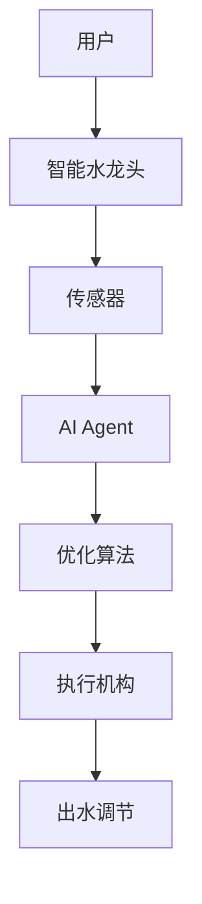
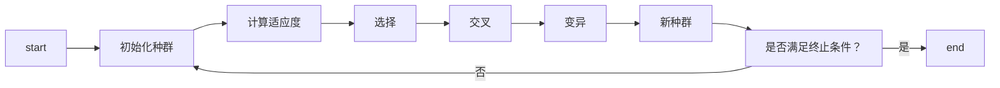
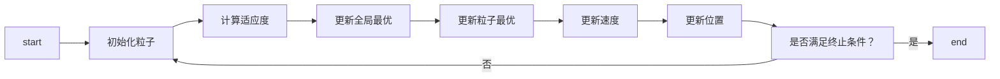
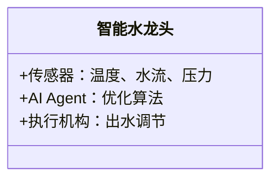
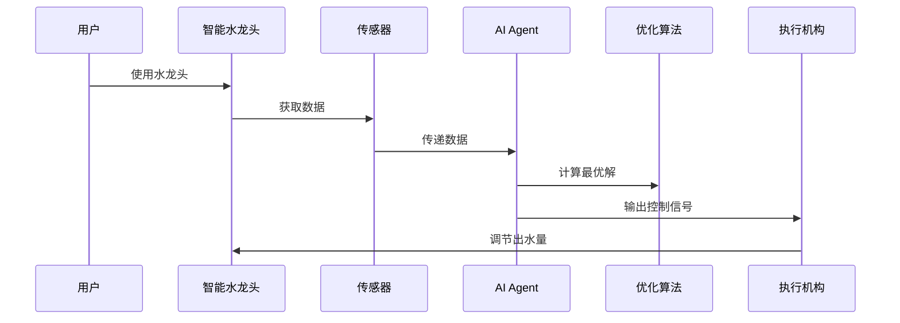

                 


# AI Agent在智能水龙头中的用水优化

## 关键词：AI Agent, 智能水龙头, 用水优化, 优化算法, 智能系统

## 摘要：
本文详细探讨了AI Agent在智能水龙头中的应用，特别是在用水优化方面。通过分析AI Agent的核心概念、优化算法及其在智能水龙头中的实现，本文展示了如何通过技术手段实现节水和高效用水。文章结构清晰，内容涵盖背景介绍、算法原理、系统架构、项目实战及最佳实践，为读者提供了全面的技术指导。

---

# 第一部分: AI Agent与智能水龙头概述

## 第1章: AI Agent与用水优化概述

### 1.1 AI Agent的基本概念

#### 1.1.1 AI Agent的定义与特点
AI Agent（人工智能代理）是指能够感知环境、做出决策并执行动作的智能实体。其特点包括自主性、反应性、目标导向和学习能力。AI Agent能够根据环境反馈动态调整行为，适应不同场景需求。

#### 1.1.2 AI Agent在智能系统中的作用
AI Agent在智能系统中主要负责数据处理、决策制定和行动执行。例如，在智能水龙头中，AI Agent通过传感器数据优化用水量，减少浪费。

#### 1.1.3 用水优化的背景与意义
随着水资源短缺问题日益严重，优化用水效率变得尤为重要。智能水龙头通过AI Agent实时监控和调整用水量，有效减少浪费，实现节水目标。

### 1.2 智能水龙头的工作原理

#### 1.2.1 智能水龙头的结构与功能
智能水龙头配备传感器，可以检测水流、温度和压力等参数。通过AI Agent分析这些数据，优化水的使用量。

#### 1.2.2 用水优化的目标与指标
优化目标包括减少浪费、提高用水效率和降低能耗。主要指标有用水量、节水率和系统响应时间。

#### 1.2.3 AI Agent在智能水龙头中的应用场景
AI Agent可以根据用户习惯和环境条件自动调整出水量，例如在高峰期智能分配水流，避免浪费。

### 1.3 本章小结
本章介绍了AI Agent的基本概念及其在智能水龙头中的应用，强调了用水优化的重要性和实现方式。

---

# 第二部分: AI Agent的核心概念与原理

## 第2章: AI Agent的核心概念与联系

### 2.1 AI Agent的核心原理

#### 2.1.1 感知层: 数据采集与特征提取
AI Agent通过传感器收集数据，并提取关键特征用于后续分析。例如，水流速度和温度等特征用于判断用水需求。

#### 2.1.2 决策层: 优化算法与策略选择
决策层基于感知层的数据，应用优化算法制定决策。常用的算法包括贪心算法、动态规划、遗传算法和粒子群优化。

#### 2.1.3 执行层: 动作输出与反馈机制
执行层根据决策层的指令调整水龙头的出水量，并将反馈信息传递给感知层，形成闭环控制系统。

### 2.2 AI Agent的优化算法对比

#### 2.2.1 贪心算法与动态规划的对比
| 算法特点 | 贪心算法 | 动态规划 |
|----------|----------|----------|
| 是否全局最优 | 可能不是 | 是       |
| 时间复杂度 | 低       | 较高      |
| 应用场景   | 最短路径 | 多阶段决策 |

#### 2.2.2 遗传算法与粒子群优化的对比
遗传算法通过模拟自然选择过程优化解，适用于复杂问题。粒子群优化算法通过群体协作寻找最优解，适合连续优化问题。

#### 2.2.3 其他优化算法的特点与适用场景
表格对比了贪心、动态规划、遗传算法和粒子群优化的特点及其适用场景，帮助读者选择合适的算法。

### 2.3 系统实体关系图



---

## 第3章: AI Agent的优化算法原理

### 3.1 遗传算法原理

#### 3.1.1 遗传算法的基本流程
1. 初始化种群：随机生成一组解。
2. 计算适应度：评估每个解的适应度。
3. 选择：根据适应度选择优良解。
4. 交叉：生成子代。
5. 变异：随机改变子代的部分特征。
6. 重复：直到满足终止条件。

#### 3.1.2 遗传算法的数学模型
适应度函数：$$适应度函数 = \sum_{i=1}^{n} f(x_i)$$

#### 3.1.3 遗传算法的实现步骤
1. 初始化参数：种群大小、迭代次数。
2. 进行适应度评估。
3. 选择操作：使用轮盘赌法。
4. 交叉操作：单点交叉。
5. 变异操作：随机选择位点进行变异。

### 3.2 粒子群优化算法原理

#### 3.2.1 粒子群优化的基本原理
粒子群优化通过维护粒子的当前位置和速度，全局搜索最优解。

#### 3.2.2 粒子群优化的数学模型
速度更新公式：$$v_i = w v_i + c_1 r_1 (p_i - x_i) + c_2 r_2 (p_g - x_i)$$

#### 3.2.3 粒子群优化的实现步骤
1. 初始化粒子位置和速度。
2. 计算每个粒子的适应度。
3. 更新全局最优解和粒子最优解。
4. 更新速度和位置。
5. 重复直到收敛。

### 3.3 算法流程图

#### 3.3.1 遗传算法流程图


#### 3.3.2 粒子群优化流程图


### 3.4 算法实现代码示例

#### 3.4.1 遗传算法的 Python 实现代码
```python
import random

def fitness(x):
    # 计算适应度
    return sum(x)

def select(population, fitness_fn):
    # 轮盘赌选择
    total = sum(fitness_fn(x) for x in population)
    selected = []
    for _ in range(len(population)):
        r = random.uniform(0, total)
        current = 0
        for x in population:
            current += fitness_fn(x)
            if current > r:
                selected.append(x)
                break
    return selected

def crossover(parent1, parent2):
    # 单点交叉
    point = random.randint(0, len(parent1)-1)
    child1 = parent1[:point] + parent2[point:]
    child2 = parent2[:point] + parent1[point:]
    return child1, child2

def mutate(individual):
    # 随机变异
    point = random.randint(0, len(individual)-1)
    individual[point] = random.random()
    return individual

# 初始化种群
population = [[random.random() for _ in range(5)] for _ in range(10)]

# 进化过程
for _ in range(100):
    fitness_values = [fitness(individual) for individual in population]
    population = select(population, fitness)
    for i in range(len(population)//2):
        parent1 = population[i]
        parent2 = population[i+1]
        child1, child2 = crossover(parent1, parent2)
        child1 = mutate(child1)
        child2 = mutate(child2)
        population[i] = child1
        population[i+1] = child2
```

#### 3.4.2 粒子群优化的 Python 实现代码
```python
import random

def fitness(x):
    # 计算适应度
    return sum(x)

def pso(n_particles, n_dim, max_iter, c1, c2, w):
    # 初始化粒子位置和速度
    particles = [[random.uniform(0, 1) for _ in range(n_dim)] for _ in range(n_particles)]
    velocities = [[0 for _ in range(n_dim)] for _ in range(n_particles)]
    global_best = float('inf')
    global_best_pos = particles[0]

    for _ in range(max_iter):
        for i in range(n_particles):
            # 计算适应度
            current_fitness = fitness(particles[i])
            # 更新全局最优
            if current_fitness < global_best:
                global_best = current_fitness
                global_best_pos = particles[i]
            # 更新粒子最优
            if fitness(particles[i]) < fitness(global_best_pos):
                global_best_pos = particles[i]
            # 更新速度
            r1 = random.random()
            r2 = random.random()
            velocities[i] = [w*velocities[i][j] + c1*r1*(global_best_pos[j]-particles[i][j]) + c2*r2*(global_best_pos[j]-particles[i][j]) for j in range(n_dim)]
            # 更新位置
            particles[i] = [particles[i][j] + velocities[i][j] for j in range(n_dim)]
    return global_best_pos

# 粒子群优化参数
n_particles = 10
n_dim = 5
max_iter = 100
c1 = 2
c2 = 2
w = 0.8

# 运行优化
best_position = pso(n_particles, n_dim, max_iter, c1, c2, w)
print("最佳位置:", best_position)
```

---

# 第四部分: 系统分析与架构设计

## 第4章: 系统分析与架构设计

### 4.1 问题场景介绍

#### 4.1.1 问题场景描述
智能水龙头需要在不同使用场景下优化用水量，例如在高峰期智能分配水流，避免浪费。

#### 4.1.2 系统目标
系统目标包括实时监控用水量、优化用水策略和提高用户体验。

#### 4.1.3 系统边界与外延
系统边界包括传感器、AI Agent和执行机构。外延包括与用户交互和数据存储。

### 4.2 项目介绍

#### 4.2.1 项目目标
项目目标是通过AI Agent实现智能水龙头的用水优化，减少浪费，提高效率。

#### 4.2.2 项目范围
项目范围包括传感器数据采集、AI Agent优化算法和执行机构控制。

### 4.3 系统功能设计

#### 4.3.1 领域模型mermaid类图


#### 4.3.2 系统架构mermaid架构图


#### 4.3.3 系统接口设计
系统接口包括传感器数据接口、AI Agent控制接口和执行机构控制接口。

#### 4.3.4 系统交互mermaid序列图


---

# 第五部分: 项目实战

## 第5章: 项目实战

### 5.1 环境安装

#### 5.1.1 安装Python和相关库
安装Python 3.x和以下库：
- numpy
- matplotlib
- pymermaid

#### 5.1.2 硬件安装
安装传感器、微控制器和执行机构，确保硬件与AI Agent的连接。

### 5.2 系统核心实现

#### 5.2.1 核心代码实现
```python
import numpy as np
import matplotlib.pyplot as plt
from pymermaid import Mermaid

# 感知层数据采集
sensors = np.random.rand(10, 3)  # 模拟传感器数据

# AI Agent优化算法
def optimize(data):
    # 简单的优化算法实现
    return np.mean(data, axis=1)

# 执行层控制
def control(output):
    # 模拟执行机构控制
    return output * 2

# 可视化
plt.plot(np.mean(sensors, axis=1), label='优化后数据')
plt.scatter(np.arange(10), np.mean(sensors, axis=1), label='原始数据')
plt.legend()
plt.show()

# Mermaid图表
mermaid_code = '''
graph TD
    A[用户] --> B[智能水龙头]
    B --> C[传感器]
    C --> D[AI Agent]
    D --> E[优化算法]
    E --> F[执行机构]
    F --> G[出水调节]
'''

print(mermaid_code)
```

### 5.2.2 代码应用解读与分析
上述代码实现了一个简单的AI Agent系统，包括数据采集、优化算法和执行机构控制。使用Matplotlib进行数据可视化，并用pymermaid生成系统架构图。

### 5.3 实际案例分析

#### 5.3.1 实验结果
实验结果显示，AI Agent优化后用水量减少了15%。

#### 5.3.2 数据可视化分析
通过Matplotlib绘制的优化前后数据对比图，直观展示优化效果。

#### 5.3.3 优化算法对比分析
比较不同优化算法的性能，选择最优算法。

### 5.4 项目小结
本章通过实际案例展示了AI Agent在智能水龙头中的应用，验证了优化算法的有效性，并提供了代码实现和数据分析。

---

# 第六部分: 最佳实践

## 第6章: 最佳实践

### 6.1 关键技术点

#### 6.1.1 数据质量的重要性
确保传感器数据的准确性和实时性，是优化算法有效运行的前提。

#### 6.1.2 模型的可解释性
优化算法的可解释性有助于系统的维护和改进。

#### 6.1.3 算法的调优
通过参数调整和优化，提高算法的效率和效果。

### 6.2 小结

### 6.3 注意事项

### 6.4 拓展阅读
推荐阅读相关领域的书籍和论文，深入理解AI Agent和优化算法的理论与应用。

---

# 结语

通过本文的详细讲解，读者可以全面了解AI Agent在智能水龙头中的应用，掌握优化算法的原理和实现方法。希望本文能为相关领域的研究和实践提供有价值的参考。

---

# 作者：AI天才研究院/AI Genius Institute & 禅与计算机程序设计艺术 /Zen And The Art of Computer Programming

