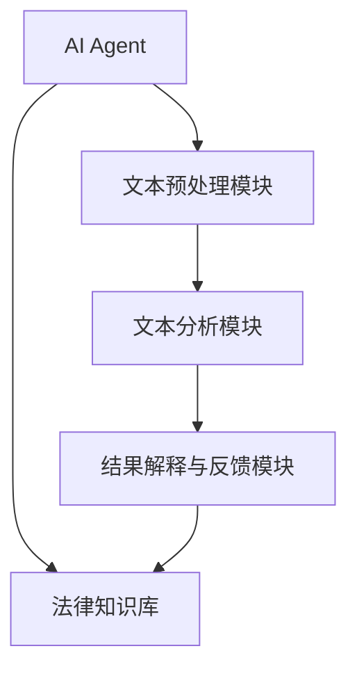
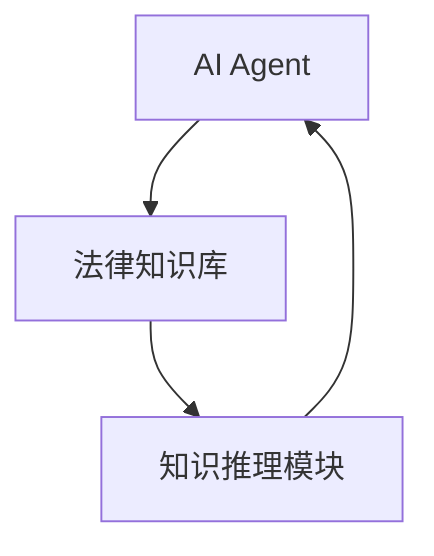
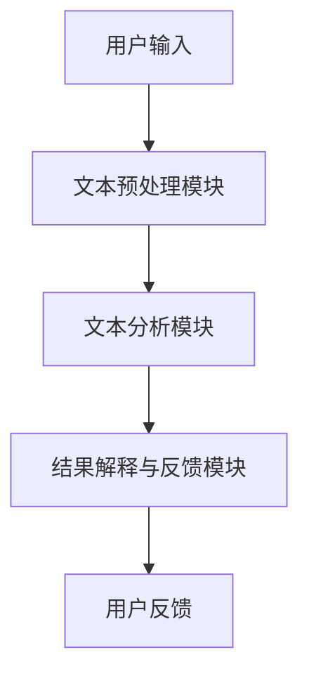
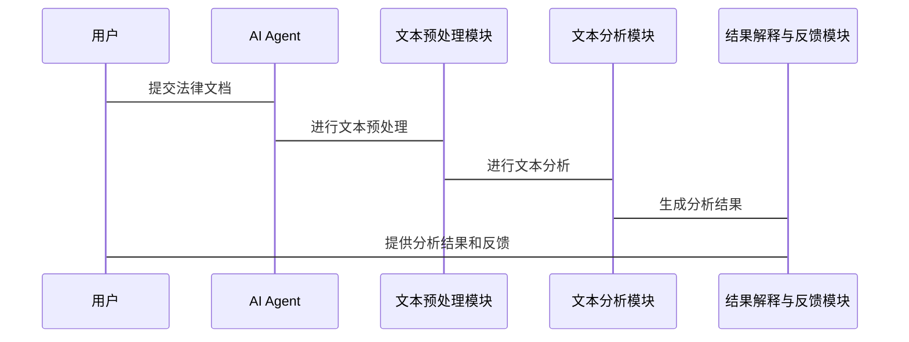

                 


# AI Agent在智能法律文档分析中的角色

> 关键词：AI Agent，智能法律文档分析，自然语言处理，法律知识图谱，法律推理，决策支持

> 摘要：本文探讨了AI Agent在智能法律文档分析中的角色与应用。通过分析法律文档分析的背景、核心原理、系统架构、算法实现及项目实战，详细阐述了AI Agent如何通过自然语言处理、法律知识图谱构建等技术，提升法律文档分析的效率与准确性。同时，本文还结合实际案例，展示了AI Agent在法律合同审查、案例检索等场景中的具体应用，并总结了AI Agent在智能法律文档分析中的优势与挑战。

---

# 第一部分: AI Agent与智能法律文档分析的背景与基础

## 第1章: AI Agent与法律文档分析的背景介绍

### 1.1 AI Agent的基本概念

#### 1.1.1 AI Agent的定义与特点
AI Agent（人工智能代理）是指能够感知环境、自主决策并执行任务的智能实体。其核心特点包括：
- **自主性**：无需外部干预，能够独立完成任务。
- **反应性**：能够实时感知环境并做出响应。
- **学习能力**：通过数据学习和优化，提升性能。
- **交互性**：能够与用户或其他系统进行交互。

#### 1.1.2 AI Agent的核心要素与功能
AI Agent的核心要素包括：
- **感知能力**：通过传感器或数据输入获取信息。
- **推理能力**：基于知识库和逻辑推理做出决策。
- **执行能力**：通过动作或输出完成任务。
- **学习能力**：通过机器学习算法优化性能。

#### 1.1.3 AI Agent在法律领域的应用潜力
AI Agent在法律领域的应用潜力主要体现在：
- **法律文本理解**：通过NLP技术分析法律文档，提取关键信息。
- **法律推理**：基于法律知识库进行逻辑推理，辅助判决。
- **决策支持**：为法律专业人士提供智能化的决策支持。

### 1.2 法律文档分析的挑战与需求

#### 1.2.1 法律文档的特点与复杂性
法律文档具有以下特点：
- **专业性**：法律术语复杂，内容严谨。
- **多样性**：包括合同、法规、判决书等多种类型。
- **冗长性**：法律文档通常篇幅较长，信息繁多。

#### 1.2.2 传统法律文档分析的局限性
传统法律文档分析的局限性包括：
- **效率低下**：人工分析耗时长，效率低。
- **主观性强**：依赖个人经验，存在主观偏差。
- **一致性差**：不同分析人员的结果可能不一致。

#### 1.2.3 智能化法律文档分析的需求
智能化法律文档分析的需求包括：
- **提高效率**：通过自动化技术快速处理大量文档。
- **提升准确性**：利用AI技术减少人为错误。
- **增强一致性**：确保分析结果的标准化和一致性。

### 1.3 AI Agent在法律文档分析中的角色定位

#### 1.3.1 AI Agent在法律文档分析中的功能定位
AI Agent在法律文档分析中的功能定位包括：
- **信息抽取**：从文档中提取关键信息，如合同条款、法律责任等。
- **知识推理**：基于法律知识库进行逻辑推理，辅助决策。
- **决策支持**：为法律专业人士提供智能化的决策支持。

#### 1.3.2 AI Agent与法律专家的协同工作模式
AI Agent与法律专家的协同工作模式包括：
- **人机协同**：AI Agent辅助法律专家完成部分任务，如文档预处理和信息提取。
- **分工合作**：AI Agent负责数据处理和模式识别，法律专家负责深度分析和决策。
- **实时交互**：AI Agent通过自然语言交互与法律专家协作完成任务。

#### 1.3.3 AI Agent在法律实践中的应用场景
AI Agent在法律实践中的应用场景包括：
- **合同审查**：快速分析合同条款，识别潜在风险。
- **案例检索**：基于类似案例进行法律推理，辅助判决。
- **法规更新**：实时跟踪法规变化，提供更新提醒。

## 第2章: AI Agent的核心原理与技术

### 2.1 AI Agent的核心原理

#### 2.1.1 AI Agent的基本工作流程
AI Agent的基本工作流程如下：
1. **感知环境**：通过传感器或数据输入获取信息。
2. **理解需求**：解析用户需求或任务目标。
3. **知识推理**：基于知识库和逻辑推理生成解决方案。
4. **执行任务**：通过动作或输出完成任务。
5. **反馈优化**：根据反馈调整行为策略。

#### 2.1.2 AI Agent的决策机制
AI Agent的决策机制包括：
- **规则驱动**：基于预定义的规则进行决策。
- **模型驱动**：通过机器学习模型进行预测和决策。
- **人机协作**：结合专家意见和AI模型结果进行综合决策。

#### 2.1.3 AI Agent的学习与自适应能力
AI Agent的学习与自适应能力体现在：
- **在线学习**：通过在线数据流不断更新模型。
- **强化学习**：通过奖励机制优化决策策略。
- **自适应推理**：根据环境变化动态调整推理策略。

### 2.2 法律文档分析的关键技术

#### 2.2.1 自然语言处理技术
自然语言处理技术在法律文档分析中的应用包括：
- **分词与词性标注**：将文本分解为词语并标注词性。
- **文本分类**：将文档归类到特定类别，如合同类型。
- **文本摘要**：提取文档的关键信息生成摘要。

#### 2.2.2 文本分类与主题建模
文本分类与主题建模在法律文档分析中的应用包括：
- **合同分类**：根据合同内容自动分类到不同类别。
- **主题建模**：识别文档中的主题分布，辅助信息提取。

#### 2.2.3 法律知识图谱构建
法律知识图谱构建技术包括：
- **实体识别**：识别法律文档中的实体，如人名、机构名。
- **关系抽取**：提取实体之间的关系，构建知识图谱。
- **知识推理**：基于知识图谱进行逻辑推理，辅助决策。

### 2.3 AI Agent与法律文档分析的结合

#### 2.3.1 AI Agent在法律文本理解中的应用
AI Agent在法律文本理解中的应用包括：
- **合同条款解析**：通过NLP技术解析合同条款，识别关键信息。
- **法律术语识别**：识别并解释法律术语，辅助理解文档内容。

#### 2.3.2 AI Agent在法律推理中的应用
AI Agent在法律推理中的应用包括：
- **案例推理**：基于类似案例进行推理，辅助判决。
- **规则推理**：根据法律规则进行推理，生成法律建议。

#### 2.3.3 AI Agent在法律决策支持中的应用
AI Agent在法律决策支持中的应用包括：
- **风险评估**：评估合同中的潜在风险。
- **决策优化**：通过数据驱动的方法优化决策过程。

## 第3章: 法律文档分析的系统架构与设计

### 3.1 法律文档分析系统的功能模块

#### 3.1.1 文本预处理模块
文本预处理模块的功能包括：
- **分词与词性标注**：将文本分解为词语并标注词性。
- **停用词处理**：去除无意义的词语，如“的”、“了”等。
- **文本向量化**：将文本转换为向量表示，便于后续处理。

#### 3.1.2 文本分析模块
文本分析模块的功能包括：
- **信息抽取**：从文本中提取关键信息，如合同条款、法律责任等。
- **文本分类**：将文档分类到特定类别。
- **主题建模**：识别文档中的主题分布。

#### 3.1.3 结果解释与反馈模块
结果解释与反馈模块的功能包括：
- **结果可视化**：将分析结果以可视化形式呈现。
- **用户反馈**：收集用户反馈，优化分析模型。
- **结果解释**：对分析结果进行解释，帮助用户理解。

### 3.2 AI Agent的系统架构设计

#### 3.2.1 系统整体架构图


#### 3.2.2 AI Agent与法律知识库的交互设计


#### 3.2.3 多模块协同工作的流程图


### 3.3 系统接口与交互设计

#### 3.3.1 系统输入接口设计
- **文本输入**：用户输入需要分析的法律文档。
- **参数设置**：用户设置分析参数，如分析类型、输出格式等。

#### 3.3.2 系统输出接口设计
- **文本输出**：输出分析结果，如合同条款解析结果。
- **可视化输出**：以图表形式展示分析结果。
- **反馈输出**：输出用户反馈信息，优化分析模型。

#### 3.3.3 用户与AI Agent的交互流程


## 第4章: 法律文档分析中的算法与模型

### 4.1 文本预处理算法

#### 4.1.1 分词与词性标注
分词与词性标注是文本预处理的关键步骤，常用的算法包括：
- **分词算法**：如jieba算法。
- **词性标注算法**：如HMM（隐马尔可夫模型）。

#### 4.1.2 停用词处理与句子分割
停用词处理与句子分割是文本预处理的必要步骤，常用的算法包括：
- **停用词处理**：去除无意义的词语。
- **句子分割**：将文本分割为独立的句子。

#### 4.1.3 文本向量化方法
文本向量化方法包括：
- **TF-IDF**：基于词频-逆文档频率的向量化方法。
- **Word2Vec**：通过深度学习生成词向量。

### 4.2 法律文本分析模型

#### 4.2.1 基于深度学习的法律文本分类
基于深度学习的法律文本分类模型包括：
- **卷积神经网络（CNN）**：用于文本特征提取和分类。
- **长短时记忆网络（LSTM）**：用于处理长文本序列。

#### 4.2.2 法律知识图谱构建算法
法律知识图谱构建算法包括：
- **实体识别算法**：如CRF（条件随机场）。
- **关系抽取算法**：如基于句法分析的关系抽取。

#### 4.2.3 法律文本摘要算法
法律文本摘要算法包括：
- **基于抽取的摘要**：从文本中抽取关键句子生成摘要。
- **基于生成的摘要**：通过生成模型生成新的摘要文本。

## 第5章: 项目实战——智能法律文档分析系统

### 5.1 项目背景与目标

#### 5.1.1 项目背景
本项目旨在开发一个智能法律文档分析系统，利用AI Agent技术提升法律文档分析的效率和准确性。

#### 5.1.2 项目目标
- **实现合同审查功能**：自动分析合同条款，识别潜在风险。
- **实现案例检索功能**：基于类似案例进行法律推理，辅助判决。

### 5.2 系统核心实现

#### 5.2.1 环境安装
- **安装Python**：建议使用Python 3.8及以上版本。
- **安装依赖库**：如jieba、spaCy、scikit-learn等。

#### 5.2.2 核心代码实现

##### 5.2.2.1 合同条款解析代码
```python
import jieba
from sklearn.feature_extraction.text import TfidfVectorizer
from sklearn.naive_bayes import MultinomialNB

# 文本预处理
def preprocess(text):
    words = jieba.lcut(text)
    return ' '.join(words)

# 文本分类
vectorizer = TfidfVectorizer()
model = MultinomialNB()

# 训练模型
X_train = vectorizer.fit_transform(preprocess(train_texts))
model.fit(X_train, train_labels)

# 预测合同类型
test_text = "甲方应支付合同金额的10%作为定金"
X_test = vectorizer.transform(preprocess(test_text))
predicted_label = model.predict(X_test)
print(predicted_label)
```

##### 5.2.2.2 法律案例检索代码
```python
import networkx as nx
from nltk import word_tokenize, pos_tag

# 构建法律知识图谱
def build_legal_graph():
    graph = nx.Graph()
    graph.add_edge("合同", "条款")
    graph.add_edge("条款", "责任")
    return graph

# 基于图的案例检索
def case_retrieval(query):
    graph = build_legal_graph()
    # 在图中找到与查询相关的节点
    # 这里简化为简单的关键词匹配
    keywords = word_tokenize(query)
    matched_cases = []
    for case in graph.nodes():
        if case in keywords:
            matched_cases.append(case)
    return matched_cases

print(case_retrieval("合同条款"))
```

### 5.3 项目结果与分析

#### 5.3.1 合同审查结果
- **合同类型**：自动分类为商业合同。
- **合同条款**：提取出关键条款，如违约责任、支付方式等。
- **风险评估**：识别出潜在的法律风险。

#### 5.3.2 案例检索结果
- **检索关键词**：合同条款。
- **匹配案例**：找到类似案例，辅助法律推理。

### 5.4 项目小结
通过本项目，我们实现了基于AI Agent的智能法律文档分析系统，展示了AI Agent在合同审查和案例检索中的应用潜力。系统通过文本预处理、分类和知识图谱构建，显著提升了法律文档分析的效率和准确性。

---

# 第二部分: 总结与展望

## 第6章: 总结与展望

### 6.1 本章总结
本文详细探讨了AI Agent在智能法律文档分析中的角色与应用。通过分析法律文档分析的背景、核心原理、系统架构、算法实现及项目实战，展示了AI Agent如何通过自然语言处理、法律知识图谱构建等技术，提升法律文档分析的效率与准确性。

### 6.2 未来展望
未来，AI Agent在智能法律文档分析中的应用将更加广泛和深入。可能的发展方向包括：
- **更复杂的法律推理**：基于深度学习的法律推理模型。
- **多模态法律分析**：结合图像、音频等多种数据源进行法律分析。
- **更高效的法律知识图谱构建**：利用知识图谱技术构建更大规模的法律知识网络。

### 6.3 最佳实践 Tips
- **数据质量**：确保训练数据的多样性和代表性。
- **模型优化**：通过不断优化模型参数提升分析精度。
- **用户反馈**：及时收集用户反馈，优化系统性能。

### 6.4 小结
AI Agent在智能法律文档分析中的应用前景广阔，随着技术的不断发展，AI Agent将为法律专业人士提供更强大、更智能的工具，推动法律行业的数字化转型。

---

# 作者：AI天才研究院/AI Genius Institute & 禅与计算机程序设计艺术 /Zen And The Art of Computer Programming

