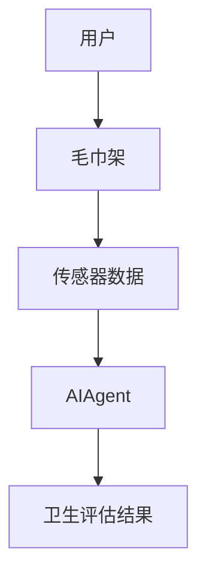
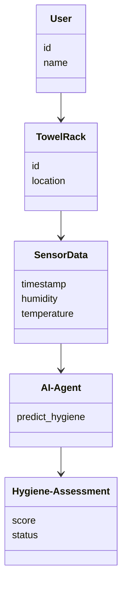
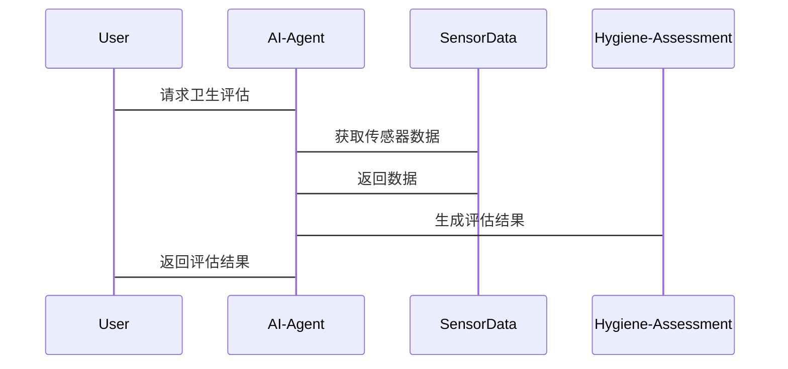

                 


# AI Agent在智能浴室毛巾架中的卫生状况评估

> 关键词：AI Agent, 卫生评估, 智能浴室, 传感器数据, 机器学习

> 摘要：本文探讨AI Agent在智能浴室毛巾架中的应用，重点分析卫生评估的核心概念、算法原理和系统架构。通过详细的技术分析和项目实战，展示如何利用AI技术提升浴室卫生管理的智能化水平。

---

# 第一部分: AI Agent与智能浴室毛巾架的背景介绍

## 第1章: 问题背景与核心概念

### 1.1 问题背景

#### 1.1.1 智能浴室的卫生管理需求
智能浴室的普及带来了对卫生管理更高的要求，毛巾架作为浴室的重要组成部分，其卫生状况直接影响用户体验和健康。

#### 1.1.2 毛巾架卫生状况的重要性
毛巾架的卫生状况不仅关系到个人健康，还影响浴室的整体清洁度，因此需要实时监测和评估。

#### 1.1.3 传统毛巾架的卫生管理痛点
传统毛巾架依赖人工清洁，存在清洁不及时、效率低、难以量化等问题。

### 1.2 问题描述

#### 1.2.1 毛巾架卫生状况的定义
卫生状况包括清洁度、细菌含量、潮湿程度等指标。

#### 1.2.2 卫生状况的评估指标
包括清洁度评分、细菌检测结果、湿度水平等。

#### 1.2.3 用户需求与痛点分析
用户需求包括实时监测、自动提醒、智能清洁；痛点是传统方法效率低、难以量化。

### 1.3 问题解决与边界

#### 1.3.1 AI Agent在卫生评估中的作用
AI Agent通过传感器数据和机器学习模型，实时评估卫生状况并提供反馈。

#### 1.3.2 解决方案的边界与外延
解决方案仅限于毛巾架的卫生评估，不包括其他浴室设备的管理。

#### 1.3.3 核心要素与系统组成
系统由传感器、AI Agent、用户界面组成，传感器采集数据，AI Agent处理数据并生成评估结果。

---

## 第2章: 核心概念与联系

### 2.1 AI Agent的核心原理

#### 2.1.1 AI Agent的基本概念
AI Agent是一个智能实体，能够感知环境并做出决策。

#### 2.1.2 AI Agent的感知与决策机制
通过传感器数据感知环境，利用算法进行决策，输出评估结果。

#### 2.1.3 AI Agent在卫生评估中的应用
AI Agent分析传感器数据，评估毛巾架的卫生状况。

### 2.2 核心概念对比

#### 2.2.1 传统传感器与AI Agent的对比
传统传感器只能采集数据，AI Agent能分析数据并提供评估结果。

#### 2.2.2 不同AI Agent算法的对比
监督学习适合分类任务，无监督学习适合异常检测。

#### 2.2.3 卫生评估指标的对比分析
清洁度评分和细菌检测结果的对比，湿度水平的对比。

### 2.3 实体关系与架构设计

#### 2.3.1 ER实体关系图


---

## 第3章: 算法原理与实现

### 3.1 数据采集与特征提取

#### 3.1.1 传感器数据的采集
传感器采集湿度、温度、细菌数量等数据。

#### 3.1.2 特征提取的算法选择
使用主成分分析（PCA）提取关键特征。

#### 3.1.3 数据预处理与标准化
数据清洗、归一化处理，确保模型输入标准化。

### 3.2 算法流程

#### 3.2.1 数据流
传感器数据 → 数据预处理 → 特征提取 → 模型训练 → 卫生评估。

#### 3.2.2 算法实现
使用机器学习模型，如支持向量机（SVM）进行分类。

### 3.3 算法代码实现

#### 3.3.1 传感器数据读取
```python
import numpy as np
import pandas as pd

# 读取传感器数据
data = pd.read_csv('sensor_data.csv')
```

#### 3.3.2 数据预处理
```python
# 数据清洗
data.dropna(inplace=True)
data['humidity'] = data['humidity'].astype(float)
```

#### 3.3.3 特征提取
```python
from sklearn.decomposition import PCA

# PCA降维
pca = PCA(n_components=3)
principal_components = pca.fit_transform(data[['humidity', 'temperature', 'bacteria']])
```

#### 3.3.4 模型训练
```python
from sklearn.svm import SVC

# 训练SVM模型
model = SVC()
model.fit(principal_components, data['hygiene_label'])
```

### 3.4 数学模型

#### 3.4.1 支持向量机分类
$$ y = \text{sign}(w \cdot x + b) $$

#### 3.4.2 PCA降维
$$ X_{\text{new}} = X P $$

---

## 第4章: 系统分析与架构设计

### 4.1 问题场景介绍
智能浴室环境中，毛巾架需要实时监测卫生状况，提供反馈。

### 4.2 系统功能设计

#### 4.2.1 领域模型


#### 4.2.2 系统架构设计
分层架构：数据采集层、计算层、应用层。

#### 4.2.3 系统接口设计
RESTful API接口，提供数据采集、评估结果查询功能。

#### 4.2.4 系统交互设计


---

## 第5章: 项目实战

### 5.1 环境安装

#### 5.1.1 安装Python和依赖
```bash
pip install numpy pandas scikit-learn
```

### 5.2 系统核心实现

#### 5.2.1 核心代码实现
```python
import numpy as np
import pandas as pd
from sklearn.decomposition import PCA
from sklearn.svm import SVC

# 读取数据
data = pd.read_csv('sensor_data.csv')

# 数据预处理
data.dropna(inplace=True)
data['humidity'] = data['humidity'].astype(float)

# 特征提取
pca = PCA(n_components=3)
principal_components = pca.fit_transform(data[['humidity', 'temperature', 'bacteria']])

# 模型训练
model = SVC()
model.fit(principal_components, data['hygiene_label'])

# 预测
new_data = pd.DataFrame({
    'humidity': [50.0],
    'temperature': [25.0],
    'bacteria': [100]
})
new_principal_components = pca.transform(new_data[['humidity', 'temperature', 'bacteria']])
prediction = model.predict(new_principal_components)
print(f'预测结果: {prediction}')
```

#### 5.2.2 代码解读
传感器数据读取、数据预处理、特征提取、模型训练和预测。

### 5.3 案例分析

#### 5.3.1 数据分析与结果解读
传感器数据如何影响卫生评估结果，模型的准确率和召回率分析。

#### 5.3.2 代码实现与系统集成
将代码集成到智能浴室系统中，展示评估结果。

### 5.4 项目小结
项目成果、经验总结、未来优化方向。

---

## 第6章: 最佳实践与小结

### 6.1 小结
AI Agent在智能浴室中的应用前景广阔，卫生评估是重要方向。

### 6.2 注意事项
传感器精度、模型调优、数据隐私保护。

### 6.3 拓展阅读
推荐学习深度学习、实时数据分析等技术。

---

# 作者：AI天才研究院 & 禅与计算机程序设计艺术

