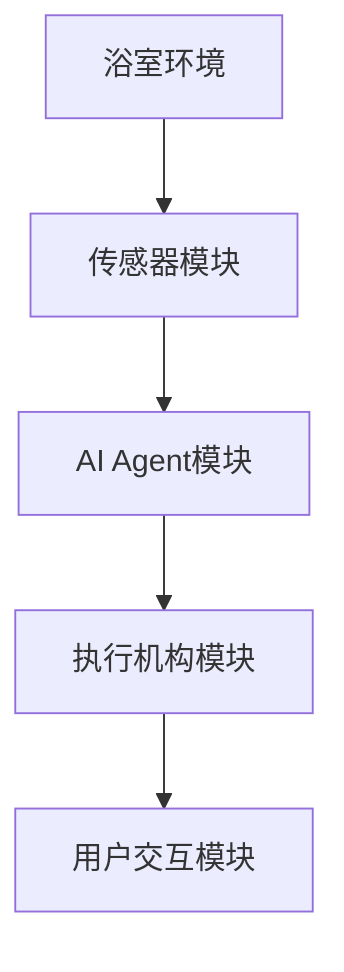
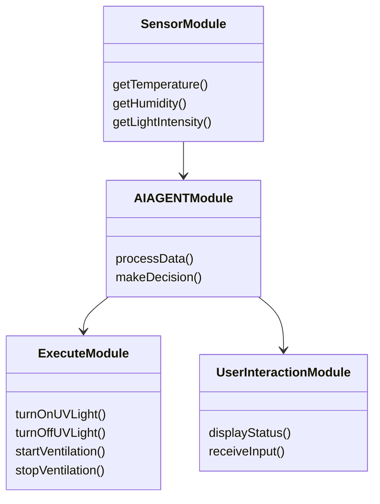
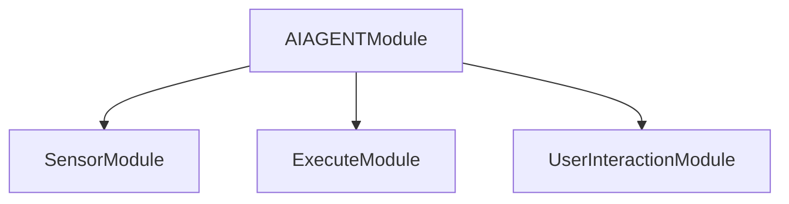
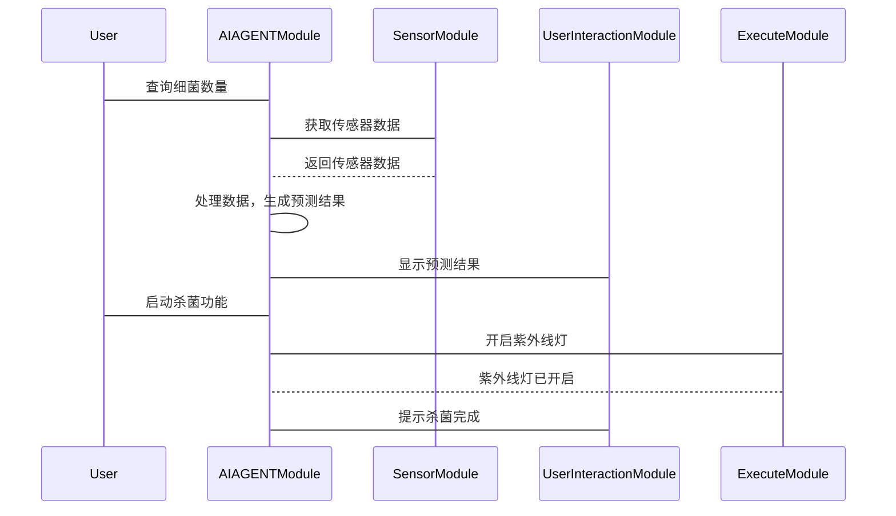

                 


---

# AI Agent在智能浴室毛巾架中的细菌控制

> 关键词：AI Agent，智能浴室，毛巾架，细菌控制，传感器，机器学习

> 摘要：本文探讨了如何通过AI Agent技术实现浴室毛巾架中的细菌智能控制。文章首先介绍了背景和问题，然后详细分析了AI Agent的核心原理，包括感知、决策和执行机制。接着，文章讲解了基于机器学习的算法原理，并通过系统架构设计展示了如何将这些算法应用于实际场景。最后，文章通过项目实战部分，详细介绍了如何实现AI Agent控制的智能毛巾架，并总结了最佳实践和未来发展方向。

---

# 第1章: 背景介绍

## 1.1 问题背景

### 1.1.1 浴室环境中的细菌问题
浴室是一个高湿度、高温的环境，这些条件为细菌的繁殖提供了理想的条件。毛巾作为浴室中常用的物品，容易成为细菌滋生的温床，尤其是当毛巾长时间潮湿时，细菌数量会急剧增加。研究表明，浴室中的细菌种类繁多，包括金黄色葡萄球菌、大肠杆菌等，这些细菌可能对用户健康造成威胁。

### 1.1.2 毛巾架的使用场景与卫生需求
传统的毛巾架设计简单，仅提供悬挂毛巾的功能，无法对毛巾的使用环境进行有效管理。用户在使用毛巾时，可能会因为毛巾潮湿而引发皮肤问题，尤其是对于免疫力较低的人群，如老人和儿童，这种问题更为严重。因此，如何在浴室环境中有效控制毛巾的细菌数量，成为一个亟待解决的问题。

### 1.1.3 细菌控制的重要性
细菌控制不仅关系到个人健康，还可能影响家庭成员的整体健康状况。通过智能手段控制细菌数量，可以显著降低感染风险，提升用户体验。同时，细菌控制也是智能家居领域的重要研究方向之一，结合AI技术，可以实现更高效的卫生管理。

## 1.2 问题描述

### 1.2.1 细菌滋生的条件与影响
细菌滋生需要水分、温度和营养物质。浴室环境中湿度高、温度适宜，这些条件为细菌繁殖提供了有利环境。细菌的滋生不仅影响毛巾的使用寿命，还可能导致用户的健康问题，如皮肤感染、过敏等。

### 1.2.2 现有毛巾架设计的局限性
传统毛巾架缺乏智能监测和控制功能，无法实时感知环境中的细菌数量。用户无法通过肉眼观察到细菌的存在，也无法主动采取措施进行控制。这种设计在高湿度环境中容易导致细菌大量繁殖，从而影响用户体验。

### 1.2.3 用户对卫生环境的高要求
现代用户对卫生环境的要求日益提高，尤其是在智能家居普及的今天，用户希望浴室设备能够提供更智能化的卫生管理功能。智能毛巾架需要能够实时监测细菌数量，并根据监测结果采取相应的控制措施，从而满足用户的高要求。

## 1.3 问题解决

### 1.3.1 AI Agent的介入
AI Agent（人工智能代理）是一种能够感知环境、自主决策并执行任务的智能系统。通过在毛巾架中集成AI Agent，可以实时监测浴室环境中的细菌数量，并根据监测结果采取相应的控制措施，如调节湿度、启动紫外线杀菌功能等。

### 1.3.2 实时监测与智能控制
AI Agent通过多种传感器（如温湿度传感器、光传感器）实时采集浴室环境数据，并结合历史数据和用户习惯，预测细菌的增长趋势。当细菌数量超过预设阈值时，AI Agent会启动相应的控制措施，如增加通风、启动紫外线杀菌灯等，从而有效控制细菌数量。

### 1.3.3 用户体验的提升
通过AI Agent的智能控制，用户可以享受更卫生、更安全的浴室环境。AI Agent不仅能够实时监测细菌数量，还可以通过手机APP向用户发送通知，提醒用户更换毛巾或采取其他卫生措施。这种智能化的管理方式显著提升了用户体验，降低了健康风险。

## 1.4 边界与外延

### 1.4.1 AI Agent的应用范围
AI Agent在智能浴室毛巾架中的应用不仅限于细菌控制，还可以扩展到其他卫生管理功能，如空气质量监测、温湿度调节等。通过与其他智能家居设备的联动，AI Agent可以实现更全面的卫生管理。

### 1.4.2 系统的边界条件
智能毛巾架系统需要在特定的环境下运行，如固定的安装位置、特定的电源供应等。系统的设计需要考虑这些边界条件，以确保AI Agent能够正常工作。例如，传感器的安装位置需要避开高温、高湿区域，以防止传感器损坏。

### 1.4.3 功能的扩展与延伸
未来，智能毛巾架的功能可以进一步扩展，如与智能马桶、智能镜子等设备联动，实现更全面的浴室环境管理。此外，AI Agent还可以通过云端数据共享，与其他用户的设备联动，形成更广泛的卫生管理网络。

## 1.5 概念结构与核心要素

### 1.5.1 核心概念组成
智能毛巾架系统的核心组成包括传感器模块、AI Agent模块、执行机构模块和用户交互模块。传感器模块负责采集环境数据，AI Agent模块负责数据处理和决策，执行机构模块负责执行决策指令，用户交互模块负责与用户进行信息交互。

### 1.5.2 关键要素的定义与关系
- **传感器模块**：包括温湿度传感器、光传感器等，用于采集浴室环境数据。
- **AI Agent模块**：负责数据处理、模型训练和决策，是系统的核心。
- **执行机构模块**：包括风机、紫外线灯等，负责执行AI Agent的决策指令。
- **用户交互模块**：通过手机APP或触摸屏与用户进行信息交互。

### 1.5.3 系统架构的核心模块
系统架构的核心模块包括数据采集模块、数据处理模块、决策模块和执行模块。数据采集模块负责采集环境数据，数据处理模块负责对数据进行清洗和预处理，决策模块负责基于机器学习模型进行预测和决策，执行模块负责根据决策结果启动相应的控制措施。

---

# 第2章: AI Agent的核心原理

## 2.1 感知与决策机制

### 2.1.1 多传感器数据融合
AI Agent通过多种传感器（如温湿度传感器、光传感器）采集浴室环境数据，并对这些数据进行融合处理。例如，AI Agent可以通过温湿度传感器的数据预测细菌的增长趋势，结合光照强度数据调整紫外线杀菌灯的开启时间。

### 2.1.2 状态识别与判断
AI Agent需要能够准确识别浴室环境的状态，如细菌数量是否超标、温湿度是否异常等。通过机器学习算法，AI Agent可以对传感器数据进行分类和回归分析，从而实现状态识别和判断。

### 2.1.3 决策逻辑与策略
AI Agent的决策逻辑基于预设的策略和实时数据。例如，当细菌数量超过预设阈值时，AI Agent会启动紫外线杀菌灯；当湿度超过一定值时，AI Agent会启动通风系统。决策逻辑可以根据用户需求和环境变化进行动态调整。

## 2.2 核心概念对比

### 2.2.1 传统控制方式与AI Agent的对比
| 对比维度         | 传统控制方式             | AI Agent控制方式         |
|------------------|--------------------------|--------------------------|
| 实时性           | 低                      | 高                      |
| 准确性           | 低                      | 高                      |
| 适应性           | 差                      | 好                      |

### 2.2.2 基于规则的控制与数据驱动控制的对比
| 对比维度         | 基于规则的控制           | 数据驱动控制             |
|------------------|--------------------------|--------------------------|
| 决策依据         | 预设规则                | 历史数据和机器学习模型    |
| 灵活性           | 低                      | 高                      |
| 适应性           | 差                      | 好                      |

### 2.2.3 实时性、准确性与适应性的对比
| 对比维度         | 实时性                   | 准确性                   | 适应性           |
|------------------|--------------------------|--------------------------|------------------|
| 传统控制方式     | 低                      | 低                      | 差              |
| AI Agent控制方式 | 高                      | 高                      | 好              |

## 2.3 实体关系图


---

# 第3章: 算法原理讲解

## 3.1 机器学习算法的选择与实现

### 3.1.1 选择合适的算法
基于细菌数量与温湿度、光照强度的关系，选择支持向量机（SVM）或随机森林（Random Forest）等监督学习算法进行分类或回归分析。例如，可以使用SVM进行细菌数量的分类预测，或使用随机森林进行细菌数量的回归预测。

### 3.1.2 算法实现步骤
1. **数据采集**：通过传感器采集浴室环境数据，包括温湿度、光照强度等。
2. **数据预处理**：对采集的数据进行清洗、归一化处理。
3. **模型训练**：使用训练数据训练机器学习模型。
4. **模型预测**：基于实时数据，使用训练好的模型预测细菌数量。
5. **决策控制**：根据预测结果，启动相应的控制措施。

### 3.1.3 代码实现
```python
import numpy as np
from sklearn.svm import SVC
from sklearn.model_selection import train_test_split

# 示例数据
X = np.array([[25, 50], [30, 60], [35, 70], [28, 55]])  # 温度和湿度
y = np.array([1, 2, 3, 1])  # 细菌类别

# 划分训练集和测试集
X_train, X_test, y_train, y_test = train_test_split(X, y, test_size=0.25)

# 训练SVM模型
model = SVC()
model.fit(X_train, y_train)

# 预测测试集
y_pred = model.predict(X_test)
print("预测结果:", y_pred)
print("真实结果:", y_test)
```

### 3.1.4 数学模型与公式
细菌数量的预测模型可以表示为：
$$ y = f(x) $$
其中，$x$ 是输入特征（如温度、湿度），$y$ 是细菌数量。使用机器学习模型训练得到函数$f$，并用于预测。

### 3.1.5 举例说明
假设当前浴室的温度为30℃，湿度为60%，通过训练好的SVM模型，预测细菌数量为2类（如低、中、高）。AI Agent会根据预测结果启动相应的杀菌措施，如开启紫外线灯。

---

# 第4章: 系统分析与架构设计

## 4.1 问题场景介绍
智能毛巾架系统需要在高湿度、高温的浴室环境中运行，实时监测细菌数量，并根据监测结果采取相应的控制措施。系统需要具备高可靠性和稳定性，能够长时间运行在恶劣环境中。

## 4.2 项目介绍
智能毛巾架系统由传感器模块、AI Agent模块、执行机构模块和用户交互模块组成。系统通过多传感器数据融合，结合机器学习算法，实现对浴室环境的智能控制。

## 4.3 系统功能设计
### 4.3.1 领域模型


### 4.3.2 系统架构设计


## 4.4 系统接口设计
### 4.4.1 传感器接口
- **输入**：温度、湿度、光照强度
- **输出**：传感器数据

### 4.4.2 AI Agent接口
- **输入**：传感器数据
- **输出**：决策指令（如开启紫外线灯、启动通风）

### 4.4.3 执行机构接口
- **输入**：决策指令
- **输出**：执行操作（如开启紫外线灯、启动通风）

## 4.5 系统交互


---

# 第5章: 项目实战

## 5.1 环境安装
### 5.1.1 安装Python
```bash
# 安装Python和pip
sudo apt-get update
sudo apt-get install python3 python3-pip
```

### 5.1.2 安装依赖库
```bash
pip install numpy scikit-learn matplotlib
```

## 5.2 核心代码实现

### 5.2.1 数据采集
```python
import serial

ser = serial.Serial('COM3', 9600)  # 假设传感器连接到COM3，波特率为9600
data = ser.readline().decode().strip()
print("传感器数据:", data)
```

### 5.2.2 数据处理与模型训练
```python
from sklearn.model

