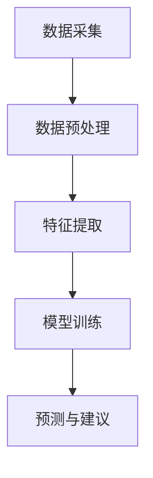
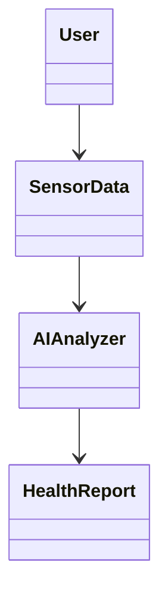
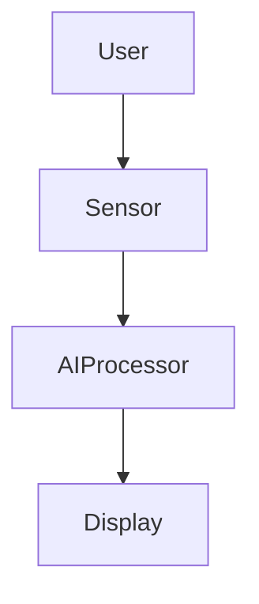
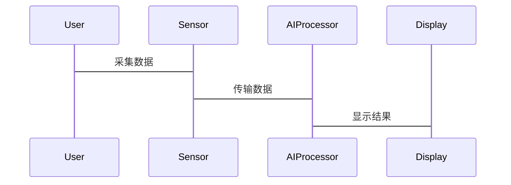

                 


# AI Agent在智能浴室镜中的每日健康检查

> 关键词：AI Agent，智能浴室镜，健康检查，算法原理，系统架构设计，项目实战

> 摘要：本文探讨AI Agent在智能浴室镜中的应用，详细分析其在每日健康检查中的作用。从背景介绍到系统架构设计，再到项目实战，全面解析如何利用AI技术提升健康监测的效率和准确性。

---

## 第1章: 背景介绍

### 1.1 问题背景

#### 1.1.1 智能浴室镜的发展现状
智能浴室镜已从简单的镜面反射发展为集成健康监测功能的智能设备。现代浴室镜配备传感器和摄像头，可实时采集用户的生理数据。

#### 1.1.2 当前健康检查的主要问题
传统健康检查流程复杂，耗时长，用户参与度低。现有设备难以实时监测，数据处理不智能化。

#### 1.1.3 AI Agent在健康检查中的作用
AI Agent能实时分析生理数据，提供个性化健康建议，优化健康检查流程，提升用户体验。

### 1.2 问题描述

#### 1.2.1 智能浴室镜的功能需求
需实时采集心率、皮肤温度等数据，支持语音交互，提供健康建议。

#### 1.2.2 用户健康数据的采集与分析
数据采集需实时、准确，分析需智能化。

#### 1.2.3 AI Agent在健康数据处理中的挑战
数据隐私保护、算法准确性、系统稳定性等问题。

### 1.3 问题解决

#### 1.3.1 AI Agent的核心解决方案
利用AI算法实时分析数据，提供个性化建议，优化健康检查流程。

#### 1.3.2 智能浴室镜的健康检查流程
数据采集→AI分析→健康报告→个性化建议。

#### 1.3.3 用户体验的提升
简化流程，提高准确性，提供定制化建议，改善用户满意度。

### 1.4 边界与外延

#### 1.4.1 系统边界定义
仅限于浴室镜内的数据采集与分析，不涉及外部健康数据源。

#### 1.4.2 功能的扩展性分析
未来可扩展至更多健康指标，如血压、血氧监测。

#### 1.4.3 系统与外部环境的交互
通过网络连接到云端数据库，进行数据存储与分析。

### 1.5 核心概念与核心要素

#### 1.5.1 AI Agent的定义与特征
AI Agent是具备感知、决策能力的智能体，能执行复杂任务。

#### 1.5.2 智能浴室镜的组成部分
包括镜子、传感器、摄像头、显示屏、AI处理模块。

#### 1.5.3 核心要素的相互关系
传感器采集数据→AI处理→生成健康报告→用户反馈。

---

## 第2章: 核心概念与联系

### 2.1 AI Agent的原理

#### 2.1.1 AI Agent的基本原理
AI Agent通过感知环境，执行任务，优化结果。在浴室镜中，AI Agent分析生理数据，提供健康建议。

#### 2.1.2 AI Agent的核心算法
包括决策树和随机森林，用于分类和预测。

#### 2.1.3 AI Agent与智能浴室镜的结合
AI Agent处理数据，浴室镜显示结果，实现智能化健康监测。

### 2.2 智能浴室镜的结构

#### 2.2.1 硬件组成部分
- 镜面
- 传感器（心率、温度）
- 摄像头
- 显示屏
- 处理模块

#### 2.2.2 软件组成部分
- 数据采集模块
- AI分析模块
- 用户界面

---

## 第3章: 算法原理讲解

### 3.1 算法原理概述

#### 3.1.1 算法流程
1. 数据采集
2. 数据预处理
3. 特征提取
4. 模型训练
5. 预测与建议

#### 3.1.2 算法流程图



### 3.2 核心算法实现

#### 3.2.1 决策树算法

```python
from sklearn.tree import DecisionTreeClassifier

# 训练数据
X = [[...], [...]]
y = [...]

# 创建模型
model = DecisionTreeClassifier()
model.fit(X, y)
```

#### 3.2.2 随机森林算法

```python
from sklearn.ensemble import RandomForestClassifier

# 训练数据
X = [[...], [...]]
y = [...]

# 创建模型
model = RandomForestClassifier(n_estimators=100)
model.fit(X, y)
```

### 3.3 数学模型与公式

#### 3.3.1 决策树的分类概率
概率计算公式：

$$ P(class | features) = \frac{count(class)}{total} $$

#### 3.3.2 随机森林的投票机制
投票结果计算：

$$ vote = \sum (class\_votes) $$

### 3.4 算法优化与调优

#### 3.4.1 参数调整
- 最大深度：防止过拟合
- 树数量：提升稳定性

#### 3.4.2 交叉验证
通过K折交叉验证优化模型。

---

## 第4章: 系统分析与架构设计方案

### 4.1 问题场景介绍

#### 4.1.1 项目背景
开发AI Agent驱动的智能浴室镜，实现每日健康检查。

### 4.2 项目介绍

#### 4.2.1 项目目标
提供实时健康监测，优化用户体验。

### 4.3 系统功能设计

#### 4.3.1 领域模型类图



### 4.4 系统架构设计

#### 4.4.1 系统架构图



### 4.5 系统接口设计

#### 4.5.1 API接口
- 数据采集接口：`GET /sensor/data`
- 分析结果接口：`POST /ai/analyze`

### 4.6 系统交互流程图



---

## 第5章: 项目实战

### 5.1 环境安装

#### 5.1.1 安装Python
```bash
python --version
pip install --upgrade pip
```

#### 5.1.2 安装依赖
```bash
pip install numpy scikit-learn matplotlib
```

### 5.2 系统核心实现

#### 5.2.1 数据采集模块

```python
import numpy as np

def collect_data():
    # 模拟传感器数据
    data = np.random.randn(100, 5)
    return data
```

#### 5.2.2 AI分析模块

```python
from sklearn.ensemble import RandomForestClassifier

def train_model(X, y):
    model = RandomForestClassifier()
    model.fit(X, y)
    return model
```

### 5.3 代码解读与分析

#### 5.3.1 代码结构
- 数据采集：读取传感器数据
- 数据处理：预处理数据
- 模型训练：训练分类器
- 结果显示：输出健康报告

### 5.4 实际案例分析

#### 5.4.1 案例背景
用户早晨使用智能浴室镜，系统采集心率、体温等数据。

#### 5.4.2 分析结果
模型预测用户健康状况，生成个性化建议。

### 5.5 项目小结

#### 5.5.1 成果总结
成功实现AI Agent在智能浴室镜中的应用，提升了健康监测效率。

#### 5.5.2 经验总结
数据质量、算法选择和系统设计是关键因素。

---

## 第6章: 总结与展望

### 6.1 最佳实践 tips

#### 6.1.1 开发建议
- 使用高质量数据集
- 定期模型调优
- 重视用户体验设计

### 6.2 小结

本文详细探讨了AI Agent在智能浴室镜中的应用，从背景到实现，全面解析了技术细节。

### 6.3 注意事项

- 数据隐私保护
- 系统稳定性维护
- 用户教育与培训

### 6.4 拓展阅读

- 推荐书籍：《集体智慧编程》
- 推荐博客：AI Genius Institute

---

## 作者

作者：AI天才研究院/AI Genius Institute & 禅与计算机程序设计艺术 /Zen And The Art of Computer Programming

