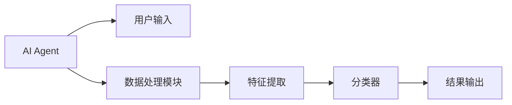
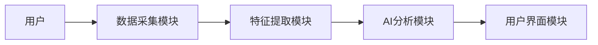
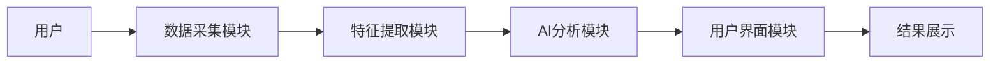

                 

# AI Agent在智能浴室镜中的皮肤状态分析

> **关键词**：AI Agent，智能浴室镜，皮肤状态分析，计算机视觉，机器学习，图像处理

> **摘要**：本文探讨了AI Agent在智能浴室镜中的应用，重点分析了其在皮肤状态监测中的作用。通过结合计算机视觉和机器学习技术，AI Agent能够实时采集和分析用户的皮肤数据，提供个性化的健康建议。本文从背景介绍、核心概念、算法原理、系统架构、项目实战等多个方面进行了详细分析，并通过实际案例展示了AI Agent在智能浴室镜中的应用潜力。

---

## 目录大纲

### 第一部分：背景介绍

#### 第1章：AI Agent与皮肤状态分析的背景

##### 1.1 问题背景
- 皮肤健康的重要性
- 智能浴室镜的发展趋势
- AI技术在健康监测中的应用

##### 1.2 问题描述
- 皮肤状态分析的挑战
- 智能浴室镜的现有功能
- AI Agent在皮肤分析中的作用

##### 1.3 问题解决思路
- 数据采集与处理
- AI算法的选择与优化
- 系统集成与用户反馈

##### 1.4 边界与外延
- 皮肤状态分析的范围界定
- 相关技术的边界（如图像处理、机器学习）
- 系统的扩展性与兼容性

##### 1.5 核心概念与组成
- AI Agent的基本概念
- 皮肤状态分析的要素
- 系统组成部分与功能模块

---

### 第二部分：核心概念与联系

#### 第2章：AI Agent的原理与实现

##### 2.1 核心原理
- AI Agent的基本原理
- 皮肤状态分析的算法原理
- 数据流与信息处理流程

##### 2.2 核心概念对比
- AI Agent与传统算法的对比
- 皮肤状态分析与其他健康监测技术的对比

##### 2.3 实体关系图

---

### 第三部分：算法原理讲解

#### 第3章：AI Agent与皮肤状态分析的算法实现

##### 3.1 数据采集与预处理
- 图像采集技术
- 图像增强与预处理方法
- 数据标注与归一化

##### 3.2 特征提取
- 基于计算机视觉的特征提取
- 使用深度学习模型提取多维特征
- 特征选择与降维技术

##### 3.3 分类与回归算法
- 常见分类算法（如SVM、随机森林、神经网络）
- 回归算法在皮肤健康评估中的应用
- 混合模型与集成学习

##### 3.4 算法流程图

##### 3.5 数学模型与公式
- 例如，使用颜色特征提取模型：
  $$ I_{lab} = f(I_{rgb}) $$
  其中，$I_{lab}$ 是转换后的颜色空间，$I_{rgb}$ 是原始图像。

---

### 第四部分：系统分析与架构设计

#### 第4章：智能浴室镜的系统架构

##### 4.1 问题场景介绍
- 用户在智能浴室镜前的使用场景
- 系统需要处理的主要问题
- 系统的功能需求与目标

##### 4.2 项目介绍
- 项目目标
- 项目范围
- 项目约束条件

##### 4.3 系统功能设计
- 数据采集模块
- 特征提取模块
- AI分析模块
- 用户界面模块

##### 4.4 系统架构设计

##### 4.5 系统接口设计
- 数据接口
- 用户接口
- API接口

##### 4.6 系统交互流程图

---

### 第五部分：项目实战

#### 第5章：智能浴室镜的实现与案例分析

##### 5.1 环境搭建与安装
- 安装Python
- 安装必要的库（如OpenCV、TensorFlow、Keras）
- 安装硬件设备（如摄像头）

##### 5.2 系统核心实现
- 数据采集与预处理的代码示例
- 特征提取与分类的代码示例
- 用户界面的设计与实现

##### 5.3 代码应用解读与分析
- 代码功能模块分析
- 代码实现细节
- 代码优化建议

##### 5.4 实际案例分析
- 案例一：正常皮肤状态分析
- 案例二：皮肤问题检测（如痘痘、过敏）
- 案例三：长期跟踪分析

##### 5.5 项目小结
- 项目总结
- 成功经验
- 改进建议

---

### 第六部分：系统实现与优化

#### 第6章：系统的实现与优化

##### 6.1 系统实现细节
- 数据处理模块的实现
- AI分析模块的实现
- 用户界面的实现

##### 6.2 系统优化
- 性能优化
- 算法优化
- 系统扩展性优化

##### 6.3 系统测试
- 功能测试
- 性能测试
- 用户体验测试

##### 6.4 系统部署
- 系统部署方案
- 系统维护与更新

---

### 第七部分：总结与展望

#### 第7章：总结与展望

##### 7.1 项目总结
- 项目目标的实现情况
- 项目成果与意义
- 项目经验总结

##### 7.2 未来展望
- 技术发展趋势
- 应用前景分析
- 研究方向建议

---

### 最佳实践 Tips

- **小结**：AI Agent在智能浴室镜中的应用为皮肤健康监测提供了全新的解决方案，结合计算机视觉和机器学习技术，能够实现高效、精准的皮肤状态分析。
- **注意事项**：
  - 数据隐私保护的重要性
  - 系统的鲁棒性与稳定性
  - 用户体验的优化
- **拓展阅读**：
  - 更多关于AI Agent的应用案例
  - 皮肤健康监测的最新研究
  - 计算机视觉与机器学习的前沿技术

---

**作者：AI天才研究院/AI Genius Institute & 禅与计算机程序设计艺术 /Zen And The Art of Computer Programming**

