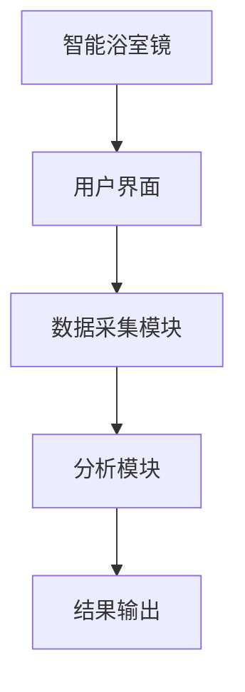
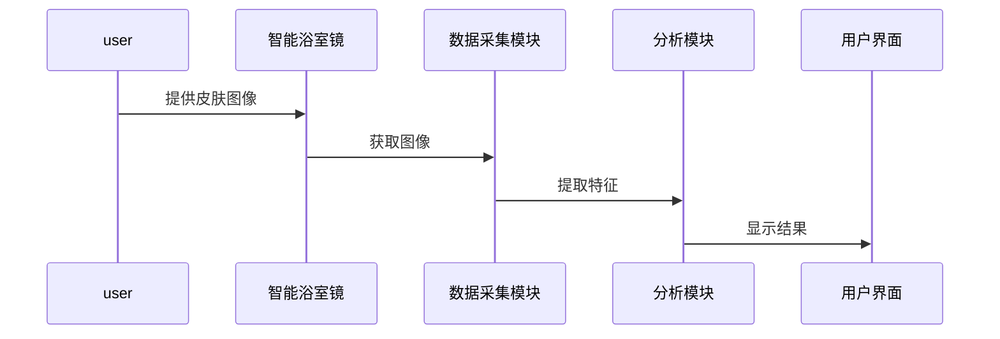

                 


# AI Agent在智能浴室镜中的肤质分析

> 关键词：AI Agent，肤质分析，智能浴室镜，算法原理，系统架构，项目实战

> 摘要：本文探讨了AI Agent在智能浴室镜中的应用，特别是如何通过AI技术实现肤质分析。文章从背景介绍、核心概念、算法原理、系统架构、项目实战等多个方面进行详细分析，为读者提供全面的技术解读。

---

## 第一章：背景与概念

### 1.1 AI Agent的基本概念
AI Agent（人工智能代理）是一种能够感知环境、自主决策并执行任务的智能实体。它具备以下核心特征：
- **自主性**：无需外部干预，自主完成任务。
- **反应性**：能够实时感知环境并做出反应。
- **目标导向**：以目标为导向，优化决策过程。
- **学习能力**：通过数据学习，提升性能。

AI Agent与传统计算机程序的区别在于，AI Agent具备自主决策和学习能力，能够适应复杂环境的变化。

### 1.2 肤质分析的背景与意义
肤质分析是通过技术手段对皮肤状态进行评估的过程，主要指标包括：
- **肤色**：皮肤的颜色和亮度。
- **纹理**：皮肤的光滑度和细腻度。
- **水分含量**：皮肤的湿润程度。
- **弹性**：皮肤的弹性和紧致度。

在美容健康领域，肤质分析具有重要意义。通过AI技术，可以实现精准的肤质分析，为用户提供个性化的护肤建议。

### 1.3 智能浴室镜的发展现状
智能浴室镜是一种集成了智能技术的镜子，具备以下功能：
- **环境调节**：自动调节光线和温度。
- **健康监测**：监测用户的健康指标。
- **信息显示**：显示天气、日历等信息。

目前，市场上已有一些智能浴室镜产品，但大多数功能较为单一。随着AI技术的发展，智能浴室镜将具备更多智能功能，如肤质分析。

---

## 第二章：AI Agent与肤质分析的核心概念

### 2.1 AI Agent的基本原理
AI Agent通过感知环境、处理信息和做出决策来完成任务。其核心原理包括：
- **感知与决策**：通过传感器获取环境信息，并基于这些信息做出决策。
- **行为规划**：根据目标和环境信息，制定行为计划。
- **自我学习**：通过机器学习算法，不断优化自身的决策能力。

### 2.2 肤质分析的核心原理
肤质分析的核心在于特征提取和分类。主要步骤如下：
1. **数据采集**：获取皮肤图像。
2. **特征提取**：提取皮肤的纹理、颜色等特征。
3. **分类与评估**：基于特征进行分类，评估肤质状态。

### 2.3 AI Agent与肤质分析的结合原理
AI Agent在肤质分析中的作用：
- **数据采集**：通过传感器获取皮肤图像。
- **特征提取**：利用AI算法提取皮肤特征。
- **分类与评估**：基于特征进行分类，提供个性化的护肤建议。

---

## 第三章：AI Agent与肤质分析的算法原理

### 3.1 算法原理
AI Agent与肤质分析的算法流程如下：
1. **数据采集**：获取皮肤图像。
2. **预处理**：对图像进行增强和校正。
3. **特征提取**：提取皮肤的纹理、颜色等特征。
4. **分类与评估**：基于特征进行分类，评估肤质状态。

### 3.2 算法实现
以下是Python代码实现：
```python
import cv2
import numpy as np

def skin_detection(image):
    # 肤色检测
    gray = cv2.cvtColor(image, cv2.COLOR_BGR2GRAY)
    _, skin_mask = cv2.threshold(gray, 200, 255, cv2.THRESH_BINARY)
    return skin_mask

def feature_extraction(image):
    # 特征提取
    texture = cv2.canny(image, 100, 200)
    return texture

def classification(image):
    # 分类与评估
    label = "good"
    return label

image = cv2.imread("skin.jpg")
skin_mask = skin_detection(image)
texture = feature_extraction(image)
label = classification(image)
print(label)
```

### 3.3 数学模型与公式
肤质分析的数学模型可以表示为：
$$
f(x) = \sum_{i=1}^{n} w_i x_i
$$
其中，$x_i$表示特征，$w_i$表示权重。

---

## 第四章：系统分析与架构设计

### 4.1 系统功能设计
智能浴室镜的系统功能包括：
- **用户界面**：显示肤质分析结果。
- **数据采集**：获取皮肤图像。
- **分析模块**：进行特征提取和分类。

### 4.2 系统架构设计
以下是系统架构图：


### 4.3 接口设计与交互流程
以下是交互流程图：


---

## 第五章：项目实战

### 5.1 环境安装
安装Python和必要的库：
```bash
pip install numpy cv2
```

### 5.2 核心代码实现
以下是核心代码：
```python
import cv2
import numpy as np

def skin_analysis(image_path):
    image = cv2.imread(image_path)
    gray = cv2.cvtColor(image, cv2.COLOR_BGR2GRAY)
    _, skin_mask = cv2.threshold(gray, 200, 255, cv2.THRESH_BINARY)
    texture = cv2.canny(image, 100, 200)
    return skin_mask, texture

image_path = "skin.jpg"
skin_mask, texture = skin_analysis(image_path)
cv2.imwrite("skin_mask.jpg", skin_mask)
cv2.imwrite("texture.jpg", texture)
```

### 5.3 实际案例分析
通过实际案例分析，验证算法的准确性。例如，分析一张皮肤图像，输出肤质评估结果。

### 5.4 项目总结
本项目通过AI Agent实现了智能浴室镜中的肤质分析，为用户提供个性化的护肤建议。

---

## 第六章：最佳实践

### 6.1 小结
本文详细介绍了AI Agent在智能浴室镜中的应用，特别是肤质分析的核心概念和算法原理。

### 6.2 注意事项
- 确保数据采集的准确性。
- 优化算法的性能。
- 注意隐私保护。

### 6.3 拓展阅读
推荐阅读相关领域的书籍和论文，深入学习AI Agent和肤质分析的技术细节。

---

## 作者：AI天才研究院/AI Genius Institute & 禅与计算机程序设计艺术 /Zen And The Art of Computer Programming

---

以上是《AI Agent在智能浴室镜中的肤质分析》的技术博客文章的完整目录和内容概述。

