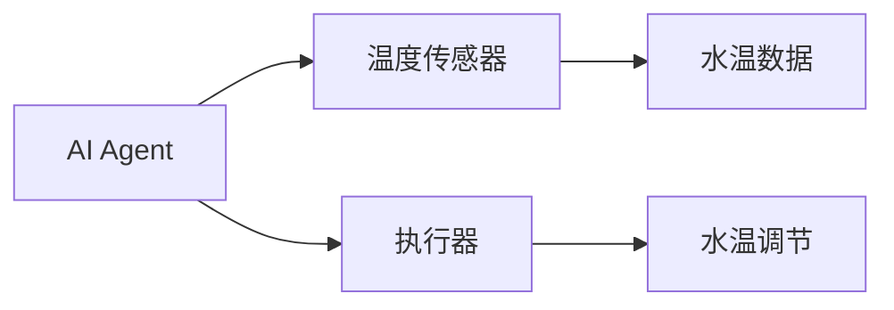
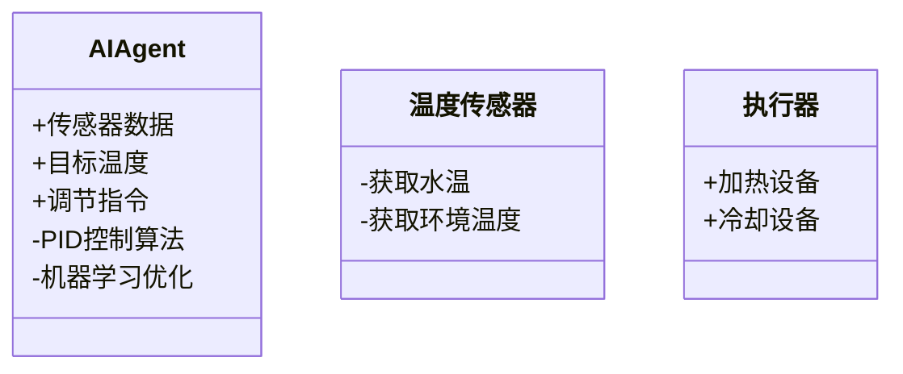
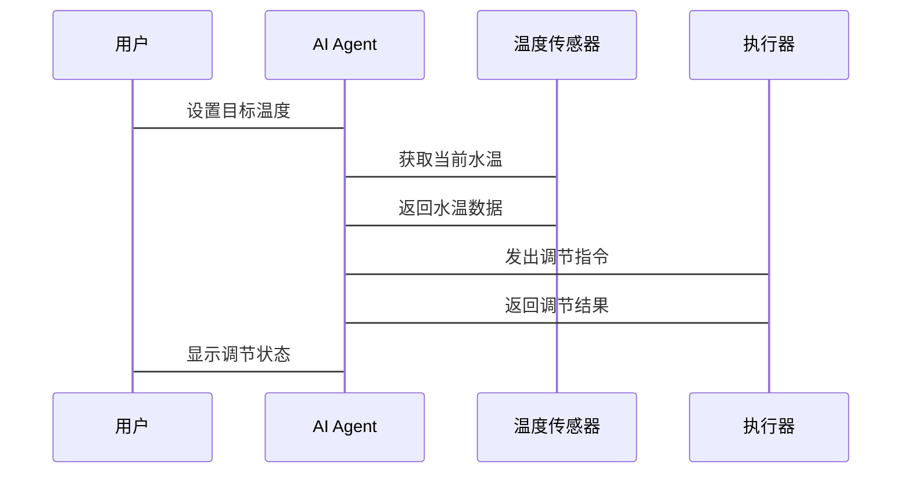

                 


# AI Agent在智能浴缸中的水温调节

> 关键词：AI Agent，智能浴缸，水温调节，物联网，自动化控制

> 摘要：本文详细探讨了AI Agent在智能浴缸水温调节中的应用，从背景介绍、核心概念、算法原理到系统架构设计，再到项目实战，系统地分析了AI Agent如何实现智能、精准的水温调节。通过理论分析和实际案例，本文为智能家居领域的AI Agent应用提供了有价值的参考。

---

## 第一部分：背景介绍

### 第1章：AI Agent与智能浴缸概述

#### 1.1 问题背景

随着智能家居的普及，人们对于生活品质的要求不断提高。智能浴缸作为一种高端智能家居设备，其水温调节功能直接影响用户体验。传统的水温调节方式依赖于手动操作或简单的温控器，存在调节滞后、能耗高、用户体验差等问题。AI Agent的引入为智能浴缸的水温调节带来了新的可能性，通过智能化的感知、决策和执行，能够实现更加精准和个性化的水温控制。

#### 1.2 问题描述

智能浴缸的水温调节需要解决以下问题：
- 实现实时感知：通过传感器获取水温和环境温度数据。
- 智能决策：根据用户需求和环境变化，动态调整水温。
- 精准控制：通过执行器实现快速、精准的水温调节。
- 用户个性化需求：不同用户对水温的偏好不同，需要个性化的调节策略。

#### 1.3 问题解决

AI Agent通过以下方式实现智能水温调节：
- **实时感知**：利用温度传感器和环境传感器，获取水温和环境数据。
- **智能决策**：基于历史数据和用户偏好，优化水温调节策略。
- **精准控制**：通过PID控制算法实现快速、稳定的水温调节。

#### 1.4 边界与外延

智能浴缸水温调节的边界包括：
- 仅考虑水温调节，不涉及浴缸的其他功能（如水流、照明等）。
- 系统在正常工作范围内（水温在30℃至45℃之间）进行调节。
- 系统与外部网络的连接仅限于数据上传和更新。

AI Agent在智能浴缸中的外延包括：
- 与其他智能家居设备的联动（如空气净化器、智能灯等）。
- 数据分析和用户行为预测，提供更加个性化的服务。

#### 1.5 概念结构与核心要素组成

AI Agent与智能浴缸水温调节的系统组成包括：
- **AI Agent**：负责数据处理、决策和控制。
- **温度传感器**：采集水温和环境温度。
- **执行器**：调节水温的设备（如电加热器、冷却系统）。
- **用户交互界面**：用户设置偏好和查看状态的界面。

---

## 第二部分：核心概念与联系

### 第2章：AI Agent的核心原理

#### 2.1 AI Agent的定义与特点

AI Agent是一种智能体，能够感知环境、自主决策并执行任务。其特点包括：
- **自主性**：能够在没有人工干预的情况下独立运行。
- **反应性**：能够实时感知环境变化并做出响应。
- **学习能力**：通过机器学习算法优化决策策略。

#### 2.2 AI Agent的实体关系图



#### 2.3 AI Agent的属性特征对比

| 属性       | 描述                                                         |
|------------|--------------------------------------------------------------|
| 感知能力   | 能够通过传感器获取环境数据                                   |
| 决策能力   | 基于感知数据，通过算法做出决策                               |
| 执行能力   | 通过执行器实现决策结果                                       |
| 学习能力   | 通过机器学习优化决策策略                                     |

---

## 第三部分：算法原理讲解

### 第3章：AI Agent的算法实现

#### 3.1 算法系统模型

智能浴缸水温调节的系统模型如下：
- **输入**：水温和环境温度数据。
- **输出**：水温调节指令。
- **核心算法**：基于PID控制的水温调节算法，结合机器学习优化。

#### 3.2 算法实现步骤

1. **数据采集**：通过温度传感器获取当前水温和环境温度。
2. **目标温度设定**：根据用户偏好设置目标水温。
3. **PID控制**：计算当前偏差，调整加热或冷却设备的功率。
4. **学习优化**：通过机器学习算法优化PID参数，提高调节精度。

#### 3.3 算法优化策略

- **自适应调节**：根据用户使用习惯和环境变化，动态调整PID参数。
- **能耗优化**：通过预测用户需求，提前调整设备状态，降低能耗。

#### 3.4 数学模型与公式

##### 3.4.1 水温变化模型

$$ T(t+1) = T(t) + \Delta T \times k $$
其中，\( T(t) \) 表示当前水温，\( \Delta T \) 表示温度变化量，\( k \) 为比例常数。

##### 3.4.2 PID控制公式

$$ u(t) = K_p \times e(t) + K_i \times \int e(t) dt + K_d \times \frac{de(t)}{dt} $$
其中，\( e(t) \) 表示误差，\( K_p \)、\( K_i \)、\( K_d \) 分别为比例、积分、微分系数。

---

## 第四部分：系统分析与架构设计

### 第4章：系统架构设计

#### 4.1 问题场景介绍

智能浴缸水温调节系统需要解决以下问题：
- 实现实时数据采集。
- 实现智能决策和精准控制。
- 提供用户友好的交互界面。

#### 4.2 项目介绍

本项目旨在设计一个基于AI Agent的智能浴缸水温调节系统，实现以下目标：
- 实现实时水温监测。
- 提供个性化的水温调节服务。
- 最小化能耗，提高用户体验。

#### 4.3 系统功能设计

##### 4.3.1 领域模型



##### 4.3.2 系统架构设计


#### 4.4 系统接口设计

- **输入接口**：用户输入目标温度和调节模式。
- **输出接口**：显示当前水温、调节状态和能耗信息。

#### 4.5 系统交互设计



---

## 第五部分：项目实战

### 第5章：系统实现

#### 5.1 环境配置

- **硬件**：温度传感器、加热器、冷却器、微控制器（如Arduino或Raspberry Pi）。
- **软件**：Python编程环境、机器学习库（如Scikit-learn）。

#### 5.2 核心代码实现

##### 5.2.1 温度传感器数据采集

```python
import time
import serial

ser = serial.Serial('COM3', 9600)  # 连接温度传感器

def get_water_temp():
    while True:
        data = ser.readline().decode().strip()
        if data:
            return float(data)
        time.sleep(1)
```

##### 5.2.2 PID控制实现

```python
class PIDController:
    def __init__(self, Kp, Ki, Kd):
        self.Kp = Kp
        self.Ki = Ki
        self.Kd = Kd
        self.error = 0
        self.integral = 0
        self.derivative = 0
        self.last_time = time.time()

    def compute_output(self, target, current):
        delta_time = time.time() - self.last_time
        self.error = target - current
        self.integral += self.error * delta_time
        self.derivative = (self.error - self.last_error) / delta_time if self.last_error else 0
        output = self.Kp * self.error + self.Ki * self.integral + self.Kd * self.derivative
        return output

    def update(self):
        self.last_error = self.error
```

##### 5.2.3 机器学习优化

```python
from sklearn.linear_model import LinearRegression

# 数据预处理
X = data[['环境温度', '用户偏好']]
y = data['目标温度']

model = LinearRegression()
model.fit(X, y)

# 预测新数据
new_X = [[当前环境温度, 用户偏好]]
predicted_temp = model.predict(new_X)
```

#### 5.3 代码解读与分析

- **温度传感器数据采集**：通过串口读取传感器数据，返回当前水温。
- **PID控制实现**：基于误差、积分和微分计算输出，实现水温调节。
- **机器学习优化**：利用线性回归模型预测最优目标温度，优化调节策略。

#### 5.4 实际案例分析

以用户A为例，用户偏好水温为38℃，环境温度为25℃。系统通过传感器获取当前水温为30℃，计算出需要加热，输出加热功率100W。经过1分钟后，水温达到38℃，系统停止加热。

---

## 第六部分：最佳实践

### 第6章：总结与展望

#### 6.1 小结

本文详细介绍了AI Agent在智能浴缸水温调节中的应用，从背景分析、算法实现到系统设计，为智能家居领域的AI Agent应用提供了参考。

#### 6.2 注意事项

- 硬件选型要确保可靠性和稳定性。
- 算法优化需要结合实际场景进行调整。
- 用户隐私和数据安全需高度重视。

#### 6.3 拓展阅读

- 推荐阅读《机器学习实战》和《智能控制系统设计》。
- 关注智能家居领域的最新动态和技术发展。

---

## 作者：AI天才研究院/AI Genius Institute & 禅与计算机程序设计艺术 /Zen And The Art of Computer Programming

---

以上是《AI Agent在智能浴缸中的水温调节》的完整内容，涵盖了背景介绍、核心概念、算法原理、系统设计和项目实战等部分，为读者提供了一套完整的解决方案和详细的技术指导。

