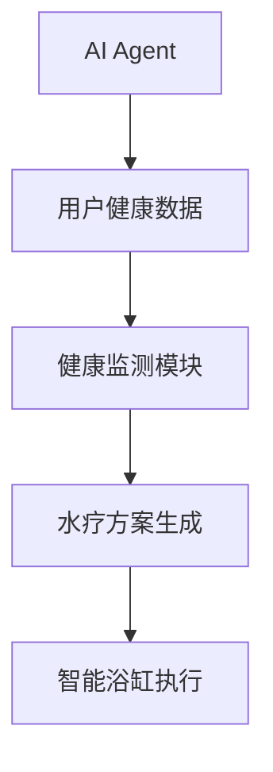

                 


# AI Agent在智能浴缸中的水疗养生定制系统

> 关键词：AI Agent，智能浴缸，水疗养生，定制系统，智能家居，健康监测

> 摘要：本文探讨了AI Agent在智能浴缸中的水疗养生定制系统的应用，详细分析了系统的核心概念、算法原理、架构设计及实现方案，展示了如何通过AI技术提升用户体验。

---

# 第一部分：问题背景与需求分析

## 第1章：问题背景

### 1.1 AI Agent的定义与作用

AI Agent（人工智能代理）是一种能够感知环境、自主决策并执行任务的智能实体。在智能浴缸中，AI Agent通过分析用户的健康数据和偏好，提供个性化的水疗养生方案，从而优化用户体验。

### 1.2 水疗养生的市场需求

随着人们对健康生活的追求，水疗养生逐渐成为高端卫浴设备的重要功能。用户不仅需要基本的温水浴功能，还希望系统能够根据个人健康状况调整水温、水流力度和时间，甚至推荐健康方案。

### 1.3 AI技术在智能家居中的应用趋势

智能家居设备正逐渐从单一功能向智能化、个性化方向发展。AI Agent的应用使得设备能够主动适应用户需求，提供更贴心的服务，成为智能家居领域的热门趋势。

## 第2章：问题描述与解决思路

### 2.1 现有智能浴缸的不足

传统智能浴缸功能单一，无法根据用户健康状况进行个性化调整。用户需要手动调节参数，体验较差，且无法提供健康建议。

### 2.2 引入AI Agent的目标

通过AI Agent实现以下目标：
- 自动采集用户健康数据（如心率、体温）。
- 根据数据推荐水疗方案（如水温、水流力度）。
- 提供健康建议，如泡澡时间建议。

### 2.3 系统设计的边界与外延

系统仅关注水疗养生功能，不涉及其他卫浴功能（如冲洗）。系统通过与外部健康监测设备（如智能手环）联动，获取更全面的健康数据。

---

# 第二部分：核心概念与系统架构

## 第3章：AI Agent的核心概念

### 3.1 AI Agent的基本原理

AI Agent通过传感器采集数据，利用算法进行分析，生成决策并执行操作。在智能浴缸中，AI Agent负责调整水温、水流等参数，为用户提供舒适体验。

### 3.2 核心概念对比

| 核心概念 | AI Agent | 传统智能设备 |
|----------|-----------|---------------|
| 数据源   | 用户健康数据 | 设备固定参数 | 
| 决策方式 | 自主学习与推理 | 预设规则 | 
| 执行方式 | 动态调整参数 | 静态设置 | 

### 3.3 系统架构设计

#### 3.3.1 系统整体架构



---

# 第三部分：算法原理与实现

## 第4章：AI Agent的核心算法

### 4.1 基于规则的推理算法

规则引擎通过预设的健康规则，生成水疗方案。例如：
- 如果用户心率偏高，建议温水浴和轻柔水流。
- 如果用户血压正常，建议循环水流促进血液循环。

### 4.2 基于机器学习的模型

利用用户健康数据（如心率、体温）和偏好（如水温），训练模型预测最佳水疗方案。模型使用梯度下降优化，损失函数为均方误差。

$$
\text{预测水温} = \beta_0 + \beta_1 \times \text{心率} + \beta_2 \times \text{体温}
$$

---

# 第四部分：系统分析与架构设计

## 第5章：系统功能设计

### 5.1 用户信息管理模块

- 用户注册与登录
- 健康数据采集（心率、体温）

### 5.2 健康监测模块

- 数据采集接口（与智能手环联动）
- 数据分析与健康评估

### 5.3 水疗方案生成模块

- 参数调整（水温、水流）
- 方案推荐（基于用户偏好）

---

# 第五部分：项目实战与代码实现

## 第6章：环境搭建与核心代码

### 6.1 环境搭建

安装Python和相关库（TensorFlow、Keras）。

### 6.2 核心代码实现

```python
def adjust_water_parameters(user_data):
    # 数据预处理
    normalized_data = normalize(user_data)
    
    # 模型预测
    predicted_temp = model.predict(normalized_data)
    
    # 参数调整
    set_water_temp(predicted_temp)
```

---

# 第六部分：最佳实践与小结

## 第7章：小结与注意事项

### 7.1 小结

本文详细介绍了AI Agent在智能浴缸中的应用，展示了如何通过技术手段提升用户体验。

### 7.2 注意事项

- 数据隐私保护
- 系统稳定性保障

---

作者：AI天才研究院/AI Genius Institute & 禅与计算机程序设计艺术 /Zen And The Art of Computer Programming

