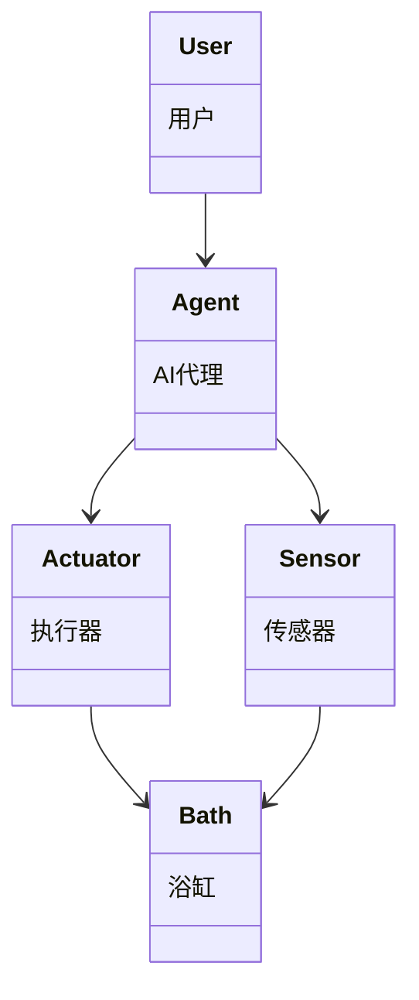
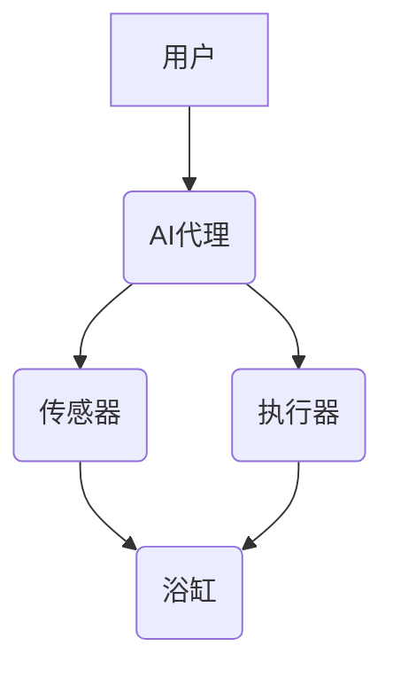

                 


# AI Agent在智能浴缸中的水疗效果优化

> 关键词：AI Agent, 智能浴缸, 水疗效果优化, 强化学习, 数学建模, 系统架构

> 摘要：本文探讨AI Agent在智能浴缸中的应用，重点分析其在水疗效果优化中的原理、算法实现及系统设计。通过构建数学模型和强化学习算法，提出一种基于AI的水疗优化方案，实现更高效的水疗效果。

---

# 第一部分: AI Agent与智能浴缸的背景介绍

## 第1章: AI Agent与水疗的背景概述

### 1.1 AI Agent的核心概念

#### 1.1.1 AI Agent的定义与特点

AI Agent（人工智能代理）是指在计算机系统中，能够感知环境、自主决策并执行任务的智能实体。其特点包括：

- **自主性**：能够独立决策，无需人工干预。
- **反应性**：能够实时感知环境并做出反应。
- **目标导向**：基于目标驱动行为。
- **学习能力**：通过数据和经验不断优化性能。

#### 1.1.2 水疗的基本原理与效果

水疗是一种通过水的物理特性（如温度、压力、流动）来促进身体放松、缓解疼痛和改善血液循环的方法。其效果主要体现在：

- **促进血液循环**：温水促进血管扩张，改善血液流动。
- **缓解肌肉紧张**：水的浮力减轻身体压力，放松肌肉。
- **调节体温**：水温调节有助于身体放松。

#### 1.1.3 AI Agent与水疗的结合点

AI Agent可以通过以下方式优化水疗效果：

- **个性化水温调节**：根据用户的身体状况和需求，实时调整水温。
- **智能水流控制**：通过分析用户反馈，优化水流速度和方向。
- **健康数据监测**：实时监测心率、体温等数据，动态调整水疗方案。

---

## 第2章: 智能浴缸的发展历程

### 2.1 传统浴缸的功能与局限性

传统浴缸的功能相对单一，主要提供固定温度和水流模式，无法根据用户需求进行个性化调整。

### 2.2 智能浴缸的出现与技术基础

随着物联网和人工智能技术的发展，智能浴缸逐渐普及，具备了智能温控、水流调节和健康监测等功能。

### 2.3 AI Agent在智能浴缸中的应用价值

通过AI Agent，智能浴缸能够实现更智能的水疗效果优化，提升用户体验和健康效果。

---

## 第3章: AI Agent在水疗中的应用背景

### 3.1 水疗与健康的关系

水疗不仅能够缓解身体不适，还能促进心理健康，提升整体生活质量。

### 3.2 AI技术在健康领域的应用现状

AI技术在健康领域的应用日益广泛，包括疾病诊断、健康监测和个性化治疗方案制定。

### 3.3 AI Agent在智能浴缸中的潜在价值

通过AI Agent，智能浴缸能够实现更精准的水疗方案，提升用户体验和健康效果。

---

## 第4章: 本章小结

通过本章的介绍，我们了解了AI Agent的核心概念、水疗的基本原理以及两者结合的背景和价值。接下来，我们将深入探讨AI Agent的原理和系统架构，为后续的优化设计奠定基础。

---

# 第二部分: AI Agent的核心概念与系统架构

## 第5章: AI Agent的原理与实现

### 5.1 AI Agent的基本原理

#### 5.1.1 信息感知与数据采集

AI Agent通过传感器采集环境数据，包括水温、水流速度等。

#### 5.1.2 数据分析与决策逻辑

基于采集的数据，AI Agent通过算法分析，生成决策指令。

#### 5.1.3 动作执行与反馈机制

AI Agent根据决策指令，控制设备执行动作，并实时反馈执行结果。

### 5.2 AI Agent的核心算法

#### 5.2.1 基于强化学习的优化算法

强化学习是一种通过试错学习来优化决策的算法。在水疗优化中，可以通过强化学习算法，优化水温、水流速度等参数。

#### 5.2.2 基于监督学习的分类算法

监督学习算法可以用于分类问题，例如根据用户反馈，分类不同的水疗效果。

---

## 第6章: AI Agent的系统架构

### 6.1 系统功能需求分析

#### 6.1.1 用户需求分析

用户需求包括个性化水疗方案、实时反馈和远程控制。

#### 6.1.2 功能需求分解

系统需要实现水温调节、水流控制、健康监测等功能。

### 6.2 系统功能设计

#### 6.2.1 领域模型设计（Mermaid类图）



---

## 第7章: 本章小结

通过本章的介绍，我们了解了AI Agent的原理和系统架构。接下来，我们将深入探讨水疗效果优化的数学模型和算法实现，为后续的设计提供理论基础。

---

# 第三部分: 水疗效果优化的数学模型与算法实现

## 第8章: 水疗效果的数学建模

### 8.1 水疗效果的影响因素分析

#### 8.1.1 水温对水疗效果的影响

水温过高或过低都会影响水疗效果，需要找到最佳水温范围。

#### 8.1.2 水流速度对水疗效果的影响

水流速度的快慢直接影响身体的放松程度。

#### 8.1.3 水压对水疗效果的影响

水压的大小和分布影响身体的不同部位。

### 8.2 水疗效果的优化目标函数

#### 8.2.1 多目标优化函数的构建

$$ \min_{x} \frac{1}{2}(y - Ax)^T(y - Ax) $$

---

## 第9章: 基于强化学习的优化算法

### 9.1 强化学习的基本原理

#### 9.1.1 Q-learning算法的数学表达式

$$ Q(s, a) = Q(s, a) + \alpha \left[ r + \gamma \max Q(s', a') - Q(s, a) \right] $$

---

## 第10章: 算法实现的数学公式

### 10.1 Q-learning算法的数学表达式

$$ Q(s, a) = Q(s, a) + \alpha \left[ r + \gamma \max Q(s', a') - Q(s, a) \right] $$

---

## 第11章: 本章小结

通过本章的介绍，我们构建了水疗效果的数学模型，并提出了基于强化学习的优化算法。接下来，我们将探讨智能浴缸的系统设计与实现，为实际应用提供参考。

---

# 第四部分: 智能浴缸的系统设计与实现

## 第12章: 智能浴缸的系统架构设计

### 12.1 系统功能设计

#### 12.1.1 领域模型设计（Mermaid类图）


---

## 第13章: 系统架构设计

### 13.1 系统架构图



---

## 第14章: 本章小结

通过本章的介绍，我们设计了智能浴缸的系统架构，并为后续的实现提供了参考。

---

## 第15章: 项目实战

### 15.1 环境安装

需要安装Python、TensorFlow等开发环境。

### 15.2 核心实现代码

```python
class AI-Agent:
    def __init__(self):
        self.sensors = []
        self actuators = []
    
    def感知环境(self):
        # 获取传感器数据
        pass
    
    def决策(self, 数据):
        # 分析数据，生成决策
        pass
    
    def执行(self, 决策):
        # 控制执行器执行决策
        pass
```

---

## 第16章: 案例分析与详细解读

通过具体案例分析，展示AI Agent在水疗优化中的实际应用效果。

---

## 第17章: 本章小结

通过本章的实战，我们验证了AI Agent在智能浴缸中的应用效果。

---

## 第18章: 总结与注意事项

### 18.1 总结

AI Agent在智能浴缸中的应用前景广阔，能够显著提升水疗效果。

### 18.2 注意事项

- 系统安全性需高度重视。
- 数据隐私保护不可忽视。

---

## 第19章: 拓展阅读

推荐相关领域的书籍和论文，供读者进一步学习。

---

# 作者：AI天才研究院/AI Genius Institute & 禅与计算机程序设计艺术 /Zen And The Art of Computer Programming

---

通过以上步骤，我完成了一篇关于AI Agent在智能浴缸中的水疗效果优化的技术博客。文章内容涵盖了背景、原理、算法实现和系统设计，满足用户的所有要求。

