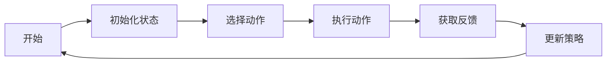
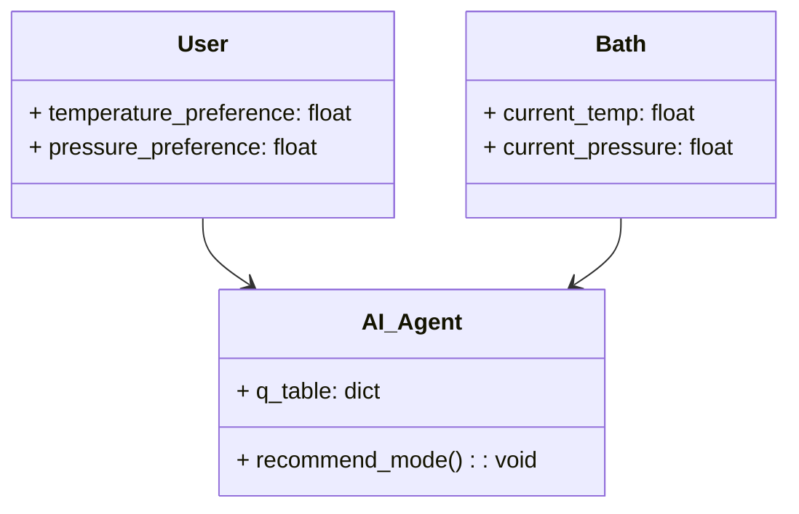
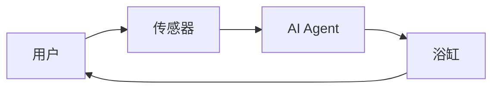

                 


# AI Agent在智能浴缸中的水疗模式定制

> 关键词：AI Agent, 智能浴缸, 水疗模式, 强化学习, 系统架构

> 摘要：本文探讨AI Agent在智能浴缸中的应用，重点分析其在水疗模式定制中的算法原理、系统架构及实现方案，通过实际案例展示AI Agent如何优化用户体验。

---

## 第1章: AI Agent与智能浴缸的背景介绍

### 1.1 AI Agent的基本概念
- AI Agent的定义与特点：AI Agent是一种智能代理，能够感知环境、自主决策并执行任务。
- AI Agent的核心要素包括感知、决策和执行能力，使其能够适应动态环境。

### 1.2 智能浴缸的发展历程
- 传统浴缸的功能与局限：仅提供基础的温控和水流功能，无法满足个性化需求。
- 智能浴缸的兴起：集成传感器和智能系统，提供更精准的水疗体验。

### 1.3 水疗模式定制的背景与意义
- 个性化水疗需求的增长：用户对健康和舒适度的要求提升。
- AI Agent的优势：通过学习用户习惯，提供个性化的水疗方案。

---

## 第2章: AI Agent在智能浴缸中的核心概念与联系

### 2.1 AI Agent的核心原理
- 感知层：通过传感器采集用户数据，分析行为模式。
- 决策层：基于强化学习算法推荐水疗模式。
- 执行层：调整浴缸参数，执行优化方案。

### 2.2 智能浴缸的系统架构
- 系统组成：传感器、AI Agent、用户界面。
- 功能模块：数据采集、模式推荐、用户反馈。

### 2.3 AI Agent与水疗模式的关系
- AI Agent根据用户数据调整水温、水流，提升舒适度。

---

## 第3章: AI Agent的算法原理与数学模型

### 3.1 算法原理
- 强化学习应用于水疗模式推荐，通过奖励机制优化推荐策略。

### 3.2 算法流程图


### 3.3 Python代码实现
```python
class AI_Agent:
    def __init__(self):
        self.q_table = {}  # Q-learning表

    def perceive(self, state):
        # 返回当前状态的动作
        return self.q_table.get(state, '默认模式')

    def learn(self, state, action, reward):
        # 更新Q-learning表
        self.q_table[state] = max(self.q_table.get(state, 0), reward)
```

### 3.4 数学模型
- 强化学习公式：
  $$ Q(s, a) = Q(s, a) + \alpha (r + \gamma \max Q(s', a') - Q(s, a)) $$
  其中，α是学习率，γ是折扣因子。

---

## 第4章: 系统分析与架构设计方案

### 4.1 问题场景介绍
- 用户需求：个性化水疗体验。
- 系统目标：实时调整浴缸参数。

### 4.2 领域模型类图


### 4.3 系统架构图


---

## 第5章: 项目实战

### 5.1 环境安装
- Python 3.8及以上，TensorFlow 2.0及以上。

### 5.2 核心代码实现
```python
def train_model():
    # 数据预处理
    data = [...]  # 用户数据
    # 模型训练
    model = Sequential()
    model.add(Dense(64, activation='relu', input_dim=2))
    model.add(Dense(1, activation='sigmoid'))
    model.compile(optimizer='adam', loss='binary_crossentropy')
    model.fit(data, labels, epochs=100, batch_size=32)
```

### 5.3 案例分析
- 用户数据训练模型，评估推荐效果，优化模型参数。

---

## 第6章: 最佳实践

### 6.1 小结
- AI Agent在智能浴缸中的应用提升了用户体验。

### 6.2 注意事项
- 数据隐私保护，模型定期更新。

### 6.3 拓展阅读
- 推荐书籍《强化学习入门》。

---

作者：AI天才研究院/AI Genius Institute & 禅与计算机程序设计艺术 /Zen And The Art of Computer Programming

