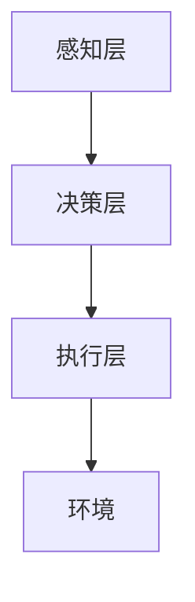

                 

<think>
好的，我将按照您的要求，逐步撰写一篇关于《AI Agent在智能海洋生态保护中的实践》的技术博客文章。为了让内容更清晰，我先列出文章的关键词和摘要。

### 关键词：
AI Agent, 智能海洋生态保护, 强化学习, 海洋环境监测, 可持续发展

### 摘要：
本文详细探讨了AI Agent在智能海洋生态保护中的应用，从背景、核心原理到系统设计和实际案例，全面分析了AI Agent如何通过感知、决策和执行层实现海洋生态的智能化保护。文章还介绍了强化学习算法及其数学模型，通过实际项目案例展示了AI Agent在海洋环境监测和资源管理中的优势，并提出了最佳实践建议。

---

# AI Agent在智能海洋生态保护中的实践

> 关键词：AI Agent, 智能海洋生态保护, 强化学习, 海洋环境监测, 可持续发展

> 摘要：本文详细探讨了AI Agent在智能海洋生态保护中的应用，从背景、核心原理到系统设计和实际案例，全面分析了AI Agent如何通过感知、决策和执行层实现海洋生态的智能化保护。文章还介绍了强化学习算法及其数学模型，通过实际项目案例展示了AI Agent在海洋环境监测和资源管理中的优势，并提出了最佳实践建议。

---

## 第1章: AI Agent与智能海洋生态保护概述

### 1.1 AI Agent的基本概念

#### 1.1.1 AI Agent的定义
AI Agent（人工智能代理）是指能够感知环境、自主决策并执行任务的智能实体。在智能海洋生态保护中，AI Agent可以是软件或硬件形式，用于监测海洋环境、保护海洋生物或优化资源管理。

#### 1.1.2 AI Agent的核心特点
- **自主性**：能够独立决策和行动。
- **反应性**：能够实时感知环境变化并做出反应。
- **学习能力**：通过数据和经验不断优化行为。
- **协作性**：能够与其他AI Agent或人类协同工作。

#### 1.1.3 AI Agent与传统海洋保护技术的区别
传统的海洋保护技术依赖于人工监测和固定设备，而AI Agent能够实现智能化、自动化和动态化的保护。

---

### 1.2 智能海洋生态保护的背景与意义

#### 1.2.1 海洋生态面临的挑战
- **海洋污染**：塑料垃圾、油污等对海洋生物的威胁。
- **资源枯竭**：过度捕捞导致鱼类数量急剧下降。
- **气候变化**：海水酸化和温度上升影响珊瑚礁等生态系统。

#### 1.2.2 智能技术在海洋生态保护中的作用
- **实时监测**：通过传感器和摄像头实时采集海洋数据。
- **智能分析**：利用AI算法识别异常情况并预测环境变化。
- **自动化保护**：部署AI Agent执行保护任务，如驱离非法捕捞船只。

#### 1.2.3 AI Agent在海洋生态保护中的优势
- **高效性**：能够快速响应环境变化。
- **精准性**：通过数据驱动决策，减少人为错误。
- **可持续性**：通过优化资源利用，推动可持续发展。

---

## 第2章: AI Agent的核心原理

### 2.1 AI Agent的基本原理

#### 2.1.1 感知层
AI Agent通过传感器、摄像头等设备感知环境信息，例如温度、湿度、光照强度等。

#### 2.1.2 决策层
AI Agent基于感知到的数据，利用算法（如强化学习）进行决策。例如，在监测到非法捕捞船只时，AI Agent可以决定发出警报或采取其他行动。

#### 2.1.3 执行层
AI Agent根据决策层的指令执行具体任务，例如释放驱逐剂或通知相关人员。

---

### 2.2 AI Agent的算法原理

#### 2.2.1 强化学习算法
强化学习是一种通过试错学习的方法，AI Agent通过与环境互动，不断优化行为策略。例如，在海洋生态监测中，AI Agent可以学习如何最优地部署传感器。

#### 2.2.2 监督学习算法
监督学习是基于标记数据进行训练，AI Agent可以学习如何识别海洋生物或预测环境变化。

#### 2.2.3 混合算法
结合强化学习和监督学习的优势，AI Agent可以在复杂环境中实现更高效的决策。

---

### 2.3 AI Agent的数学模型与公式

#### 2.3.1 强化学习的数学模型
在强化学习中，AI Agent通过与环境互动获得奖励（Reward），并根据Q值（Q-learning）进行决策。公式如下：
$$ Q(s, a) = Q(s, a) + \alpha (r + \gamma \max Q(s', a') - Q(s, a)) $$
其中：
- \( s \)：当前状态
- \( a \)：当前动作
- \( r \)：获得的奖励
- \( \gamma \)：折扣因子
- \( \alpha \)：学习率

---

## 第3章: AI Agent在海洋生态保护中的系统设计

### 3.1 系统分析与架构设计

#### 3.1.1 系统架构
AI Agent系统通常采用分层架构，包括感知层、决策层和执行层。如下图所示：



---

### 3.2 系统功能设计

#### 3.2.1 数据采集模块
- **功能**：实时采集海洋环境数据，如温度、光照、水质等。
- **技术**：使用传感器和物联网设备。

#### 3.2.2 环境监测模块
- **功能**：分析数据并识别异常情况，如非法捕捞或污染事件。
- **技术**：基于机器学习的异常检测算法。

#### 3.2.3 决策控制模块
- **功能**：根据监测结果制定保护策略，如发出警报或启动驱逐装置。
- **技术**：强化学习算法优化决策过程。

---

## 第4章: AI Agent的实现与应用案例

### 4.1 环境搭建

#### 4.1.1 开发工具安装
- **Python**：安装Anaconda或Pyenv。
- **深度学习框架**：安装TensorFlow或PyTorch。
- **数据处理工具**：安装Pandas、NumPy等库。

#### 4.1.2 数据集准备
- **数据来源**：海洋环境监测数据、卫星图像等。
- **数据预处理**：清洗、归一化等。

---

### 4.2 核心代码实现

#### 4.2.1 感知层代码
```python
# 传感器数据采集
import serial

ser = serial.Serial('COM3', 9600)
data = ser.readline().decode().strip()
print("感知到的环境数据:", data)
```

#### 4.2.2 决策层代码
```python
# 强化学习算法实现（Q-learning）
import numpy as np

class QLearning:
    def __init__(self, state_space, action_space):
        self.q_table = np.zeros((state_space, action_space))
    
    def choose_action(self, state, epsilon):
        if np.random.random() < epsilon:
            return np.random.randint(action_space)
        else:
            return np.argmax(self.q_table[state])
    
    def update_q_table(self, state, action, reward, next_state, alpha, gamma):
        self.q_table[state, action] = self.q_table[state, action] + alpha * (reward + gamma * np.max(self.q_table[next_state]) - self.q_table[state, action])
```

---

### 4.3 实际案例分析

#### 4.3.1 案例背景
某海域面临非法捕捞和海洋污染的双重威胁，AI Agent被部署以监测和保护海洋环境。

#### 4.3.2 案例实现
AI Agent通过传感器实时监测海洋数据，并通过强化学习算法优化驱逐非法捕捞船只的策略。

#### 4.3.3 案例结果
- **成功案例**：AI Agent显著减少了非法捕捞事件的发生。
- **优化建议**：进一步优化算法以应对更复杂的环境挑战。

---

## 第5章: 最佳实践与总结

### 5.1 小结
AI Agent在智能海洋生态保护中的应用前景广阔，通过感知、决策和执行层的协同工作，能够显著提升海洋保护的效率和效果。

### 5.2 注意事项
- **数据质量**：确保传感器数据的准确性和实时性。
- **算法优化**：根据实际需求不断优化AI Agent的决策算法。
- **系统维护**：定期维护和更新系统以应对环境变化。

### 5.3 拓展阅读
- 推荐阅读《强化学习入门》和《深度学习与计算机视觉》等书籍，以深入了解AI Agent的核心技术。

---

## 作者信息

作者：AI天才研究院/AI Genius Institute & 禅与计算机程序设计艺术 /Zen And The Art of Computer Programming

---

希望这篇博客文章能满足您的需求！如果需要进一步修改或补充，请随时告知。

