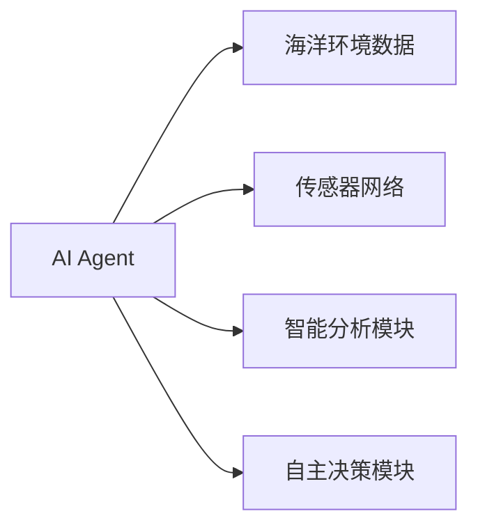
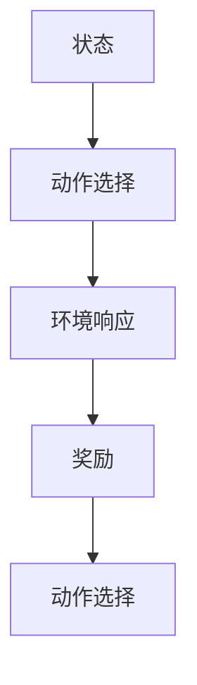
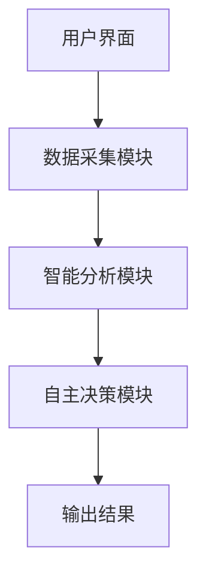
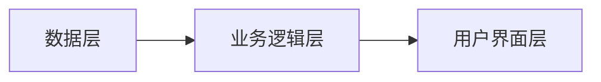
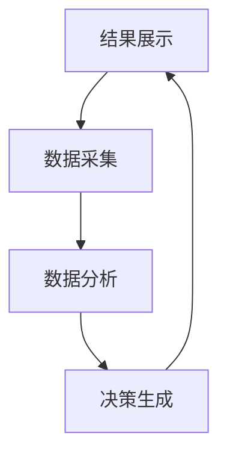

                 


# AI Agent在智能海洋生态监测中的实践

## 关键词：AI Agent, 智能海洋生态监测, 算法原理, 系统架构, 项目实战

## 摘要：  
本文详细探讨了AI Agent在智能海洋生态监测中的应用与实践。通过背景介绍、核心概念、算法原理、系统架构、项目实战等多维度分析，深入阐述了AI Agent如何在海洋生态监测中发挥作用。文章结合实际案例和代码实现，为读者提供了从理论到实践的全面指导，帮助读者理解并掌握AI Agent在智能海洋生态监测中的应用技巧。

---

## 第1章: AI Agent与智能海洋生态监测的背景介绍

### 1.1 AI Agent的基本概念  
AI Agent（人工智能代理）是一种能够感知环境、自主决策并执行任务的智能实体。它具备以下核心特点：  
1. **自主性**：无需外部干预，自主完成任务。  
2. **反应性**：能够实时感知环境变化并做出响应。  
3. **目标导向性**：基于目标驱动行为。  
4. **学习能力**：通过数据和经验不断优化自身性能。  

AI Agent可以分为**反应式代理**、**基于模型的代理**和**混合代理**，分别适用于不同的应用场景。  

### 1.2 智能海洋生态监测的背景与意义  
海洋生态监测是保护海洋环境、评估生物多样性的重要手段。传统监测方法依赖人工操作，存在效率低、成本高、覆盖范围有限等问题。引入AI Agent技术，可以实现海洋生态的智能化、实时化监测，显著提升监测效率和精度。  

### 1.3 问题背景与解决方案  
在海洋生态监测中，数据获取难度大、环境复杂多变、监测任务多样化等挑战亟待解决。AI Agent通过自动化数据采集、智能分析和自主决策，为这些问题提供了一种高效解决方案。  

### 1.4 本章小结  
本章介绍了AI Agent的基本概念及其在智能海洋生态监测中的应用背景，为后续内容奠定了基础。

---

## 第2章: AI Agent与智能海洋生态监测的核心概念与联系

### 2.1 AI Agent与海洋生态监测的关系  
AI Agent在海洋生态监测中的作用主要体现在以下几个方面：  
1. **数据采集**：通过传感器和无人机等设备，实时采集海洋环境数据。  
2. **智能分析**：利用机器学习算法，分析数据并识别异常情况。  
3. **自主决策**：基于分析结果，自主调整监测策略或触发预警机制。  

#### AI Agent与海洋生态监测的关系图（Mermaid图）



### 2.2 核心概念的对比分析  
以下是AI Agent与传统自动化监测系统的对比分析表：  

| **核心要素** | **AI Agent** | **传统自动化系统** |  
|--------------|--------------|--------------------|  
| **自主性**   | 高           | 低                 |  
| **学习能力** | 高           | 无                 |  
| **适应性**   | 强           | 弱                 |  

#### 实体关系图（ER图）

```mermaid
erd
    A[AI Agent] -{1..N}--> B[传感器数据]
    A -{1}--> C[智能分析模块]
    C -{1}--> D[监测结果]
```

### 2.3 本章小结  
本章通过对比分析和关系图，清晰阐述了AI Agent与智能海洋生态监测的核心概念及其联系。

---

## 第3章: AI Agent在海洋生态监测中的算法原理

### 3.1 算法原理概述  
AI Agent的核心算法包括**强化学习（Reinforcement Learning）**和**决策树（Decision Tree）**。以下是一个简化版的强化学习算法流程：  



### 3.2 算法实现细节  
以下是一个简单的强化学习算法实现代码示例：  

```python
import numpy as np

class AI_Agent:
    def __init__(self, state_space, action_space):
        self.state_space = state_space
        self.action_space = action_space
        self.Q = np.zeros((state_space, action_space))

    def choose_action(self, state, epsilon=0.1):
        if np.random.random() < epsilon:
            return np.random.randint(self.action_space)
        else:
            return np.argmax(self.Q[state, :])

    def update_Q(self, state, action, reward, next_state, gamma=0.99):
        self.Q[state, action] = reward + gamma * np.max(self.Q[next_state, :])
```

### 3.3 数学模型与公式  
强化学习的核心公式为：  

$$ Q(s, a) = Q(s, a) + \alpha [r + \gamma \max Q(s', a') - Q(s, a)] $$  

其中：  
- \( Q(s, a) \) 表示状态 \( s \) 下动作 \( a \) 的价值函数。  
- \( \alpha \) 表示学习率。  
- \( r \) 表示奖励值。  
- \( \gamma \) 表示折扣因子。  

### 3.4 本章小结  
本章详细介绍了AI Agent在海洋生态监测中的算法原理，并通过代码和公式进行了深入讲解。

---

## 第4章: 智能海洋生态监测系统的架构设计

### 4.1 系统功能设计  
系统功能模块包括：  
1. **数据采集模块**：负责采集海洋环境数据。  
2. **智能分析模块**：对数据进行分析和处理。  
3. **自主决策模块**：基于分析结果做出决策。  
4. **用户交互模块**：提供人机交互界面。  

#### 系统功能流程图（Mermaid图）



### 4.2 系统架构设计  
系统采用分层架构，包括数据层、业务逻辑层和用户界面层。  

#### 系统架构图（Mermaid图）



### 4.3 接口与交互设计  
系统接口包括：  
1. **数据采集接口**：用于传感器数据的上传。  
2. **分析结果接口**：用于返回分析结果。  
3. **决策指令接口**：用于下发决策指令。  

#### 系统交互流程图（Mermaid图）



### 4.4 本章小结  
本章详细设计了智能海洋生态监测系统的架构，并通过流程图和图表展示了系统各部分的关系。

---

## 第5章: 项目实战——AI Agent在海洋生态监测中的应用

### 5.1 环境安装与配置  
安装所需的开发环境包括Python、NumPy、Matplotlib等库。  

### 5.2 系统核心代码实现  
以下是AI Agent的核心代码实现：  

```python
class OceanMonitor:
    def __init__(self, sensors, agents):
        self.sensors = sensors
        self.agents = agents

    def collect_data(self):
        data = []
        for sensor in self.sensors:
            data.append(sensor.read_data())
        return data

    def analyze_data(self, data):
        results = []
        for agent in self.agents:
            results.append(agent.analyze(data))
        return results

    def make_decision(self, results):
        for agent in self.agents:
            decision = agent.decide(results)
            print(f"Agent {agent.id} 决策: {decision}")
```

### 5.3 案例分析与详细解读  
以海洋温度监测为例，AI Agent可以根据历史数据预测未来温度变化趋势，并根据预测结果调整监测策略。  

### 5.4 项目总结与经验分享  
通过项目实战，我们发现AI Agent在海洋生态监测中的应用潜力巨大，但也需要在算法优化和系统稳定性方面进一步改进。

### 5.5 本章小结  
本章通过实际案例展示了AI Agent在海洋生态监测中的应用，并总结了项目经验。

---

## 第6章: 最佳实践与未来展望

### 6.1 最佳实践Tip  
在实际应用中，建议优先优化AI Agent的算法性能，并确保系统的可扩展性和可维护性。  

### 6.2 未来展望  
未来，随着AI技术的不断进步，AI Agent在海洋生态监测中的应用将更加广泛，监测精度和效率也将进一步提升。

### 6.3 本章小结  
本章总结了AI Agent在智能海洋生态监测中的最佳实践，并展望了未来的发展方向。

---

## 作者：AI天才研究院 & 禅与计算机程序设计艺术

