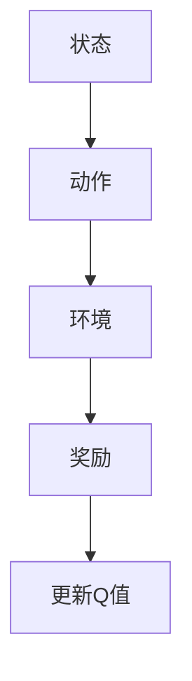

                 


# AI Agent在智能海洋生态系统预测中的实践

> 关键词：AI Agent, 智能海洋生态系统, 强化学习, 环境预测, 海洋生态监测

> 摘要：本文探讨了AI Agent在智能海洋生态系统预测中的应用，详细分析了AI Agent的核心原理、算法实现、系统架构以及在海洋环境监测中的实际应用场景。通过强化学习算法和系统设计，展示了如何利用AI Agent技术实现对海洋生态系统的智能化预测与管理。

---

# 第一部分: AI Agent与智能海洋生态系统预测的背景与概念

## 第1章: 智能海洋生态系统预测的背景与意义

### 1.1 海洋生态系统的定义与组成
海洋生态系统是由海洋生物群落及其非生物环境组成的复杂系统，包括海洋植物、动物、微生物以及水、温度、盐度等环境因素。这些要素相互作用，构成了一个动态平衡的生态系统。

### 1.2 AI Agent的基本概念
AI Agent（智能体）是指能够感知环境并采取行动以实现目标的智能实体。AI Agent具备自主性、反应性、目标导向性和社会性等特征，能够根据环境信息做出决策。

### 1.3 智能海洋生态系统预测的背景与意义
随着全球气候变化和人类活动的影响，海洋生态系统面临着前所未有的挑战。传统的海洋环境监测方法效率低下，难以应对复杂的动态变化。通过引入AI Agent技术，可以实现对海洋生态系统的实时监测、预测和管理，为保护海洋环境提供技术支持。

---

# 第二部分: AI Agent在智能海洋生态系统预测中的核心概念与联系

## 第2章: AI Agent与智能海洋生态系统的关系

### 2.1 AI Agent的核心概念
AI Agent通过感知环境、分析数据、制定策略并执行动作，能够有效应对复杂环境中的不确定性问题。在智能海洋生态系统中，AI Agent可以用于监测海洋生物分布、预测环境变化趋势等。

### 2.2 智能海洋生态系统的实体关系
智能海洋生态系统中的实体包括海洋生物、环境因素和预测模型。通过AI Agent的协调，这些实体能够实现信息共享和协同工作。

### 2.3 AI Agent与智能海洋生态系统的交互流程
AI Agent通过传感器获取海洋环境数据，结合历史数据和预测模型，生成预测结果并采取相应的行动，如调整监测设备的位置或发出预警信息。

---

# 第三部分: AI Agent在智能海洋生态系统预测中的算法原理

## 第3章: 基于强化学习的AI Agent算法

### 3.1 强化学习的基本原理
强化学习是一种通过试错方法来优化决策模型的算法。AI Agent通过与环境的交互，不断学习最优策略以最大化累积奖励。

#### 3.1.1 Q-Learning算法
Q-Learning是一种经典的强化学习算法，适用于离散动作空间的问题。其核心思想是通过维护一个Q值表，记录每个状态-动作对的期望奖励。

#### 3.1.2 算法流程


### 3.2 强化学习在海洋生态预测中的应用
通过强化学习算法，AI Agent可以学习如何优化海洋环境监测策略，例如选择最佳的监测点位或调整传感器的采样频率。

#### 3.2.1 算法实现
以下是一个简单的Q-Learning算法实现示例：
```python
import numpy as np

class AI-Agent:
    def __init__(self, state_space_size, action_space_size):
        self.q_table = np.zeros((state_space_size, action_space_size))
    
    def choose_action(self, state, epsilon=0.1):
        if np.random.random() < epsilon:
            return np.random.randint(0, action_space_size)
        else:
            return np.argmax(self.q_table[state, :])
    
    def learn(self, state, action, reward, next_state):
        self.q_table[state, action] = self.q_table[state, action] * 0.9 + reward
```

---

# 第四部分: AI Agent在智能海洋生态系统预测中的系统架构

## 第4章: 系统架构与功能设计

### 4.1 系统功能设计
智能海洋生态系统预测系统主要包括数据采集、数据处理、模型预测和结果展示四个模块。

#### 4.1.1 数据采集模块
数据采集模块通过传感器获取海洋环境数据，例如水温、盐度、溶解氧含量等。

#### 4.1.2 数据处理模块
数据处理模块对采集到的原始数据进行清洗、归一化处理，并提取特征。

#### 4.1.3 模型预测模块
模型预测模块基于强化学习算法，生成海洋环境的预测结果。

#### 4.1.4 结果展示模块
结果展示模块将预测结果以可视化的方式呈现，方便用户理解和决策。

### 4.2 系统架构设计
系统架构采用分层设计，包括数据层、计算层和应用层。

#### 4.2.1 数据层
数据层负责存储和管理所有环境数据，支持高效的数据查询和更新。

#### 4.2.2 计算层
计算层实现AI Agent的核心算法，完成数据处理和预测任务。

#### 4.2.3 应用层
应用层提供用户界面，展示预测结果并支持用户交互。

### 4.3 系统接口设计
系统接口采用RESTful API设计，支持与外部系统的数据交互。

---

# 第五部分: AI Agent在智能海洋生态系统预测中的项目实战

## 第5章: 项目实战与案例分析

### 5.1 项目背景
本项目旨在利用AI Agent技术，实现对某海域海洋生态系统的实时监测和预测。

### 5.2 核心代码实现
以下是AI Agent的核心代码实现：
```python
import numpy as np
import random

class AI-Agent:
    def __init__(self, state_space_size, action_space_size):
        self.q_table = np.zeros((state_space_size, action_space_size))
    
    def choose_action(self, state, epsilon=0.1):
        if random.random() < epsilon:
            return random.randint(0, action_space_size-1)
        else:
            return np.argmax(self.q_table[state, :])
    
    def learn(self, state, action, reward, next_state):
        self.q_table[state, action] = self.q_table[state, action] * 0.9 + reward
```

### 5.3 案例分析
以某海域的海洋环境监测为例，AI Agent通过强化学习算法，成功预测了海洋生态系统的动态变化，并优化了监测设备的部署策略。

---

# 第六部分: 总结与展望

## 第6章: 总结与展望

### 6.1 本章总结
本文详细探讨了AI Agent在智能海洋生态系统预测中的应用，介绍了其核心原理、算法实现和系统架构。通过实际案例分析，展示了AI Agent在海洋环境监测中的巨大潜力。

### 6.2 未来展望
未来，随着AI技术的不断发展，AI Agent在海洋生态系统的应用将更加广泛。通过结合边缘计算、物联网等技术，可以进一步提升预测的准确性和实时性。

---

# 作者：AI天才研究院 & 禅与计算机程序设计艺术

