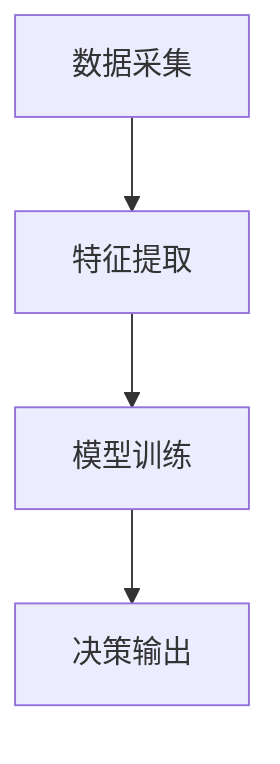
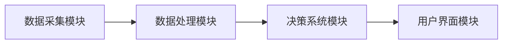

                 


# AI Agent在智能海洋资源勘探中的实践

> 关键词：AI Agent, 智能海洋资源勘探, 数据采集, 决策系统, 数学模型, 机器学习

> 摘要：本文深入探讨了AI Agent在智能海洋资源勘探中的应用，分析了其核心概念、算法原理、系统架构，并通过实际案例展示了如何利用AI技术优化海洋资源勘探的效率和准确性。文章内容涵盖从理论到实践的各个方面，为读者提供了全面的指导和启示。

---

## 第一部分: AI Agent与智能海洋资源勘探的背景与基础

### 第1章: AI Agent与智能海洋资源勘探概述

#### 1.1 AI Agent的基本概念
##### 1.1.1 AI Agent的定义
AI Agent（人工智能代理）是一种能够感知环境、自主决策并执行任务的智能实体。它可以是一个软件程序、机器人或其他智能系统，具备以下核心特征：
- **自主性**：无需外部干预，自主完成任务。
- **反应性**：能够实时感知环境并做出反应。
- **目标导向**：基于目标驱动行为。

##### 1.1.2 AI Agent的核心特征
| 特征 | 描述 |
|------|------|
| 自主性 | 无需外部干预，自主完成任务。 |
| 反应性 | 能够实时感知环境并做出反应。 |
| 目标导向 | 行为基于目标驱动，而非随机执行。 |

##### 1.1.3 AI Agent与传统自动化的区别
| 方面 | 传统自动化 | AI Agent |
|------|------------|----------|
| 智能水平 | 基于固定规则 | 具备学习和推理能力 |
| 环境适应性 | 适应固定场景 | 能够适应动态环境 |
| 决策能力 | 无自主决策 | 具备自主决策能力 |

#### 1.2 智能海洋资源勘探的背景
##### 1.2.1 海洋资源勘探的重要性
海洋资源勘探是人类探索和开发海洋资源的重要活动，包括矿产资源、生物资源和能源资源等。随着全球资源需求的增加，海洋资源勘探的重要性日益凸显。

##### 1.2.2 传统海洋资源勘探的局限性
传统海洋资源勘探依赖人工操作，存在以下问题：
- **效率低下**：人工操作耗时长，成本高。
- **精度不足**：受人类经验限制，难以做到精准探测。
- **危险性高**：深海勘探环境恶劣，存在安全隐患。

##### 1.2.3 智能化技术在海洋勘探中的应用前景
随着人工智能技术的快速发展，AI Agent在海洋资源勘探中的应用前景广阔。通过智能化技术，可以提高勘探效率、降低成本、增强安全性。

#### 1.3 AI Agent在海洋资源勘探中的作用
##### 1.3.1 提高勘探效率
AI Agent可以通过自动化数据处理和智能决策，显著提高勘探效率。

##### 1.3.2 优化资源分配
AI Agent可以根据实时数据优化资源分配，提高勘探的精准度。

##### 1.3.3 实现自主决策
AI Agent可以在复杂环境中自主决策，适应动态变化的环境条件。

---

## 第二部分: AI Agent的核心概念与原理

### 第2章: AI Agent的核心概念与原理

#### 2.1 AI Agent的核心概念
##### 2.1.1 知识表示
知识表示是AI Agent理解和处理信息的基础。常见的知识表示方法包括：
- **规则表示**：通过预定义的规则表示知识。
- **语义网络**：通过节点和边表示概念及其关系。
- **概率表示**：通过概率模型表示不确定性。

##### 2.1.2 状态空间
状态空间是AI Agent所处环境的所有可能状态的集合。状态空间的大小直接影响AI Agent的决策效率。

##### 2.1.3 行动空间
行动空间是AI Agent在某一状态下可以执行的所有可能动作。

#### 2.2 AI Agent的感知与决策机制
##### 2.2.1 感知模块
感知模块负责采集和处理环境中的数据，主要包括：
- **数据采集**：通过传感器采集环境数据。
- **特征提取**：从原始数据中提取有用特征。
- **数据融合**：将多源数据进行融合，提高感知精度。

##### 2.2.2 决策模块
决策模块负责根据感知数据制定决策策略，主要包括：
- **目标设定**：明确决策目标。
- **决策规则**：基于规则或模型进行决策。
- **策略优化**：通过学习优化决策策略。

##### 2.2.3 执行模块
执行模块负责将决策结果转化为具体行动，主要包括：
- **行动规划**：制定具体的行动计划。
- **行动执行**：执行预设的行动计划。
- **反馈处理**：处理执行后的反馈信息。

#### 2.3 AI Agent的分类与对比
##### 2.3.1 分类标准
AI Agent可以根据以下标准进行分类：
- **智能水平**：分为弱人工智能和强人工智能。
- **应用场景**：分为特定任务AI Agent和通用任务AI Agent。
- **决策方式**：分为基于规则的AI Agent和基于学习的AI Agent。

##### 2.3.2 各类AI Agent的优缺点对比
| 类型 | 优点 | 缺点 |
|------|------|------|
| 基于规则的AI Agent | 实现简单，易于解释 | 需要手动编写规则，难以应对复杂情况 |
| 基于学习的AI Agent | 能够适应复杂环境，具备学习能力 | 需要大量数据和计算资源，难以解释 |

##### 2.3.3 适用场景分析
基于规则的AI Agent适用于规则明确的场景，如简单的数据处理任务。基于学习的AI Agent适用于复杂多变的场景，如动态环境中的资源勘探。

---

## 第三部分: AI Agent在海洋资源勘探中的应用场景

### 第3章: AI Agent在海洋资源勘探中的应用场景

#### 3.1 海洋地质勘探中的AI Agent应用
##### 3.1.1 地震数据处理
AI Agent可以通过机器学习算法对地震数据进行自动处理和分析，识别地质结构。

##### 3.1.2 地层识别
通过AI Agent对地质数据进行分类和聚类分析，实现地层的自动识别。

##### 3.1.3 风险评估
AI Agent可以基于历史数据和实时数据，评估勘探过程中的风险因素。

#### 3.2 海洋生物资源勘探中的AI Agent应用
##### 3.2.1 生物多样性分析
AI Agent可以通过图像识别技术，分析海洋生物的种类和分布。

##### 3.2.2 生物资源分布预测
基于AI Agent的预测模型，可以预测海洋生物资源的分布区域。

##### 3.2.3 生态系统保护
AI Agent可以实时监测海洋生态系统的健康状况，制定保护策略。

#### 3.3 海洋环境监测中的AI Agent应用
##### 3.3.1 环境数据采集
AI Agent可以通过传感器网络采集海洋环境数据，如温度、盐度和溶解氧含量。

##### 3.3.2 环境变化预测
基于历史数据和机器学习模型，AI Agent可以预测海洋环境的变化趋势。

##### 3.3.3 环境保护决策支持
AI Agent可以为海洋环境保护提供决策支持，优化资源分配和行动计划。

---

## 第四部分: AI Agent的算法原理与数学模型

### 第4章: AI Agent的感知与决策算法

#### 4.1 感知算法
##### 4.1.1 数据采集与预处理
数据采集是感知过程的第一步，通常通过传感器网络完成。预处理步骤包括数据清洗、特征提取和数据标准化。

##### 4.1.2 特征提取
特征提取是通过降维技术（如主成分分析）从原始数据中提取有用的特征。

##### 4.1.3 模型训练
模型训练是基于机器学习算法（如支持向量机、随机森林）对特征数据进行训练，得到分类或回归模型。

#### 4.2 决策算法
##### 4.2.1 基于概率的决策树
基于概率的决策树是一种常用的分类方法，通过概率计算确定决策路径。

##### 4.2.2 基于强化学习的策略网络
基于强化学习的策略网络通过奖励机制优化决策策略。

##### 4.2.3 基于规则的决策系统
基于规则的决策系统通过预定义的规则进行决策，适用于规则明确的场景。

#### 4.3 算法实现流程图


### 第5章: AI Agent的数学模型与公式

#### 5.1 感知模型
##### 5.1.1 线性回归模型
线性回归模型用于预测连续型变量，公式为：
$$y = \beta_0 + \beta_1x + \epsilon$$

##### 5.1.2 逻辑回归模型
逻辑回归模型用于分类问题，公式为：
$$P(y=1|x) = \frac{e^{\beta_0 + \beta_1x}}{1 + e^{\beta_0 + \beta_1x}}$$

#### 5.2 决策模型
##### 5.2.1 决策树算法
决策树是一种常用的分类方法，通过信息增益或基尼指数选择最优分裂特征。

##### 5.2.2 强化学习算法
强化学习算法通过状态-动作-奖励机制优化决策策略，常用Q-learning算法：
$$Q(s, a) = Q(s, a) + \alpha[r + \gamma \max Q(s', a) - Q(s, a)]$$

---

## 第五部分: AI Agent的系统分析与架构设计

### 第5章: 系统分析与架构设计

#### 5.1 项目背景与目标
本项目旨在开发一个基于AI Agent的智能海洋资源勘探系统，目标是提高勘探效率、降低成本、增强安全性。

#### 5.2 系统功能设计
##### 5.2.1 数据采集模块
负责采集海洋环境数据，包括温度、盐度、溶解氧含量等。

##### 5.2.2 数据处理模块
对采集到的数据进行预处理、特征提取和数据融合。

##### 5.2.3 决策系统模块
基于机器学习模型进行资源分布预测和风险评估。

#### 5.3 系统架构设计
##### 5.3.1 系统架构图


##### 5.3.2 接口设计
系统通过API接口与外部设备和数据库进行交互。

##### 5.3.3 交互流程
用户通过用户界面模块提交任务，系统通过数据采集模块采集数据，数据处理模块进行处理，决策系统模块生成决策结果，并返回给用户界面模块。

---

## 第六部分: 项目实战

### 第6章: 项目实战

#### 6.1 环境安装
##### 6.1.1 Python环境配置
安装Python 3.8及以上版本，安装必要的库，如NumPy、Pandas、Scikit-learn、TensorFlow。

#### 6.2 核心代码实现
##### 6.2.1 数据处理代码
```python
import numpy as np
import pandas as pd

# 数据加载
data = pd.read_csv('ocean_data.csv')

# 数据预处理
data.dropna(inplace=True)
data['label'] = data['label'].astype(int)

# 特征提取
X = data.iloc[:, :-1].values
y = data.iloc[:, -1].values
```

##### 6.2.2 模型训练代码
```python
from sklearn.model import DecisionTreeClassifier
from sklearn.metrics import accuracy_score

# 模型训练
model = DecisionTreeClassifier()
model.fit(X, y)

# 模型预测
y_pred = model.predict(X)
print('准确率:', accuracy_score(y, y_pred))
```

##### 6.2.3 决策系统代码
```python
from sklearn.ensemble import RandomForestClassifier

# 模型训练
model = RandomForestClassifier()
model.fit(X, y)

# 决策系统
def make_decision(new_data):
    return model.predict(new_data)
```

#### 6.3 案例分析
##### 6.3.1 数据分析
通过数据分析，确定海洋资源的分布规律。

##### 6.3.2 模型验证
通过交叉验证评估模型的性能，调整参数以优化模型。

##### 6.3.3 实际应用
在实际勘探中应用AI Agent系统，验证其效果。

#### 6.4 项目小结
通过本项目，验证了AI Agent在海洋资源勘探中的有效性，提高了勘探效率和准确性。

---

## 第七部分: 最佳实践与展望

### 第7章: 最佳实践与展望

#### 7.1 最佳实践
##### 7.1.1 数据质量管理
确保数据的准确性和完整性，避免数据偏差。

##### 7.1.2 模型优化
通过参数调优和模型融合，提高模型的性能。

##### 7.1.3 系统维护
定期更新模型和优化系统，适应环境变化。

#### 7.2 未来展望
##### 7.2.1 技术进步
随着人工智能技术的不断进步，AI Agent在海洋资源勘探中的应用将更加广泛。

##### 7.2.2 多学科融合
AI Agent将与其他学科技术深度融合，推动海洋资源勘探的发展。

##### 7.2.3 应用场景扩展
AI Agent的应用场景将不断扩展，涵盖更多海洋资源勘探领域。

---

## 作者：AI天才研究院/AI Genius Institute & 禅与计算机程序设计艺术 /Zen And The Art of Computer Programming

