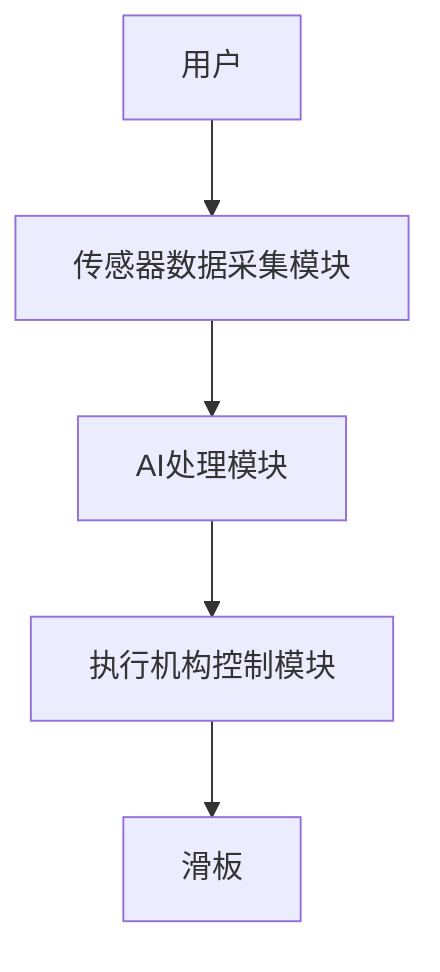

                 


# AI Agent在智能滑板中的技巧学习指导

> **关键词**：AI Agent，智能滑板，技巧学习，算法原理，系统架构，项目实战

> **摘要**：本文深入探讨了AI Agent在智能滑板中的应用，从理论到实践，系统地讲解了AI Agent的核心概念、算法原理、系统架构设计以及项目实战。通过具体的技术细节和实际案例分析，本文展示了如何利用AI技术提升滑板学习的效率和效果。

---

## 第一部分: AI Agent与智能滑板的背景与概念

### 第1章: AI Agent的基本概念与背景

#### 1.1 AI Agent的定义与特点

##### 1.1.1 AI Agent的定义
AI Agent（人工智能代理）是指能够感知环境、自主决策并执行任务的智能实体。它通过传感器获取信息，利用算法处理数据，并通过执行机构完成目标。AI Agent的核心在于其自主性和智能性，能够在动态环境中灵活应对各种挑战。

##### 1.1.2 AI Agent的核心特点
- **自主性**：能够在没有外部干预的情况下独立运作。
- **反应性**：能够实时感知环境变化并做出响应。
- **学习能力**：通过数据和经验不断优化自身性能。
- **决策能力**：能够根据当前状态和目标制定最优策略。

##### 1.1.3 AI Agent与传统AI的区别
传统的AI系统通常依赖于预定义的规则和数据，而AI Agent具有更强的自主性和适应性。它能够主动探索环境、与用户交互并动态调整策略，从而更好地适应复杂多变的场景。

#### 1.2 智能滑板的基本概念

##### 1.2.1 滑板的基本功能与类型
滑板是一种极限运动工具，传统滑板需要依赖滑板手的技巧和平衡能力。智能滑板通过集成传感器、AI算法和执行机构，能够自动调整姿态、辅助用户完成复杂动作。

##### 1.2.2 智能滑板的定义与技术特点
智能滑板是一种结合了AI技术的滑板，能够通过传感器采集数据，利用AI算法分析用户动作并提供实时反馈，从而帮助用户提高技巧。

##### 1.2.3 智能滑板的应用场景与用户需求
- **应用场景**：滑板训练、极限运动、娱乐健身。
- **用户需求**：初学者需要基础技巧指导，进阶用户需要高级动作训练，专业运动员需要精准的反馈和优化建议。

#### 1.3 AI Agent在智能滑板中的问题背景

##### 1.3.1 滑板运动中的技术挑战
滑板运动需要高度的平衡感和协调性，初学者往往难以掌握基本技巧，容易受伤。同时，进阶动作（如空翻、侧滑）对技巧要求极高，传统教学效率低下。

##### 1.3.2 用户在滑板学习中的痛点
- 初学者缺乏正确的姿势和技巧指导，容易养成不良习惯。
- 中级用户需要系统化的训练计划，但缺乏个性化的反馈。
- 高级用户需要实时的技巧优化和动作分析。

##### 1.3.3 AI Agent如何解决这些问题
AI Agent可以通过实时监测用户的动作，提供个性化的指导和反馈。例如，通过姿态识别技术帮助用户纠正姿势，通过动作分析提供技巧优化建议。

---

## 第二部分: AI Agent的核心概念与原理

### 第2章: AI Agent的核心概念与原理

#### 2.1 AI Agent的核心概念

##### 2.1.1 感知层
感知层是AI Agent与环境交互的第一步，负责采集数据并识别环境状态。在智能滑板中，感知层通常包括加速度传感器、陀螺仪、摄像头等设备。

##### 2.1.2 决策层
决策层负责根据感知数据制定行动策略。它基于传感器数据和用户目标，选择最优的动作方案。

##### 2.1.3 执行层
执行层负责将决策层的指令转化为具体动作，例如调整滑板的姿态或提供震动反馈。

#### 2.2 AI Agent的原理与流程

##### 2.2.1 数据采集与处理
AI Agent通过传感器采集滑板的姿态数据、用户动作数据等信息，将其转化为可用的格式进行分析。

##### 2.2.2 状态分析与判断
基于采集的数据，AI Agent分析当前状态并判断是否需要干预。例如，检测用户是否失去平衡。

##### 2.2.3 动作规划与执行
根据判断结果，AI Agent规划具体的动作方案，并通过执行机构（如电机）调整滑板姿态或提供反馈。

#### 2.3 AI Agent的数学模型与公式

##### 2.3.1 状态空间的表示
状态空间是AI Agent决策的基础，通常用向量表示。例如，滑板的姿态可以用四元数表示。

$$ q = [q_w, q_x, q_y, q_z] $$

其中，$q_w$、$q_x$、$q_y$、$q_z$分别表示四元数的四个分量。

---

## 第三部分: AI Agent的算法原理与实现

### 第3章: AI Agent的算法原理

#### 3.1 强化学习算法

##### 3.1.1 强化学习的基本原理
强化学习是一种通过奖励机制训练AI Agent的方法。AI Agent通过与环境交互，不断尝试动作以获得最大奖励。

##### 3.1.2 Q-learning算法
Q-learning是一种经典的强化学习算法，通过维护一个Q表来记录状态-动作对的期望奖励。

$$ Q(s, a) = r + \gamma \max_{a'} Q(s', a') $$

其中，$\gamma$是折扣因子，$s$是当前状态，$a$是当前动作，$s'$是下一个状态。

##### 3.1.3 实现流程
1. 初始化Q表。
2. 采集环境数据，确定当前状态。
3. 根据策略选择动作。
4. 执行动作，观察奖励和新状态。
5. 更新Q表。

#### 3.2 监督学习算法

##### 3.2.1 监督学习的基本原理
监督学习通过标签数据训练AI Agent，使其能够预测目标输出。

##### 3.2.2 支持向量机（SVM）
SVM是一种常用的监督学习算法，适用于分类问题。

$$ \text{目标函数} = \min_{w, b} \frac{1}{2} ||w||^2 + C \sum_{i=1}^n \xi_i $$
$$ \text{约束条件} = y_i (w \cdot x_i + b) \geq 1 - \xi_i, \xi_i \geq 0 $$

其中，$w$是权重向量，$b$是偏置项，$y_i$是标签，$x_i$是输入数据。

---

## 第四部分: AI Agent的系统架构与设计

### 第4章: 系统架构设计

#### 4.1 问题场景介绍
智能滑板系统需要实时监测用户动作，提供个性化反馈。系统架构需要支持多传感器数据采集、AI算法处理和执行机构控制。

#### 4.2 系统功能设计

##### 4.2.1 功能模块划分
- **传感器数据采集模块**：负责采集滑板姿态、用户动作数据。
- **AI处理模块**：分析数据，生成反馈指令。
- **执行机构控制模块**：根据反馈指令调整滑板姿态。

#### 4.3 系统架构设计

##### 4.3.1 系统架构图


---

## 第五部分: 项目实战与案例分析

### 第5章: 项目实战

#### 5.1 环境安装与配置
- **开发环境**：Python 3.8+
- **依赖库安装**：numpy、scikit-learn、tensorflow

#### 5.2 核心代码实现

##### 5.2.1 传感器数据处理
```python
import numpy as np

def process_sensor_data(data):
    # 数据预处理
    processed_data = data.reshape(-1, 4)
    return processed_data
```

##### 5.2.2 AI算法实现
```python
from sklearn.svm import SVC

def train_svm_model(X, y):
    model = SVC()
    model.fit(X, y)
    return model
```

#### 5.3 实际案例分析

##### 5.3.1 初级用户训练案例
- 用户A刚开始学习滑板，AI Agent通过姿态识别帮助其纠正姿势。
- 通过Q-learning算法优化训练计划。

##### 5.3.2 进阶用户训练案例
- 用户B希望掌握空翻技巧，AI Agent通过强化学习提供实时反馈。
- 系统记录用户动作，分析错误并提供改进建议。

---

## 第六部分: 总结与展望

### 6.1 总结
本文详细探讨了AI Agent在智能滑板中的应用，从理论到实践，系统地讲解了AI Agent的核心概念、算法原理、系统架构设计以及项目实战。通过具体的技术细节和实际案例分析，展示了如何利用AI技术提升滑板学习的效率和效果。

### 6.2 展望
未来，AI Agent在智能滑板中的应用将更加智能化和个性化。随着算法的优化和硬件的进步，智能滑板将能够提供更加精准的反馈和个性化的训练计划，帮助用户更高效地掌握滑板技巧。

---

**作者：AI天才研究院/AI Genius Institute & 禅与计算机程序设计艺术 /Zen And The Art of Computer Programming**

