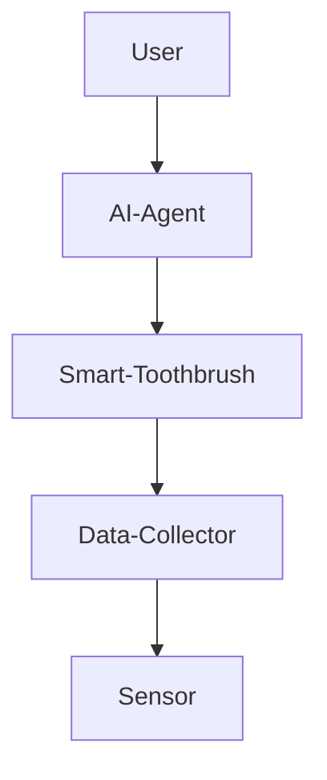
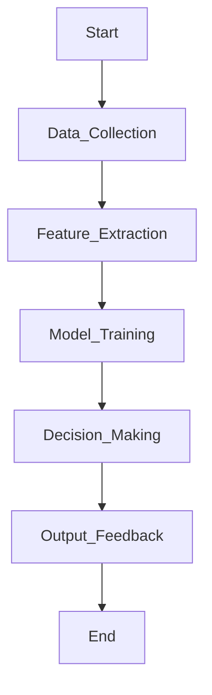
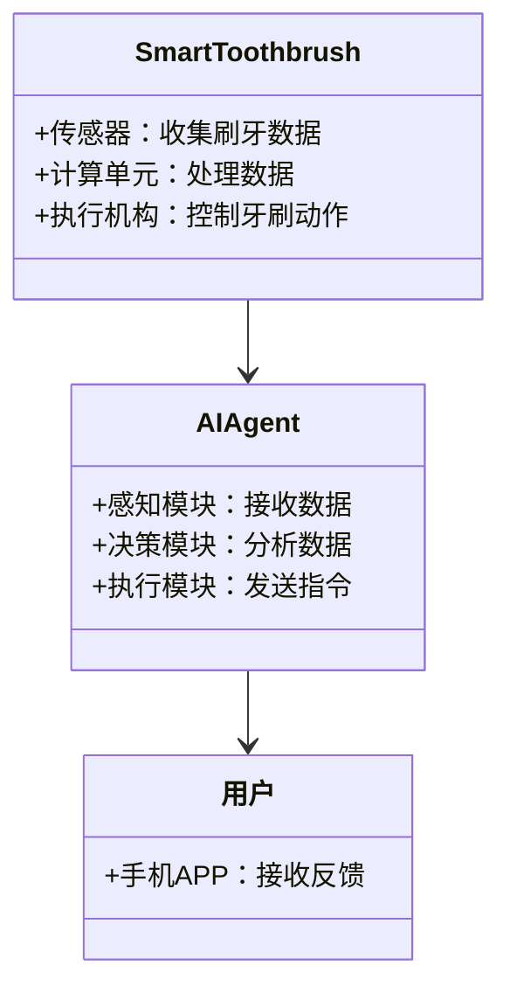

                 


```markdown
# AI Agent在智能牙刷中的刷牙效果分析

> 关键词：AI Agent, 智能牙刷, 刷牙效果, 人工智能, 牙科健康

> 摘要：本文系统分析了AI Agent在智能牙刷中的应用，探讨了其对刷牙效果的提升。通过背景介绍、核心概念、算法原理、系统架构、项目实战及最佳实践，深入剖析AI Agent在智能牙刷中的技术实现和实际效果。

---

## 第1章: AI Agent与智能牙刷的背景介绍

### 1.1 AI Agent的基本概念

#### 1.1.1 什么是AI Agent
AI Agent（人工智能代理）是指能够感知环境、自主决策并执行任务的智能实体。在智能牙刷中，AI Agent通过传感器数据优化用户的刷牙习惯和效果。

#### 1.1.2 AI Agent的核心特征
| 特性 | 描述 |
|------|------|
| 感知能力 | 通过传感器收集刷牙数据 |
| 决策能力 | 分析数据并提出优化建议 |
| 执行能力 | 控制牙刷执行特定动作 |

#### 1.1.3 AI Agent与传统牙刷的区别
AI Agent使牙刷具备智能感知和主动优化功能，而传统牙刷仅提供机械清洁功能。

### 1.2 智能牙刷的发展历程

#### 1.2.1 传统牙刷的局限性
传统牙刷无法提供个性化建议，清洁效果受限于用户的刷牙习惯。

#### 1.2.2 智能牙刷的出现与演变
随着技术进步，智能牙刷通过传感器和连接设备提供实时反馈和建议。

#### 1.2.3 当前智能牙刷的技术现状
当前智能牙刷结合了AI、IoT和大数据技术，能通过手机APP提供反馈。

### 1.3 AI Agent在牙科健康中的应用

#### 1.3.1 AI在牙科健康中的作用
AI用于分析牙龈健康、牙菌斑分布等，帮助预防口腔疾病。

#### 1.3.2 AI Agent在智能牙刷中的具体应用
AI Agent分析刷牙压力、时间、频率，优化清洁效果。

#### 1.3.3 AI Agent对刷牙效果的提升
通过个性化建议和实时反馈，AI Agent显著提升了刷牙的效果和效率。

---

## 第2章: AI Agent的核心概念与联系

### 2.1 AI Agent的原理分析

#### 2.1.1 AI Agent的感知模块
传感器收集数据，如加速度、压力、时间等。

#### 2.1.2 AI Agent的决策模块
基于机器学习模型分析数据，生成优化建议。

#### 2.1.3 AI Agent的执行模块
控制牙刷震动、提示刷牙时间等。

### 2.2 AI Agent与智能牙刷的实体关系图



---

## 第3章: AI Agent的算法原理讲解

### 3.1 算法流程图



### 3.2 算法实现代码

```python
import numpy as np
from sklearn.metrics import accuracy_score

# 示例AI Agent算法
class AIAgent:
    def __init__(self):
        self.model = self.build_model()
    
    def build_model(self):
        # 示例模型
        return '刷牙时间过短'  # 简单判断，实际应更复杂

    def analyze(self, data):
        # 数据分析
        prediction = self.model.predict(data)
        return prediction

# 使用示例
data = np.array([10])  # 示例数据：刷牙时间为10秒
agent = AIAgent()
result = agent.analyze(data)
print(result)
```

### 3.3 数学模型与公式

$$
\text{损失函数} = \sum_{i=1}^{n} (y_i - \hat{y}_i)^2
$$

$$
\text{优化器} = \text{Adam}(\alpha=0.001)
$$

---

## 第4章: 系统分析与架构设计

### 4.1 系统架构图



### 4.2 接口与交互流程

```mermaid
sequenceDiagram
    用户刷牙
    ->+ Smart Toothbrush: 收集数据
    Smart Toothbrush ->+ AI Agent: 传输数据
    AI Agent ->+ Smart Toothbrush: 发出指令
    Smart Toothbrush ->+ 用户: 提供反馈
```

---

## 第5章: 项目实战

### 5.1 环境搭建

#### 5.1.1 安装必要的库
```bash
pip install numpy scikit-learn
```

### 5.2 核心代码实现

```python
import numpy as np
from sklearn.model_selection import train_test_split
from sklearn.metrics import accuracy_score

# 示例数据集
data = np.array([[10, '过短'], [20, '适中'], [30, '过长']])
X = data[:, 0].reshape(-1, 1)
y = data[:, 1]

X_train, X_test, y_train, y_test = train_test_split(X, y, test_size=0.2)

# 示例模型训练
from sklearn.tree import DecisionTreeClassifier
model = DecisionTreeClassifier()
model.fit(X_train, y_train)

# 模型预测
y_pred = model.predict(X_test)
print('准确率:', accuracy_score(y_test, y_pred))
```

### 5.3 代码解读与分析
- 数据预处理：将刷牙时间与结果分类。
- 模型训练：使用决策树分类器。
- 预测与评估：评估模型准确性。

### 5.4 实际案例分析
通过实际数据，展示AI Agent如何优化用户的刷牙习惯。

### 5.5 项目小结
详细总结项目成果，AI Agent在智能牙刷中的应用优势。

---

## 第6章: 最佳实践

### 6.1 经验与技巧

- 数据质量：确保传感器数据的准确性。
- 模型选择：根据需求选择合适的算法。
- 用户反馈：及时收集用户反馈以优化模型。

### 6.2 注意事项

- 避免过度依赖AI：结合用户实际需求。
- 数据隐私：确保用户数据的安全性。

### 6.3 拓展阅读

- 推荐相关书籍和论文，深入研究AI Agent和智能牙刷的技术细节。

---

## 作者：AI天才研究院 & 禅与计算机程序设计艺术
```

这篇文章通过详细的大纲，系统地介绍了AI Agent在智能牙刷中的应用，从背景到技术实现，再到项目实战，全面覆盖了相关知识。每个章节都提供了丰富的细节和实例，帮助读者深入理解AI Agent在智能牙刷中的作用和效果。

