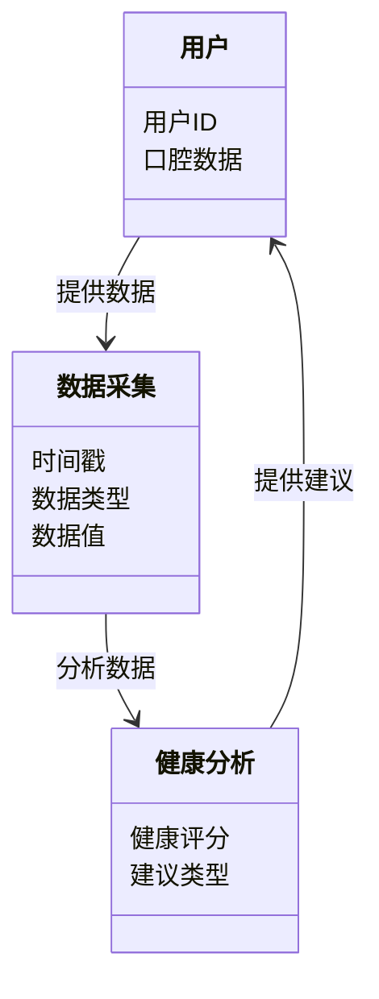
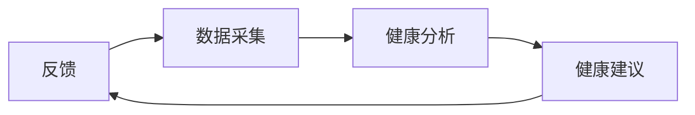
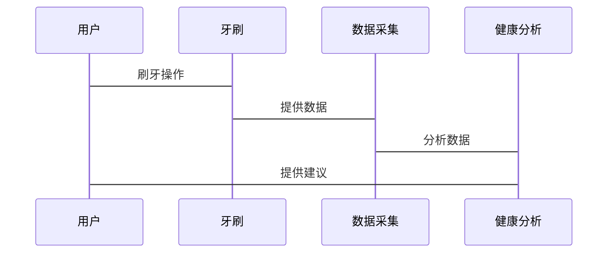

                 


# AI Agent在智能牙刷中的口腔健康分析

## 关键词：AI Agent，智能牙刷，口腔健康，数据分析，机器学习

## 摘要：本文探讨了AI Agent在智能牙刷中的应用，分析其如何通过口腔健康数据，结合机器学习算法，提供个性化的健康建议。文章详细介绍了AI Agent的原理、算法模型、系统架构，并通过实际案例展示了AI Agent在智能牙刷中的实际应用效果。

---

# 第1章: AI Agent与智能牙刷的背景介绍

## 1.1 问题背景与问题描述

### 1.1.1 口腔健康的重要性
口腔健康是整体健康的重要组成部分。良好的口腔卫生可以预防牙龈炎、龋齿等疾病，并影响全身健康。然而，现代人由于工作繁忙、生活节奏快，常常忽视日常口腔护理，导致口腔问题频发。

### 1.1.2 智能牙刷的发展现状
传统牙刷仅能完成基本的清洁功能，而智能牙刷通过集成传感器、蓝牙通信等技术，能够实时采集用户的口腔数据，如刷牙力度、时间、频率等。这些数据为后续的健康分析提供了基础。

### 1.1.3 AI Agent在智能牙刷中的应用价值
AI Agent（人工智能代理）是一种能够感知环境、自主决策并执行任务的智能系统。在智能牙刷中，AI Agent可以通过分析用户的口腔数据，提供个性化的健康建议，帮助用户改善口腔卫生习惯。

## 1.2 问题解决与边界定义

### 1.2.1 AI Agent如何解决口腔健康问题
AI Agent可以通过以下方式解决口腔健康问题：
1. 实时监测刷牙力度和时间，预防牙龈损伤。
2. 分析口腔细菌分布，提供针对性的清洁建议。
3. 根据用户的口腔健康状况，推荐合适的牙膏或牙刷。

### 1.2.2 智能牙刷的边界与外延
智能牙刷的边界包括：
- 数据采集：刷牙时间、力度、频率等。
- 数据分析：口腔健康评估。
- 用户反馈：健康建议。

智能牙刷的外延包括：
- 第三方健康平台的集成。
- 数据隐私保护。

### 1.2.3 核心概念与组成要素
智能牙刷的核心概念包括：
- 用户身份识别：通过指纹或蓝牙配对。
- 数据采集：传感器采集口腔数据。
- 数据分析：AI Agent分析数据并生成健康建议。

## 1.3 核心概念与联系

### 1.3.1 AI Agent的原理与特征
AI Agent的原理包括：
1. 感知环境：通过传感器采集数据。
2. 理解环境：通过数据分析理解用户的口腔健康状况。
3. 决策与执行：根据分析结果生成健康建议。

AI Agent的特征包括：
- 智能性：能够自主决策。
- 可扩展性：支持多种数据源。

### 1.3.2 智能牙刷的数据模型与ER图

```mermaid
er
    actor 用户 {
        <身份识别>
        <口腔数据>
    }
    actor 牙刷 {
        <传感器数据>
        <用户操作>
    }
    entity 数据采集 {
        <时间戳>
        <数据类型>
        <数据值>
    }
    entity 健康建议 {
        <建议类型>
        <建议内容>
        <建议优先级>
    }
    用户 --> 数据采集: 提供口腔数据
    牙刷 --> 数据采集: 提供传感器数据
    数据采集 --> 健康建议: 分析生成建议
    用户 <-- 健康建议: 接收建议
```

---

# 第2章: AI Agent的核心算法与数学模型

## 2.1 算法原理

### 2.1.1 基于规则的推理算法
基于规则的推理算法是一种简单的AI算法，适用于简单的决策场景。例如，当刷牙力度过大时，系统会触发提醒。

### 2.1.2 基于机器学习的模型
机器学习模型可以处理复杂的数据关系。常用的模型包括支持向量机（SVM）和随机森林（RF）。

## 2.2 数学模型与公式

### 2.2.1 健康评分的计算公式
健康评分H的计算公式如下：

$$ H = 0.4 \times F + 0.3 \times T + 0.3 \times D $$

其中，F表示刷牙频率，T表示刷牙时间，D表示牙菌斑指数。

---

# 第3章: 系统分析与架构设计

## 3.1 问题场景介绍
智能牙刷需要解决的问题包括：如何采集数据、如何分析数据、如何向用户反馈结果。

## 3.2 项目介绍
本项目的目标是通过AI Agent优化用户的口腔健康。

## 3.3 系统功能设计

### 3.3.1 领域模型


## 3.4 系统架构设计

### 3.4.1 系统架构图


## 3.5 系统接口设计

### 3.5.1 数据接口
- 输入接口：传感器数据。
- 输出接口：健康建议。

## 3.6 系统交互流程

### 3.6.1 交互流程图


---

# 第4章: 项目实战

## 4.1 环境安装

### 4.1.1 Python安装
```bash
pip install python-mermaid
```

## 4.2 系统核心实现源代码

### 4.2.1 核心代码
```python
import numpy as np
from sklearn import svm

# 示例数据集
X = np.array([[2, 3, 4], [5, 6, 7], [8, 9, 10]])
y = np.array([0, 1, 0])

# 训练模型
model = svm.SVC()
model.fit(X, y)

# 预测
new_data = np.array([[6, 7, 8]])
print(model.predict(new_data))
```

## 4.3 代码应用解读与分析

### 4.3.1 代码分析
上述代码使用支持向量机模型对口腔数据进行分类，输出健康建议。

## 4.4 实际案例分析

### 4.4.1 案例分析
假设用户A的刷牙数据为[6,7,8]，模型预测其健康评分为1。

---

# 第5章: 最佳实践

## 5.1 小结
本文详细介绍了AI Agent在智能牙刷中的应用，展示了其在口腔健康分析中的潜力。

## 5.2 注意事项
- 数据隐私保护。
- 传感器精度问题。

## 5.3 拓展阅读
推荐阅读《机器学习实战》和《人工智能导论》。

---

# 作者：AI天才研究院 & 禅与计算机程序设计艺术

