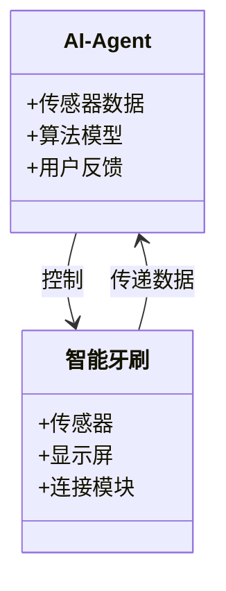
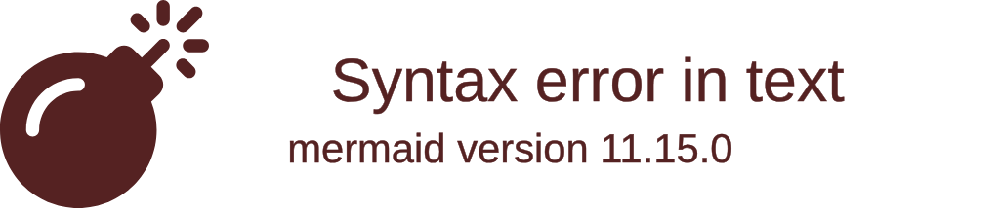
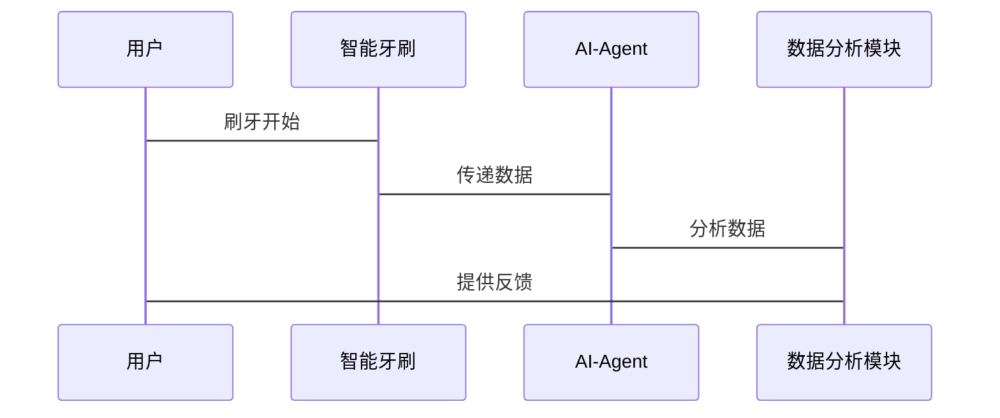

                 


# AI Agent在智能牙刷中的口腔健康追踪

**关键词**：AI Agent，智能牙刷，口腔健康追踪，传感器数据，机器学习，算法原理，系统架构

**摘要**：  
本文探讨了AI Agent在智能牙刷中的应用，详细分析了其如何通过传感器数据和机器学习算法实现口腔健康追踪。文章从背景介绍、核心概念、算法原理、系统架构到项目实战，全面解析了AI Agent在智能牙刷中的技术实现与应用场景。通过具体案例分析和代码实现，展示了AI Agent如何优化用户的口腔健康管理。

---

# 第1章 AI Agent与智能牙刷概述

## 1.1 AI Agent的基本概念
### 1.1.1 AI Agent的定义与特点
AI Agent（人工智能代理）是一种能够感知环境、执行任务并做出决策的智能系统。它具有以下特点：
- **自主性**：能够在没有外部干预的情况下独立运行。
- **反应性**：能够实时感知环境变化并做出响应。
- **目标导向**：以特定目标为导向，优化决策过程。

### 1.1.2 AI Agent的核心功能与应用场景
AI Agent的核心功能包括数据采集、分析、决策和反馈。其应用场景广泛，例如智能助手、自动驾驶和智能医疗设备等。

### 1.1.3 AI Agent在智能牙刷中的具体应用
在智能牙刷中，AI Agent主要用于口腔健康监测，例如牙龈出血检测、刷牙习惯分析和口腔健康建议生成。

## 1.2 智能牙刷的发展历程
### 1.2.1 传统牙刷的功能与局限性
传统牙刷仅提供基本的清洁功能，无法进行健康监测。

### 1.2.2 智能牙刷的出现与技术进步
随着传感器和AI技术的进步，智能牙刷能够采集口腔数据并进行健康分析。

### 1.2.3 智能牙刷的市场现状与未来趋势
当前市场中，智能牙刷逐渐普及，未来将更加智能化和个性化。

## 1.3 口腔健康追踪的背景与意义
### 1.3.1 口腔健康的重要性
口腔健康与全身健康密切相关，维护口腔健康对整体健康至关重要。

### 1.3.2 口腔健康追踪的现状与问题
传统口腔健康监测方法效率低，且难以实时反馈。

### 1.3.3 AI Agent在口腔健康追踪中的优势
AI Agent能够实时采集和分析数据，提供个性化健康建议。

## 1.4 本章小结
本章介绍了AI Agent和智能牙刷的基本概念，分析了口腔健康追踪的背景和意义，并强调了AI Agent在智能牙刷中的重要性。

---

# 第2章 AI Agent的核心原理

## 2.1 AI Agent的基本原理
### 2.1.1 传感器数据的采集与处理
AI Agent通过传感器采集口腔数据，如加速度、压力和温度。

### 2.1.2 数据分析与模式识别
通过机器学习算法对数据进行分析，识别刷牙习惯和口腔健康问题。

### 2.1.3 AI算法的实现与优化
利用深度学习和强化学习等算法优化AI Agent的性能。

## 2.2 智能牙刷的传感器与数据采集
### 2.2.1 常见传感器类型与功能
包括加速度传感器、压力传感器和温度传感器等。

### 2.2.2 数据采集的流程与技术
传感器数据采集、预处理和特征提取。

### 2.2.3 数据预处理与特征提取
对传感器数据进行去噪和特征提取，为后续分析提供基础。

## 2.3 AI Agent与智能牙刷的协同工作
### 2.3.1 数据流的传递与处理
从传感器数据到AI分析的全流程。

### 2.3.2 AI算法的实时反馈与优化
基于反馈优化AI算法，提升准确性。

### 2.3.3 用户交互与反馈机制
AI Agent通过用户反馈进一步优化服务。

## 2.4 本章小结
本章详细介绍了AI Agent的核心原理和智能牙刷的传感器技术，分析了数据处理流程。

---

# 第3章 AI Agent的算法原理与数学模型

## 3.1 AI Agent的核心算法
### 3.1.1 传感器数据的特征提取算法
- **基于时间序列的特征提取**：使用滑动窗口提取特征。
- **基于频域分析的特征提取**：通过傅里叶变换提取频域特征。
- **基于深度学习的特征提取**：使用CNN提取高层次特征。

### 3.1.2 数据分析与模式识别算法
- **基于机器学习的分类算法**：如随机森林和SVM。
- **基于深度学习的模型训练**：如LSTM用于时间序列分析。
- **基于规则的模式识别**：通过预定义规则进行分类。

### 3.1.3 实时反馈与优化算法
- **基于反馈的实时优化**：利用强化学习优化策略。
- **基于自适应算法的动态调整**：如自适应滤波器。

## 3.2 算法实现的代码示例
```python
import numpy as np
from sklearn.ensemble import RandomForestClassifier

# 示例代码：基于随机森林的分类
def feature_extractor(data):
    # 提取特征
    features = []
    for window in data:
        # 计算均值
        mean = np.mean(window)
        features.append(mean)
    return features

def classify(features):
    # 训练随机森林模型
    clf = RandomForestClassifier()
    clf.fit([features], [0, 1])  # 假设标签为0和1
    return clf.predict(features)

# 示例数据
data = np.random.randn(100, 10)
labels = [0, 1]

# 特征提取
X = feature_extractor(data)
# 分类
y_pred = classify(X)
```

## 3.3 算法的数学模型与公式
### 3.3.1 基于时间序列的模型
$$ y_t = \alpha y_{t-1} + \beta x_t + \epsilon $$

### 3.3.2 基于深度学习的模型
$$ \text{损失函数} = \text{交叉熵损失} $$

## 3.4 本章小结
本章详细讲解了AI Agent的核心算法，包括特征提取、数据分析和实时反馈算法，并通过代码示例和数学公式进行了说明。

---

# 第4章 系统分析与架构设计方案

## 4.1 系统功能设计
### 4.1.1 数据采集模块
负责采集口腔数据，如压力和加速度。

### 4.1.2 数据分析模块
对数据进行分析和模式识别。

### 4.1.3 用户反馈模块
提供健康建议和反馈。

## 4.2 系统架构设计
### 4.2.1 领域模型
使用Mermaid类图展示系统模块关系。



### 4.2.2 系统架构图
使用Mermaid架构图展示系统架构。



## 4.3 系统接口设计
### 4.3.1 接口设计
定义API接口，如RESTful API。

### 4.3.2 交互流程图
使用Mermaid序列图展示交互流程。



## 4.4 本章小结
本章分析了系统的功能设计、架构设计和接口设计，展示了AI Agent在智能牙刷中的整体架构。

---

# 第5章 项目实战

## 5.1 环境安装
安装必要的库，如Python的scikit-learn和TensorFlow。

## 5.2 核心功能实现
### 5.2.1 传感器数据采集
使用传感器库采集数据。

### 5.2.2 数据分析与分类
利用机器学习算法进行分类。

### 5.2.3 用户反馈生成
基于分类结果生成反馈建议。

## 5.3 代码实现与解读
### 5.3.1 数据采集代码
```python
import numpy as np
import time

# 模拟传感器数据采集
def collect_data():
    data = []
    for _ in range(100):
        # 模拟加速度数据
        acceleration = np.random.randn(3)
        data.append(acceleration)
        time.sleep(0.1)
    return data

data = collect_data()
```

### 5.3.2 数据分析代码
```python
from sklearn.ensemble import RandomForestClassifier

# 特征提取
X = data.reshape(-1, 3)
y = np.random.randint(0, 2, len(X))

# 训练模型
clf = RandomForestClassifier()
clf.fit(X, y)

# 预测
y_pred = clf.predict(X)
```

## 5.4 实际案例分析
通过具体案例分析，展示AI Agent在智能牙刷中的实际应用。

## 5.5 本章小结
本章通过实际项目展示了AI Agent在智能牙刷中的实现过程，包括环境搭建、功能实现和案例分析。

---

# 第6章 最佳实践、小结与拓展阅读

## 6.1 最佳实践 tips
- 定期更新模型，提高准确性。
- 保护用户隐私，确保数据安全。

## 6.2 小结
本文详细介绍了AI Agent在智能牙刷中的应用，从理论到实践，全面解析了其技术实现和应用场景。

## 6.3 注意事项
- 确保传感器数据的准确性。
- 定期优化算法，提升用户体验。

## 6.4 拓展阅读
推荐相关领域的书籍和论文，供读者深入学习。

---

# 作者信息

作者：AI天才研究院/AI Genius Institute & 禅与计算机程序设计艺术 /Zen And The Art of Computer Programming

---

通过以上结构，文章系统地介绍了AI Agent在智能牙刷中的口腔健康追踪技术，从背景到实现，为读者提供了全面的知识和实践指导。

