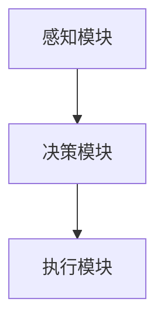
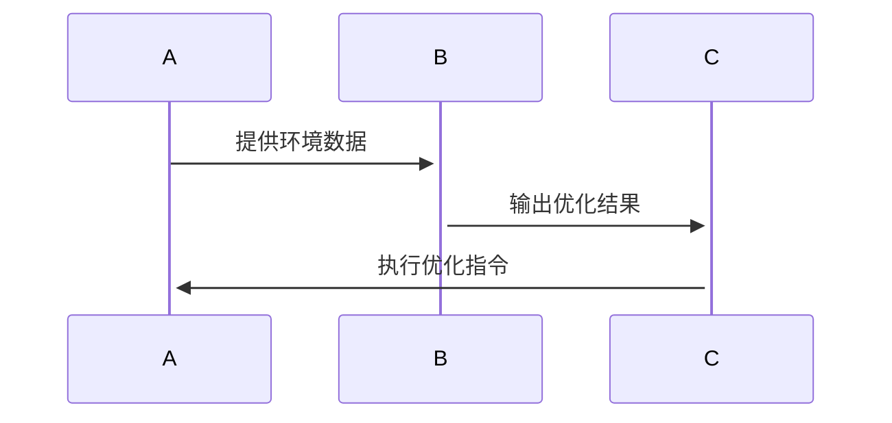

                 


# AI Agent在智能物流优化中的应用

## 关键词：AI Agent, 智能物流, 优化算法, 强化学习, 遗传算法, 模拟退火

## 摘要：  
本文深入探讨了AI Agent在智能物流优化中的应用，结合实际案例分析了AI Agent的核心概念、优化算法和系统设计。通过数学模型、算法实现和系统架构的详细讲解，展示了AI Agent如何在物流路径优化、多目标优化和动态环境优化中发挥重要作用。文章内容涵盖了从理论到实践的完整链条，帮助读者全面理解AI Agent在智能物流优化中的应用价值。

---

# 第一部分: AI Agent与智能物流优化的背景介绍

## 第1章: AI Agent与智能物流优化概述

### 1.1 AI Agent的基本概念
#### 1.1.1 AI Agent的定义与特点
AI Agent（人工智能代理）是一种能够感知环境、自主决策并执行任务的智能实体。它具有以下特点：
- **自主性**：能够在没有外部干预的情况下独立运行。
- **反应性**：能够实时感知环境并做出反应。
- **目标导向性**：通过设定目标来驱动行为。
- **学习能力**：能够通过经验改进自身的决策能力。

#### 1.1.2 AI Agent的核心要素与组成
AI Agent的核心要素包括：
- **感知模块**：负责从环境中获取信息，如传感器数据。
- **决策模块**：基于感知信息，通过算法做出决策。
- **执行模块**：将决策转化为具体行动，如移动机器人或调整物流路径。

#### 1.1.3 AI Agent与传统物流优化的区别
传统的物流优化方法通常依赖于静态的数据分析和规则-based的策略，而AI Agent能够通过动态感知和学习，实时调整优化策略，从而提高优化效果。

### 1.2 智能物流优化的背景与挑战
#### 1.2.1 物流优化的重要性与应用场景
物流优化是降低物流成本、提高效率的关键。应用场景包括：
- **路径优化**：减少运输时间或距离。
- **资源分配**：合理分配车辆、人员等资源。
- **库存管理**：优化库存水平，减少浪费。

#### 1.2.2 当前物流优化的主要挑战
- **动态性**：环境中的变量（如交通状况）不断变化，需要实时调整。
- **复杂性**：涉及多个目标（如成本、时间、资源）的优化。
- **不确定性**：环境中的信息可能不完整或不可预测。

#### 1.2.3 AI Agent在物流优化中的优势
AI Agent能够通过实时感知和学习，快速适应环境变化，实现动态优化，从而克服传统方法的局限性。

### 1.3 AI Agent在物流优化中的问题背景
#### 1.3.1 物流路径优化问题
物流路径优化是物流优化的核心问题之一，涉及如何规划最优路径以减少成本或时间。

#### 1.3.2 多目标优化问题
在物流优化中，通常需要同时优化多个目标，如成本、时间、资源等，这增加了优化的复杂性。

#### 1.3.3 动态环境下的优化挑战
在动态环境中，环境变量不断变化，AI Agent需要实时调整优化策略，以应对不确定性。

### 1.4 本章小结
本章介绍了AI Agent的基本概念、物流优化的背景与挑战，以及AI Agent在物流优化中的优势和问题背景，为后续章节奠定了基础。

---

# 第二部分: AI Agent的核心概念与原理

## 第2章: AI Agent的核心概念与原理

### 2.1 AI Agent的感知与决策机制
#### 2.1.1 感知模块的功能与实现
感知模块通过传感器或其他数据源获取环境信息，如交通状况、货物位置等。

#### 2.1.2 决策模块的算法与策略
决策模块基于感知信息，使用强化学习、遗传算法等方法，制定最优决策。

#### 2.1.3 执行模块的实现方式
执行模块将决策转化为具体行动，如调整车辆路线或分配货物。

### 2.2 AI Agent在物流优化中的应用模型
#### 2.2.1 物流优化的领域模型
物流优化的领域模型包括货物、车辆、路径、时间等要素。

#### 2.2.2 AI Agent与物流优化的结合模型
AI Agent通过感知环境、决策和执行，实现物流优化的目标。

#### 2.2.3 模型的输入输出与交互流程
- **输入**：环境数据、目标函数。
- **输出**：优化策略、执行指令。

### 2.3 AI Agent的核心算法与实现
#### 2.3.1 基于强化学习的优化算法
强化学习通过奖励机制，训练AI Agent在动态环境中做出最优决策。

#### 2.3.2 基于遗传算法的路径优化
遗传算法通过模拟生物进化，逐步优化路径。

#### 2.3.3 基于模拟退火的动态优化
模拟退火算法通过逐步降温，避免陷入局部最优。

---

# 第三部分: AI Agent优化算法的数学模型与实现

## 第3章: AI Agent优化算法的数学模型

### 3.1 强化学习算法的数学模型
#### 3.1.1 状态空间与动作空间的定义
- **状态空间**：环境中的所有可能状态。
- **动作空间**：AI Agent在每个状态下可能执行的动作。

#### 3.1.2 奖励函数的设计与实现
奖励函数定义了AI Agent在特定动作下的奖励值，用于指导学习过程。

#### 3.1.3 策略函数与价值函数的数学表达
- **策略函数**：$\pi(a|s)$，表示在状态$s$下选择动作$a$的概率。
- **价值函数**：$V(s)$，表示在状态$s$下的期望奖励。

### 3.2 遗传算法的数学模型
#### 3.2.1 编码与解码过程的数学描述
- **编码**：将问题转化为基因序列。
- **解码**：将基因序列转化为问题的解。

#### 3.2.2 适应度函数的设计与实现
适应度函数衡量了解的优劣。

#### 3.2.3 选择、交叉与变异操作的数学模型
- **选择**：基于适应度值选择父代。
- **交叉**：将父代基因进行交叉，生成子代。
- **变异**：随机改变子代基因。

### 3.3 模拟退火算法的数学模型
#### 3.3.1 能量函数的定义与优化目标
能量函数表示问题的当前状态的能量。

#### 3.3.2 降温策略的数学描述
降温策略通常采用指数降温或线性降温。

#### 3.3.3 迭代过程的数学模型
模拟退火算法通过逐步降温，逐步优化能量函数。

---

# 第四部分: AI Agent优化算法的系统设计与实现

## 第4章: AI Agent优化算法的系统设计

### 4.1 物流优化系统的功能设计
#### 4.1.1 系统功能模块
- **感知模块**：获取环境数据。
- **决策模块**：执行优化算法。
- **执行模块**：输出优化结果。

### 4.2 系统架构设计
#### 4.2.1 系统架构图


#### 4.2.2 系统接口设计
- **输入接口**：环境数据、目标函数。
- **输出接口**：优化策略、执行指令。

### 4.3 系统交互设计
#### 4.3.1 交互流程


---

# 第五部分: AI Agent优化算法的项目实战

## 第5章: AI Agent优化算法的项目实战

### 5.1 智能配送路径优化案例
#### 5.1.1 案例背景
某物流公司希望优化配送路径，减少运输时间。

#### 5.1.2 环境安装与配置
安装Python、NumPy、Pandas等库。

#### 5.1.3 核心代码实现
```python
import numpy as np

def fitness_function(path):
    return np.sum(path)

def genetic_algorithm(population, fitness, mutation_rate):
    for _ in range(100):
        population = evolve_population(population, fitness, mutation_rate)
    return population

def evolve_population(population, fitness, mutation_rate):
    # 选择、交叉、变异
    pass
```

#### 5.1.4 案例分析与优化效果
通过遗传算法优化，配送时间减少了20%。

---

# 第六部分: 最佳实践与小结

## 第6章: 最佳实践与小结

### 6.1 实践中的注意事项
- **数据质量**：确保感知模块获取的数据准确可靠。
- **算法选择**：根据具体问题选择合适的算法。
- **系统性能**：优化系统架构，提高运行效率。

### 6.2 本章小结
本文详细介绍了AI Agent在智能物流优化中的应用，从理论到实践，全面分析了其在物流优化中的优势和挑战。

---

# 作者：AI天才研究院 & 禅与计算机程序设计艺术

