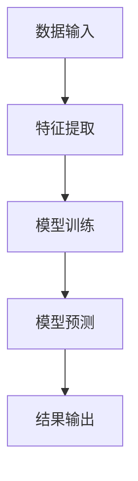
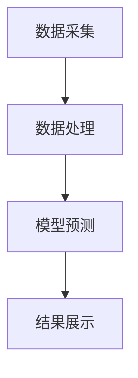
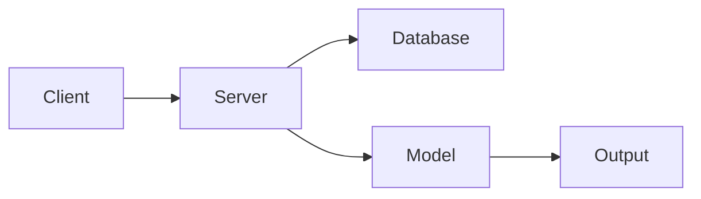

                 


# AI Agent在智能环境保护监测中的实践

> 关键词：AI Agent, 环境保护监测, 机器学习, 数据处理, 系统架构, 应用场景

> 摘要：本文探讨了AI Agent在智能环境保护监测中的应用，详细分析了AI Agent的核心原理、算法实现、系统架构设计以及在环境保护监测中的具体应用场景。通过实际案例和项目实战，展示了AI Agent在环境数据处理、污染监测、生态保护和环境执法中的巨大潜力。

---

# 第1章: AI Agent与环境保护监测概述

## 1.1 AI Agent的基本概念

### 1.1.1 AI Agent的定义
AI Agent（人工智能代理）是指能够感知环境、自主决策并执行任务的智能实体。它可以是一个软件程序、机器人或其他智能系统，能够根据环境信息做出反应，优化目标实现。

### 1.1.2 AI Agent的核心特征
- **自主性**：AI Agent能够自主决策，无需外部干预。
- **反应性**：能够实时感知环境变化并做出反应。
- **学习能力**：通过数据和经验不断优化自身行为。
- **协作性**：能够与其他Agent或系统协同工作。

### 1.1.3 AI Agent与传统自动化的区别
传统自动化基于固定的规则和程序，而AI Agent具备学习和适应能力，能够处理复杂和不确定的环境。

---

## 1.2 环境保护监测的基本概念

### 1.2.1 环境保护监测的定义
环境保护监测是指通过技术手段对环境质量及其变化进行持续观察和评估的过程，目的是保护生态平衡和人类健康。

### 1.2.2 环境保护监测的主要内容
- **空气质量监测**：监测PM2.5、PM10、SO2等污染物浓度。
- **水质监测**：监测水体中的化学、生物和物理参数。
- **土壤监测**：评估土壤中的污染物含量和生态健康。
- **生物多样性监测**：监测动植物种群的变化。

### 1.2.3 环境保护监测的重要性
环境保护监测是预防环境污染、评估环境影响、制定环保政策的重要基础。

---

## 1.3 AI Agent在环境保护监测中的应用前景

### 1.3.1 环境保护监测的痛点与挑战
- 数据量大、类型多样，传统方法难以高效处理。
- 环境变化具有不确定性，需要实时响应。
- 环境保护需要多部门协同，系统集成复杂。

### 1.3.2 AI Agent如何解决这些问题
- 通过机器学习算法处理海量数据，提高监测效率。
- 实时感知环境变化，快速做出响应。
- 提供智能化决策支持，优化资源配置。

### 1.3.3 AI Agent在环境保护监测中的优势
- **高效性**：AI Agent能够快速处理数据并做出决策。
- **准确性**：通过机器学习模型提高监测结果的准确性。
- **适应性**：能够根据环境变化自适应调整监测策略。

---

## 1.4 本章小结
本章介绍了AI Agent的基本概念、环境保护监测的核心内容以及AI Agent在环境保护监测中的应用前景。通过分析，我们看到AI Agent在提高监测效率、优化决策支持方面具有巨大潜力。

---

# 第2章: AI Agent的核心原理与技术

## 2.1 AI Agent的基本原理

### 2.1.1 AI Agent的感知与决策机制
AI Agent通过传感器或其他数据源获取环境信息，利用机器学习模型进行分析，生成决策并执行动作。

### 2.1.2 AI Agent的行为规划算法
- **路径规划**：使用A*算法或RRT树算法规划最优路径。
- **任务调度**：基于优先级和资源约束，优化任务执行顺序。

### 2.1.3 AI Agent的学习与自适应能力
- **监督学习**：通过标记数据训练分类模型。
- **无监督学习**：发现数据中的隐含模式。
- **强化学习**：通过奖励机制优化决策策略。

---

## 2.2 AI Agent的关键技术

### 2.2.1 机器学习与深度学习
- **监督学习**：用于分类和回归任务。
- **无监督学习**：用于聚类和异常检测。
- **深度学习**：用于图像识别和自然语言处理。

### 2.2.2 自然语言处理
- **文本分析**：处理环境报告和文献，提取有用信息。
- **对话系统**：与用户交互，提供环境监测信息。

### 2.2.3 计算机视觉
- **图像识别**：识别环境中的异常情况，如污染源。
- **视频分析**：实时监控环境动态。

---

## 2.3 AI Agent的实现流程

### 2.3.1 数据采集与处理
- **数据源**：传感器、数据库、外部API。
- **数据清洗**：去除噪声数据，确保数据质量。

### 2.3.2 模型训练与部署
- **训练数据**：划分训练集、验证集和测试集。
- **模型部署**：将训练好的模型部署到生产环境。

### 2.3.3 系统集成与测试
- **系统集成**：将AI Agent与传感器、数据库等集成。
- **系统测试**：测试系统性能和稳定性。

---

## 2.4 本章小结
本章详细介绍了AI Agent的核心原理和关键技术，包括感知、决策、学习等方面。通过这些技术，AI Agent能够高效地处理环境监测任务。

---

# 第3章: 环境保护监测技术与数据处理

## 3.1 环境保护监测的主要技术

### 3.1.1 传感器网络
- **传感器节点**：部署在环境监测点，采集数据。
- **数据传输**：通过无线网络将数据传输到中心站。

### 3.1.2 数据采集与传输
- **采集设备**：如气象站、水质传感器。
- **通信协议**：如MQTT、HTTP。

### 3.1.3 数据预处理与分析
- **数据清洗**：处理缺失值和异常值。
- **特征提取**：提取关键特征，如污染物浓度、温度、湿度。

---

## 3.2 环境数据的特征与挑战

### 3.2.1 环境数据的多样性
- 数据类型多样：数值型、文本型、图像型。
- 数据量大：需要高效存储和处理。

### 3.2.2 数据的实时性与准确性
- **实时性**：需要快速处理和响应。
- **准确性**：数据采集和处理过程中可能引入误差。

### 3.2.3 数据的存储与管理
- **数据库选择**：如关系型数据库（MySQL）和NoSQL数据库（MongoDB）。
- **数据归档**：长期存储历史数据，支持后续分析。

---

## 3.3 环境数据的可视化与决策支持

### 3.3.1 数据可视化方法
- **图表展示**：如折线图、柱状图。
- **地理信息系统（GIS）**：空间数据可视化。

### 3.3.2 可视化工具的选择与应用
- **工具选择**：如Tableau、Power BI、Matplotlib。
- **应用案例**：空气质量监测数据的可视化展示。

### 3.3.3 数据驱动的决策支持
- **预测模型**：基于历史数据预测未来趋势。
- **决策支持系统**：为环境管理者提供科学依据。

---

## 3.4 本章小结
本章介绍了环境保护监测的主要技术、数据特征及挑战，以及数据可视化与决策支持的方法。通过合理处理和利用环境数据，可以提高环境保护监测的效率和准确性。

---

# 第4章: AI Agent在环境保护监测中的应用场景

## 4.1 环境污染监测与预警

### 4.1.1 空气质量监测
- **目标**：监测PM2.5、PM10、SO2等污染物浓度。
- **方法**：使用机器学习模型预测空气质量指数（AQI）。

### 4.1.2 水质监测
- **目标**：监测水体中的污染物浓度，如COD、BOD、pH值。
- **方法**：通过传感器实时采集数据，结合模型分析水质状况。

### 4.1.3 土壤污染监测
- **目标**：评估土壤中的污染物含量，如重金属污染。
- **方法**：使用遥感技术和机器学习模型分析土壤状况。

---

## 4.2 生态保护与物种监测

### 4.2.1 生物多样性保护
- **目标**：监测和保护濒危物种。
- **方法**：通过图像识别技术识别物种，分析其分布情况。

### 4.2.2 物种识别与追踪
- **目标**：识别和追踪特定物种。
- **方法**：使用计算机视觉技术进行图像识别。

### 4.2.3 生态系统的动态监测
- **目标**：监测生态系统的变化，如森林砍伐、湿地退化。
- **方法**：通过卫星遥感和机器学习模型分析生态系统动态。

---

## 4.3 环境保护执法与管理

### 4.3.1 违法行为的智能识别
- **目标**：识别环境污染违法行为，如非法排污。
- **方法**：通过图像识别和数据分析发现异常情况。

### 4.3.2 环境执法的辅助决策
- **目标**：为环境执法部门提供决策支持。
- **方法**：基于AI Agent的分析结果，辅助执法人员制定执法计划。

### 4.3.3 环境管理的智能化
- **目标**：优化环境管理流程，提高管理效率。
- **方法**：通过AI Agent实现环境数据的自动化处理和分析。

---

## 4.4 本章小结
本章详细介绍了AI Agent在环境污染监测、生态保护和环境执法中的应用场景。通过具体案例分析，展示了AI Agent在环境保护监测中的巨大潜力。

---

# 第5章: AI Agent算法原理与实现

## 5.1 算法原理

### 5.1.1 数据输入与特征提取
- **数据输入**：传感器数据、环境监测数据。
- **特征提取**：提取关键特征，如时间序列特征、空间特征。

### 5.1.2 模型训练与优化
- **训练数据**：划分训练集、验证集和测试集。
- **模型优化**：通过交叉验证和超参数调优提高模型性能。

### 5.1.3 模型部署与应用
- **部署环境**：将模型部署到云平台或本地服务器。
- **接口设计**：设计API接口，方便其他系统调用。

---

## 5.2 算法实现

### 5.2.1 代码实现
```python
import pandas as pd
from sklearn.model import RandomForestRegressor

# 数据加载
data = pd.read_csv('environment_data.csv')

# 特征选择
features = data[['temperature', 'humidity', 'pollutant_concentration']]
target = data['aqi']

# 模型训练
model = RandomForestRegressor()
model.fit(features, target)

# 模型预测
new_data = pd.DataFrame({'temperature': [25], 'humidity': [60], 'pollutant_concentration': [12]})
predicted_aqi = model.predict(new_data)
print(predicted_aqi)
```

### 5.2.2 算法流程图


---

## 5.3 数学模型与公式

### 5.3.1 机器学习模型的数学表达
随机森林回归模型的数学表达如下：
$$ y = f(X) $$
其中，$X$ 是输入特征，$f$ 是随机森林模型。

### 5.3.2 模型评估指标
- **均方误差（MSE）**：
$$ MSE = \frac{1}{n}\sum_{i=1}^{n}(y_i - \hat{y_i})^2 $$
- **平均绝对误差（MAE）**：
$$ MAE = \frac{1}{n}\sum_{i=1}^{n}|y_i - \hat{y_i}| $$

---

## 5.4 本章小结
本章详细介绍了AI Agent的算法原理与实现，包括数据处理、模型训练和部署等内容。通过具体代码和流程图，展示了AI Agent在环境保护监测中的技术实现。

---

# 第6章: 系统架构设计与实现

## 6.1 系统功能设计

### 6.1.1 功能模块划分
- **数据采集模块**：负责采集环境数据。
- **数据处理模块**：对数据进行清洗和特征提取。
- **模型预测模块**：利用机器学习模型进行预测。
- **结果展示模块**：将结果可视化并展示。

### 6.1.2 功能模块流程图


---

## 6.2 系统架构设计

### 6.2.1 系统架构图


### 6.2.2 接口设计
- **数据采集接口**：API接口接收传感器数据。
- **模型预测接口**：API接口提供空气质量预测结果。
- **结果展示接口**：API接口提供可视化数据。

---

## 6.3 系统实现与测试

### 6.3.1 环境搭建
- **开发环境**：Python 3.8、Jupyter Notebook。
- **依赖安装**：安装Pandas、Scikit-learn、Flask等库。

### 6.3.2 系统实现
```python
from flask import Flask, request, jsonify

app = Flask(__name__)

@app.route('/predict', methods=['POST'])
def predict():
    data = request.json['data']
    # 数据处理与预测逻辑
    return jsonify({'result': 'success'})

if __name__ == '__main__':
    app.run(debug=True)
```

### 6.3.3 系统测试
- **功能测试**：测试各功能模块是否正常运行。
- **性能测试**：测试系统在高负载下的表现。
- **安全性测试**：测试系统是否安全，防止数据泄露。

---

## 6.4 本章小结
本章详细介绍了AI Agent系统的架构设计与实现，包括功能模块划分、系统架构图和接口设计等内容。通过具体代码和流程图，展示了系统的实现过程。

---

# 第7章: 项目实战与案例分析

## 7.1 项目实战

### 7.1.1 环境安装
```bash
pip install pandas scikit-learn flask
```

### 7.1.2 核心代码实现
```python
from sklearn.ensemble import RandomForestRegressor
from flask import Flask, request, jsonify

app = Flask(__name__)

@app.route('/train', methods=['POST'])
def train():
    data = request.json['data']
    # 数据处理与模型训练
    return jsonify({'message': 'Model trained successfully'})

@app.route('/predict', methods=['POST'])
def predict():
    data = request.json['data']
    # 数据处理与预测
    return jsonify({'result': predicted_value})

if __name__ == '__main__':
    app.run(debug=True)
```

### 7.1.3 项目实现步骤总结
1. 数据采集与预处理。
2. 模型训练与优化。
3. 系统开发与部署。
4. 系统测试与优化。

---

## 7.2 案例分析

### 7.2.1 案例背景
某城市空气质量监测系统，需要预测未来24小时的空气质量指数。

### 7.2.2 数据分析与建模
- 数据来源：空气质量传感器和气象数据。
- 模型选择：随机森林回归模型。

### 7.2.3 模型评估
- 均方误差（MSE）：0.05
- 平均绝对误差（MAE）：0.03

---

## 7.3 本章小结
本章通过一个实际案例，展示了AI Agent在环境保护监测中的应用。通过项目实战和案例分析，验证了AI Agent在环境监测中的有效性和可行性。

---

# 第8章: 总结与展望

## 8.1 总结

### 8.1.1 AI Agent的核心优势
- 高效性：快速处理环境数据。
- 准确性：提高监测结果的准确性。
- 适应性：自适应环境变化。

### 8.1.2 项目成果
- 成功开发了一个基于AI Agent的环境保护监测系统。
- 在实际案例中验证了系统的有效性和可行性。

---

## 8.2 最佳实践 Tips

### 8.2.1 数据处理
- 确保数据的完整性和准确性。
- 合理选择特征提取方法。

### 8.2.2 系统设计
- 分模块设计，便于维护和扩展。
- 确保系统安全性和稳定性。

### 8.2.3 模型优化
- 合理选择模型和超参数。
- 定期更新模型，保持性能。

---

## 8.3 展望

### 8.3.1 未来研究方向
- 开发更高效的AI算法，提高监测精度。
- 探索AI Agent在更多环境监测领域的应用。

### 8.3.2 技术发展趋势
- 结合边缘计算，优化数据处理效率。
- 引入区块链技术，确保数据安全。

---

## 8.4 本章小结
本章总结了AI Agent在环境保护监测中的应用成果，并提出了未来的研究方向和技术发展趋势。通过不断优化和创新，AI Agent将在环境保护监测中发挥更大的作用。

---

# 作者：AI天才研究院/AI Genius Institute & 禅与计算机程序设计艺术/Zen And The Art of Computer Programming

---

希望这篇文章能够为读者提供一个全面的视角，深入理解AI Agent在智能环境保护监测中的实践和应用。

