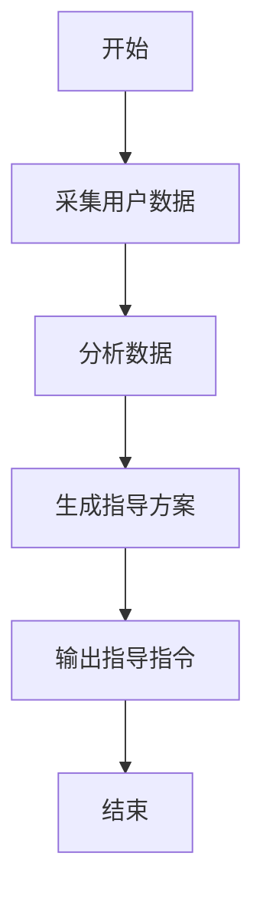
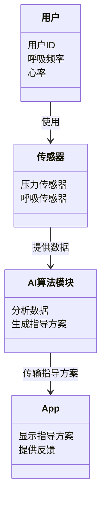
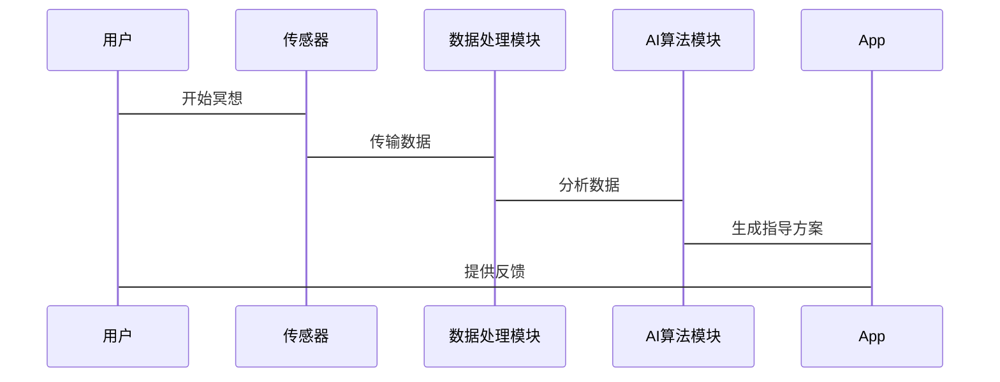

                 


# AI Agent在智能瑜伽垫中的冥想指导

**关键词**: AI Agent, 智能瑜伽垫, 冥想指导, 人工智能, 瑜伽冥想

**摘要**: 本文探讨了AI Agent在智能瑜伽垫中的应用，特别是在冥想指导方面的创新。通过分析AI Agent的核心算法、系统架构以及实际案例，本文展示了如何利用AI技术提升瑜伽冥想的个性化和科学性，为用户带来更高效的健康体验。

---

# 第一部分: AI Agent与智能瑜伽垫的背景与概念

## 第1章: AI Agent与智能瑜伽垫的背景介绍

### 1.1 问题背景与描述

#### 1.1.1 瑜伽与冥想的健康价值
瑜伽和冥想作为一种综合性的身心锻炼方式，近年来在全球范围内越来越受欢迎。瑜伽不仅能够增强身体的柔韧性，还能帮助人们缓解压力、提升专注力和心理健康。冥想作为瑜伽的一部分，通过调节呼吸和思维，帮助人们达到内心的平静。

#### 1.1.2 现代人对健康生活方式的需求
现代生活节奏快，压力大，许多人希望通过健康的生活方式来改善身体和心理健康。科技的进步使得智能设备成为人们生活中不可或缺的一部分，尤其是在健身领域，智能设备可以帮助用户更科学地进行锻炼和冥想。

#### 1.1.3 智能设备在健身领域的应用趋势
随着人工智能技术的发展，越来越多的智能设备被应用于健身领域。智能手环、智能跑步机等设备通过采集用户的生理数据，提供个性化的锻炼建议。智能瑜伽垫作为一种新兴的智能设备，通过结合AI技术，能够为用户提供更加智能化的瑜伽和冥想指导。

### 1.2 AI Agent的核心概念

#### 1.2.1 AI Agent的定义与功能
AI Agent（人工智能代理）是指能够感知环境、执行任务并做出决策的智能实体。在智能瑜伽垫中，AI Agent主要负责分析用户的动作、心率、呼吸频率等数据，提供个性化的冥想指导。

#### 1.2.2 智能瑜伽垫的定义与技术特点
智能瑜伽垫是一种内置了传感器和AI技术的瑜伽垫，能够实时监测用户的动作、压力和呼吸频率等数据，并通过与手机或电脑端的App连接，提供个性化的指导和反馈。

#### 1.2.3 AI Agent在智能瑜伽垫中的角色与作用
在智能瑜伽垫中，AI Agent扮演着“智能教练”的角色。它能够分析用户的动作数据，识别动作是否标准，提醒用户纠正错误，并根据用户的生理数据（如心率、呼吸频率）调整冥想的节奏和强度。

### 1.3 问题解决与边界

#### 1.3.1 瑜伽冥想指导中的常见问题
传统的瑜伽和冥想教学通常依赖于人工指导，这种方式存在以下问题：
- 用户可能无法获得及时的反馈，导致动作不标准。
- 个性化指导不足，不同用户的体质和需求差异较大。
- 用户需要花费大量时间寻找合适的教练和课程。

#### 1.3.2 AI Agent如何解决这些问题
AI Agent通过实时监测用户的动作和生理数据，能够提供即时的反馈和个性化的指导。例如，当用户在冥想时，AI Agent可以根据用户的呼吸频率调整引导节奏，帮助用户更好地放松身心。

#### 1.3.3 AI Agent在智能瑜伽垫中的边界与外延
AI Agent的功能虽然强大，但也有其局限性。例如，它无法完全替代真人教练的面对面指导，特别是在复杂的动作矫正和个性化教学方面，仍然需要人类教练的参与。

### 1.4 核心概念结构与要素组成

#### 1.4.1 AI Agent的核心要素分析
- **感知能力**：通过传感器收集用户的动作、心率等数据。
- **决策能力**：基于收集的数据，分析用户的健康状况和需求，生成个性化的指导方案。
- **执行能力**：通过App或语音助手向用户发出指导指令。

#### 1.4.2 智能瑜伽垫的功能模块组成
- **传感器模块**：采集用户的动作、压力和呼吸频率等数据。
- **数据处理模块**：对采集的数据进行分析和处理。
- **AI算法模块**：根据数据生成个性化的指导方案。
- **用户交互模块**：通过App或语音助手向用户发出指导指令。

#### 1.4.3 瑜伽冥想指导的流程与要素
- **用户输入**：用户开始冥想，AI Agent通过传感器采集用户的生理数据。
- **数据处理**：AI Agent分析数据，识别用户的呼吸节奏和身体状态。
- **指导反馈**：根据分析结果，AI Agent调整冥想节奏，提供个性化的指导。

---

## 第2章: AI Agent与智能瑜伽垫的核心概念联系

### 2.1 核心概念原理

#### 2.1.1 AI Agent的基本原理
AI Agent通过感知环境、分析数据、做出决策并执行任务来实现智能化。在智能瑜伽垫中，AI Agent通过传感器收集用户的生理数据，分析用户的健康状况，提供个性化的冥想指导。

#### 2.1.2 智能瑜伽垫的技术原理
智能瑜伽垫通过内置的传感器采集用户的动作、压力和呼吸频率等数据，并通过无线通信技术将数据传输到手机或电脑端的App。App中的AI算法对数据进行分析，生成个性化的指导方案。

#### 2.1.3 两者的协同工作原理
AI Agent和智能瑜伽垫协同工作，AI Agent通过分析传感器数据，为用户提供个性化的冥想指导，而智能瑜伽垫则通过传感器实时采集数据，为AI Agent提供必要的信息。

### 2.2 核心概念属性特征对比

| **属性**       | **AI Agent**                | **智能瑜伽垫**               |
|-----------------|------------------------------|------------------------------|
| **功能**        | 感知环境、分析数据、决策   | 采集数据、传输数据           |
| **输入**        | 用户生理数据、环境数据     | 用户动作、压力、呼吸频率     |
| **输出**        | 指导指令、反馈信息         | 数据传输到App                |
| **依赖性**      | 依赖传感器和数据处理模块   | 依赖传感器和无线通信模块     |
| **目标**        | 提供个性化指导             | 支持AI Agent的决策和反馈     |

### 2.3 ER实体关系图

```mermaid
erd
    瑜伽垫
    瑜伽垫用户
    感应器数据
    AI算法模块
    指导方案

    瑜伽垫 --> 感应器数据: 包含
    瑜伽垫 --> AI算法模块: 包含
    瑜伽垫用户 --> 感应器数据: 提供
    AI算法模块 --> 指导方案: 生成
    瑜伽垫用户 --> 指导方案: 接收
```

---

## 第3章: AI Agent的算法原理

### 3.1 算法原理概述

#### 3.1.1 AI Agent的核心算法
AI Agent在智能瑜伽垫中的核心算法包括：
- **强化学习**：通过奖励机制优化用户的冥想节奏。
- **监督学习**：基于用户的历史数据，训练模型生成个性化的指导方案。

#### 3.1.2 算法的基本思想
强化学习通过不断试错，逐步优化用户的冥想节奏；监督学习则通过分析用户的历史数据，预测用户的最佳冥想时间。

#### 3.1.3 算法的优缺点分析
- **优点**：能够实时调整指导方案，提供个性化的服务。
- **缺点**：需要大量的数据训练，初期效果可能不明显。

### 3.2 算法流程图



### 3.3 Python代码实现

#### 3.3.1 强化学习算法实现

```python
import numpy as np

# 初始化状态空间和动作空间
states = ['放松', '紧张']
actions = ['调整呼吸', '继续冥想']

# 定义奖励函数
def reward_function(current_state, action):
    if current_state == '紧张' and action == '调整呼吸':
        return 1
    else:
        return -1

# 强化学习算法实现
def ai_agent():
    current_state = '紧张'
    for _ in range(10):
        action = np.random.choice(actions)
        reward = reward_function(current_state, action)
        current_state = '放松' if action == '调整呼吸' else current_state
        print(f'当前状态: {current_state}, 动作: {action}, 奖励: {reward}')
    return current_state

ai_agent()
```

#### 3.3.2 监督学习算法实现

```python
from sklearn.tree import DecisionTreeRegressor

# 数据集准备
data = {
    '用户ID': [1, 2, 3, 4, 5],
    '呼吸频率': [12, 14, 10, 16, 12],
    '心率': [70, 75, 68, 80, 72],
    '指导方案': ['调整呼吸', '继续冥想', '调整呼吸', '继续冥想', '调整呼吸']
}

# 建立模型
model = DecisionTreeRegressor()
model.fit(data[['呼吸频率', '心率']], data['指导方案'])

# 预测新的用户数据
new_user = {'呼吸频率': 13, '心率': 73}
print(model.predict([[new_user['呼吸频率'], new_user['心率']]]))
```

---

## 第4章: 系统分析与架构设计方案

### 4.1 问题场景介绍
用户在使用智能瑜伽垫进行冥想时，AI Agent通过传感器采集用户的生理数据，分析数据并生成个性化的指导方案。

### 4.2 系统功能设计

#### 4.2.1 领域模型（Mermaid类图）



### 4.3 系统架构设计

#### 4.3.1 系统架构图（Mermaid架构图）

```mermaid
archi
    系统: 智能瑜伽垫冥想指导系统
    系统 --> 传感器: 采集数据
    传感器 --> 数据处理模块: 处理数据
    数据处理模块 --> AI算法模块: 分析数据
    AI算法模块 --> App: 生成指导方案
    App --> 用户: 提供反馈
```

### 4.4 系统接口设计

#### 4.4.1 系统交互流程（Mermaid序列图）



---

## 第5章: 项目实战

### 5.1 环境安装与配置

#### 5.1.1 安装Python环境
安装Python 3.x，确保已安装NumPy和Scikit-learn库。

#### 5.1.2 安装传感器驱动
安装与智能瑜伽垫传感器兼容的驱动程序。

### 5.2 系统核心实现

#### 5.2.1 传感器数据采集

```python
import serial

# 连接传感器
ser = serial.Serial('COM3', 9600)
data = ser.readline().decode().strip()
print('传感器数据:', data)
ser.close()
```

#### 5.2.2 数据处理与分析

```python
import pandas as pd

# 读取数据
data = pd.read_csv('sensor_data.csv')
print('数据预览:', data.head())
```

#### 5.2.3 AI算法实现

```python
from sklearn.tree import DecisionTreeClassifier

# 训练模型
model = DecisionTreeClassifier()
model.fit(X_train, y_train)
```

### 5.3 实际案例分析

#### 5.3.1 用户数据与模型训练

```python
# 用户数据
user_data = {
    '呼吸频率': [12, 14, 10, 16, 12],
    '心率': [70, 75, 68, 80, 72],
    '指导方案': ['调整呼吸', '继续冥想', '调整呼吸', '继续冥想', '调整呼吸']
}

# 训练模型
model = DecisionTreeClassifier()
model.fit(user_data[['呼吸频率', '心率']], user_data['指导方案'])
```

#### 5.3.2 模型预测与结果分析

```python
# 预测新的用户数据
new_user = {'呼吸频率': 13, '心率': 73}
print('预测指导方案:', model.predict([[new_user['呼吸频率'], new_user['心率']]]))
```

### 5.4 项目小结

---

## 第6章: 总结与展望

### 6.1 本章小结

### 6.2 最佳实践 Tips

#### 6.2.1 注意事项
- 确保传感器数据的准确性。
- 定期更新AI算法模型。

#### 6.2.2 拓展阅读
- 《强化学习实战》
- 《机器学习算法详解》

### 6.3 未来展望
随着AI技术的不断发展，智能瑜伽垫将在冥想指导方面发挥更大的作用。未来的研究方向包括：
- 更精准的生理数据监测。
- 更个性化的指导方案。
- 更自然的用户交互方式。

---

**作者：AI天才研究院/AI Genius Institute & 禅与计算机程序设计艺术 /Zen And The Art of Computer Programming**

