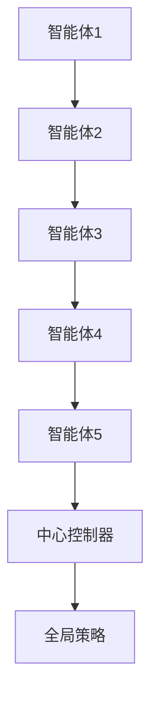
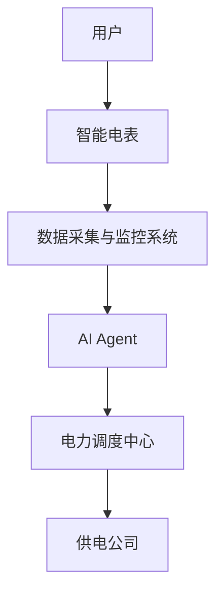

                 


# AI Agent在智能电力需求响应中的应用

> **关键词**：AI Agent, 智能电力, 需求响应, 强化学习, 多智能体系统

> **摘要**：  
本文探讨AI Agent在智能电力需求响应中的应用，分析其核心概念、算法原理及系统架构，结合实际案例，展示如何通过AI技术优化电力管理。文章内容涵盖背景介绍、技术原理、系统设计和项目实战，旨在为读者提供全面的技术指导和实践参考。

---

## 第1章：AI Agent与电力需求响应的背景

### 1.1 AI Agent的基本概念

AI Agent（人工智能代理）是指能够感知环境、自主决策并执行任务的智能体。它通过传感器获取信息，利用算法进行分析，并通过执行器采取行动。AI Agent广泛应用于自动驾驶、智能助手、机器人等领域，其核心特征包括自主性、反应性、目标导向和学习能力。

#### 1.1.1 AI Agent的定义与特点
- **定义**：AI Agent是一种智能系统，能够根据环境信息自主决策并执行任务。
- **特点**：
  - **自主性**：无需外部干预，自主完成任务。
  - **反应性**：实时感知环境变化并做出反应。
  - **目标导向**：以特定目标为导向，优化决策。
  - **学习能力**：通过数据和经验不断优化性能。

#### 1.1.2 AI Agent的分类与应用场景
- **分类**：
  - **简单反射型**：基于规则的反应式系统。
  - **基于模型的反应型**：利用内部模型进行决策。
  - **目标驱动型**：以目标为导向，优化行动路径。
  - **实用驱动型**：以效用函数为驱动，最大化效用。
- **应用场景**：
  - 智能电网
  - 自动驾驶
  - 智能助手

### 1.2 电力需求响应的背景

电力需求响应是指根据电网的实时状况，通过调整电力用户的用电行为，实现电力供需平衡的一种管理方式。随着智能电网的快速发展，电力需求响应在能源管理中的重要性日益凸显。

#### 1.2.1 电力需求响应的定义
电力需求响应是通过改变电力用户的用电模式，以适应电网的实时需求，优化电力资源的配置和使用。

#### 1.2.2 智能电网的发展与需求响应的重要性
智能电网通过集成先进的信息通信技术、数据分析技术，实现电力系统各环节的智能化管理。电力需求响应在智能电网中扮演着关键角色，能够有效降低电网的峰谷负荷，提高电力系统的稳定性和经济性。

#### 1.2.3 当前电力系统面临的挑战
- **电力供需不平衡**：负荷波动大，难以实时调节。
- **可再生能源的接入**：可再生能源的不稳定性增加了电网的管理难度。
- **用户用电行为的多样性**：用户用电需求复杂多样，难以统一协调。

### 1.3 问题背景与描述

电力系统在运行过程中面临着诸多挑战，其中之一便是如何高效、经济地管理电力需求，以适应电网的实时需求。传统的电力需求响应方式往往依赖于人工调度或简单的规则系统，难以应对复杂多变的电网环境。因此，如何利用先进的AI技术，构建智能化的电力需求响应系统，成为当前研究的热点。

#### 1.3.1 当前电力系统的需求响应挑战
- **实时性要求高**：电力需求响应需要实时响应电网的波动。
- **复杂性高**：电力系统涉及众多参与者，包括发电厂、供电公司、用户等，各方利益交织，协调难度大。
- **数据量大**：电力系统中涉及大量数据，包括负荷数据、气象数据、用户行为数据等，如何高效处理这些数据是一个挑战。

#### 1.3.2 问题解决思路
通过引入AI Agent技术，构建智能化的电力需求响应系统，实现对电力用户的智能化管理和调度。AI Agent能够实时感知电网状态，分析用户用电行为，并根据优化目标制定最优决策。

### 1.4 核心概念的组成

电力需求响应系统的核心组成部分包括：

- **电力系统**：包括发电厂、输电网、配电网等。
- **用户侧设备**：包括电力用户、智能家居设备等。
- **数据采集与监控系统（SCADA）**：实时采集电网数据，监控系统运行状态。
- **AI Agent**：通过分析数据，制定最优的电力调度策略。

---

## 第2章：AI Agent在电力需求响应中的核心概念

### 2.1 多智能体系统设计

多智能体系统是指由多个相互作用的智能体组成的系统，广泛应用于复杂任务的分布式协作。在电力需求响应中，多智能体系统能够协调不同用户的用电行为，实现整体优化。

#### 2.1.1 多智能体系统的定义与特点
- **定义**：由多个智能体组成的系统，智能体之间通过交互协作完成任务。
- **特点**：
  - **分布式性**：智能体分布在不同的位置，独立决策。
  - **协作性**：智能体之间通过通信和协作完成共同目标。
  - **动态性**：系统状态和环境动态变化。

#### 2.1.2 多智能体系统在电力需求响应中的应用
- **负荷分配**：通过多智能体协作，实现电力负荷的合理分配。
- **用户行为预测**：多个智能体分别预测不同用户的用电行为，综合分析制定调度策略。

### 2.2 强化学习在电力优化中的应用

强化学习是一种通过试错方式学习最优策略的算法，广泛应用于电力系统的优化调度。在电力需求响应中，强化学习能够帮助AI Agent制定最优的调度策略，以最小化成本或最大化收益。

#### 2.2.1 强化学习的基本原理
- **定义**：通过智能体与环境的交互，学习最优策略的过程。
- **基本组件**：
  - **状态（State）**：环境的当前情况。
  - **动作（Action）**：智能体采取的行动。
  - **奖励（Reward）**：智能体行为的评价指标。
  - **策略（Policy）**：智能体选择动作的规则。
  - **价值函数（Value Function）**：评估状态或动作的价值。

#### 2.2.2 强化学习在电力需求响应中的应用
- **负荷预测**：通过强化学习，预测用户的用电行为，制定最优的电力调度策略。
- **价格响应**：根据实时电价，优化用户的用电行为，降低电费支出。

---

## 第3章：强化学习算法原理

### 3.1 Q-learning算法

Q-learning是一种经典的强化学习算法，通过更新Q值表，学习最优策略。其核心思想是通过试错方式，找到每个状态-动作对的最优Q值。

#### 3.1.1 Q-learning算法的基本原理
- **算法流程**：
  1. 初始化Q值表，通常为零。
  2. 进入一个新状态。
  3. 根据当前状态选择一个动作。
  4. 执行动作，观察下一个状态，并获得奖励。
  5. 更新Q值表：Q(s,a) = Q(s,a) + α*(r + γ*max Q(s',a') - Q(s,a))。
  6. 重复上述步骤，直到达到终止条件。

- **公式**：
  $$ Q(s,a) = Q(s,a) + \alpha \times (r + \gamma \times \max Q(s',a') - Q(s,a)) $$

- **参数解释**：
  - α：学习率，控制更新步长。
  - γ：折扣因子，平衡当前奖励和未来奖励的重要性。

#### 3.1.2 Q-learning算法的实现步骤
1. 初始化Q值表。
2. 确定当前状态。
3. 根据策略选择动作。
4. 执行动作，观察新状态，并获得奖励。
5. 更新Q值表。
6. 重复上述步骤。

#### 3.1.3 Q-learning算法的优缺点
- **优点**：
  - 简单易实现。
  - 适用于离散状态和动作空间。
- **缺点**：
  - 在连续状态和动作空间中表现不佳。
  - 需要较大的训练样本。

#### 3.1.4 Q-learning算法的流程图（Mermaid）

```mermaid
graph TD
    A[初始化Q表] --> B[进入状态s]
    B --> C[选择动作a]
    C --> D[执行动作a，观察s'，获得奖励r]
    D --> E[更新Q(s,a) = Q(s,a) + α*(r + γ*max Q(s',a') - Q(s,a))]
    E --> F[结束？] --> G[继续循环]
```

### 3.2 多智能体强化学习

多智能体强化学习是强化学习在多智能体系统中的扩展，旨在通过多个智能体的协作，实现全局最优。

#### 3.2.1 多智能体强化学习的挑战与解决方案
- **挑战**：
  - **通信与协调**：智能体之间需要有效通信，协调行动。
  - **竞争与合作**：智能体之间可能存在竞争，需要平衡个体目标与全局目标。
- **解决方案**：
  - **分布式强化学习**：每个智能体独立学习，通过通信共享信息。
  - **集中式强化学习**：由中心控制器协调多个智能体的行动。

#### 3.2.2 多智能体强化学习的流程图（Mermaid）



---

## 第4章：系统设计与架构

### 4.1 系统架构设计

智能电力需求响应系统的架构设计需要考虑系统的实时性、可扩展性和可维护性。

#### 4.1.1 系统架构图（Mermaid）



---

## 第5章：项目实战

### 5.1 电力需求响应系统项目介绍

#### 5.1.1 项目背景
某城市供电公司希望通过引入AI Agent技术，优化电力需求响应系统，降低高峰负荷，提高电力系统的稳定性。

#### 5.1.2 项目目标
- 实现基于AI Agent的电力需求响应系统。
- 优化电力调度策略，降低电力成本。

#### 5.1.3 项目范围
- 系统设计与开发
- 算法实现与优化
- 测试与部署

---

## 作者：AI天才研究院/AI Genius Institute & 禅与计算机程序设计艺术 /Zen And The Art of Computer Programming

---

**注**：由于篇幅限制，以上仅为文章的部分内容。完整的文章将涵盖更多细节，包括数学公式、算法代码、系统设计图和实际案例分析。

