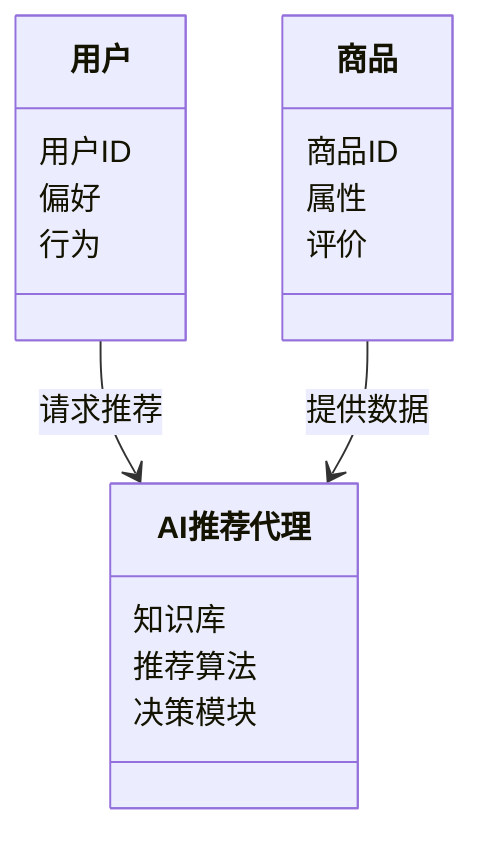
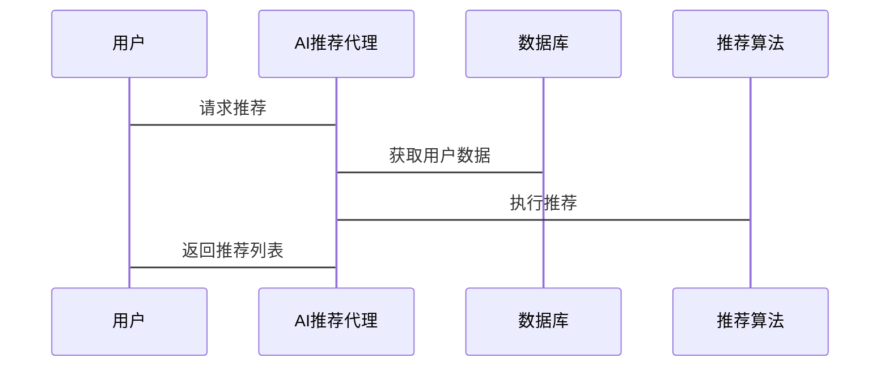

                 


# AI Agent在智能电子商务推荐中的角色

## 关键词：AI Agent, 智能推荐系统, 电子商务, 协同过滤, 混合推荐, 自然语言处理

## 摘要：AI Agent通过智能推荐系统在电子商务中扮演着重要角色，利用协同过滤、内容过滤和混合推荐算法，结合自然语言处理和动态决策机制，提升用户购物体验。本文详细探讨AI Agent的核心概念、算法原理、系统设计及项目实战，提供全面的技术分析。

---

## 第一部分: AI Agent在智能电子商务推荐中的背景与基础

### 第1章: AI Agent与智能推荐系统概述

#### 1.1 AI Agent的基本概念
- **AI Agent的定义与特点**
  - AI Agent是能够感知环境并采取行动以实现目标的智能体。
  - 具备自主性、反应性、目标导向和社会能力。

- **AI Agent在电子商务中的应用场景**
  - 个性化推荐
  - 用户行为分析
  - 自动化决策支持

- **智能推荐系统的发展历程**
  - 从基于规则的传统推荐到机器学习驱动的AI Agent推荐。

#### 1.2 智能推荐系统的分类与特点
- **协同过滤**
  - 基于用户相似性或商品相似性进行推荐。
  - 优点：捕捉用户偏好；缺点：冷启动问题。

- **内容过滤**
  - 基于商品属性或用户历史行为进行推荐。
  - 优点：内容准确性高；缺点：计算复杂度高。

- **混合推荐**
  - 结合协同过滤和内容过滤的优点，提升推荐效果。
  - 优点：鲁棒性强；缺点：实现复杂。

- **AI Agent在推荐系统中的角色**
  - 作为智能体，优化推荐过程，提升用户体验。

#### 1.3 本章小结
AI Agent通过智能推荐系统在电商中提供个性化服务，协同过滤和内容过滤是主要推荐方法，混合推荐结合两者优势。

---

## 第二部分: AI Agent的核心概念与原理

### 第2章: AI Agent的核心概念与联系

#### 2.1 AI Agent的核心原理
- **知识表示与推理**
  - 使用符号逻辑或概率模型表示知识，进行推理。

- **自然语言处理在推荐中的应用**
  - 分析用户评论和商品描述，提取语义信息。

- **动态决策机制**
  - 根据实时数据调整推荐策略。

#### 2.2 AI Agent与推荐系统的对比分析
- **AI Agent的优势**
  - 自适应性强，能处理动态变化。
  - 具备推理能力，提供更智能推荐。

- **传统推荐系统的局限性**
  - 难以处理实时数据和复杂场景。

- **AI Agent在推荐中的创新点**
  - 结合自然语言处理和动态决策，提升推荐精准度。

#### 2.3 AI Agent推荐系统的ER实体关系图
```mermaid
er
actor: 用户
agent: AI推荐代理
product: 商品
preference: 用户偏好
interaction: 用户与代理的交互
```

#### 2.4 本章小结
AI Agent通过知识表示、自然语言处理和动态决策，优化推荐系统，提供更智能的服务。

---

## 第三部分: AI Agent推荐系统的算法原理

### 第3章: 推荐系统的算法原理

#### 3.1 协同过滤算法
- **基于用户的协同过滤**
  - 计算用户相似度，推荐相似用户的商品。
  - 公式：$sim(u, v) = \frac{\sum_{i}(u_i - \bar{u})(v_i - \bar{v})}{\sqrt{\sum_{i}(u_i - \bar{u})^2} \cdot \sqrt{\sum_{i}(v_i - \bar{v})^2}}}$

- **基于物品的协同过滤**
  - 计算商品相似度，推荐相似商品。
  - 公式：$sim(i, j) = \frac{\sum_{u}(u_i - \bar{i})(u_j - \bar{j})}{\sqrt{\sum_{u}(u_i - \bar{i})^2} \cdot \sqrt{\sum_{u}(u_j - \bar{j})^2}}}$

- **混合协同过滤算法**
  - 综合用户和物品的相似度，平衡推荐结果。

- **协同过滤的优缺点**
  - 优点：捕捉用户偏好；缺点：冷启动问题。

#### 3.2 基于内容的推荐算法
- **基于商品属性的内容过滤**
  - 分析商品特征，推荐相似商品。

- **基于用户行为的内容过滤**
  - 分析用户历史行为，推荐相关商品。

- **基于深度学习的内容推荐**
  - 使用神经网络提取高阶特征，提升推荐精准度。

#### 3.3 混合推荐算法
- **混合推荐的定义**
  - 结合多种推荐方法，提升推荐效果。

- **混合推荐的优势**
  - 鲁棒性高，适应不同场景。

- **混合推荐的实现方式**
  - 加权融合：根据算法性能分配权重。
  - 阶段式融合：分阶段应用不同算法。

#### 3.4 AI Agent推荐系统的算法选择
- **算法选择的依据**
  - 数据规模、实时性要求和推荐效果。

- **不同场景下的算法适用性**
  - 冷启动场景：基于内容的推荐。
  - 大数据场景：混合推荐算法。

- **算法的可扩展性与实现**
  - 确保算法能扩展到大规模数据。

---

## 第四部分: 系统分析与架构设计

### 第4章: 系统分析与架构设计

#### 4.1 系统分析
- **问题场景介绍**
  - 用户需求分析，系统目标设定。

- **项目介绍**
  - 开发一个智能推荐系统，提升用户体验。

#### 4.2 系统功能设计
- **领域模型（类图）**


#### 4.3 系统架构设计
- **架构图**


#### 4.4 系统接口设计
- **接口定义**
  - 用户请求推荐：API调用。
  - 系统返回推荐列表。

#### 4.5 系统交互设计
- **交互流程图**


---

## 第五部分: 项目实战

### 第5章: 项目实战

#### 5.1 环境安装
- **Python 3.x**
  - 安装numpy和pandas库。

#### 5.2 核心实现
```python
import numpy as np
from sklearn.metrics.pairwise import cosine_similarity

def user_based_recommender(data, user_id):
    user_mean = np.mean(data, axis=1)
    centered_data = data - user_mean[:, np.newaxis]
    similarities = cosine_similarity(centered_data)
    top_users = np.argsort(similarities[user_id], axis=0)[-5:]
   推荐商品 = data[user_id][top_users]
```

#### 5.3 代码应用解读与分析
- **数据预处理**
  - 标准化和归一化处理。
- **计算相似度**
  - 使用余弦相似度衡量用户相似度。
- **生成推荐列表**
  - 根据相似度排序，推荐相似用户的商品。

#### 5.4 实际案例分析
- **案例分析**
  - 基于协同过滤的电影推荐系统。
- **详细讲解剖析**
  - 数据集的处理、模型训练和结果分析。

#### 5.5 项目小结
- **项目总结**
  - 成功实现协同过滤推荐系统。
- **优化建议**
  - 结合内容过滤，提升推荐效果。

---

## 第六部分: 总结与展望

### 第6章: 总结与展望

#### 6.1 总结
- AI Agent在电商推荐中的优势明显，结合多种算法，提升用户体验。

#### 6.2 注意事项
- 数据隐私保护，模型可解释性。

#### 6.3 拓展阅读
- 深度学习在推荐系统中的应用。
- 联合学习技术的研究。

---

## 作者：AI天才研究院/AI Genius Institute & 禅与计算机程序设计艺术 /Zen And The Art of Computer Programming

