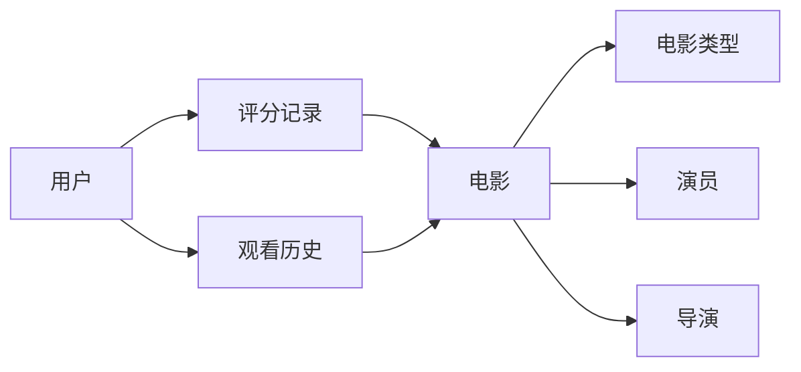
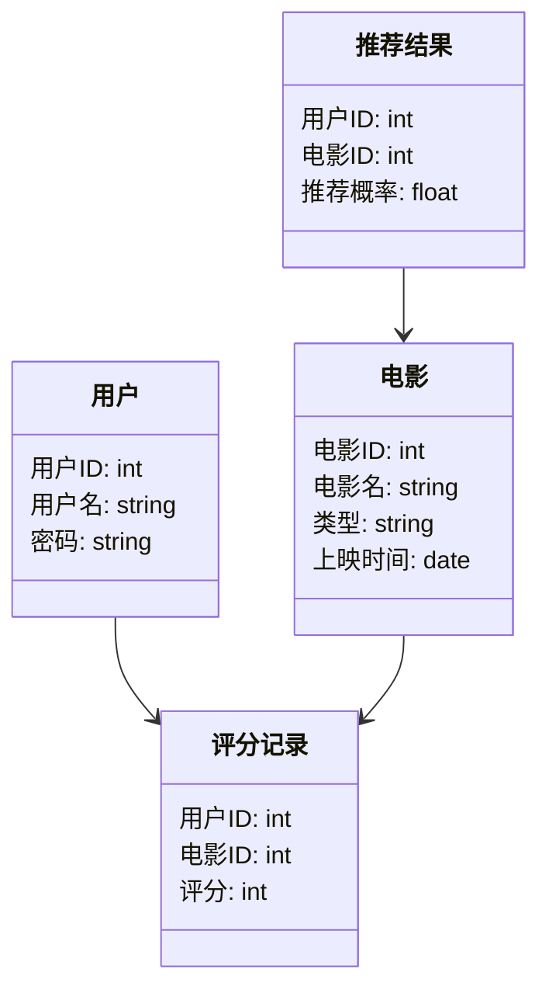
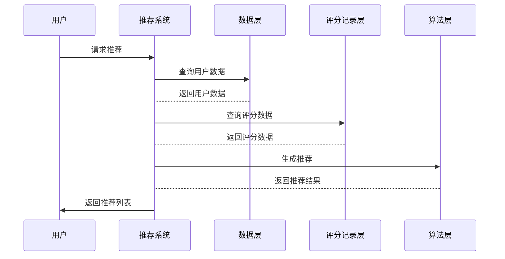

                 


# AI Agent在智能电影推荐中的应用

## 关键词：AI Agent, 智能推荐系统, 协同过滤, 电影推荐, 机器学习, 用户行为分析

## 摘要：AI Agent在智能电影推荐中的应用，涉及推荐系统的核心算法与架构设计。通过协同过滤和基于内容的推荐方法，AI Agent能够有效分析用户行为，提取电影特征，生成个性化推荐。本文详细探讨了AI Agent的工作原理，推荐系统的分类，推荐算法的数学模型，并通过系统架构设计和项目实战，展示了如何构建高效智能的电影推荐系统。

---

# 第1章: AI Agent与电影推荐的背景概述

## 1.1 AI Agent的基本概念

### 1.1.1 什么是AI Agent

AI Agent，即人工智能代理，是一种能够感知环境、执行任务以实现目标的智能实体。在电影推荐系统中，AI Agent充当用户与推荐系统之间的桥梁，负责理解和预测用户的偏好。

### 1.1.2 AI Agent的核心特征

- **自主性**：能够独立执行任务。
- **反应性**：能根据环境变化调整行为。
- **社会性**：能与其他系统或用户进行交互。
- **学习能力**：通过数据学习改进推荐效果。

### 1.1.3 AI Agent在推荐系统中的作用

AI Agent通过分析用户行为、提取电影特征，生成个性化推荐列表，提升用户体验。

## 1.2 电影推荐系统的背景

### 1.2.1 传统电影推荐系统的局限性

传统推荐系统存在数据稀疏性、计算复杂度高、实时性差等问题，难以满足大规模用户的个性化需求。

### 1.2.2 智能推荐系统的兴起

随着机器学习和大数据技术的发展，智能推荐系统逐渐取代传统方法，成为主流。

### 1.2.3 AI Agent在电影推荐中的优势

AI Agent能够实时分析用户行为，动态调整推荐策略，显著提升了推荐的准确性和实时性。

---

# 第2章: AI Agent与电影推荐的核心概念

## 2.1 AI Agent的工作原理

### 2.1.1 用户行为分析

AI Agent通过收集用户的观看历史、评分数据，分析用户的偏好和兴趣。

### 2.1.2 电影特征提取

提取电影的 genres、actors、directors 等特征，构建电影的特征向量。

### 2.1.3 推荐结果生成

基于用户的特征和电影的特征，生成个性化推荐列表。

## 2.2 电影推荐系统的分类

### 2.2.1 基于协同过滤的推荐

通过用户行为数据，找到与目标用户相似的用户群体，推荐他们喜欢的电影。

### 2.2.2 基于内容的推荐

根据电影的特征，找到与目标用户兴趣相似的电影。

### 2.2.3 混合推荐模型

结合协同过滤和基于内容的推荐，提升推荐的准确性和多样性。

## 2.3 AI Agent与推荐系统的关联

### 2.3.1 AI Agent在推荐系统中的角色

作为推荐系统的核心模块，AI Agent负责数据处理、模型训练和推荐生成。

### 2.3.2 推荐系统的数据流

用户输入 → 数据处理 → 模型训练 → 推荐生成 → 用户反馈。

### 2.3.3 AI Agent的决策机制

基于用户行为和电影特征，通过机器学习模型生成推荐结果。

## 2.4 核心概念对比表

| 对比维度       | 协同过滤       | 基于内容的推荐 |
|----------------|----------------|----------------|
| 数据依赖       | 用户行为数据    | 电影特征数据    |
| 优势           | 高准确性       | 高可解释性       |
| 适用场景       | 用户群体较大    | 电影特征丰富     |

## 2.5 系统实体关系图



---

# 第3章: 协同过滤算法原理

## 3.1 协同过滤的基本原理

### 3.1.1 相似度计算公式

$$ sim(i,j) = \frac{\sum_{k} r_{ik} r_{jk}}{\sqrt{\sum_{k} r_{ik}^2} \sqrt{\sum_{k} r_{jk}^2}} $$

### 3.1.2 基于用户的协同过滤算法实现

```python
def user_based_CF(user_id, ratings, user_similarity):
    recommended_movies = []
    for user in ratings[user_id].keys():
        similarity = user_similarity[user_id][user]
        for movie in ratings[user].keys():
            if movie not in ratings[user_id].keys():
                recommended_movies.append((movie, similarity))
    recommended_movies.sort(key=lambda x: x[1], reverse=True)
    return recommended_movies
```

### 3.1.3 基于物品的协同过滤算法实现

```python
def item_based_CF(user_id, ratings, item_similarity):
    recommended_movies = []
    for movie in ratings[user_id].keys():
        for similar_movie, similarity in item_similarity[movie].items():
            if similar_movie not in ratings[user_id].keys():
                recommended_movies.append((similar_movie, similarity))
    recommended_movies.sort(key=lambda x: x[1], reverse=True)
    return recommended_movies
```

## 3.2 基于内容的推荐算法

### 3.2.1 电影特征提取方法

使用TF-IDF提取电影的关键词特征，构建电影的向量表示。

### 3.2.2 基于向量空间模型的相似度计算

$$ sim(i,j) = \frac{\sum_{k} v_{ik} v_{jk}}{\sqrt{\sum_{k} v_{ik}^2} \sqrt{\sum_{k} v_{jk}^2}} $$

---

# 第4章: 系统分析与架构设计

## 4.1 推荐系统的场景与需求分析

### 4.1.1 用户需求

用户希望获得个性化、实时的电影推荐。

### 4.1.2 系统需求

系统需要高效处理大量数据，实时生成推荐结果。

## 4.2 领域模型设计



## 4.3 系统架构设计

### 4.3.1 数据层

- 负责数据的存储和管理。
- 使用数据库存储用户信息、电影信息和评分记录。

### 4.3.2 业务逻辑层

- 包含推荐算法的实现。
- 负责处理用户的请求，生成推荐结果。

### 4.3.3 用户界面层

- 提供用户交互界面。
- 展示推荐结果。

## 4.4 系统接口设计



---

# 第5章: 项目实战

## 5.1 环境安装与配置

### 5.1.1 安装Python和必要的库

```bash
pip install numpy pandas scikit-learn
```

## 5.2 核心代码实现

### 5.2.1 数据预处理

```python
import pandas as pd
from sklearn.metrics.pairwise import cosine_similarity

# 读取数据
ratings = pd.read_csv('ratings.csv')
movies = pd.read_csv('movies.csv')

# 合并数据
merged_data = ratings.merge(movies, on='movieId')
```

### 5.2.2 模型训练

```python
# 计算协同过滤的相似度矩阵
similarity_matrix = cosine_similarity(ratings_matrix)
```

### 5.2.3 推荐结果输出

```python
def get_recommendations(user_id, similarity_matrix, ratings):
    user_ratings = ratings[ratings['userId'] == user_id]
    similar_users = similarity_matrix[user_id]
    recommended_movies = []
    for i in range(len(similar_users)):
        if similar_users[i] > 0.5:
            user = ratings[ratings['userId'] == i]
            recommended_movies.append(user[['movieId', 'rating']].values)
    return recommended_movies
```

## 5.3 代码解读与分析

### 5.3.1 数据预处理

将用户评分数据和电影数据合并，便于后续处理。

### 5.3.2 模型训练

使用余弦相似度计算用户之间的相似性，为推荐提供基础数据。

### 5.3.3 推荐结果输出

根据用户相似性，推荐相似用户的高评分电影。

## 5.4 实际案例分析

以MovieLens数据集为例，展示推荐系统的实际运行效果。

## 5.5 项目总结

本项目通过协同过滤算法实现了电影推荐系统，验证了AI Agent在推荐系统中的有效性。

---

# 第6章: 最佳实践与小结

## 6.1 设计中的注意事项

- 数据隐私保护
- 模型调优与优化
- 系统扩展性设计

## 6.2 本章小结

本文详细介绍了AI Agent在电影推荐系统中的应用，从算法原理到系统架构，再到项目实现，全面展示了如何构建高效的智能推荐系统。

---

# 作者

作者：AI天才研究院/AI Genius Institute & 禅与计算机程序设计艺术 /Zen And The Art of Computer Programming

