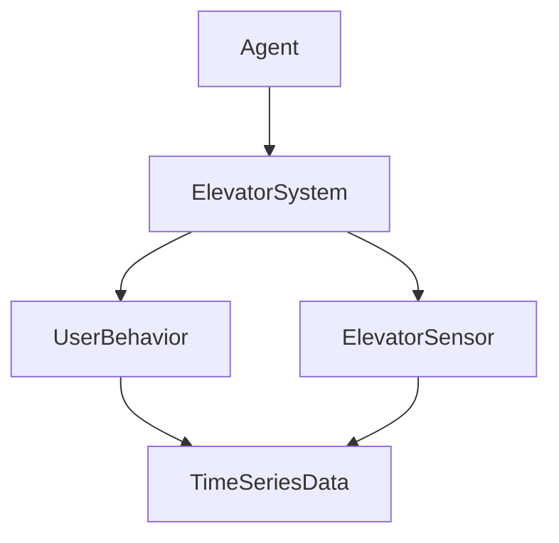
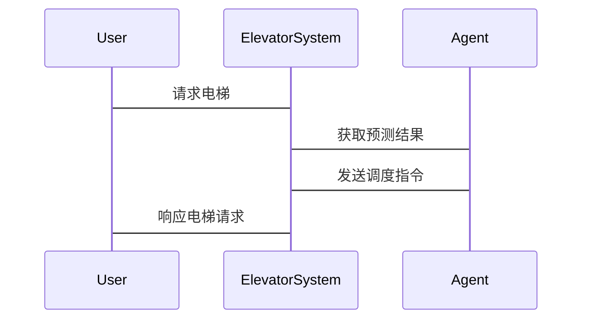

                 


# AI Agent在智能电梯中的人流预测

> 关键词：AI Agent, 智能电梯, 人流预测, LSTM, 时间序列, 电梯系统优化

> 摘要：本文系统地探讨了AI Agent在智能电梯中进行人流预测的应用，从问题背景到算法实现，再到系统架构设计，详细阐述了AI Agent如何优化电梯运行效率和用户体验。通过理论分析与实践案例结合，本文为AI Agent在电梯系统中的应用提供了全面的技术指导。

---

# 第1章: 问题背景与需求分析

## 1.1 问题背景
### 1.1.1 智能电梯的发展现状
智能电梯作为现代建筑的重要组成部分，其核心目标是提高运行效率、降低能耗、优化用户体验。传统电梯系统主要依赖固定的运行模式，难以应对动态变化的人流需求。

### 1.1.2 传统电梯人流预测的局限性
传统电梯系统的人流预测方法通常基于固定的时间间隔或历史数据，难以适应实时变化的人流情况。这种方法在高峰期可能导致电梯等待时间过长，而在低谷期可能导致资源浪费。

### 1.1.3 AI Agent在电梯系统中的应用潜力
AI Agent（人工智能代理）具有自主学习和决策的能力，能够实时分析电梯系统的运行状态和用户需求，为电梯的人流预测和调度优化提供新的解决方案。

## 1.2 问题描述
### 1.2.1 电梯人流预测的核心问题
电梯系统的人流预测需要考虑多个因素，包括用户到达时间、电梯运行状态、楼层需求等。如何在动态变化的环境中准确预测电梯使用需求是核心挑战。

### 1.2.2 电梯运行效率与用户体验的平衡
电梯系统的优化目标是在提高运行效率的同时，尽可能提升用户体验。AI Agent可以通过实时数据处理和智能决策，实现两者的动态平衡。

### 1.2.3 电梯系统中的多目标优化
电梯系统优化需要同时考虑多个目标，例如减少等待时间、降低能耗、提高电梯利用率等。AI Agent可以通过多目标优化算法实现这些目标的协调统一。

## 1.3 解决思路
### 1.3.1 引入AI Agent的必要性
AI Agent能够实时分析电梯系统的运行数据，快速响应用户需求，显著提高电梯系统的智能化水平。

### 1.3.2 基于AI Agent的人流预测框架
构建一个基于AI Agent的人流预测框架，结合历史数据和实时信息，实现对电梯使用需求的精准预测。

### 1.3.3 与其他电梯控制系统的协同
AI Agent需要与电梯控制系统协同工作，确保预测结果能够被系统有效执行。

## 1.4 问题的边界与外延
### 1.4.1 电梯人流预测的适用场景
适用于商业办公楼、酒店、大型公共场所等场景，特别是在高峰期和非高峰期的切换中表现尤为突出。

### 1.4.2 系统边界与功能限制
系统边界包括电梯运行状态、用户需求、电梯控制指令等。功能限制主要体现在对实时数据的处理能力和预测精度上。

### 1.4.3 与其他电梯问题的关系
电梯系统中的问题，如能耗优化、故障预测等，可以通过引入AI Agent技术实现协同优化。

## 1.5 核心概念与要素
### 1.5.1 AI Agent的定义与特征
AI Agent是一种能够感知环境、自主决策的智能体，具有学习能力、适应性和实时性。

### 1.5.2 电梯人流预测的关键要素
包括用户行为数据、电梯运行状态、时间序列数据、电梯系统参数等。

### 1.5.3 系统的核心组件与功能
系统的核心组件包括数据采集模块、预测模型、决策模块和执行模块。

---

# 第2章: AI Agent与电梯人流预测的核心概念

## 2.1 AI Agent的基本原理
### 2.1.1 AI Agent的定义与分类
AI Agent可以分为简单反射Agent和基于模型的反射Agent两类，后者具有更强的学习和推理能力。

### 2.1.2 AI Agent的核心算法
包括监督学习、无监督学习、强化学习等。强化学习在电梯系统中应用广泛，因为它能够通过试错优化决策。

### 2.1.3 AI Agent的决策机制
基于状态感知和目标函数，AI Agent能够做出最优决策。

## 2.2 电梯人流预测的数学模型
### 2.2.1 时间序列分析模型
时间序列模型是电梯人流预测的基础，常用ARIMA、GARCH等模型。

### 2.2.2 基于AI的预测模型
深度学习模型如LSTM（长短期记忆网络）在时间序列预测中表现优异。

### 2.2.3 模型的输入输出关系
输入包括历史电梯使用数据、用户行为数据、时间特征等，输出是电梯未来使用需求的预测值。

## 2.3 AI Agent与电梯系统的交互
### 2.3.1 Agent与电梯系统的接口设计
通过API接口实现Agent与电梯系统之间的数据交互。

### 2.3.2 Agent与电梯传感器的数据流
传感器数据（如电梯按钮点击、门开关状态）通过数据总线传递给AI Agent。

### 2.3.3 Agent与电梯控制系统的协同
AI Agent通过预测结果向电梯控制系统发送调度指令。

## 2.4 核心概念的ER实体关系图



---

# 第3章: 电梯人流预测的算法原理

## 3.1 算法概述
### 3.1.1 基于LSTM的时间序列预测
LSTM网络通过记忆单元和控制门实现对时间序列数据的长程依赖建模。

### 3.1.2 算法流程
数据预处理、模型训练、预测推理。

## 3.2 LSTM模型的数学推导

### 3.2.1 LSTM的基本结构
LSTM单元包括输入门、遗忘门、输出门和记忆单元。

$$
f_t = \sigma(W_f \cdot [h_{t-1}, x_t] + b_f)
$$

$$
i_t = \sigma(W_i \cdot [h_{t-1}, x_t] + b_i)
$$

$$
o_t = \sigma(W_o \cdot [h_{t-1}, x_t] + b_o)
$$

$$
h_t = f_t \cdot c_{t-1} + i_t \cdot tanh(W_c \cdot [h_{t-1}, x_t] + b_c)
$$

### 3.2.2 LSTM的实现代码
```python
import keras
from keras.layers import LSTM, Dense
from keras.models import Sequential

# 模型定义
model = Sequential()
model.add(LSTM(64, input_shape=(None, input_dim)))
model.add(Dense(1))
model.compile(loss='mean_squared_error', optimizer='adam')
```

## 3.3 算法实现与优化
### 3.3.1 算法实现
基于时间序列数据的LSTM预测模型。

### 3.3.2 算法优化
通过调整LSTM的参数（如单元数、学习率）和数据预处理（如归一化）提高预测精度。

---

# 第4章: 系统分析与架构设计

## 4.1 问题场景介绍
### 4.1.1 场景描述
商业办公楼电梯系统的人流预测。

### 4.1.2 系统特点
高实时性、高准确性、高扩展性。

## 4.2 系统功能设计
### 4.2.1 功能模块划分
数据采集模块、预测模型模块、决策模块、执行模块。

## 4.3 系统架构设计
### 4.3.1 系统架构图

```mermaid
graph TD
    Agent --> [预测结果]
    ElevatorSystem --> [电梯运行状态]
    UserBehavior --> [用户需求]
    TimeSeriesData --> [历史数据]
```

### 4.3.2 系统接口设计
API接口定义、数据格式、通信协议。

### 4.3.3 系统交互流程图



---

# 第5章: 项目实战

## 5.1 环境安装与配置
### 5.1.1 环境需求
Python 3.8+, Keras 2.4+, TensorFlow 2.5+。

### 5.1.2 安装依赖
`pip install keras tensorflow`

## 5.2 核心代码实现
### 5.2.1 数据预处理
```python
import pandas as pd
import numpy as np

# 数据加载
data = pd.read_csv('elevator_usage.csv')

# 数据归一化
from sklearn.preprocessing import MinMaxScaler
scaler = MinMaxScaler()
data_scaled = scaler.fit_transform(data)
```

### 5.2.2 LSTM模型实现
```python
def build_model(input_dim):
    model = Sequential()
    model.add(LSTM(64, input_shape=(None, input_dim)))
    model.add(Dense(1))
    model.compile(loss='mean_squared_error', optimizer='adam')
    return model

# 模型训练
model = build_model(input_dim)
model.fit(X_train, y_train, epochs=100, batch_size=32)
```

### 5.2.3 模型预测
```python
# 预测结果
y_pred = model.predict(X_test)
# 反归一化
y_pred = scaler.inverse_transform(y_pred)
```

## 5.3 案例分析与解读
### 5.3.1 数据分析
通过对历史数据的分析，找出电梯使用高峰期和低谷期的规律。

### 5.3.2 模型验证
通过实际运行数据验证模型的预测精度。

## 5.4 项目小结
### 5.4.1 项目总结
AI Agent在电梯系统中的应用显著提高了电梯的运行效率和用户体验。

### 5.4.2 经验与教训
模型的泛化能力和实时性需要进一步优化。

---

# 第6章: 最佳实践与拓展阅读

## 6.1 最佳实践 tips
### 6.1.1 数据预处理的注意事项
确保数据的完整性和准确性。

### 6.1.2 模型优化的建议
尝试不同的模型结构和超参数组合。

### 6.1.3 系统部署的建议
采用云原生架构，确保系统的高可用性和扩展性。

## 6.2 小结
AI Agent在电梯系统中的应用前景广阔，未来可以通过引入更多传感器数据和强化学习算法进一步提升预测精度。

## 6.3 注意事项
### 6.3.1 数据隐私保护
注意电梯系统数据的隐私保护。

### 6.3.2 系统稳定性
确保系统的稳定运行，避免因模型预测错误导致的电梯故障。

## 6.4 拓展阅读
### 6.4.1 相关技术
推荐阅读《深度学习》、《强化学习实战》等书籍。

### 6.4.2 应用场景
电梯系统优化、智能交通管理、智慧城市建设。

---

# 作者：AI天才研究院/AI Genius Institute & 禅与计算机程序设计艺术 /Zen And The Art of Computer Programming

---

以上目录大纲和内容规划旨在为AI Agent在智能电梯中的人流预测提供一个全面的技术指导，涵盖从理论到实践的各个方面。后续可以根据实际内容补充具体章节和小节的详细内容。

