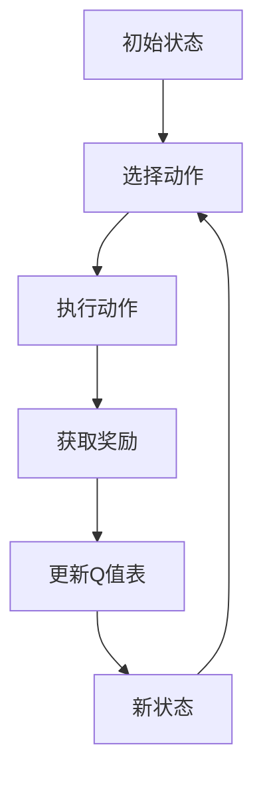
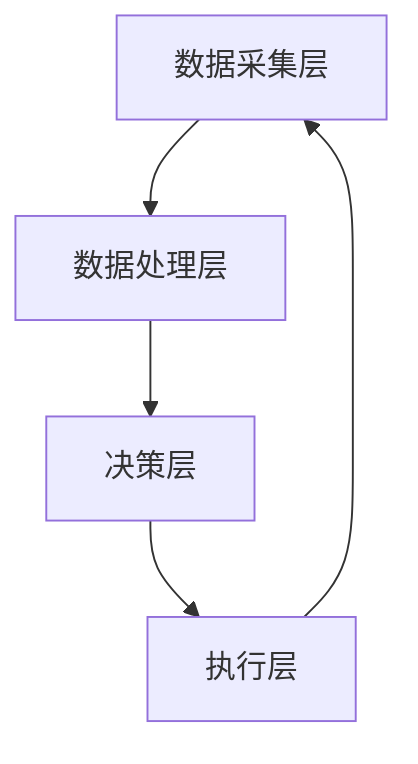

                 


# AI Agent在智能电网中的应用

> 关键词：AI Agent，智能电网，强化学习，电力系统，能源优化

> 摘要：随着人工智能技术的快速发展，AI Agent（人工智能代理）在智能电网中的应用逐渐成为研究的热点。本文从AI Agent的基本概念和核心原理出发，详细探讨其在智能电网中的具体应用场景，包括电力系统状态监测、负荷预测与优化调度、电力市场交易与决策支持等方面。同时，本文结合强化学习算法和系统架构设计，深入分析AI Agent在智能电网中的实现方法，并通过实际案例展示其在能源优化中的巨大潜力。文章最后总结了AI Agent在智能电网中的应用优势，并提出了未来的发展方向和研究建议。

---

# 第一部分: AI Agent与智能电网的背景介绍

## 第1章: AI Agent的基本概念与核心原理

### 1.1 AI Agent的定义与特点

AI Agent（人工智能代理）是指能够感知环境、自主决策并采取行动的智能体。它通过传感器获取环境信息，利用算法进行分析和推理，并通过执行器对外界产生影响。AI Agent的核心特点包括：

1. **自主性**：能够在没有外部干预的情况下自主运行。
2. **反应性**：能够实时感知环境变化并做出响应。
3. **目标导向性**：基于目标函数或奖励机制进行决策。
4. **学习能力**：通过机器学习算法不断优化自身的决策能力。

### 1.2 智能电网的基本概念

智能电网是一种以数字化技术为基础，能够实现电力系统各环节（发电、输电、配电、用电）智能化运行和管理的新型电力系统。其主要目标是提高电力系统的效率、可靠性和可持续性。

智能电网的关键特征包括：
1. **实时性**：能够实时监测和调整电力系统的运行状态。
2. **互动性**：支持用户与电网之间的双向互动。
3. **灵活性**：能够适应可再生能源的接入和分布式能源的管理。
4. **安全性**：具备强大的网络安全防护能力。

### 1.3 AI Agent在智能电网中的应用背景

智能电网的发展面临诸多挑战，例如：
- **复杂性**：电力系统的规模庞大，涉及多个子系统和设备的协调运行。
- **不确定性**：可再生能源的波动性、用户负荷的变化等都增加了系统的不确定性。
- **安全性**：网络安全攻击和物理攻击对电力系统的威胁日益增加。

AI Agent通过其自主决策和学习能力，能够有效应对上述挑战。例如：
- **状态监测与故障诊断**：AI Agent可以通过实时数据分析，快速发现并定位电力系统中的故障。
- **负荷预测与优化调度**：AI Agent可以根据历史数据和当前状态，预测未来的电力需求，并制定最优的能源调度方案。
- **电力市场交易**：AI Agent可以参与电力市场交易，优化能源采购成本。

---

## 第2章: AI Agent的核心概念与工作原理

### 2.1 AI Agent的核心概念

#### 2.1.1 状态空间与动作空间

AI Agent的决策过程基于状态空间和动作空间：
- **状态空间**：描述环境当前的状态，例如电力系统的负载、设备运行状态等。
- **动作空间**：AI Agent可以执行的动作，例如调整设备功率、切换电路等。

#### 2.1.2 环境模型与交互机制

AI Agent通过与环境的交互来感知状态并采取行动。环境模型描述了环境的状态、动作和奖励之间的关系。例如：
- **状态**：当前电力系统的负载和设备状态。
- **动作**：AI Agent采取的行动，如调整发电量。
- **奖励**：环境对AI Agent行动的反馈，例如电力成本的变化。

#### 2.1.3 多智能体系统与协作

智能电网是一个复杂的系统，通常需要多个AI Agent协同工作。多智能体系统通过分布式决策和协作，能够更好地处理复杂任务，例如能源调度和市场交易。

### 2.2 AI Agent的算法原理

#### 2.2.1 强化学习算法

强化学习是一种通过试错机制来优化决策策略的方法。AI Agent通过与环境的交互，学习最优的策略以最大化累积奖励。

##### Q-learning算法

Q-learning是一种经典的强化学习算法，其核心思想是通过更新Q值表来学习最优策略。Q值表记录了每个状态下每个动作的期望奖励。

$$ Q(s, a) = Q(s, a) + \alpha \left( r + \gamma \max Q(s', a') - Q(s, a) \right) $$

其中：
- $s$：当前状态
- $a$：当前动作
- $s'$：下一个状态
- $r$：奖励
- $\alpha$：学习率
- $\gamma$：折扣因子

##### 深度强化学习（DQN）

深度强化学习结合了深度神经网络和强化学习，通过神经网络来近似Q值函数。DQN算法包括两个网络：动作值网络和目标网络。

#### 2.2.2 监督学习与无监督学习

- **监督学习**：通过标注数据训练AI Agent，使其能够预测状态和动作。
- **无监督学习**：通过未标注数据发现数据中的隐含模式，用于状态分类或异常检测。

#### 2.2.3 贝叶斯网络与决策树

贝叶斯网络是一种概率推理模型，可以用于故障诊断和风险评估。决策树是一种基于特征的分类方法，用于负荷预测和设备状态分类。

### 2.3 AI Agent的数学模型与公式

#### 2.3.1 状态转移方程

状态转移方程描述了当前状态和动作如何影响下一个状态：

$$ s' = f(s, a) $$

其中，$f$ 是状态转移函数。

#### 2.3.2 动作选择模型

基于Q值的贪心策略：

$$ a = \arg \max Q(s, a) $$

#### 2.3.3 奖励函数与价值函数

奖励函数定义了AI Agent行动的反馈：

$$ r = R(s, a) $$

价值函数描述了在某个状态下采取某动作的期望累积奖励：

$$ V(s) = \max_a Q(s, a) $$

---

## 第3章: AI Agent在智能电网中的应用领域

### 3.1 电力系统状态监测与故障诊断

#### 3.1.1 基于AI Agent的设备状态监测

AI Agent可以通过传感器数据实时监测电力设备的状态，并通过强化学习算法预测设备的健康状况。

#### 3.1.2 故障定位与修复策略

在发生故障时，AI Agent能够快速定位故障位置，并制定修复策略以最小化对电力系统的影响。

### 3.2 负荷预测与优化调度

#### 3.2.1 负荷预测的AI Agent实现

AI Agent可以通过历史负荷数据和天气预报等信息，预测未来的电力需求。

#### 3.2.2 能源调度的优化算法

AI Agent可以优化电力系统的能源调度，例如在可再生能源充足时优先使用可再生能源。

### 3.3 电力市场交易与决策支持

#### 3.3.1 市场分析与预测

AI Agent可以分析电力市场的需求和价格变化，制定最优的采购策略。

#### 3.3.2 自动化交易策略

通过强化学习算法，AI Agent可以实现电力市场的自动化交易，以获取最大利润。

---

## 第4章: AI Agent的算法实现与数学模型

### 4.1 强化学习算法的实现

#### 4.1.1 算法流程图（mermaid）



#### 4.1.2 算法实现代码示例

```python
import numpy as np

class AI_Agent:
    def __init__(self, state_space, action_space):
        self.state_space = state_space
        self.action_space = action_space
        self.Q = np.zeros((state_space, action_space))
    
    def choose_action(self, state):
        if np.random.random() < 0.9:
            return np.argmax(self.Q[state, :])
        else:
            return np.random.randint(0, self.action_space)
    
    def update_Q(self, state, action, reward, next_state):
        self.Q[state, action] += 0.1 * (reward + 0.9 * np.max(self.Q[next_state, :]) - self.Q[state, action])
```

### 4.2 数学模型与公式

#### 4.2.1 Q-learning更新公式

$$ Q(s, a) = Q(s, a) + \alpha (r + \gamma \max Q(s', a') - Q(s, a)) $$

其中：
- $\alpha$ 是学习率，通常取0.1。
- $\gamma$ 是折扣因子，通常取0.9。

---

## 第5章: 系统分析与架构设计

### 5.1 系统功能需求分析

智能电网AI Agent系统需要实现以下功能：
- 实时监测电力系统的运行状态。
- 预测电力需求并优化能源调度。
- 支持电力市场的自动化交易。

### 5.2 系统架构设计

#### 5.2.1 分层架构设计（mermaid）


#### 5.2.2 模块化设计与交互流程



---

## 第6章: 项目实战

### 6.1 环境安装

```bash
pip install numpy
pip install gym
pip install matplotlib
```

### 6.2 系统核心实现源代码

```python
import gym
import numpy as np
import matplotlib.pyplot as plt

class AI_Agent:
    def __init__(self, env):
        self.env = env
        self.Q = np.zeros(self.env.observation_space.shape)
    
    def choose_action(self, state):
        if np.random.random() < 0.9:
            return self.env.action_space.index(np.argmax(self.Q[state]))
        else:
            return self.env.action_space.sample()
    
    def update_Q(self, state, action, reward, next_state):
        self.Q[state] = self.Q[state] + 0.1 * (reward + 0.9 * np.max(self.Q[next_state]) - self.Q[state])

# 初始化环境
env = gym.make('PowerSystem-v0')
agent = AI_Agent(env)

# 训练过程
for episode in range(1000):
    state = env.reset()
    total_reward = 0
    while True:
        action = agent.choose_action(state)
        next_state, reward, done, _ = env.step(action)
        agent.update_Q(state, action, reward, next_state)
        total_reward += reward
        if done:
            break
    print(f'Episode {episode}, Total Reward: {total_reward}')

# 可视化结果
plt.plot(episode, total_reward)
plt.xlabel('Episode')
plt.ylabel('Total Reward')
plt.show()
```

### 6.3 案例分析与详细解读

通过上述代码，AI Agent可以在智能电网环境中实现电力系统的优化调度。例如，在负荷预测中，AI Agent可以根据历史数据和当前状态，预测未来的电力需求，并制定最优的能源调度策略。

---

## 第7章: 总结与展望

### 7.1 总结

AI Agent在智能电网中的应用具有巨大的潜力。通过强化学习算法和系统架构设计，AI Agent能够实现电力系统的状态监测、负荷预测、能源调度和市场交易等关键任务。

### 7.2 展望

未来，随着人工智能技术的不断发展，AI Agent在智能电网中的应用将更加广泛。例如：
- 更高效的算法设计，如多智能体协同学习。
- 更强大的硬件支持，如边缘计算和云计算的结合。
- 更广泛的应用场景，如智能配电网和分布式能源管理。

---

# 作者：AI天才研究院/AI Genius Institute & 禅与计算机程序设计艺术 /Zen And The Art of Computer Programming

---

以上是《AI Agent在智能电网中的应用》的技术博客文章的详细内容，涵盖了从基础概念到具体应用的各个方面，并结合了算法实现和系统设计的详细解读。

