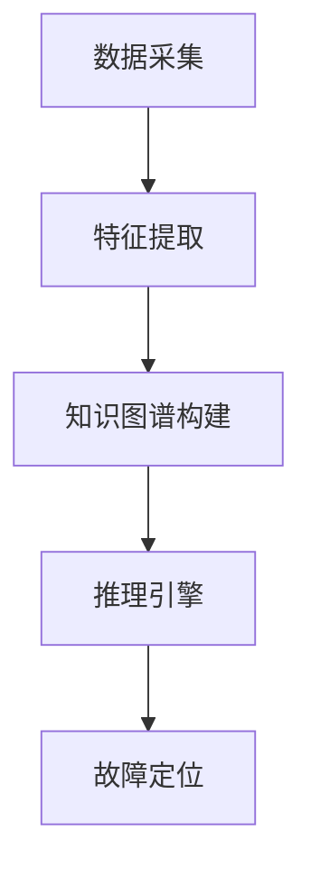
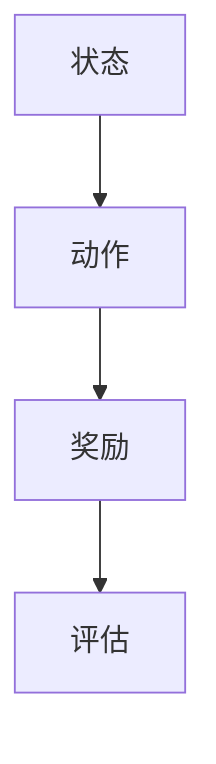

                 


# AI Agent在智能电网故障诊断中的角色

## 关键词：智能电网，AI Agent，故障诊断，知识图谱，强化学习，系统架构

## 摘要：本文探讨AI Agent在智能电网故障诊断中的应用，分析其核心原理、算法模型及系统架构，结合实际案例，展示AI Agent在提升故障诊断效率和准确率方面的优势，为智能电网的可靠运行提供技术支撑。

---

# 第一部分: 智能电网与AI Agent概述

## 第1章: 智能电网概述

### 1.1 智能电网的定义与特点
智能电网是一种集成现代信息通信技术的电力网络，具备实时监测、自动控制和智能决策能力。其特点包括分布式能源接入、数据驱动的管理、高效的电力传输和分配，以及强大的故障自愈能力。

### 1.2 智能电网的组成部分
智能电网由发电、输电、配电、用电和通信五个部分组成，各部分通过信息交互实现协调运行。

### 1.3 智能电网故障诊断的重要性
故障诊断是保障电网稳定运行的关键，传统方法依赖人工经验，效率低且准确性差。AI Agent通过智能化分析，显著提升故障定位和修复效率。

## 第2章: AI Agent的基本概念

### 2.1 AI Agent的定义
AI Agent是具备感知、推理、学习和决策能力的智能体，能够独立完成特定任务。

### 2.2 AI Agent的工作原理
AI Agent通过传感器收集数据，利用算法进行分析，做出决策并执行动作。其核心包括数据采集、特征提取、模型训练和决策优化。

### 2.3 AI Agent在智能电网中的应用
AI Agent用于电网监测、故障诊断、负荷预测等领域，尤其在故障诊断中表现出色，能够快速定位和修复问题。

---

# 第二部分: AI Agent在智能电网故障诊断中的核心概念

## 第3章: 智能电网故障诊断的核心原理

### 3.1 故障诊断的基本流程
故障诊断通常包括数据采集、特征提取、模式识别和决策推理四个步骤。

### 3.2 基于AI Agent的故障诊断方法
AI Agent通过知识图谱推理和强化学习，实现对电网设备状态的实时监测和故障定位。

### 3.3 AI Agent与传统故障诊断方法的对比
AI Agent在实时性、准确性和适应性方面优于传统方法，能够处理复杂和动态的电网环境。

## 第4章: AI Agent与智能电网故障诊断的实体关系

### 4.1 实体关系图（ER图）
```mermaid
erDiagram
    actor User {
        <name>
    }
    actor Grid_Device {
        <device_id>
    }
    actor AI-Agent {
        <agent_id>
    }
    Grid_Device --> AI-Agent: 传输数据
    AI-Agent --> User: 提供诊断结果
```

### 4.2 AI Agent与电网设备的关系
AI Agent通过传感器收集设备数据，分析设备状态，预测潜在故障，从而实现预防性维护。

### 4.3 故障诊断过程中的信息流分析
信息流从设备到AI Agent，经分析后传递给用户，确保快速响应和处理。

---

# 第三部分: 算法原理与数学模型

## 第5章: 基于知识图谱的故障诊断算法

### 5.1 知识图谱的构建
知识图谱整合电网设备、运行状态和历史故障数据，为AI Agent提供决策支持。

### 5.2 基于知识图谱的推理算法
AI Agent利用图嵌入技术进行推理，快速定位故障原因。

### 5.3 算法流程图（Mermaid）


## 第6章: 强化学习在故障诊断中的应用

### 6.1 强化学习的基本原理
通过状态-动作-奖励机制，训练AI Agent在故障诊断中的决策能力。

### 6.2 状态空间与动作空间的定义
状态包括设备状态和运行参数，动作包括诊断步骤和修复措施。

### 6.3 算法实现代码
```python
import numpy as np
import tensorflow as tf

# 定义网络结构
model = tf.keras.Sequential([
    tf.keras.layers.Dense(64, activation='relu'),
    tf.keras.layers.Dense(10, activation='softmax')
])

# 定义损失函数和优化器
loss = tf.keras.losses.sparse_categorical_crossentropy
optimizer = tf.keras.optimizers.Adam(learning_rate=0.001)

# 训练模型
model.compile(optimizer=optimizer, loss=loss, metrics=['accuracy'])
```

### 6.4 数学模型与公式
损失函数：$$ L = -\sum_{i} y_i \log(p_i) $$

优化器：$$ \theta = \theta - \eta \frac{\partial L}{\partial \theta} $$

### 6.5 算法流程图（Mermaid）


---

# 第四部分: 系统分析与架构设计

## 第7章: 智能电网故障诊断系统架构

### 7.1 系统功能设计
系统包括数据采集、故障诊断、结果展示和修复建议功能。

### 7.2 系统架构图（Mermaid）


### 7.3 系统接口设计
接口包括数据采集接口、诊断结果接口和用户反馈接口。

### 7.4 系统交互流程图（Mermaid）
```mermaid
sequence
    User -> Grid_Device: 获取数据
    Grid_Device -> AI-Agent: 传输数据
    AI-Agent -> User: 提供诊断结果
```

---

# 第五部分: 项目实战

## 第8章: 环境安装与核心代码实现

### 8.1 环境安装
安装Python、TensorFlow和Mermaid工具，配置开发环境。

### 8.2 核心代码实现
```python
import pandas as pd
from sklearn.model_selection import train_test_split
from tensorflow.keras import layers

# 加载数据
data = pd.read_csv('grid_data.csv')

# 数据分割
train_data, test_data = train_test_split(data)

# 构建模型
model = tf.keras.Sequential([
    layers.Dense(64, activation='relu'),
    layers.Dense(10, activation='softmax')
])

# 编译和训练模型
model.compile(optimizer='adam', loss='sparse_categorical_crossentropy', metrics=['accuracy'])
model.fit(train_data, epochs=10, validation_data=test_data)
```

### 8.3 案例分析
通过实际案例展示AI Agent如何快速定位故障，减少停电时间。

### 8.4 项目总结
总结项目成果，提出改进建议和未来研究方向。

---

# 第六部分: 最佳实践与总结

## 第9章: 最佳实践

### 9.1 注意事项
确保数据质量，选择合适的算法，优化模型参数。

### 9.2 未来研究方向
探索更高效的算法，结合边缘计算，提升诊断效率。

## 第10章: 总结

AI Agent在智能电网故障诊断中的应用前景广阔，通过技术创新，能够显著提升电网的可靠性和效率。

---

# 作者

作者：AI天才研究院/AI Genius Institute & 禅与计算机程序设计艺术 /Zen And The Art of Computer Programming

