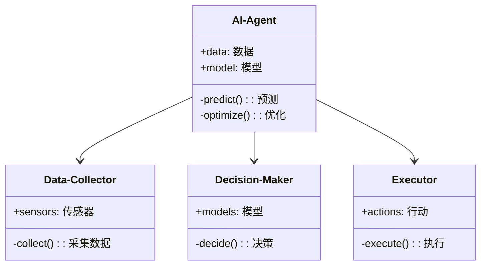
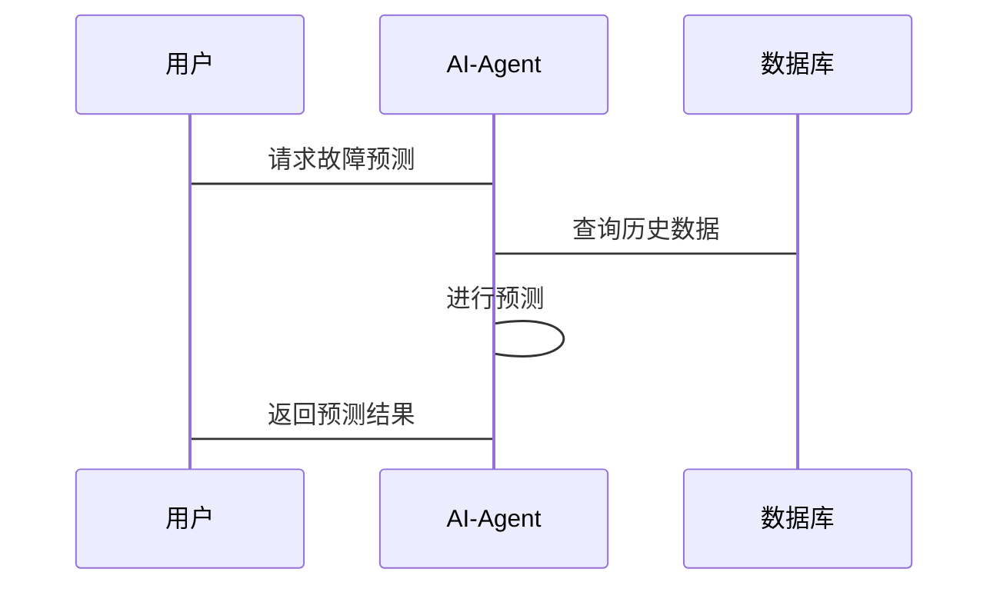

                 


# AI Agent在智能电网故障预测中的角色

## 关键词：智能电网、AI Agent、故障预测、机器学习、深度学习、系统架构

## 摘要：  
本文探讨了AI Agent在智能电网故障预测中的角色和应用。通过分析智能电网的结构和AI Agent的基本原理，详细介绍了基于机器学习和深度学习的故障预测算法，并展示了如何通过系统设计和项目实战来实现高效的智能电网故障预测。文章最后总结了AI Agent在智能电网中的重要性，并展望了未来的发展方向。

---

# 第1章: AI Agent与智能电网的结合

## 1.1 AI Agent的基本概念

### 1.1.1 什么是AI Agent
AI Agent（人工智能代理）是一种能够感知环境、自主决策并执行任务的智能实体。它可以是一个软件程序，也可以是硬件设备，其核心目标是通过感知和行动来优化特定目标的实现。

### 1.1.2 AI Agent的核心特征
- **自主性**：能够在没有外部干预的情况下独立运行。
- **反应性**：能够实时感知环境变化并做出反应。
- **目标导向**：通过目标驱动来优化决策和行动。
- **学习能力**：能够通过经验不断优化自身的算法和策略。

### 1.1.3 AI Agent与传统自动化的区别
传统自动化依赖于预定义的规则和程序，而AI Agent具有学习能力和自适应性，能够根据环境变化动态调整行为。

## 1.2 智能电网的基本概念

### 1.2.1 智能电网的定义
智能电网是一种通过先进信息通信技术和自动化设备，实现电力系统中各环节（发电、输电、配电、用电）智能化运行和管理的新型电力系统。

### 1.2.2 智能电网的主要组成部分
- **发电环节**：包括传统发电厂和可再生能源发电设备。
- **输电环节**：通过高压输电线路传输电力。
- **配电环节**：将电力分配到各个用户。
- **用电环节**：用户端的电力消耗和管理。

### 1.2.3 智能电网的优势与挑战
优势包括高效性、可靠性和环保性；挑战主要集中在数据处理、系统安全和成本控制。

## 1.3 AI Agent在智能电网中的角色

### 1.3.1 AI Agent在智能电网中的应用领域
- **故障预测**：通过分析历史数据和实时数据，预测电力系统中的潜在故障。
- **负荷预测**：预测用户的电力需求，优化电力分配。
- **异常检测**：实时监控系统运行状态，发现异常情况。

### 1.3.2 AI Agent如何提升智能电网的效率
通过自主学习和优化算法，AI Agent能够提高电力系统的运行效率，降低成本，并减少对环境的影响。

### 1.3.3 AI Agent在智能电网故障预测中的作用
AI Agent能够实时分析电力系统中的各种数据，预测可能的故障，并采取相应的措施，从而避免或减少故障带来的损失。

## 1.4 本章小结
本章介绍了AI Agent的基本概念、智能电网的结构及其优势与挑战，并重点阐述了AI Agent在智能电网中的角色和应用。

---

# 第2章: 智能电网的结构与运行机制

## 2.1 智能电网的系统架构

### 2.1.1 智能电网的分层架构
智能电网通常采用分层架构，包括感知层、网络层、平台层和应用层。

### 2.1.2 各层的功能与作用
- **感知层**：负责数据的采集和初步处理。
- **网络层**：负责数据的传输和通信。
- **平台层**：负责数据的存储、分析和处理。
- **应用层**：负责最终的决策和应用。

### 2.1.3 分层架构的优缺点
优点包括结构清晰、易于扩展；缺点是各层之间的协同需要复杂的设计。

## 2.2 智能电网的数据流分析

### 2.2.1 数据采集与处理流程
- **数据采集**：通过传感器和采集设备获取实时数据。
- **数据预处理**：对采集到的数据进行清洗、归一化等处理。
- **数据存储**：将处理后的数据存储在数据库中。

### 2.2.2 数据传输与存储机制
- **数据传输**：通过通信网络将数据传输到平台层。
- **数据存储**：使用分布式存储技术提高数据的可靠性和可扩展性。

## 2.3 智能电网的运行模式

### 2.3.1 分布式能源系统
分布式能源系统通过多个小型发电设备为用户提供电力，具有灵活性和可扩展性的特点。

### 2.3.2 集中式能源系统
集中式能源系统通过大型发电厂为整个区域提供电力，具有高效性和稳定性。

## 2.4 本章小结
本章详细介绍了智能电网的系统架构、数据流分析以及运行模式，为后续章节的分析奠定了基础。

---

# 第3章: AI Agent的基本原理与类型

## 3.1 AI Agent的基本原理

### 3.1.1 感知层：数据采集与特征提取
AI Agent通过感知层采集环境数据，并提取特征信息，为后续的决策提供依据。

### 3.1.2 决策层：基于机器学习的决策模型
AI Agent利用机器学习算法构建决策模型，根据特征信息做出最优决策。

### 3.1.3 执行层：动作输出与反馈机制
AI Agent根据决策结果执行具体动作，并通过反馈机制不断优化自身行为。

## 3.2 AI Agent的类型

### 3.2.1 基于规则的AI Agent
基于规则的AI Agent通过预定义的规则和条件来做出决策，适用于规则明确且变化较小的场景。

### 3.2.2 基于机器学习的AI Agent
基于机器学习的AI Agent通过学习历史数据，构建模型并预测未来行为，适用于复杂多变的场景。

### 3.2.3 基于强化学习的AI Agent
基于强化学习的AI Agent通过与环境的互动，不断优化自身的决策策略，适用于需要动态调整的复杂场景。

## 3.3 本章小结
本章介绍了AI Agent的基本原理和不同类型，帮助读者理解AI Agent在智能电网中的应用方式。

---

# 第4章: 智能电网故障预测的核心算法

## 4.1 基于机器学习的故障预测算法

### 4.1.1 线性回归模型
线性回归模型通过建立特征与目标之间的线性关系，预测故障的发生概率。

### 4.1.2 支持向量机（SVM）模型
SVM模型通过构建超平面，将数据点分为不同类别，适用于分类和回归任务。

### 4.1.3 神经网络模型
神经网络模型通过多层神经元的组合，能够捕捉复杂的数据模式，适用于非线性问题。

## 4.2 基于深度学习的故障预测算法

### 4.2.1 卷积神经网络（CNN）在图像识别中的应用
CNN通过卷积操作提取图像中的特征，适用于电力设备图像的故障识别。

### 4.2.2 循环神经网络（RNN）在时间序列预测中的应用
RNN通过处理序列数据，适用于电力负荷预测和时间序列分析。

### 4.2.3 Transformer模型在智能电网中的应用
Transformer模型通过自注意力机制，能够捕捉长距离依赖关系，适用于复杂的电力系统预测。

## 4.3 算法对比与优化

### 4.3.1 不同算法的优缺点分析
- 线性回归模型：简单易用，但适用于线性关系。
- SVM模型：性能稳定，但需要参数调优。
- 神经网络模型：能力强，但计算复杂。

### 4.3.2 算法优化策略
- 数据预处理：提高数据质量，增强模型性能。
- 超参数优化：通过网格搜索等方法找到最优参数。
- 模型集成：通过集成学习提高预测准确率。

### 4.3.3 算法在智能电网中的实际应用案例
通过实际案例分析，展示不同算法在智能电网中的应用效果和优化策略。

## 4.4 本章小结
本章详细介绍了基于机器学习和深度学习的故障预测算法，并通过对比分析和优化策略，帮助读者选择最优的算法。

---

# 第5章: AI Agent在智能电网故障预测中的系统设计

## 5.1 项目介绍

### 5.1.1 项目背景
随着智能电网的快速发展，故障预测的准确性对于系统的稳定运行至关重要。

### 5.1.2 项目目标
通过AI Agent实现智能电网的故障预测，提高系统的可靠性和效率。

## 5.2 系统功能设计

### 5.2.1 领域模型（mermaid类图）


### 5.2.2 系统架构设计（mermaid架构图）
```mermaid
architecturalDiagram
    layer 前端 {
        Frontend
    }
    layer 后端 {
        Backend
    }
    layer 数据库 {
        Database
    }
    Frontend --> Backend
    Backend --> Database
```

### 5.2.3 系统接口设计
- **数据接口**：与数据采集设备进行数据交互。
- **模型接口**：与机器学习模型进行参数设置和预测结果获取。
- **用户接口**：与最终用户进行交互，展示预测结果和决策建议。

### 5.2.4 系统交互（mermaid序列图）


## 5.3 项目实战

### 5.3.1 环境配置
- **Python版本**：3.8及以上
- **库的安装**：安装numpy、pandas、scikit-learn、tensorflow等库

### 5.3.2 系统核心实现源代码

```python
import numpy as np
import pandas as pd
from sklearn.model_selection import train_test_split
from sklearn.linear_model import LinearRegression

# 数据加载
data = pd.read_csv('grid_data.csv')
X = data.drop('fault', axis=1)
y = data['fault']

# 数据分割
X_train, X_test, y_train, y_test = train_test_split(X, y, test_size=0.2)

# 模型训练
model = LinearRegression()
model.fit(X_train, y_train)

# 模型预测
y_pred = model.predict(X_test)
```

### 5.3.3 代码应用解读与分析
上述代码展示了如何使用线性回归模型进行故障预测，包括数据加载、数据分割、模型训练和预测等步骤。

### 5.3.4 实际案例分析
通过具体案例分析，展示AI Agent在智能电网故障预测中的实际效果和优化空间。

## 5.4 本章小结
本章通过系统设计和项目实战，详细介绍了AI Agent在智能电网故障预测中的实现过程和应用效果。

---

# 第6章: 总结与展望

## 6.1 总结
本文详细探讨了AI Agent在智能电网故障预测中的角色和应用，介绍了智能电网的基本结构、AI Agent的核心原理以及基于机器学习和深度学习的故障预测算法。

## 6.2 未来展望
随着人工智能技术的不断发展，AI Agent在智能电网中的应用将更加广泛和深入，特别是在分布式能源系统和实时优化控制方面。

## 6.3 最佳实践 tips
- 数据质量是故障预测的基础，需要确保数据的准确性和完整性。
- 模型优化是提高预测准确率的关键，可以通过超参数调优和模型集成来实现。
- 系统安全性是AI Agent应用的重要保障，需要采取多层次的安全防护措施。

## 6.4 本章小结
本文总结了AI Agent在智能电网中的重要性，并展望了未来的发展方向，为读者提供了宝贵的参考。

---

# 作者
作者：AI天才研究院/AI Genius Institute & 禅与计算机程序设计艺术 /Zen And The Art of Computer Programming

