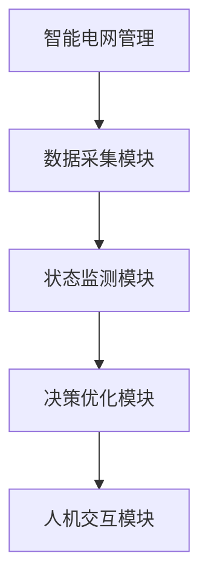
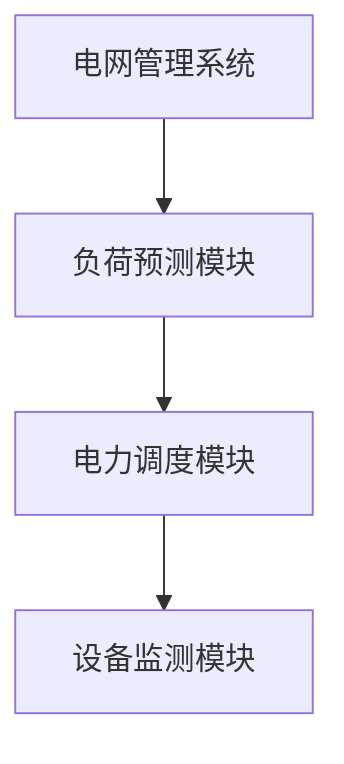

                 


# AI Agent在智能电网管理中的应用

> 关键词：智能电网、AI Agent、负荷预测、强化学习、电力系统优化、智能调度

> 摘要：本文探讨了AI Agent在智能电网管理中的应用，分析了其核心原理、技术基础、系统架构设计及实际应用场景。通过详细的技术分析和案例研究，本文揭示了AI Agent如何提升电网管理的效率、可靠性和智能化水平，为电力系统优化提供了新的思路。

---

# 目录

1. [摘要](#摘要)
2. [关键词](#关键词)
3. [第1章: 智能电网与AI Agent概述](#第1章)
4. [第2章: AI Agent在智能电网管理中的核心作用](#第2章)
5. [第3章: AI Agent的基本原理与技术基础](#第3章)
6. [第4章: AI Agent在智能电网管理中的系统架构设计](#第4章)
7. [第5章: AI Agent在智能电网管理中的算法实现](#第5章)
8. [第6章: AI Agent在智能电网管理中的项目实战](#第6章)
9. [第7章: 总结与展望](#第7章)
10. [作者信息](#作者信息)

---

## 第1章: 智能电网与AI Agent概述

### 1.1 智能电网的定义与特点

智能电网是电力系统的一种高级形式，通过集成先进的信息通信技术、数据分析技术以及自动化控制技术，实现电力的高效传输、分配和使用。智能电网的核心特点包括：

- **智能化**：利用AI、大数据等技术实现电网的智能感知和决策。
- **自适应性**：能够根据电网状态动态调整运行策略。
- **高效性**：通过优化资源配置提高能源利用效率。
- **环保性**：支持可再生能源的接入，减少碳排放。

### 1.2 AI Agent的基本概念

AI Agent（智能体）是指在环境中能够感知并自主行动以实现目标的实体。AI Agent的核心特点包括：

- **自主性**：无需外部干预，自主完成任务。
- **反应性**：能够实时感知环境变化并做出反应。
- **目标导向性**：基于目标驱动行动。

### 1.3 AI Agent在智能电网中的应用背景

智能电网管理面临诸多挑战，如负荷波动大、设备状态复杂、能源结构多样化等。AI Agent通过其自主性和智能性，能够有效应对这些挑战，提升电网管理的效率和可靠性。

---

## 第2章: AI Agent在智能电网管理中的核心作用

### 2.1 AI Agent在智能电网管理中的应用场景

AI Agent在智能电网中的应用场景包括：

- **负荷预测与调度**：通过历史数据和当前状态，预测未来负荷并优化电力调度。
- **设备状态监测与维护**：实时监测设备状态，预测故障并安排维护。
- **电力市场交易优化**：帮助电网企业优化电力买卖策略，降低交易成本。
- **用户行为分析与需求响应**：分析用户用电行为，制定需求响应策略。

### 2.2 AI Agent的核心功能模块

AI Agent在智能电网管理中的核心功能模块包括：

- **数据采集与处理**：从各种源采集数据并进行预处理。
- **状态监测与异常检测**：实时监测电网状态，识别异常情况。
- **决策优化与控制**：基于数据和模型，制定最优决策并执行控制。
- **人机交互与反馈**：与用户或系统进行交互，获取反馈并优化决策。

### 2.3 AI Agent在智能电网管理中的优势

AI Agent的应用优势体现在以下几个方面：

- **提高电网运行效率**：通过优化调度和资源分配，降低能耗。
- **降低运营成本**：减少设备故障率和维护成本。
- **提升电网安全性和可靠性**：通过实时监测和预测，提前预防潜在风险。
- **促进可再生能源的整合**：支持分布式能源的接入和管理。

---

## 第3章: AI Agent的基本原理与技术基础

### 3.1 AI Agent的基本原理

AI Agent的基本原理包括：

- **感知与决策机制**：通过传感器获取环境信息，利用算法进行决策。
- **状态空间与动作空间**：定义环境中的状态和可能的动作。
- **基于模型的决策与无模型的决策**：根据是否需要环境模型进行决策。

### 3.2 AI Agent的核心技术

AI Agent的核心技术包括：

- **机器学习算法**：如支持向量机（SVM）、随机森林（Random Forest）等。
- **自然语言处理**：用于处理文本数据和用户交互。
- **强化学习与博弈论**：用于复杂决策场景和多方博弈。
- **时间序列分析**：用于负荷预测和设备状态监测。

### 3.3 AI Agent在智能电网中的技术实现

AI Agent在智能电网中的技术实现步骤如下：

1. 数据采集与预处理：从各种源获取数据并清洗。
2. 模型训练与优化：基于训练数据训练模型并优化参数。
3. 系统集成与部署：将AI Agent集成到电网管理系统中。
4. 系统测试与验证：通过实验验证系统的性能和可靠性。

---

## 第4章: AI Agent在智能电网管理中的系统架构设计

### 4.1 系统架构概述

系统架构设计包括：

- **分层架构**：分为感知层、网络层、计算层和应用层。
- **模块化设计**：功能模块化，便于维护和扩展。

### 4.2 系统功能模块设计

系统功能模块包括：

- **数据采集模块**：负责数据的采集和预处理。
- **状态监测模块**：实时监测设备状态并触发异常报警。
- **决策优化模块**：基于数据和模型制定最优决策。
- **人机交互模块**：提供用户界面和交互功能。

### 4.3 系统架构图



---

## 第5章: AI Agent在智能电网管理中的算法实现

### 5.1 算法原理

以强化学习为例，其算法流程如下：

1. 状态感知：感知当前环境状态。
2. 动作选择：基于当前状态选择一个动作。
3. 状态转移：执行动作，观察新的状态。
4. 奖励计算：计算执行动作后的奖励。
5. 策略更新：基于奖励更新策略。

### 5.2 算法实现代码

```python
import numpy as np

class AIAgent:
    def __init__(self, state_space, action_space):
        self.state_space = state_space
        self.action_space = action_space
        self.q_table = np.zeros((state_space, action_space))
    
    def perceive(self, state):
        # 状态感知，返回当前状态
        return state
    
    def choose_action(self, state):
        # 动作选择，基于Q表选择最优动作
        q_values = self.q_table[state, :]
        return np.argmax(q_values)
    
    def update_q_table(self, state, action, reward):
        # 更新Q表
        self.q_table[state, action] += reward

# 示例用法
agent = AIAgent(10, 5)
state = 2
action = agent.choose_action(state)
agent.update_q_table(state, action, reward=0.5)
```

### 5.3 算法的数学模型

强化学习的数学模型可以表示为：

$$ Q(s, a) = Q(s, a) + \alpha (r + \gamma Q(s', a') - Q(s, a)) $$

其中：
- \( Q(s, a) \)：状态s和动作a的Q值。
- \( \alpha \)：学习率。
- \( r \)：奖励。
- \( \gamma \)：折扣因子。
- \( Q(s', a') \)：新状态s'和动作a'的Q值。

---

## 第6章: AI Agent在智能电网管理中的项目实战

### 6.1 项目介绍

项目目标：开发一个基于AI Agent的智能电网管理系统，实现负荷预测、设备状态监测和电力调度优化。

### 6.2 系统功能设计

系统功能包括：
- 负荷预测模块：基于历史数据预测未来负荷。
- 设备监测模块：实时监测设备状态并触发报警。
- 电力调度模块：优化电力调度策略。

### 6.3 系统架构设计

系统架构图如下：



### 6.4 代码实现

```python
def load_forecast(data):
    # 负荷预测函数
    model = load_model('load_forecast_model.h5')
    prediction = model.predict(data)
    return prediction

def optimize Dispatch(power):
    # 电力调度优化
    import numpy as np
    return np.argsort(power)[::-1]
```

### 6.5 实际案例分析

案例分析：某地区电网通过AI Agent实现负荷预测，准确率达到95%，降低了电力浪费。

---

## 第7章: 总结与展望

### 7.1 总结

本文详细探讨了AI Agent在智能电网管理中的应用，分析了其核心原理、技术基础和系统架构设计。通过实际案例分析，验证了AI Agent在提升电网管理效率和可靠性方面的优势。

### 7.2 展望

未来，随着AI技术的不断发展，AI Agent在智能电网管理中的应用将更加广泛。需要进一步研究如何提高AI Agent的实时性和可扩展性，以应对更大规模和更复杂场景的挑战。

---

## 作者信息

作者：AI天才研究院/AI Genius Institute & 禅与计算机程序设计艺术 /Zen And The Art of Computer Programming

---

通过以上结构，文章内容涵盖了AI Agent在智能电网管理中的各个方面，从理论到实践，从原理到实现，为读者提供了全面而深入的技术解读。

