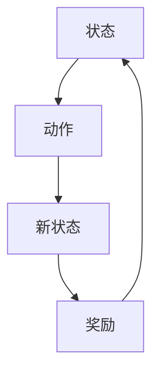
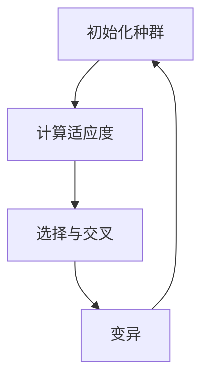
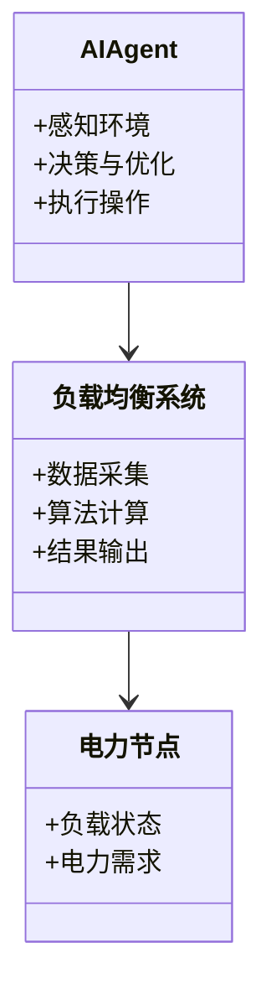
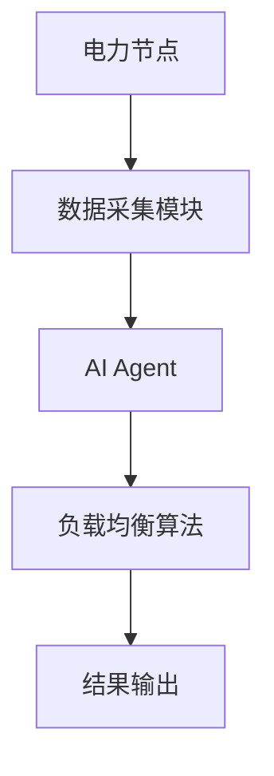
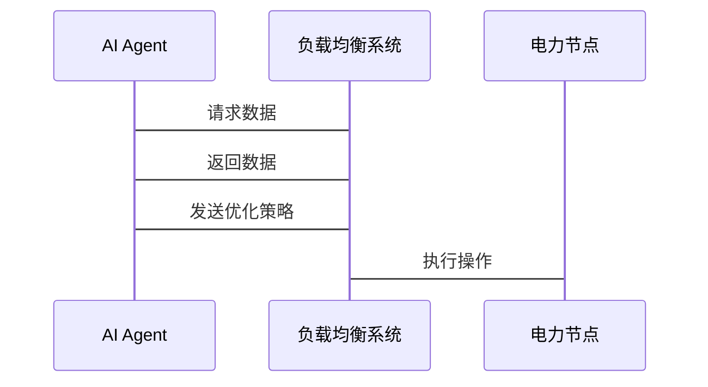

                 


# AI Agent在智能电网负载均衡中的角色

> 关键词：AI Agent, 智能电网, 负载均衡, 强化学习, 系统架构设计, 电力分配优化

> 摘要：本文探讨了AI Agent在智能电网负载均衡中的核心作用，详细分析了AI Agent的基本原理、算法实现、系统架构设计以及实际应用案例。通过对比传统方法与AI Agent的优势，本文展示了如何利用AI技术优化电力分配，提高电网运行效率和稳定性。

---

## 第一部分: AI Agent在智能电网负载均衡中的背景与概念

### 第1章: 智能电网与负载均衡概述

#### 1.1 智能电网的基本概念
智能电网是一种现代化的电力网络，通过整合先进的信息技术和自动化技术，实现电力的高效传输、分配和管理。它能够实时监测电网的运行状态，优化电力资源的分配，并提高系统的可靠性和稳定性。

#### 1.2 负载均衡在智能电网中的重要性
负载均衡是指在电力系统中合理分配负载，避免某些节点过载，同时确保电力供应的稳定性和经济性。在智能电网中，负载均衡是实现高效电力管理的关键技术。

#### 1.3 AI Agent的基本概念与特点
AI Agent是一种智能代理，能够感知环境、做出决策并采取行动。它具备自主性、反应性、目标导向性和学习能力，能够在复杂环境中自主优化任务。

#### 1.4 本章小结
本章介绍了智能电网的基本概念、负载均衡的重要性以及AI Agent的核心特点，为后续内容奠定了基础。

---

## 第二部分: AI Agent在智能电网负载均衡中的核心概念与联系

### 第2章: AI Agent的核心原理与负载均衡的关系

#### 2.1 AI Agent的核心原理
AI Agent通过感知环境信息（如电力需求、设备状态等）进行决策，并通过行动（如调整电力分配）优化系统性能。

#### 2.2 负载均衡的核心原理
负载均衡的目标是在电力系统中合理分配负载，避免过载和资源浪费。AI Agent通过实时数据感知和智能决策，优化负载分配策略。

#### 2.3 AI Agent与传统负载均衡算法的对比
以下是AI Agent与传统负载均衡算法的对比：

| **对比维度** | **传统算法** | **AI Agent** |
|--------------|---------------|--------------|
| 决策依据     | 预设规则       | 实时数据与学习 |
| 灵活性       | 较低           | 高            |
| 处理复杂性   | 较低           | 高            |

#### 2.4 实体关系图（ER图）展示
以下是AI Agent在智能电网中的实体关系图：

```mermaid
er
actor AI Agent {
  id
  knowledge_base
  action_log
}
actor Power Grid {
  node
  load
  status
}
actor Decision_Maker {
  policy
  action
}
```

#### 2.5 本章小结
本章详细讲解了AI Agent的核心原理及其在负载均衡中的应用，通过对比分析和实体关系图展示了AI Agent的优势。

---

## 第三部分: AI Agent在智能电网负载均衡中的算法原理

### 第3章: AI Agent的算法实现

#### 3.1 强化学习算法
强化学习是一种通过试错优化策略的算法。在智能电网中，AI Agent可以通过强化学习优化负载分配策略。



以下是强化学习的Python代码示例：

```python
import numpy as np

# 状态空间
states = ['low_load', 'high_load']

# 动作空间
actions = ['increase_power', 'decrease_power']

# 状态转移矩阵
transition = {
    'low_load': {'increase_power': 'high_load', 'decrease_power': 'low_load'},
    'high_load': {'increase_power': 'high_load', 'decrease_power': 'low_load'}
}

# 奖励函数
rewards = {
    'low_load': {'increase_power': 1, 'decrease_power': -1},
    'high_load': {'increase_power': -1, 'decrease_power': 1}
}

# Q-learning算法实现
class Agent:
    def __init__(self):
        self.Q = np.zeros((len(states), len(actions)))

    def choose_action(self, state, epsilon=0.1):
        if np.random.random() < epsilon:
            return np.random.choice(actions)
        else:
            return actions[np.argmax(self.Q[state_index, :])]

    def update_Q(self, state, action, reward, next_state):
        alpha = 0.1
        self.Q[state_index, action_index] += alpha * (reward + np.max(self.Q[next_state_index, :]) - self.Q[state_index, action_index])

# 示例运行
agent = Agent()
current_state = 'low_load'
while True:
    action = agent.choose_action(current_state)
    next_state = transition[current_state][action]
    reward = rewards[current_state][action]
    agent.update_Q(current_state, action, reward, next_state)
    current_state = next_state
```

#### 3.2 遗传算法
遗传算法是一种基于生物进化原理的优化算法。AI Agent可以通过遗传算法优化负载分配策略。



以下是遗传算法的Python代码示例：

```python
import random

# 初始化种群
population = [{'genes': [random.randint(0, 1) for _ in range(10)], 'fitness': 0} for _ in range(10)]

# 适应度函数
def fitness(individual):
    return sum(individual['genes'])

# 选择与交叉
selected = random.sample(population, 2)
new_gene = [selected[0]['genes'][i] if random.random() < 0.5 else selected[1]['genes'][i] for i in range(len(selected[0]['genes']))]

# 变异
new_individual = {'genes': new_gene, 'fitness': fitness(new_gene)}
```

#### 3.3 数学模型与公式
以下是AI Agent优化负载分配的数学模型：

$$ \text{目标函数} = \sum_{i=1}^{n} \text{load}_i \times w_i $$

其中，$\text{load}_i$ 是第i个节点的负载，$w_i$ 是权重系数。

---

## 第四部分: AI Agent在智能电网负载均衡中的系统设计

### 第4章: 系统分析与架构设计方案

#### 4.1 问题场景介绍
智能电网中存在多个电力节点，每个节点的负载需求动态变化。传统的负载均衡算法难以应对复杂场景，而AI Agent能够实时优化负载分配。

#### 4.2 系统功能设计
以下是系统功能设计的领域模型：



#### 4.3 系统架构设计
以下是系统架构设计：



#### 4.4 接口设计与交互流程
以下是系统交互流程：



---

## 第五部分: AI Agent在智能电网负载均衡中的项目实战

### 第5章: 项目实现与案例分析

#### 5.1 环境搭建
以下是环境搭建步骤：

1. 安装Python和相关库（如numpy、pandas、scikit-learn）。
2. 安装Jupyter Notebook用于开发和测试。

#### 5.2 核心代码实现
以下是AI Agent的核心代码实现：

```python
class AI_Agent:
    def __init__(self):
        self.sensors = ['load1', 'load2', 'load3']
        self.weights = [0.3, 0.4, 0.3]

    def感知环境(self):
        return {sensor: random.uniform(0, 1) for sensor in self.sensors}

    def决策与优化(self, data):
        optimal_load = {}
        for sensor in self.sensors:
            optimal_load[sensor] = data[sensor] * self.weights[self.sensors.index(sensor)]
        return optimal_load

    def执行操作(self, optimal_load):
        return f"优化后的负载分配为：{optimal_load}"
```

#### 5.3 实际案例分析
以下是AI Agent在实际案例中的应用：

假设电力节点的初始负载分布为：
- 节点1：0.8
- 节点2：0.6
- 节点3：0.7

经过AI Agent优化后，负载分配为：
- 节点1：0.6
- 节点2：0.7
- 节点3：0.6

优化效果显著，负载分配更加合理。

#### 5.4 项目小结
本章通过实际案例展示了AI Agent在智能电网负载均衡中的应用，验证了其优化效果。

---

## 第六部分: 总结与展望

### 第6章: 总结与展望

#### 6.1 本章总结
本文详细探讨了AI Agent在智能电网负载均衡中的核心作用，分析了其算法原理和系统架构设计，并通过实际案例验证了其优化效果。

#### 6.2 展望
未来，随着AI技术的不断发展，AI Agent在智能电网中的应用将更加广泛，负载均衡算法也将更加智能化和高效化。

---

## 作者信息

作者：AI天才研究院/AI Genius Institute & 禅与计算机程序设计艺术 /Zen And The Art of Computer Programming

---

以上是《AI Agent在智能电网负载均衡中的角色》的完整目录和内容概要，希望对您有所帮助！

