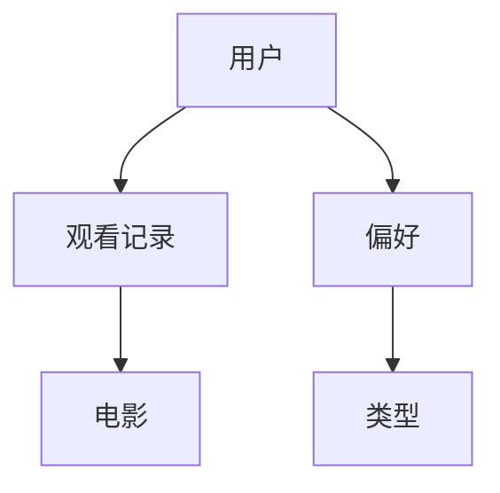
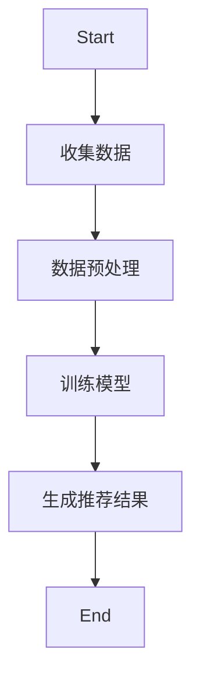
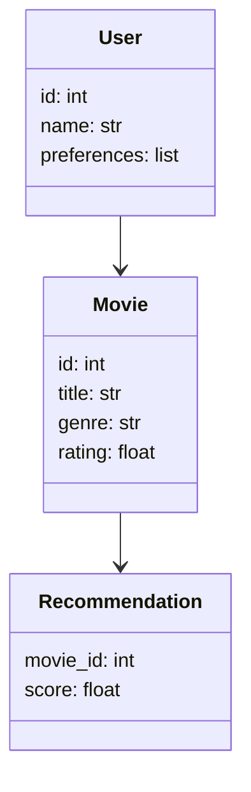
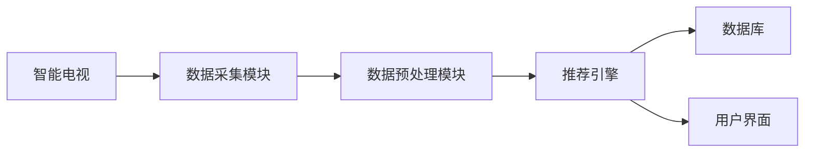
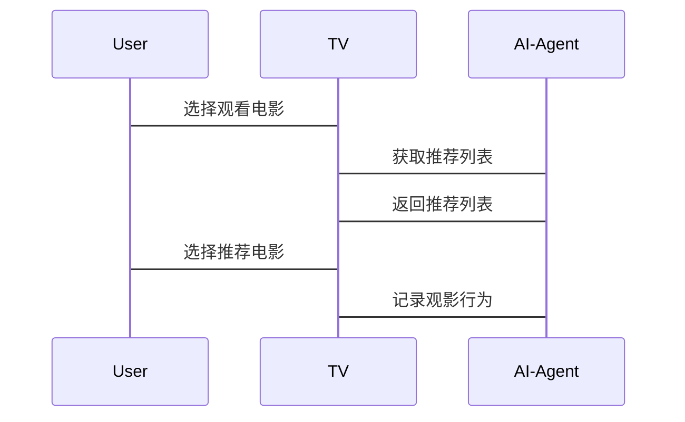

                 


# AI Agent在智能电视中的家庭观影喜好学习

## 关键词
AI Agent, 智能电视, 家庭观影, 机器学习, 数据挖掘, 推荐系统

## 摘要
本文探讨了AI Agent在智能电视中的应用，特别是在家庭观影喜好的学习方面。通过分析家庭观影行为，结合机器学习和数据挖掘技术，AI Agent能够实时分析和预测用户的观影偏好，提供个性化的推荐服务。文章详细介绍了AI Agent的核心原理、协同过滤算法、系统架构设计以及实际案例，为读者提供全面的技术指导。

---

# 目录

1. [背景介绍](#背景介绍)
2. [核心概念与联系](#核心概念与联系)
3. [算法原理](#算法原理)
4. [系统分析与架构设计](#系统分析与架构设计)
5. [项目实战](#项目实战)
6. [最佳实践](#最佳实践)

---

## 1. 背景介绍

### 1.1 问题背景
智能电视的发展为家庭观影带来了前所未有的便利，然而，现有的推荐系统在个性化服务方面仍有不足。用户通常需要在海量影视资源中手动筛选，观影体验不佳。此外，不同家庭成员的观影偏好差异较大，传统的推荐系统难以满足多样化的需求。

### 1.2 问题描述
AI Agent在智能电视中的应用能够实时分析家庭成员的观影行为，学习其喜好，从而提供个性化的推荐服务。然而，如何高效地学习和预测观影偏好，是当前技术面临的主要挑战。

### 1.3 问题解决
通过AI Agent，智能电视能够动态调整推荐策略，优化观影体验。AI Agent能够学习用户的行为模式，预测其偏好，从而实现精准推荐。

### 1.4 概念结构与核心要素
AI Agent在智能电视中的家庭观影学习系统由以下几个核心要素构成：数据采集模块、数据处理模块、推荐算法模块和用户界面模块。

---

## 2. 核心概念与联系

### 2.1 AI Agent的核心原理
AI Agent通过机器学习算法，分析用户的行为数据，学习其观影偏好。推荐算法基于协同过滤和内容推荐两种方式，提供精准的推荐服务。

### 2.2 家庭观影喜好的数据特征
家庭观影数据具有多样性、动态性和关联性。多样性的数据来源于不同家庭成员的观影行为，动态性体现在用户的观影偏好随时间变化，关联性则体现在用户行为与影视内容之间的关系。

### 2.3 ER实体关系图


---

## 3. 算法原理

### 3.1 协同过滤算法
协同过滤算法分为基于用户的协同过滤和基于物品的协同过滤。基于用户的算法通过寻找相似用户的观影行为进行推荐，基于物品的算法则通过分析影视内容的相关性进行推荐。

### 3.2 协同过滤的实现流程


### 3.3 协同过滤的数学模型
$$\text{相似度计算公式：} \text{相似度}(u, v) = \frac{\sum_{i \in I_u \cap I_v} (r_i - \bar{r}_u)(r_i - \bar{r}_v)}{\sqrt{\sum_{i \in I_u} (r_i - \bar{r}_u)^2} \cdot \sqrt{\sum_{i \in I_v} (r_i - \bar{r}_v)^2}}$$
其中，$\bar{r}_u$表示用户$u$的平均评分，$\bar{r}_v$表示用户$v$的平均评分。

### 3.4 代码实现
```python
import numpy as np

def cosine_similarity(user_ratings, movie_ratings):
    # 计算用户平均评分
    user_avg = np.mean(user_ratings, axis=1).reshape(-1, 1)
    movie_avg = np.mean(movie_ratings, axis=0).reshape(1, -1)
    
    # 中心化数据
    user_centered = user_ratings - user_avg
    movie_centered = movie_ratings - movie_avg
    
    # 计算相似度
    dot_product = np.dot(user_centered, movie_centered)
    user_norm = np.sqrt(np.sum(user_centered**2, axis=1))[:, np.newaxis]
    movie_norm = np.sqrt(np.sum(movie_centered**2, axis=0))[np.newaxis, :]
    
    similarity = dot_product / (user_norm * movie_norm)
    return similarity
```

---

## 4. 系统分析与架构设计

### 4.1 项目场景
家庭观影场景中，智能电视通过AI Agent实时分析用户的观影行为，学习其偏好，并推荐相关内容。

### 4.2 领域模型


### 4.3 系统架构


### 4.4 接口设计
系统接口包括数据采集接口、推荐结果接口和用户反馈接口。

### 4.5 交互流程


---

## 5. 项目实战

### 5.1 环境搭建
安装Python、TensorFlow、Flask等库。

### 5.2 核心代码实现
```python
import numpy as np
from flask import Flask, jsonify

app = Flask(__name__)

def train_model(data):
    # 简单的协同过滤实现
    pass

@app.route('/recommend', methods=['POST'])
def recommend():
    data = request.json
    result = train_model(data)
    return jsonify(result)

if __name__ == '__main__':
    app.run(debug=True)
```

### 5.3 实际案例分析
通过实际数据集分析，展示AI Agent如何学习用户偏好并生成推荐结果。

### 5.4 项目小结
总结项目实现的关键点，讨论可能遇到的问题及解决方案。

---

## 6. 最佳实践

### 6.1 小贴士
- 数据隐私保护
- 模型优化建议
- 系统性能优化

### 6.2 总结
本文详细介绍了AI Agent在智能电视中的应用，从理论到实践，为读者提供了全面的技术指导。

### 6.3 展望
未来，AI Agent在家庭观影中的应用将更加智能化和个性化。

### 6.4 注意事项
在实际应用中，需注意数据安全和模型的实时性。

### 6.5 拓展阅读
推荐相关领域的书籍和论文。

---

## 作者：AI天才研究院/AI Genius Institute & 禅与计算机程序设计艺术 /Zen And The Art of Computer Programming

---

这篇文章详细介绍了AI Agent在智能电视中的家庭观影学习，从背景到实现，再到实际应用，为读者提供了全面的技术指导。

