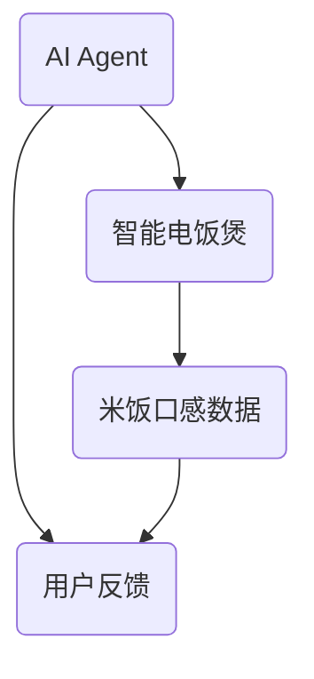
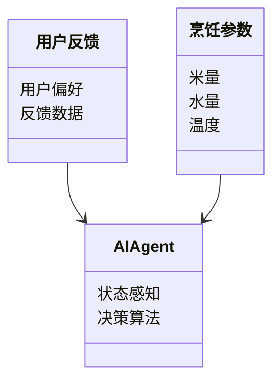
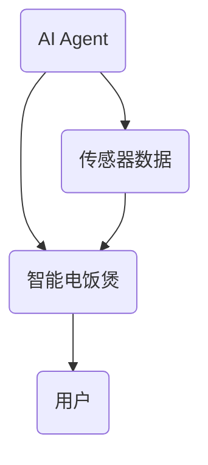
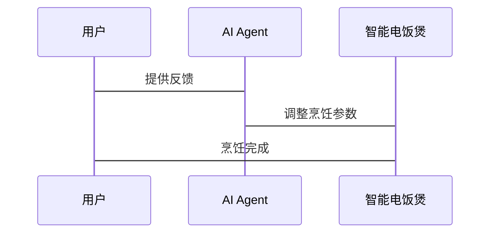

                 


# AI Agent在智能电饭煲中的米饭口感定制

## 关键词：
AI Agent, 智能电饭煲, 米饭口感, 强化学习, 多目标优化, 智能家居

## 摘要：
本文探讨了AI Agent在智能电饭煲中的应用，重点分析了如何通过AI技术实现米饭口感的个性化定制。从背景介绍、核心概念、算法原理到系统架构，再到项目实战和最佳实践，本文全面解析了AI Agent在智能电饭煲中的技术实现和应用价值。通过强化学习和多目标优化算法，AI Agent能够根据用户反馈实时调整烹饪参数，实现最佳米饭口感。本文还提供了实际的Python代码示例，帮助读者理解如何将AI技术应用于智能家电领域。

---

# 第一部分: AI Agent在智能电饭煲中的米饭口感定制背景介绍

## 第1章: 问题背景与描述

### 1.1 问题背景
#### 1.1.1 米饭烹饪的历史与现状
米饭是全球主要的主食之一，其烹饪技术经历了从传统手工烹饪到现代化智能设备的演变。传统烹饪方式依赖人工经验，而现代智能电饭煲通过自动化技术提升了烹饪效率，但仍难以满足用户对米饭口感的个性化需求。

#### 1.1.2 智能电饭煲的发展历程
智能电饭煲的发展经历了多个阶段，从最初的单一保温功能到如今的多功能烹饪模式。然而，现有的智能电饭煲仍然缺乏对米饭口感的深度优化能力，用户反馈显示，口感一致性差、个性化需求无法满足是主要问题。

#### 1.1.3 米饭口感优化的市场需求
随着消费者对食品品质要求的提高，市场对个性化、高品质米饭的需求日益增长。AI技术的引入为智能电饭煲提供了新的可能性，通过AI Agent优化米饭口感，满足用户个性化需求，具有广阔的市场前景。

### 1.2 问题描述
#### 1.2.1 米饭口感的影响因素
米饭口感受多种因素影响，包括米的种类、水量、温度、压力、烹饪时间等。不同用户对米饭的偏好也不同，有的喜欢软糯，有的偏爱Q弹。

#### 1.2.2 智能电饭煲的功能局限性
现有智能电饭煲虽然能够根据预设程序进行烹饪，但缺乏对用户反馈的实时调整能力，无法根据用户偏好动态优化烹饪参数。

#### 1.2.3 用户对米饭口感的个性化需求
用户对米饭口感的个性化需求日益增长，不同用户对米饭的软硬度、香甜度等有不同的偏好，传统智能电饭煲难以满足这种个性化需求。

## 第2章: 问题解决与边界

### 2.1 问题解决思路
#### 2.1.1 引入AI Agent的必要性
AI Agent能够实时感知烹饪过程中的各种参数，并根据用户反馈动态调整烹饪策略，从而实现个性化口感优化。

#### 2.1.2 AI Agent在米饭口感优化中的作用
AI Agent通过强化学习和多目标优化算法，能够在复杂条件下找到最优烹饪参数，满足用户个性化需求。

#### 2.1.3 技术实现的可行性分析
通过传感器获取烹饪数据，结合用户反馈，AI Agent能够实时调整烹饪参数，实现动态优化。技术实现上，可以通过边缘计算实现本地化优化，也可以通过云计算实现更复杂的模型训练。

### 2.2 问题边界与外延
#### 2.2.1 AI Agent的功能边界
AI Agent的功能包括但不限于烹饪参数调整、用户偏好分析、烹饪过程监控等。其功能边界不包括米的种植、收割等上游环节。

#### 2.2.2 米饭口感优化的适用范围
AI Agent优化的米饭口感适用于各种米种，但需要根据具体米种调整烹饪参数。对于特殊米种或烹饪环境，可能需要额外的数据训练。

#### 2.2.3 与其他智能家居设备的协同
AI Agent可以通过智能家居平台与其他设备协同工作，例如与智能音箱联动，实现语音控制烹饪过程。

## 第3章: 核心概念与结构

### 3.1 核心概念
#### 3.1.1 AI Agent的定义与特征
AI Agent是一种能够感知环境、自主决策并执行任务的智能体。其核心特征包括自主性、反应性、目标导向性和学习能力。

#### 3.1.2 米饭口感优化的指标体系
米饭口感优化的指标包括软硬度、香甜度、粘糯度、弹性等。这些指标可以通过传感器测量和用户反馈综合评估。

#### 3.1.3 智能电饭煲的硬件与软件架构
智能电饭煲的硬件架构包括传感器、执行器、控制器等，软件架构则包括数据采集、算法处理、用户交互等模块。

### 3.2 核心概念的关系
#### 3.2.1 AI Agent与智能电饭煲的实体关系图


---

# 第二部分: AI Agent的核心原理与算法

## 第4章: AI Agent的核心原理

### 4.1 AI Agent的基本原理
#### 4.1.1 基于强化学习的决策机制
AI Agent通过强化学习算法，根据环境反馈调整行为策略，从而实现目标优化。

#### 4.1.2 多目标优化的实现方法
在米饭口感优化中，AI Agent需要同时优化多个指标，如软硬度、香甜度等，可以通过加权的方式实现多目标优化。

#### 4.1.3 知识表示与推理逻辑
AI Agent通过知识库存储不同米种的烹饪参数，并根据用户反馈动态调整知识表示。

### 4.2 算法原理
#### 4.2.1 强化学习算法（Q-Learning）
```mermaid
graph TD
    S(状态) --> A(动作)
    A --> R(奖励)
    R -->
```

#### 4.2.2 多目标优化算法（Pareto优化）
$$
f(x) = \sum_{i=1}^{n} w_i x_i
$$
其中，$w_i$是目标权重，$x_i$是目标值。

---

## 第5章: 系统分析与架构设计

### 5.1 问题场景介绍
#### 5.1.1 用户需求分析
用户希望电饭煲能够根据个人口味调整米饭口感。

#### 5.1.2 系统目标
通过AI Agent实现个性化米饭口感优化。

### 5.2 项目介绍
#### 5.2.1 项目背景
本项目旨在通过AI技术提升智能电饭煲的烹饪体验。

#### 5.2.2 项目目标
实现基于AI Agent的米饭口感个性化定制。

### 5.3 系统功能设计
#### 5.3.1 领域模型（Mermaid类图）


#### 5.3.2 系统架构设计（Mermaid架构图）


#### 5.3.3 系统接口设计
AI Agent与智能电饭煲之间的接口通过标准API实现数据交互。

#### 5.3.4 系统交互（Mermaid序列图）


---

## 第6章: 项目实战

### 6.1 环境安装
#### 6.1.1 硬件环境
需要一台支持AI功能的智能电饭煲和相关传感器。

#### 6.1.2 软件环境
安装Python、TensorFlow、Keras等深度学习框架。

### 6.2 核心代码实现
#### 6.2.1 AI Agent的Python实现
```python
import numpy as np
import tensorflow as tf

# 定义强化学习模型
class AI_Agent:
    def __init__(self):
        self.model = tf.keras.Sequential([
            tf.keras.layers.Dense(64, activation='relu'),
            tf.keras.layers.Dense(10, activation='softmax')
        ])
        self.model.compile(optimizer='adam', loss='sparse_categorical_crossentropy')
    
    def perceive(self, state):
        return self.model.predict(np.array([state]))[0]
    
    def decide(self, state):
        action = np.argmax(self.perceive(state))
        return action
```

#### 6.2.2 烹饪参数调整
```python
def adjust_cooking_parameters(parameters, feedback):
    # 根据用户反馈调整烹饪参数
    parameters['temperature'] += feedback['temperature_adjustment']
    parameters['water'] += feedback['water_adjustment']
    return parameters
```

### 6.3 代码解读与分析
#### 6.3.1 AI Agent的代码解读
AI Agent通过深度学习模型感知状态并做出决策。模型由两个全连接层组成，分别用于特征提取和动作选择。

#### 6.3.2 烹饪参数调整的代码解读
根据用户反馈调整烹饪参数，具体调整幅度由反馈数据决定。

### 6.4 实际案例分析
#### 6.4.1 案例背景
用户偏好软糯的米饭，AI Agent需要调整温度和水量以实现最佳口感。

#### 6.4.2 实施过程
AI Agent通过多次试验，逐步优化烹饪参数，最终达到用户满意的口感。

### 6.5 项目小结
通过AI Agent的引入，智能电饭煲能够实现个性化米饭口感优化，显著提升了用户体验。

---

## 第7章: 最佳实践与总结

### 7.1 最佳实践 tips
- 定期更新AI模型，以适应不同米种和用户偏好。
- 保持传感器的清洁，确保数据采集的准确性。
- 提供用户友好的反馈界面，便于用户调整偏好。

### 7.2 小结
本文详细介绍了AI Agent在智能电饭煲中的应用，通过强化学习和多目标优化算法，实现了米饭口感的个性化定制。

### 7.3 注意事项
- 确保AI Agent的安全性和隐私保护。
- 定期维护系统，防止硬件故障。

### 7.4 拓展阅读
- 《强化学习：算法与应用》
- 《智能家电设计与实现》

---

# 作者：AI天才研究院/AI Genius Institute & 禅与计算机程序设计艺术 /Zen And The Art of Computer Programming

