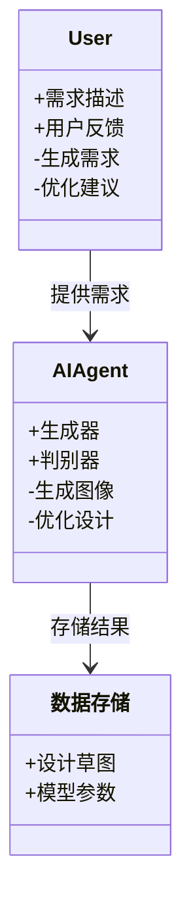

                 


# AI Agent在智能画板中的创意激发系统

> 关键词：AI Agent, 智能画板, 创意激发, GAN, 强化学习, 系统架构, 项目实战

> 摘要：本文探讨了AI Agent在智能画板中的应用，分析了其在创意激发中的作用，详细讲解了基于生成对抗网络和强化学习的算法原理，并通过系统架构设计和项目实战，展示了AI Agent如何助力设计过程。

---

# 第一部分: AI Agent与智能画板的背景与概念

## 第1章: AI Agent与智能画板概述

### 1.1 AI Agent的基本概念

#### 1.1.1 AI Agent的定义
AI Agent（人工智能代理）是一种能够感知环境并采取行动以实现目标的智能实体。它可以是软件程序或物理设备，通过传感器获取信息，并通过执行器与环境互动。

#### 1.1.2 AI Agent的核心特征
- **自主性**：能够在没有外部干预的情况下运作。
- **反应性**：能够实时感知环境并做出反应。
- **目标导向**：通过实现目标来优化行为。
- **学习能力**：能够通过经验改进性能。

#### 1.1.3 AI Agent与传统AI的区别
传统AI主要依赖于规则和预定义的数据，而AI Agent具有自主性和适应性，能够根据环境动态调整行为。

---

### 1.2 智能画板的定义与特点

#### 1.2.1 智能画板的概念
智能画板是一种结合了AI技术的数字绘画工具，能够通过AI代理辅助用户进行创意设计。

#### 1.2.2 智能画板的功能与优势
- **智能生成**：根据用户的输入生成设计草图。
- **实时反馈**：提供即时的设计建议和优化方案。
- **学习能力**：通过用户行为学习偏好，提升推荐精准度。

#### 1.2.3 智能画板的应用场景
- **平面设计**：广告、海报设计。
- **产品设计**：工业产品外观设计。
- **艺术创作**：数字艺术作品创作。

---

## 第2章: AI Agent在创意激发中的作用

### 2.1 创意激发的背景与挑战

#### 2.1.1 创意激发的定义
创意激发是指通过技术手段激发用户的创作灵感，帮助用户生成新的创意或设计方案。

#### 2.1.2 创意激发的难点
- **多样性**：需要生成多种不同的设计方案。
- **个性化**：不同用户的需求和风格差异较大。
- **实时性**：需要快速响应用户的输入。

#### 2.1.3 AI在创意激发中的潜力
AI能够通过深度学习模型生成高质量的设计方案，并根据用户反馈不断优化。

---

### 2.2 AI Agent在智能画板中的应用

#### 2.2.1 AI Agent如何辅助创意生成
AI Agent通过分析用户输入的关键词或参考图像，生成多种设计草图供用户选择。

#### 2.2.2 AI Agent在设计过程中的角色
- **设计辅助**：提供实时的设计建议和优化方案。
- **创意启发**：根据用户偏好生成灵感草图。
- **反馈优化**：根据用户反馈调整设计方向。

#### 2.2.3 AI Agent与用户交互的方式
- **文本交互**：用户通过输入关键词描述设计需求。
- **图像交互**：用户上传参考图像，AI根据图像生成设计草图。

---

## 第3章: AI Agent与智能画板的结合

### 3.1 AI Agent在智能画板中的核心功能

#### 3.1.1 智能生成与推荐
AI Agent根据用户需求生成设计草图，并推荐相似风格的作品。

#### 3.1.2 智能辅助与优化
通过实时分析用户的操作，提供优化建议，如颜色搭配、构图调整等。

#### 3.1.3 智能反馈与学习
AI Agent通过用户反馈不断优化生成算法，提升推荐的精准度。

---

### 3.2 AI Agent与智能画板的系统架构

#### 3.2.1 系统整体架构
- **用户界面层**：用户与系统交互的入口，包括画布、工具栏等。
- **AI Agent层**：负责接收用户输入，生成设计草图，并提供反馈。
- **数据存储层**：存储用户数据、设计草图和模型参数。

#### 3.2.2 AI Agent的模块划分
- **输入处理模块**：接收用户的输入并解析需求。
- **生成模块**：基于深度学习模型生成设计草图。
- **优化模块**：根据用户反馈优化设计。
- **输出模块**：将生成的设计草图输出到用户界面。

#### 3.2.3 系统功能流程
- 用户输入需求。
- AI Agent解析需求并生成设计草图。
- 用户查看草图并提供反馈。
- AI Agent根据反馈优化设计。
- 最终输出优化后的设计草图。

---

# 第二部分: AI Agent与创意激发系统的原理

## 第4章: AI Agent的核心算法原理

### 4.1 基于生成对抗网络的创意生成

#### 4.1.1 GAN的基本原理
生成对抗网络由生成器和判别器组成，通过对抗训练生成高质量的图像。

#### 4.1.2 GAN在图像生成中的应用
生成器通过训练生成逼真的图像，判别器则用于区分生成图像和真实图像。

#### 4.1.3 GAN的训练过程与优化
- **对抗训练**：生成器和判别器交替训练，逐步提升生成图像的质量。
- **损失函数**：使用交叉熵损失函数，衡量生成图像与真实图像的差异。

---

### 4.2 基于强化学习的创意优化

#### 4.2.1 强化学习的基本原理
强化学习通过智能体与环境的交互，学习最优策略以实现目标。

#### 4.2.2 强化学习在设计优化中的应用
通过定义奖励函数，智能体学习如何调整设计参数以获得最佳效果。

#### 4.2.3 强化学习的奖励机制设计
- **奖励函数**：根据设计质量、用户反馈等因素定义奖励。
- **策略优化**：通过调整策略参数，提升奖励值。

---

## 第5章: 创意激发系统的算法实现

### 5.1 基于GAN的图像生成算法

#### 5.1.1 GAN的数学模型
生成器和判别器的数学模型如下：
$$
G(x) = \text{生成图像}, \quad D(x) = \text{判别图像是否为真实}
$$
损失函数为：
$$
\mathcal{L} = -\mathbb{E}[\log D(x)] - \mathbb{E}[\log (1 - D(G(x)))]
$$

#### 5.1.2 GAN的实现代码
```python
import torch
import torch.nn as nn

class Generator(nn.Module):
    def __init__(self, latent_dim, img_size):
        super(Generator, self).__init__()
        self.latent_dim = latent_dim
        self.img_size = img_size
        self.model = nn.Sequential(
            nn.Linear(latent_dim, 256),
            nn.LeakyReLU(0.2),
            nn.Linear(256, 512),
            nn.LeakyReLU(0.2),
            nn.Linear(512, img_size),
            nn.Tanh()
        )

    def forward(self, z):
        return self.model(z)

class Discriminator(nn.Module):
    def __init__(self, img_size):
        super(Discriminator, self).__init__()
        self.model = nn.Sequential(
            nn.Linear(img_size, 512),
            nn.LeakyReLU(0.2),
            nn.Linear(512, 256),
            nn.LeakyReLU(0.2),
            nn.Linear(256, 1),
            nn.Sigmoid()
        )

    def forward(self, x):
        return self.model(x)
```

---

### 5.2 基于强化学习的优化算法

#### 5.2.1 强化学习的数学模型
奖励函数定义为：
$$
R(s, a) = \text{奖励值}
$$
策略函数为：
$$
\pi(a|s) = \text{选择动作的概率}
$$

#### 5.2.2 强化学习的实现代码
```python
import torch
import torch.nn as nn

class PolicyNetwork(nn.Module):
    def __init__(self, state_dim, action_dim):
        super(PolicyNetwork, self).__init__()
        self.fc1 = nn.Linear(state_dim, 128)
        self.fc2 = nn.Linear(128, action_dim)
        self.softmax = nn.Softmax(dim=1)

    def forward(self, x):
        x = self.fc1(x)
        x = self.fc2(x)
        x = self.softmax(x)
        return x
```

---

## 第6章: 系统分析与架构设计方案

### 6.1 系统功能设计

#### 6.1.1 领域模型类图


---

### 6.2 系统架构设计

#### 6.2.1 系统架构图
```mermaid
graph TD
    User -> Input Layer: 提供需求
    Input Layer -> AI Agent: 分析需求
    AI Agent -> Generator: 生成草图
    AI Agent -> Discriminator: 优化设计
    Discriminator -> Output Layer: 输出结果
    Output Layer -> User: 显示结果
```

---

## 第7章: 项目实战

### 7.1 环境安装

#### 7.1.1 安装Python和PyTorch
```bash
conda install pytorch torchvision torchaudio
```

---

### 7.2 系统核心实现

#### 7.2.1 GAN实现代码
```python
import torch
import torch.nn as nn

# 定义生成器和判别器
generator = Generator(latent_dim=100, img_size=256)
discriminator = Discriminator(img_size=256)

# 定义损失函数和优化器
criterion = nn.BCELoss()
optimizer_g = torch.optim.Adam(generator.parameters(), lr=0.0002)
optimizer_d = torch.optim.Adam(discriminator.parameters(), lr=0.0002)

# 训练过程
for epoch in range(num_epochs):
    for i, (real_imgs, _) in enumerate(dataloader):
        # 生成假图像
        z = torch.randn(batch_size, latent_dim)
        fake_imgs = generator(z)
        # 训练判别器
        optimizer_d.zero_grad()
        real_output = discriminator(real_imgs)
        fake_output = discriminator(fake_imgs)
        d_loss = criterion(real_output, torch.ones_like(real_output)) + \
                 criterion(fake_output, torch.zeros_like(fake_output))
        d_loss.backward()
        optimizer_d.step()
        # 训练生成器
        optimizer_g.zero_grad()
        g_loss = criterion(fake_output, torch.ones_like(fake_output))
        g_loss.backward()
        optimizer_g.step()
```

---

### 7.3 案例分析与代码解读

#### 7.3.1 案例分析
以生成广告设计草图为案例，展示AI Agent如何根据用户输入生成多种设计方案。

#### 7.3.2 代码解读
```python
# 生成草图
z = torch.randn(1, 100)
fake_img = generator(z)
# 显示生成的图像
imshow(fake_img)
```

---

## 第8章: 最佳实践与小结

### 8.1 最佳实践

#### 8.1.1 注意事项
- **数据质量**：确保训练数据多样化且高质量。
- **模型优化**：根据实际需求调整模型参数。
- **用户反馈**：及时收集用户反馈以优化系统。

#### 8.1.2 小结
AI Agent在智能画板中的应用为创意设计提供了全新的可能性，通过结合GAN和强化学习，能够显著提升设计效率和质量。

---

### 8.2 拓展阅读

- [深入理解生成对抗网络](https://arxiv.org/abs/1606.03498)
- [强化学习在图像生成中的应用](https://arxiv.org/abs/1603.00744)

---

作者：AI天才研究院/AI Genius Institute & 禅与计算机程序设计艺术 /Zen And The Art of Computer Programming

