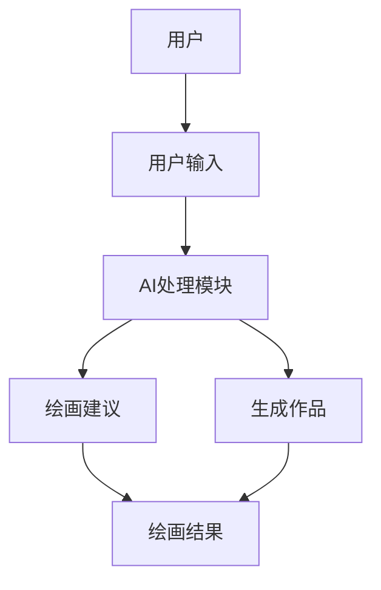

                 


# AI Agent在智能画框中的艺术创作辅助

> 关键词：AI Agent, 智能画框, 艺术创作, 强化学习, 生成对抗网络

> 摘要：本文探讨AI Agent在智能画框中的艺术创作辅助应用，分析其背景、核心概念、算法原理、系统架构设计及项目实战，提供深度的技术见解和实践经验。

---

## 第一部分: AI Agent与艺术创作的背景介绍

### 第1章: AI Agent的基本概念

#### 1.1 AI Agent的定义与特点

- **1.1.1 AI Agent的定义**
  AI Agent（人工智能代理）是能够感知环境并采取行动以实现目标的智能实体。它通过传感器接收信息，利用计算模型处理数据，并通过执行器与环境交互。

- **1.1.2 AI Agent的核心特点**
  - **自主性**：能够在没有外部干预的情况下独立运作。
  - **反应性**：能够实时感知环境变化并做出反应。
  - **目标导向**：所有行动均以实现特定目标为导向。
  - **学习能力**：能够通过经验改进自身性能。

- **1.1.3 AI Agent与传统AI的区别**
  AI Agent不仅仅是静态的知识库或规则引擎，而是具备动态决策和执行能力的实体。

#### 1.2 艺术创作中的AI Agent

- **1.2.1 艺术创作的定义与特点**
  艺术创作是人类通过想象力和创造力将想法转化为具体作品的过程。其特点包括主观性、创造性、个性化和情感表达。

- **1.2.2 AI Agent在艺术创作中的作用**
  AI Agent可以通过算法生成灵感、辅助创作、优化设计并提供反馈，帮助艺术家更高效地完成创作。

- **1.2.3 智能画框的概念与应用场景**
  智能画框是一种结合AI技术的绘画辅助工具，通过AI Agent实时分析用户的绘画动作并提供建议或改进方案。

### 第2章: AI Agent在艺术创作中的背景与问题

#### 2.1 艺术创作的数字化转型

- **2.1.1 数字化艺术创作的现状**
  随着技术进步，数字绘画工具如Procreate、Adobe Photoshop广泛应用于艺术创作。

- **2.1.2 AI技术对艺术创作的影响**
  AI技术为艺术创作提供了新的可能性，如自动化绘画、风格迁移和图像生成。

#### 2.2 AI Agent在艺术创作中的问题与挑战

- **2.2.1 技术实现的难点**
  AI Agent需要理解艺术创作的复杂性，包括色彩、构图、情感表达等。

- **2.2.2 用户需求的多样性**
  不同艺术家有不同的创作风格和需求，AI Agent需要具备高度的适应性。

- **2.2.3 艺术创作的个性化与标准化**
  如何在标准化算法中实现个性化创作是一个重要挑战。

---

## 第二部分: AI Agent与艺术创作的核心概念

### 第3章: AI Agent的艺术创作模型

#### 3.1 基于强化学习的艺术创作模型

- **3.1.1 强化学习的基本原理**
  强化学习通过智能体与环境的交互，通过试错学习，逐步逼近最优策略。

- **3.1.2 艺术创作中的强化学习应用**
  AI Agent可以学习用户绘画习惯，预测用户的下一步动作，并提供建议。

#### 3.2 基于生成对抗网络的艺术创作模型

- **3.2.1 生成对抗网络的基本原理**
  GAN由生成器和判别器组成，通过对抗训练生成逼真的图像。

- **3.2.2 艺术创作中的生成对抗网络应用**
  GAN可以用于风格迁移、图像修复和艺术作品生成。

### 第4章: AI Agent与艺术创作的核心联系

#### 4.1 AI Agent的艺术创作流程

- **4.1.1 用户需求分析**
  AI Agent分析用户意图，理解用户的绘画目标和风格偏好。

- **4.1.2 创作目标设定**
  根据用户需求，AI Agent制定创作计划，确定风格、色彩和构图。

- **4.1.3 创作过程执行**
  AI Agent实时辅助用户完成绘画，提供实时反馈和优化建议。

#### 4.2 AI Agent与艺术创作的协同工作

- **4.2.1 人机协同的创作模式**
  AI Agent与人类艺术家共同创作，AI提供技术支持，艺术家负责创意表达。

- **4.2.2 创作结果的评估与优化**
  AI Agent通过评估模型对创作结果进行打分，帮助用户优化作品。

---

## 第三部分: AI Agent的艺术创作算法原理

### 第5章: 强化学习算法在艺术创作中的应用

#### 5.1 强化学习模型的设计与实现

- **5.1.1 算法流程**
  环境（用户绘画动作）→ 智能体（AI Agent）处理 → 动作（建议或修改）→ 环境反馈。

- **5.1.2 算法实现步骤**
  1. 定义状态空间和动作空间。
  2. 确定奖励函数。
  3. 选择合适的策略和价值函数网络。
  4. 进行环境交互，更新策略。

#### 5.2 生成对抗网络的数学模型

- **5.2.1 GAN的损失函数**
  $$\mathcal{L} = \mathbb{E}_{x,y}[\log(D(x,y))] + \mathbb{E}_{x,z}[\log(1 - D(x,G(x,z)))]$$

- **5.2.2 网络结构**
  - 生成器：使用卷积反向网络，将输入噪声映射到图像空间。
  - 判别器：使用卷积网络，判断输入是否为真实图像。

---

## 第四部分: 系统架构设计

### 第6章: 智能画框系统架构

#### 6.1 系统功能设计

- **用户界面**
  - 绘画工具：支持手绘和AI辅助两种模式。
  - 个性化设置：允许用户自定义创作参数。

- **AI处理模块**
  - 强化学习模块：实时分析用户绘画动作，提供下一步建议。
  - GAN模块：生成风格匹配的艺术作品。

#### 6.2 系统架构设计



---

## 第五部分: 项目实战

### 第7章: 实战案例分析

#### 7.1 环境安装

```bash
pip install numpy tensorflow matplotlib
```

#### 7.2 核心代码实现

```python
import numpy as np
import tensorflow as tf

def generator(input, output_dim):
    # 定义生成器网络
    pass

def discriminator(input):
    # 定义判别器网络
    pass

def train_gan():
    # 训练GAN模型
    pass
```

---

## 第六部分: 最佳实践

### 第8章: 实践小结与注意事项

- **小结**
  AI Agent在艺术创作中的应用前景广阔，但仍需解决技术与艺术结合的难点。

- **注意事项**
  - 保持对艺术创作的人文关怀。
  - 确保技术的透明性和可解释性。

### 第9章: 拓展阅读

- 推荐书籍：《生成对抗网络：算法与实现》。
- 推荐工具：DeepArt、Artbreeder。

---

作者：AI天才研究院/AI Genius Institute & 禅与计算机程序设计艺术/Zen And The Art of Computer Programming

