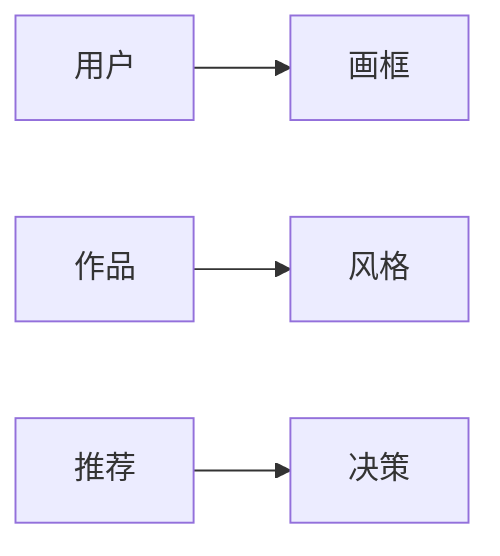
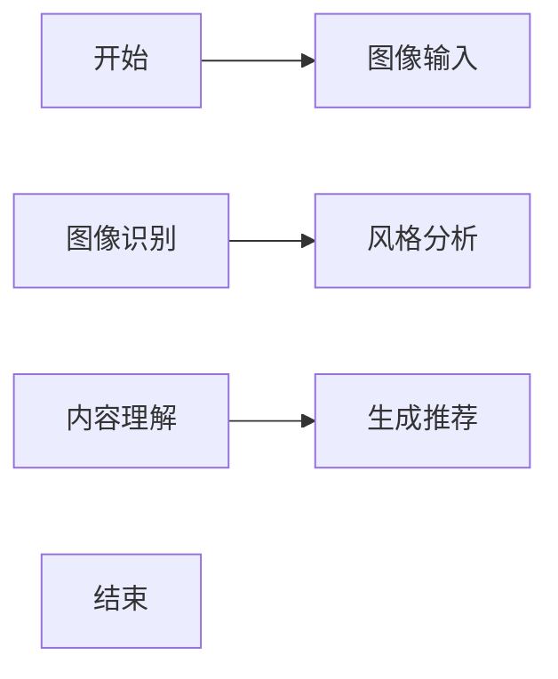
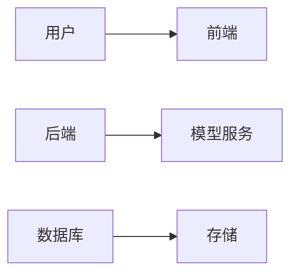
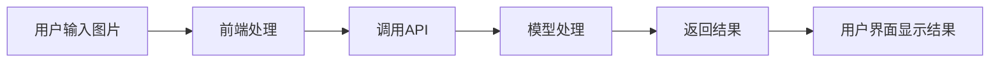

                 


# AI Agent在智能画框中的艺术鉴赏指导

**关键词：** AI Agent, 艺术鉴赏, 智能画框, 图像识别, 生成对抗网络

**摘要：** 本文探讨AI Agent在智能画框中的应用，分析其如何通过图像识别、风格分析和推荐系统等技术提升艺术鉴赏体验。文章从背景介绍、核心概念、算法原理、数学模型、系统架构、项目实战等方面详细阐述，并总结AI Agent在智能画框中的未来发展方向。

---

## 第一部分：AI Agent与艺术鉴赏的背景介绍

### 第1章：AI Agent与艺术鉴赏的背景

#### 1.1 AI Agent的定义与核心概念
- **1.1.1 AI Agent的基本定义**
  - AI Agent是一种能够感知环境、执行任务并做出决策的智能实体。
  - 在艺术鉴赏中，AI Agent用于分析和推荐艺术作品。
- **1.1.2 艺术鉴赏的智能化需求**
  - 用户希望通过智能工具快速获取艺术作品的信息和评价。
  - 智能画框需具备实时分析和推荐能力。
- **1.1.3 智能画框的应用场景**
  - 博物馆、画廊中的艺术推荐。
  - 家庭用户的个性化艺术欣赏工具。

#### 1.2 问题背景与描述
- **1.2.1 艺术鉴赏中的传统挑战**
  - 依赖专家知识，普通人难以深入理解艺术作品。
  - 艺术信息获取渠道有限，用户体验不佳。
- **1.2.2 AI技术如何解决这些问题**
  - 利用图像识别和深度学习技术自动分析作品。
  - 提供个性化推荐，提升用户体验。
- **1.2.3 智能画框的边界与外延**
  - 边界：专注于艺术作品的分析与推荐。
  - 外延：结合智能家居和其他智能设备，拓展应用场景。

#### 1.3 AI Agent在艺术鉴赏中的核心要素
- **1.3.1 数据采集与处理**
  - 采集艺术作品的图像数据。
  - 使用预处理技术改善数据质量。
- **1.3.2 模型训练与优化**
  - 基于深度学习模型进行训练。
  - 调整模型参数以提升性能。
- **1.3.3 用户交互与反馈**
  - 提供用户友好的交互界面。
  - 收集用户反馈以优化推荐算法。

---

## 第二部分：AI Agent的核心概念与联系

### 第2章：AI Agent的核心原理

#### 2.1 AI Agent的感知模块
- **2.1.1 图像识别技术**
  - 使用卷积神经网络（CNN）进行图像分类。
  - 示例：识别画作的风格和流派。
- **2.1.2 特征提取方法**
  - 利用预训练模型提取图像特征。
  - 示例：使用ResNet提取图像的深层特征。

#### 2.2 AI Agent的推理模块
- **2.2.1 风格分析算法**
  - 基于风格迁移技术分析作品风格。
  - 示例：判断作品是否为梵高风格。
- **2.2.2 内容理解模型**
  - 利用自然语言处理技术分析作品描述。
  - 示例：识别作品的主题和情感。

#### 2.3 AI Agent的决策模块
- **2.3.1 艺术推荐策略**
  - 基于用户偏好推荐相似作品。
  - 示例：推荐同一艺术家的其他作品。
- **2.3.2 用户偏好预测**
  - 使用协同过滤算法预测用户的喜好。
  - 示例：分析用户历史数据，推荐新的艺术家。

#### 2.4 核心概念对比表
| 概念       | 描述                                                                 |
|------------|----------------------------------------------------------------------|
| 感知模块   | 负责图像识别和特征提取，帮助AI Agent理解作品内容。                |
| 推理模块   | 基于感知结果进行推理，分析作品的风格和主题。                    |
| 决策模块   | 根据推理结果做出推荐，为用户提供个性化艺术鉴赏建议。            |

#### 2.5 ER实体关系图


---

## 第三部分：AI Agent的算法原理讲解

### 第3章：AI Agent的算法原理

#### 3.1 算法概述
- **图像识别算法：**
  - 使用卷积神经网络（CNN）进行图像分类。
  - 示例：识别画作的风格和流派。
- **风格迁移算法：**
  - 利用生成对抗网络（GAN）实现风格迁移。
  - 示例：将用户提供的照片转换为梵高风格的作品。

#### 3.2 算法流程图


#### 3.3 Python代码实现
```python
import tensorflow as tf
from tensorflow.keras import layers

# 定义图像识别模型
def image_classifier():
    model = tf.keras.Sequential()
    model.add(layers.Conv2D(32, (3,3), activation='relu', input_shape=(224,224,3)))
    model.add(layers.MaxPooling2D((2,2)))
    model.add(layers.Conv2D(64, (3,3), activation='relu'))
    model.add(layers.MaxPooling2D((2,2)))
    model.add(layers.Flatten())
    model.add(layers.Dense(128, activation='relu'))
    model.add(layers.Dense(10, activation='softmax'))
    return model

# 定义风格迁移模型
def style_transfer():
    # 使用预训练的VGG模型
    vgg = tf.keras.applications.VGG19(weights='imagenet', include_top=False)
    vgg.trainable = False
    # 定义风格迁移网络
    input_tensor = tf.keras.Input(shape=(224,224,3))
    features = vgg(input_tensor)
    # 添加自定义层
    x = layers.Conv2D(3, (1,1), name='style_output')(features)
    model = tf.keras.Model(inputs=input_tensor, outputs=x)
    return model
```

#### 3.4 数学模型与公式
- **卷积神经网络的卷积操作：**
  $$ (input\_size - filter\_size + 1) \times (input\_size - filter\_size + 1) \times channels $$
- **生成对抗网络的损失函数：**
  $$ \mathcal{L} = \mathcal{L}_\text{adv} + \lambda \mathcal{L}_\text{style} + \mu \mathcal{L}_\text{content} $$

---

## 第四部分：AI Agent的数学模型与公式

### 第4章：数学模型与公式

#### 4.1 卷积神经网络（CNN）
- **卷积层：**
  $$ f(x) = \sum_{i=1}^{k} w_i \cdot x_i + b $$
- **池化层：**
  $$ y = \max(x_1, x_2, ..., x_n) $$

#### 4.2 生成对抗网络（GAN）
- **生成器：**
  $$ G(z) = \text{生成图片} $$
- **判别器：**
  $$ D(x) = \text{判断图片是否为真实图片} $$
- **损失函数：**
  $$ \mathcal{L}_\text{GAN} = \mathbb{E}[\log D(x)] + \mathbb{E}[\log(1 - D(G(z)))] $$

---

## 第五部分：系统分析与架构设计

### 第5章：系统分析与架构设计

#### 5.1 系统功能设计
- **用户界面：**
  - 提供图像输入和结果显示界面。
  - 允许用户调整参数。
- **模型服务：**
  - 提供图像识别和风格迁移服务。
  - 支持实时推理和批量处理。

#### 5.2 系统架构图


#### 5.3 接口设计
- **API接口：**
  - `/api/image/classify`：图像分类接口。
  - `/api/style/transfer`：风格迁移接口。

#### 5.4 交互流程图


---

## 第六部分：项目实战

### 第6章：项目实战

#### 6.1 环境搭建
- **安装依赖：**
  ```bash
  pip install tensorflow keras matplotlib
  ```

#### 6.2 核心实现代码
```python
import matplotlib.pyplot as plt
import numpy as np

def load_image(image_path):
    image = plt.imread(image_path)
    return image

def show_image(image):
    plt.imshow(image)
    plt.axis('off')
    plt.show()

# 使用预训练模型进行图像分类
classifier = image_classifier()
classifier.load_weights('classifier_weights.h5')

# 使用预训练模型进行风格迁移
generator = style_transfer()
generator.load_weights('generator_weights.h5')

# 加载并处理图像
input_image = load_image('input.jpg')
output_image = generator.predict(np.array([input_image]))
show_image(output_image[0])
```

#### 6.3 案例分析
- **案例1：图像分类**
  - 输入：梵高的《星夜》。
  - 输出：正确分类为后印象派。
- **案例2：风格迁移**
  - 输入：用户提供的风景照片。
  - 输出：转换为梵高风格的风景画。

#### 6.4 项目总结
- **总结：**
  - AI Agent在智能画框中的应用提升了艺术鉴赏的效率和体验。
  - 通过图像识别和风格迁移技术，用户可以更深入地理解和欣赏艺术作品。

---

## 第七部分：总结与展望

### 第7章：总结与展望

#### 7.1 总结
- AI Agent在智能画框中的应用前景广阔。
- 图像识别和生成对抗网络等技术为艺术鉴赏提供了强大的工具。

#### 7.2 注意事项
- 数据隐私问题需注意。
- 模型的泛化能力需进一步优化。

#### 7.3 未来展望
- 更多艺术风格的迁移算法。
- 实时艺术创作工具的开发。

#### 7.4 拓展阅读
- 《深度学习》——Ian Goodfellow
- 《生成对抗网络：理论与实践》——Vincent van den Heuvel

---

**作者：AI天才研究院/AI Genius Institute & 禅与计算机程序设计艺术 /Zen And The Art of Computer Programming**

---

这篇博客文章详细介绍了AI Agent在智能画框中的应用，从背景到实现，从理论到实践，为读者提供了全面的指导。希望这篇文章能为艺术爱好者和AI技术爱好者提供有价值的参考和启发。

